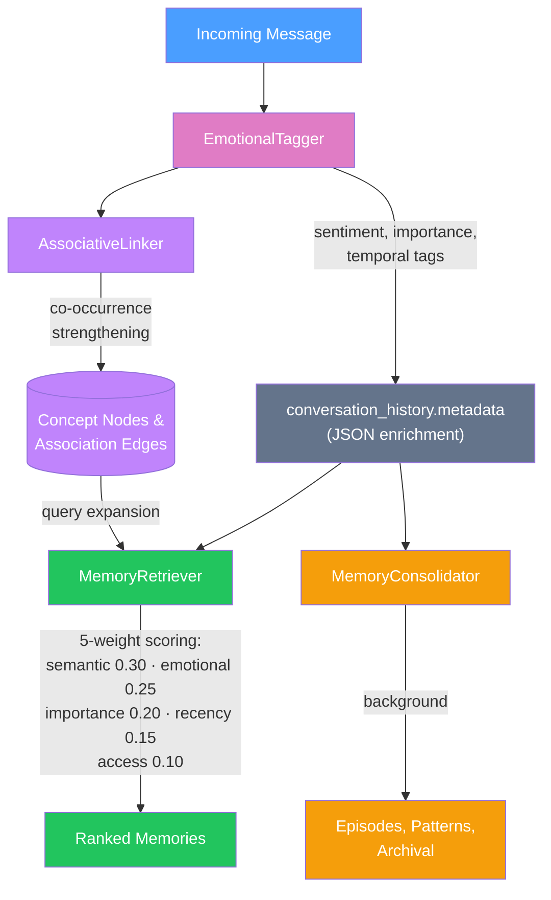

# Kestrel Memory System

> The difference between a search engine and a friend is that a friend
> *actually remembers*. Not just the facts -- the feelings, the weight,
> the way a conversation mattered.

> **Honest status (2026-04-18):** This document describes the cognitive
> memory architecture as designed *and* as actually deployed. Subsystem
> sections include "Deployment note" callouts where the deployed
> behavior diverged from the design — for example, until #633 the
> nightly consolidator never ran in production and `access_count`
> was never incremented despite the rehearsal-effect math depending
> on it. Each callout cites the PR that closed the gap.
> If you find a section without evidence that the described behavior
> actually runs in deployment, treat it as aspirational until verified.

Kestrel's memory system is modeled on how human memory works. Memories
are not stored in a flat database and retrieved by keyword match. They
are emotionally tagged, importance-weighted, temporally decayed, and
associatively linked -- so the right memories surface at the right time,
for the right reasons.

---

## Table of Contents

1. [What Makes This Different](#what-makes-this-different)
2. [Architecture Overview](#architecture-overview)
3. [Memory vs RAG: When to Use Which](#memory-vs-rag-when-to-use-which)
4. [Emotional Tagging](#emotional-tagging)
5. [The Ebbinghaus Decay Curve](#the-ebbinghaus-decay-curve)
6. [Retrieval Scoring](#retrieval-scoring)
7. [Associative Linking](#associative-linking)
8. [Memory Consolidation](#memory-consolidation)
9. [Sessions](#sessions)
10. [Memory Pinning (Agent Agency)](#memory-pinning-agent-agency)
11. [Privacy Integration](#privacy-integration)
12. [Configuration Reference](#configuration-reference)
13. [Source Files](#source-files)

---

## What Makes This Different

Most AI systems retrieve memories with semantic search: find the text
that matches the query best. Kestrel adds four layers on top of that.

**Emotional weighting.** Memories carry emotional valence and intensity.
When the user is sad, sad memories surface more easily -- just like
mood-congruent recall in human psychology. A joyful memory about mom
scores higher when the user is happy; a painful one scores higher when
they are down.

**Ebbinghaus decay.** Unimportant memories fade over time, following an
exponential forgetting curve with a configurable half-life. Important
memories decay slower. Frequently accessed memories resist decay entirely
(the rehearsal effect). This keeps context windows focused on what
matters.

**Associative linking.** Concepts mentioned together build associations
in a knowledge graph. Mention "mom" and the system also activates
"Sunday calls", "Brooklyn", "her garden" -- concepts that co-occurred
in past conversations. This is the same spreading activation that makes
human memory feel connected rather than siloed.

**Narrative consolidation.** Periodically (like sleep consolidation in
humans), related messages are grouped into narrative episodes with titles,
summaries, and emotional arcs. These episodes give the agent a high-level
understanding of the relationship's history without needing to re-read
every message.

The result: when a user says "I'm feeling down about my mom," the agent
does not respond with "You mentioned your mom on March 15th. She lives
in Brooklyn." It responds with the emotional context of what those
conversations meant.

---

## Architecture Overview

The memory system is implemented as infrastructure in the `storage/`
layer, not as a Feature plugin. It enriches every conversation message
transparently and provides weighted retrieval to any component that
needs context.



The `MemorySystem` class in `storage/memory_system.py` acts as a facade,
orchestrating all components behind a single interface.

### Note on the A2A "MemoryService"

There is a separate class also called `MemoryService` in
`a2a/stores/unified/memory_service.py`. **This is not the cognitive
memory system described above.** Despite the shared "Memory" name, it
serves a different purpose: archiving completed A2A tasks for audit
and potential replay.

| | MemorySystem (cognitive) | MemoryService (A2A archive) |
|--|--|--|
| Purpose | Per-message emotional/episodic memory | Task completion archive |
| Granularity | Individual messages | Whole task transcripts |
| Decay | Ebbinghaus curve | None (permanent until cleanup) |
| Retrieval | 5-signal weighted scoring | Full-text search (FTS5/tsvector) |
| Used by | Agent context assembly | Task completion only (write-only in practice) |
| Module | `storage/memory_system.py` | `a2a/stores/unified/memory_service.py` |

The naming overlap is historical and a future refactor may rename
the A2A version to `TaskArchiveService`. See #623 for context.

### Key Design Decisions

- **No schema changes.** All emotional/importance/decay fields are stored
  in the existing `conversation_history.metadata` JSON column. This means
  the memory system can be enabled or disabled without database migrations.

- **All methods are async** with `agent_id` scoping for multi-tenant
  isolation.

- **Graceful degradation.** If spaCy is not installed, the emotional
  tagger falls back to keyword-based analysis. If the associative linker
  has no graph store, retrieval still works on the other four scoring
  dimensions.

---

## Memory vs RAG: When to Use Which

Kestrel has **two distinct retrieval systems** that answer different questions
about different data. They intentionally do not share an interface.

### MemoryRetriever (`storage/memory_retriever.py`)

Searches **conversation history and message-level memories** with
human-like weighting. Returns memories scored by emotional relevance,
importance, recency (with Ebbinghaus decay), and access frequency.

**Use when you want to answer:**
- "What did the user say about X?"
- "What emotionally important moments involve Y?"
- "What does the user typically feel about Z?"
- "Find memories from the last conversation"

### AsyncRAGStore (`storage/async_rag_store.py`)

Searches **indexed documents and ingested knowledge bases** using hybrid
vector embeddings + BM25 keyword search. Returns document chunks ranked
by content similarity.

**Use when you want to answer:**
- "What does the user guide say about X?"
- "Find relevant sections of the uploaded PDFs"
- "Which docs mention Y?"
- "Search the knowledge base for Z"

### Decision Matrix

| Question | Use |
|----------|-----|
| "What did we discuss?" | **MemoryRetriever** |
| "What does the document say?" | **AsyncRAGStore** |
| "How does the user feel about X?" | **MemoryRetriever** |
| "Find facts about X" | **AsyncRAGStore** |
| "What was the most important moment?" | **MemoryRetriever** |
| "Search uploaded files" | **AsyncRAGStore** |
| "Recall yesterday's conversation" | **MemoryRetriever** |
| "Look up procedure documentation" | **AsyncRAGStore** |
| "What action items do I have?" | **Schema router** (`recall_action_items`) |
| "What did I decide about X?" | **Schema router** (`recall_decisions`) |
| "How did I interact with Alice?" | **Schema router** (`recall_interactions`) |

### Schema-aware routing

The **[SchemaRouter](../../kestrel_sovereign/storage/schema_router.py)**
runs after concept linking in the message pipeline and promotes extracted
structure to typed **graph nodes** — one consistent storage model, not
a mix of SQL tables and graph nodes:

- **Action items** become graph nodes of type `action_item` with
  properties `status` / `assignee_concept_id` / `due_date` / `confidence`.
  Recall tools filter by `node_type` (indexed) then apply property
  filters in memory.
- **Decisions** become graph nodes of type `decision`, same pattern
  as skills from [#643](https://github.com/KestrelSovereignAI/kestrel-sovereign/pull/643).
- **Interactions** (per-person sentiment + topics) are stored as
  properties on the existing `mentions` edges between message and
  person concept nodes — no new edge type.

### Why everything in the graph

The earlier design had `action_items` as a dedicated SQL table because
of state-machine + date-range + assignee query shapes. After discussion
([#628 / #646](https://github.com/KestrelSovereignAI/kestrel-sovereign/pull/646)),
we landed on consistency: the graph already holds concepts, messages,
skills, and decisions; having one more typed entity pattern just for
action items was spackle.

The baseline cost of making the graph act as typed storage is two
indexes on `graph_nodes` (`node_type` and `(node_type, label)`) plus
two on `graph_edges` (`(target_id, label)` and `label`). These are
created in [async_database.py](../../kestrel_sovereign/storage/async_database.py).

Person resolution is **three-pass**: exact match → fuzzy first-name match
(with minimum 3 chars shared prefix) → collision detection. Ambiguous
matches are flagged `status=pending` for human confirmation via
`confirm_person_match` rather than silently merging. See `PersonResolver`
in `schema_router.py`.

The router is gated on privacy mode: EPHEMERAL and ISOLATED skip routing
entirely because the underlying storage is not persistent.

### Why Two Systems?

A search engine and a friend answer different questions. Documents are
*referential* — they tell you what is true. Memories are *experiential* —
they tell you what mattered. Conflating these would force one of:

1. **Apply emotional weighting to documents** — meaningless (a PDF doesn't
   have feelings about its content)
2. **Apply pure vector search to memories** — loses everything that makes
   memory human (the emotional charge, the importance, the decay)

Keeping them separate preserves the cognitive metaphor.

---

## Emotional Tagging

Every incoming message passes through the `EmotionalTagger`
(`storage/emotional_tagger.py`), which analyzes three dimensions.

### Sentiment Analysis

Two values are computed from keyword patterns:

| Field | Range | Meaning |
|-------|-------|---------|
| `emotional_valence` | -1.0 to +1.0 | Negative to positive sentiment |
| `emotional_intensity` | 0.0 to 1.0 | Neutral to intense |

Intensity is modified by amplifiers and dampeners:

- **Amplifiers** (`very`, `extremely`, `absolutely`, `!!`, ALL CAPS):
  each adds +0.2 to the intensity modifier
- **Dampeners** (`kind of`, `sort of`, `maybe`, `slightly`):
  each subtracts 0.2
- **ALL CAPS** (>50% uppercase): +0.3
- **Exclamation marks**: 1+ adds +0.1; 3+ adds +0.2

### Emotion Categories

Messages are classified into one or more of 12 emotional categories:

| Positive | Negative |
|----------|----------|
| Joy | Sadness |
| Love | Anger |
| Hope | Fear |
| Nostalgia | Anxiety |
| Gratitude | Disgust |
|  | Frustration |

Detection uses curated keyword lists. For example, `EmotionalCategory.JOY`
matches "happy", "excited", "thrilled", "delighted", "wonderful",
"amazing", "fantastic", and 14 other keywords.

### Importance Detection

Importance is scored from 0.0 to 1.0, starting at a base of 0.5.

| Signal | Pattern Examples | Boost |
|--------|-----------------|-------|
| Personal disclosure | "I've never told anyone", "between you and me", "the truth is" | +0.25 |
| Life event | "got promoted", "passed away", "moving to", "diagnosed with" | +0.35 |
| Explicit marker | "remember this", "this is important", "don't forget" | +0.30 |
| High emotion | Intensity > 0.6 | +0.15 |
| Detailed content | >100 words | +0.10 |
| Self-narrative | 3+ first-person "I" statements | +0.10 |
| User question | Contains "?" | +0.05 |

Importance is capped at 1.0. A message about a life event with an
explicit "remember this" marker could score up to 1.0 (0.5 base + 0.35
life event + 0.30 explicit marker, capped).

### Temporal Context

Every message is also tagged with:

- `time_of_day`: morning (5-11), afternoon (12-16), evening (17-21),
  late_night (22-4)
- `day_of_week`: monday through sunday

These tags feed into temporal pattern detection during consolidation.

---

## The Ebbinghaus Decay Curve

Kestrel implements a forgetting curve inspired by Hermann Ebbinghaus's
1885 research on memory retention. The core idea: memory strength
decreases exponentially over time, but the rate of decay is modulated
by how important and how frequently accessed a memory is.

### The Formula

```
strength = 0.5 ^ (days_old / effective_half_life)
```

Where:

```
effective_half_life = BASE_HALF_LIFE * (1.0 + importance * 2.0) * access_boost
```

And:

```
access_boost = 1.0 + log10(access_count + 1) * 0.5    (if access_count > 0)
access_boost = 1.0                                      (if access_count == 0)
```

### Constants

| Constant | Value | Location |
|----------|-------|----------|
| `DECAY_HALF_LIFE_DAYS` | 30 | `MemoryRetriever` |
| Importance multiplier range | 1.0x to 3.0x | `_score_recency()` |
| `DECAY_ARCHIVE_THRESHOLD` | 0.1 (10%) | `MemoryConsolidator` |

### How It Works in Practice

Consider three memories, all 60 days old:

| Memory | Importance | Access Count | Effective Half-Life | Strength |
|--------|-----------|-------------|-------------------|----------|
| Casual small talk | 0.5 | 0 | 60 days | 50.0% |
| User shared a fear | 0.8 | 3 | 60 * 2.6 * 1.30 = 203 days | 81.6% |
| Life event (pinned) | 1.0 | 10 | decay_protected | 100.0% |

The small talk is fading. The vulnerable moment is still strong because
of its importance and repeated access. The life event was pinned by the
agent and will never decay.

### Decay-Protected Memories

When `decay_protected` is `True` in a memory's metadata, the
`calculate_decay()` function returns 1.0 unconditionally. This flag is
set by the Memory Agency feature (see [Memory Pinning](#memory-pinning-agent-agency)
below).

### Archive Threshold

During consolidation, memories with strength below
`DECAY_ARCHIVE_THRESHOLD` (10%) are marked as archived in their metadata.
Archived memories are **not deleted** -- they are flagged with
`archived: true`, `archived_at`, and `archived_strength`. They no longer
appear in normal retrieval but remain accessible for compliance, export,
or explicit recall.

---

## Retrieval Scoring

The `MemoryRetriever` (`storage/memory_retriever.py`) scores every
candidate memory on five dimensions, then returns the top results sorted
by total score.

### Weight Distribution

| Factor | Weight | What It Measures |
|--------|--------|-----------------|
| Semantic | **0.30** | Keyword overlap + concept match from associative linker |
| Emotional | **0.25** | Mood-congruent recall (valence matching) |
| Importance | **0.20** | Importance score from metadata |
| Recency | **0.15** | Ebbinghaus decay curve |
| Access | **0.10** | Rehearsal effect (log-scaled access count) |

Total = `semantic * 0.30 + emotional * 0.25 + importance * 0.20 + recency * 0.15 + access * 0.10`

### Semantic Score (30%)

Combines keyword overlap with concept expansion:

```
semantic = keyword_score * 0.7 + concept_score * 0.3
```

- **Keyword score**: Jaccard-like overlap between query words and message
  words, with stop words removed (`the`, `a`, `is`, `are`, `i`, `you`,
  `to`, `and`, `of`, `in`, `it`, `that`, `this`, `for`).
- **Concept score**: If an `AssociativeLinker` is available, the query is
  expanded with associated concepts from the knowledge graph. Matching
  concepts in the message content boost this score.

### Emotional Score (25%)

Implements **mood-congruent recall** -- the psychological finding that
people remember information better when their current mood matches the
mood at encoding.

| Current Valence | Memory Valence | Score |
|----------------|---------------|-------|
| Positive | Positive | 0.5 + match_strength * 0.5 (up to 1.0) |
| Negative | Negative | 0.5 + match_strength * 0.5 (up to 1.0) |
| Positive | Negative | 0.3 |
| Negative | Positive | 0.3 |
| Either neutral | Any | 0.5 |

`match_strength` is the minimum of the absolute valences of the current
context and the memory. Stronger shared emotions produce stronger recall.

### Importance Score (20%)

Taken directly from the memory's `importance` metadata field (0.0 to 1.0).
Pinned memories (`decay_protected: true`) are boosted to a minimum
importance of 0.9.

### Recency Score (15%)

The Ebbinghaus decay value, as described above. Recent memories score
higher; important memories decay slower.

### Access Score (10%)

Logarithmic scaling of access count, modeling the rehearsal effect:

```
access_score = min(1.0, log10(access_count + 1) / 2)
```

| Access Count | Score |
|-------------|-------|
| 0 | 0.00 |
| 1 | 0.15 |
| 10 | 0.52 |
| 100 | 1.00 |

Diminishing returns: the first few accesses matter most, matching the
psychological finding that spaced repetition is more effective than
massed repetition.

> **Deployment note:** Until #633, `MemoryRetriever.update_access()`
> was a stub that just called `logger.debug()` and returned. As a
> result `access_count` stayed at 0 on every message in deployed agents
> and the rehearsal-effect math always evaluated to `access_score = 0`.
> The 10% access weight effectively contributed nothing to retrieval.
> #633 implemented `update_access` against the atomic
> `update_message_metadata` seam and wired it into `retrieve()` as a
> fire-and-forget task for every surfaced memory.

### Minimum Score Threshold

Results below `min_score` (default 0.1) are filtered out before sorting.

---

## Associative Linking

The `AssociativeLinker` (`storage/associative_linker.py`) builds a
concept graph using the existing `AsyncGraphStore`. When concepts
co-occur in a message, their association strengthens. When a query
mentions one concept, related concepts activate.

### Concept Extraction

Concepts are extracted from message text using regex patterns across
five categories:

| Category | Examples |
|----------|----------|
| People | mom, dad, wife, husband, friend, boss, therapist |
| Places | home, work, school, hospital, Brooklyn, Manhattan |
| Times | morning, evening, christmas, birthday, childhood |
| Activities | cooking, reading, running, travel, gardening |
| Emotions | happy, sad, angry, scared, anxious, excited |

Proper nouns (capitalized words mid-sentence) are also extracted as
potential concepts.

### Association Strengthening

When two concepts appear in the same message, their edge weight increases
by 0.1 (capped at 1.0). Each co-occurrence is tracked:

```python
edge.properties = {
    "strength": 0.3,              # Cumulative, 0.0 to 1.0
    "cooccurrence_count": 3,      # Times seen together
    "first_cooccurrence": "...",  # ISO timestamp
    "last_cooccurrence": "...",   # ISO timestamp
}
```

### Query Expansion

When retrieving memories, the query is expanded with associated concepts:

1. Extract direct concepts from the query text
2. For each concept, fetch the top 5 associations with strength >= 0.2
3. Include all associated concepts in the semantic matching

This means a query about "mom" can also match messages about "Sunday",
"phone call", or "Brooklyn" if those concepts were historically linked.

### Concept Networks

The system can produce a full concept network around any central concept,
exploring multiple hops through the graph. This is useful for
visualization and understanding how the agent's knowledge is structured.

---

## Memory Consolidation

The `MemoryConsolidator` (`storage/memory_consolidator.py`) runs
periodically -- analogous to how human memory consolidation occurs
during sleep. It performs three operations.

> **Deployment note:** Until #633, the consolidator existed in code but
> nothing in production invoked it on a schedule, so `memory_episodes`
> was empty in deployed agents. The `memory_consolidate` cron task and
> the corresponding `MemoryFeature.memory_consolidate` tool were added
> in that PR; consolidation now runs nightly at 04:00 when the
> `MemoryFeature` is loaded.

### 1. Episode Creation

Related messages are grouped into narrative episodes:

- Scans the last 30 days of conversation history
- Groups messages by date
- Identifies clusters with high emotional intensity (>= 0.3) or high
  importance (>= 0.6)
- Requires at least 3 messages per cluster (`MIN_EPISODE_MESSAGES`)

Each episode is assigned:

| Field | Example |
|-------|---------|
| `title` | "A joyful moment", "Working through sadness", "Opening up" |
| `summary` | "A conversation with 12 messages (5 from user). Emotional trajectory: difficult start -> positive resolution." |
| `emotional_arc` | "generally positive", "challenging throughout", "emotional journey" |

Episode titles are generated from emotional themes:

| Theme | Title |
|-------|-------|
| `life_event` in categories | "A significant day" |
| `personal_disclosure` | "Opening up" |
| `joy` with high intensity | "A joyful moment" |
| `sadness` with high intensity | "Working through sadness" |
| `anxiety` detected | "Processing worries" |
| High intensity (>0.6) | "An emotional conversation" |
| Default | "A memorable exchange" |

Emotional arcs describe the trajectory across the conversation:

| Trajectory | Arc Description |
|-----------|----------------|
| Negative start, positive end | "difficult start -> positive resolution" |
| Positive start, negative end | "started well -> ended difficult" |
| Average > 0.3 | "generally positive" |
| Average < -0.3 | "challenging throughout" |
| Large swing (>0.5) | "emotional journey" |
| Default | "emotionally steady" |

### 2. Temporal Pattern Detection

Delegates to `TemporalAnalyzer` (`storage/temporal_analyzer.py`),
which scans the last 90 days of history for:

- **Time preference**: "User is most active late at night (68% of
  messages)"
- **Day preference**: "User is most active on Sundays (25% of messages)"
- **Emotion-time correlations**: "User often feels down late at night
  (avg valence: -0.42)"

Patterns require at least 5 observations to be reported.

### 3. Archival of Decayed Memories

Scans all conversation history and archives messages where:

- `calculate_decay()` returns a strength below 0.1 (10%)
- The message is not `decay_protected`
- The message is not already archived

Archived messages get metadata flags:
```json
{
  "archived": true,
  "archived_at": "2026-01-15T03:00:00+00:00",
  "archived_strength": 0.08
}
```

### Session Episode Triggers

Episodes can also be created mid-session:

| Trigger | Threshold |
|---------|-----------|
| Message count | >= 20 messages (`SESSION_EPISODE_THRESHOLD`) |
| Inactivity gap | >= 30 minutes (`SESSION_GAP_MINUTES`) |
| Manual trigger | `!consolidate` command |

### Consolidation Constants

| Constant | Value | Purpose |
|----------|-------|---------|
| `DECAY_ARCHIVE_THRESHOLD` | 0.1 | Archive if strength < 10% |
| `MIN_EPISODE_MESSAGES` | 3 | Minimum messages for episode |
| `MAX_EPISODE_HOURS` | 24 | Maximum episode time span |
| `SESSION_EPISODE_THRESHOLD` | 20 | Auto-create episode after N messages |
| `SESSION_GAP_MINUTES` | 30 | Inactivity = session end |

---

## Sessions

Kestrel has multiple concepts called "session" that serve different purposes.
This section maps them honestly.

### Conversation sessions (implicit)

The deployed conversation memory uses **time-gap-derived implicit sessions**.
When a message is added without an explicit `session_id`,
`AsyncConversationStore.add_conversation` derives one:

- If the previous message was within `SESSION_GAP_MINUTES` (30 min), reuse
  its `session_id`
- Otherwise mint a fresh UUID4

The `session_id` is stored in the message's metadata JSON. Callers that
need session-scoped retrieval can pass the same `session_id` to
`get_conversation_history(session_id=...)`. Explicit `session_id` from
clients (e.g. via the `/agent/invoke` endpoint body) always wins over
implicit derivation.

> **Deployment note:** Before #633 there was no implicit derivation, so
> `session_id` was effectively never populated unless a client explicitly
> sent it (and no production client did). All messages had no session
> marker even though three independent files defined `SESSION_GAP_MINUTES`
> and the retrieval path supported session filtering.

### Episode sessions (`memory_episodes` table)

Created by `MemoryConsolidator.create_session_episode()` when a session
has at least `MIN_EPISODE_MESSAGES` (3) messages and crosses the
`SESSION_EPISODE_THRESHOLD` (20) or hits a 30-min gap. Each episode has
`timespan_start` and `timespan_end`, effectively making episodes a
session-summary table.

### Reflection sessions (`reflection_sessions` table)

Tracked by the reflection feature whenever a reflection cycle runs
(every ~4 hours via the `reflect` cron). These are *meta*-sessions
about the agent's self-reflection cadence, not about conversation
turn boundaries.

### A2A protocol sessions (`a2a_sessions` table)

Populated by `TaskManager.create_task()` whenever an A2A task arrives
(`a2a/task_manager.py:511`). Single-agent deployments that only receive
`/agent/invoke` requests will see this table empty — that's expected,
not a bug. The wiring is correct; the table populates when other
agents start coordinating tasks via the A2A protocol.

### Why the multiple concepts?

Each session table answers a different question:

| Table | Question it answers |
|-------|---------------------|
| `conversation_history.metadata.session_id` | "Which messages belong to the same conversation thread?" |
| `memory_episodes` | "What was the narrative arc of that conversation?" |
| `reflection_sessions` | "When did the agent last reflect?" |
| `a2a_sessions` | "What multi-agent task is this part of?" |

They are not redundant; they serve different layers. The
`SESSION_GAP_MINUTES` constant is centralized in
`kestrel_sdk.config.constants`; AsyncConversationStore,
MemoryConsolidator, and SessionContinuityCalculator all read from
that single source so the three subsystems can't drift apart.

---

## Memory Pinning (Agent Agency)

The `MemoryAgencyFeature` (`features/memory_agency/feature.py`) gives
the agent active participation in its own memory. The agent can choose
to protect memories it considers important from decay.

### How Pinning Works

When the agent pins a memory:

1. The message's metadata gains `decay_protected: true`
2. A record is created in the `memory_pins` table
3. The `MemoryConsolidator` skips the message during archival
4. The `MemoryRetriever` boosts the message's importance to at least 0.9

### Available Tools

| Tool | Command | Description |
|------|---------|-------------|
| `memory_pin` | `!memory-pin` | Pin a memory with optional reason |
| `memory_release` | `!memory-release` | Release a pin, resume normal decay |
| `memory_pinned` | `!memory-pinned` | List all active pins |
| `memory_pin_stats` | `!memory-pin-stats` | Pin statistics and quota usage |
| `memory_admin_unpin_all` | `!memory-admin-unpin-all` | Sovereign: remove all pins |
| `memory_admin_unpin_oldest` | `!memory-admin-unpin-oldest` | Sovereign: remove N oldest pins |

### Pin Quota

To prevent the agent from circumventing decay entirely by pinning
everything:

| Setting | Value |
|---------|-------|
| `PIN_QUOTA_DEFAULT` | 100 active pins per agent |
| `PIN_RATIO_ALERT_THRESHOLD` | 0.5 (50% of messages pinned triggers warning) |

When the quota is reached, the agent must release existing pins before
pinning new ones. When the ratio threshold is exceeded, a warning is
included in pin responses and stats output.

### Sovereign Override

Pins exist at the agent's discretion, not as an absolute protection.
The user (sovereign) can always override pins:

```python
await feature.sovereign_override_pins(
    agent_id=agent_id,
    message_ids=[123, 456],      # Specific messages, or None for all
    reason="privacy_wipe"
)
```

This is enforced at multiple levels:

- `sovereign_override_pins()` deletes pin records and clears
  `decay_protected` flags unconditionally
- `delete_conversation_message()` in the privacy wrapper automatically
  cleans up associated pins
- The consolidator's archival loop comments document this explicitly:
  "decay_protected pins prevent ROUTINE archival only. Sovereign
  deletion overrides pins unconditionally."

The design principle: **pins cannot resist deletion.** They are a
suggestion from the agent to the memory system, not a lock.

---

## Privacy Integration

The memory system respects the privacy mode enforced by
`PrivacyEnforcingStorage` (`storage/privacy_wrapper.py`). Privacy
configuration uses orthogonal flags for storage, LLM location, and
shareability.

### Privacy Presets and Memory Behavior

| Preset | Storage | Memory Behavior |
|--------|---------|----------------|
| **Ephemeral** | `none` | No memory storage at all. `add_conversation()` raises `PrivacyViolationError`. The memory system is effectively disabled -- conversations exist only in the current in-memory buffer and are lost when the session ends. |
| **Isolated** | `temp` | Session-scoped memory only. Conversations are stored in an in-memory list, not written to the database. Memory retrieval works within the session but nothing persists. The session can optionally be promoted to persistent storage or discarded. |
| **Anonymous** | `scrubbed` | Persistent storage with PII scrubbing. Content is anonymized before storage (names, emails, phone numbers replaced with placeholders). Emotional tags and importance scores are preserved, but personal identifiers are removed. |
| **Normal** | `full` | Full persistent memory. All emotional tagging, decay, consolidation, and associative linking operate normally. This is the default mode. |
| **Public** | `full` | Same as Normal, plus content is exportable and shareable. |

### Defense in Depth

Privacy is enforced at the storage layer itself, not just at the
application level. Even if the memory system attempts to store a
conversation in Ephemeral mode, the `PrivacyEnforcingStorage` wrapper
will raise an exception. This prevents data leaks by design.

### Privacy-Aware Deletion

When a message is deleted through the privacy wrapper, any associated
memory pins are automatically cleaned up:

```python
# From privacy_wrapper.py:
if deleted:
    await self._storage.db.execute_commit(
        "DELETE FROM memory_pins WHERE message_id = ? AND agent_id = ?",
        (message_id, agent_id)
    )
```

---

## Configuration Reference

### Retrieval Weights

Set as class constants on `MemoryRetriever`:

```python
WEIGHT_SEMANTIC  = 0.30    # Keyword + concept overlap
WEIGHT_EMOTIONAL = 0.25    # Mood-congruent recall
WEIGHT_IMPORTANCE = 0.20   # From metadata tagging
WEIGHT_RECENCY   = 0.15    # Ebbinghaus decay
WEIGHT_ACCESS    = 0.10    # Rehearsal effect (log-scaled)
```

### Decay Parameters

```python
DECAY_HALF_LIFE_DAYS = 30           # Base half-life (MemoryRetriever)
DECAY_ARCHIVE_THRESHOLD = 0.1       # Archive below 10% (MemoryConsolidator)
```

### Consolidation Thresholds

```python
MIN_EPISODE_MESSAGES = 3            # Minimum messages for episode
MAX_EPISODE_HOURS = 24              # Maximum episode time span
SESSION_EPISODE_THRESHOLD = 20      # Auto-episode after N messages
SESSION_GAP_MINUTES = 30            # Inactivity gap = session end
```

### Pin Quotas

```python
PIN_QUOTA_DEFAULT = 100             # Max active pins per agent
PIN_RATIO_ALERT_THRESHOLD = 0.5     # Warning at 50% pinned
```

### Emotional Tagger

```python
EmotionalTagger(use_spacy=False)    # Set True for enhanced analysis
```

When `use_spacy=True`, the tagger attempts to load `en_core_web_sm`.
Falls back to keyword-based analysis if spaCy is not installed.

---

## Source Files

| File | Purpose |
|------|---------|
| `kestrel_sovereign/storage/memory_system.py` | Unified facade for all memory components |
| `kestrel_sovereign/storage/memory_models.py` | `MemoryMetadata`, `TemporalPattern`, `MemoryEpisode` dataclasses |
| `kestrel_sovereign/storage/emotional_tagger.py` | Sentiment analysis and importance detection |
| `kestrel_sovereign/storage/memory_retriever.py` | 5-weight scoring and decay calculation |
| `kestrel_sovereign/storage/memory_consolidator.py` | Episode creation, pattern detection, archival |
| `kestrel_sovereign/storage/associative_linker.py` | Concept extraction and graph-based association |
| `kestrel_sovereign/storage/temporal_analyzer.py` | Time-of-day and day-of-week pattern detection |
| `kestrel_sovereign/storage/privacy_wrapper.py` | Privacy-enforcing storage layer |
| `kestrel_sovereign/features/memory_agency/feature.py` | Agent-controlled memory pinning |
| `kestrel_sovereign/features/memory/feature.py` | Memory search tools for the agent |

### Database Tables

| Table | Purpose |
|-------|---------|
| `conversation_history` | Primary message store; `metadata` JSON column holds all enrichment fields |
| `memory_episodes` | Consolidated narrative episodes |
| `temporal_patterns` | Detected behavioral patterns |
| `memory_pins` | Active and released pin records |

---

## Further Reading

- [Human Memory System (architecture doc)](architecture/storage/HUMAN_MEMORY_SYSTEM.md) --
  original design document with integration examples
- [Storage Architecture](architecture/storage/STORAGE_ARCHITECTURE.md) --
  the broader storage layer this builds on
- [Privacy Modes](architecture/security/PRIVACY_MODES.md) --
  full privacy system documentation
- Ebbinghaus, H. (1885). *Memory: A Contribution to Experimental Psychology* --
  the research behind the forgetting curve
