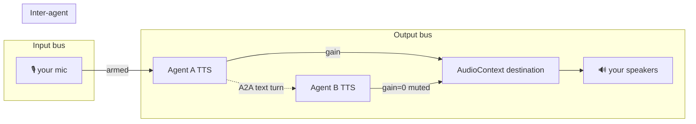

# Multi-Agent Voice — The Mixing Board

**Status:** Draft v1 — design proposal. Epic: [#1767](https://github.com/KestrelSovereignAI/kestrel-sovereign/issues/1767)
**Date:** 2026-06-13
**Author:** opus-4.8 (with @UncleSaurus)

## Changelog

### v1 (this draft)
- Initial design. Three-bus model (output / input / inter-agent), the recording-studio control surface, and a v0→v2 phasing that ships the draft-preservation bug fix as the first slice of the substrate.

## Problem

The chat UI gives every agent its own message-history pane (a detached `<div>` cached in a `chatPanes` Map, swapped by `mountChatPane()` in [static/js/chat.js:777](../../kestrel_sovereign/static/js/chat.js#L777)), but the **composer** — the textarea, send button, attach button, and mic button — is a **single global element** in [static/index.html:228-235](../../kestrel_sovereign/static/index.html#L228-L235). The voice session behind the mic is likewise a module-level singleton: `let client = null` at file scope in [static/js/voice/ui.js:84](../../kestrel_sovereign/static/js/voice/ui.js#L84).

The data model already disagrees with this. Look at what is *already* per-agent on the pane object ([static/js/ui.js:189-203](../../kestrel_sovereign/static/js/ui.js#L189-L203)): scroll position, composer mode, queued message, `pendingAttachments`. And voice settings are per-agent too — keyed via `settingsKeyForAgent()` / `currentAgentKey()` and persisted per agent ([static/js/voice/ui.js:129-152](../../kestrel_sovereign/static/js/voice/ui.js#L129-L152), #1347), with the per-agent `voice_directive` living on `AgentIdentityPackage.voice_config` (#1352). The composer's *state* belongs to the agent. Only its *rendering and session* are global.

Every symptom we can observe is that one mismatch surfacing:

| Symptom | Cause | Evidence |
|---|---|---|
| Half-typed draft is lost (or sent to the wrong agent) when you switch tabs | `mountChatPane()` saves/restores only `scrollPos`, never `messageInput.value`; one shared textarea | [chat.js:777-824](../../kestrel_sovereign/static/js/chat.js#L777-L824) |
| Switching tabs mid-voice orphans the session — old agent keeps talking / mic keeps feeding it | `selectAgent()` and `mountChatPane()` never call the voice module; dependency is one-way (voice→chat) | [identity.js:797-871](../../kestrel_sovereign/static/js/identity.js#L797-L871) |
| Mic audio mis-routes after a switch | Endpoint is bound once at session start via `API.buildAgentUrl()`, never re-resolved | [voice/ui.js:399,446](../../kestrel_sovereign/static/js/voice/ui.js#L399) |
| Model selector stays locked to the old agent's voice model | `acquireSelectorOwnership()` has no agent-switch release path | [voice/ui.js:352-375](../../kestrel_sovereign/static/js/voice/ui.js#L352) |

There is no spackle reconciling these — there is simply *no handling* of agent-switch-during-voice. The seam is unguarded, not patched. Fixing the symptoms one at a time (save the draft here, stop the session there) **would** be spackle. The honest fix is to decide what the composer *is*, then build the substrate once.

## Non-goals

- **Agents literally hearing each other's audio.** No echo cancellation, speaker diarization, or audio cross-talk between agents. Inter-agent coordination rides the existing A2A channel (see below). Voice is a *human* peripheral.
- **Floor-control arbitration in v1.** When two agents are both live and want your mic, "who gets the turn" is a policy we defer (v2). v1 sidesteps it with single-target mic input.
- **New voice providers or routing rules.** The privacy-aware path resolver in [kestrel-feature-voice/routing.py](../../../kestrel-feature-voice/kestrel_feature_voice/routing.py) (#723) stays the single source of truth. This epic is client session topology, not provider plumbing.

## The core idea: three buses, not one knob

The reason multi-agent voice *feels* overwhelming is that three independent routing problems are being heard as one. Separate them and each is tractable.

| Bus | Question | Primitive | Difficulty |
|---|---|---|---|
| **Output** | "Who do I hear?" | Per-agent gain node → shared `AudioContext` destination | Low |
| **Input** | "Who hears me?" | One mic → the *armed* agent's session | Medium (v1: single-arm) |
| **Inter-agent** | "Do agents hear each other?" | A2A text turns — **not audio** | Punt to A2A |



### Output bus — "who do I hear?"
Each agent with a live voice session owns a playback chain. Today that's `createVoicePlayback()` ([static/js/voice/playback.js](../../kestrel_sovereign/static/js/voice/playback.js)) feeding one global sink. The change: route every agent's playback through its own **gain node** into one shared destination.
- **Mute** = gain 0 on that agent. **Solo** = gain 0 on everyone else.
- Multiple agents talking at once is fine for the *audio engine* (it mixes down); it's only bad for *your ears* — which is precisely what mute/solo exist to control.
- Default policy: switching tabs auto-mutes the agents you're not looking at, so you never get surprise background chatter, but their sessions keep living.

### Input bus — "who hears me?"
You have one mic. **Arm/Record** on an agent card routes your mic to that agent's session.
- v1: **exactly one agent is input-armed at a time** (arming B disarms A). This is push-to-talk-with-a-target and it neatly sidesteps turn-taking.
- The mic-arm state becomes per-pane, so it survives tab switches like every other composer field.

### Inter-agent bus — "do agents hear each other?"
This is the rabbit hole, and the move that fills it in: **don't make it audio.** Agents in the same room exchange **text turns over A2A** — the signed, ordered, persisted agent-to-agent transport already documented in [docs/diagrams/11-a2a-protocol.md](../diagrams/11-a2a-protocol.md). The voice layer is a skin: it converts *your* speech to a turn and renders *their* turns to your ears. Agent-to-agent never touches the audio graph.

This separation is what keeps the feature out of the research swamp. Conflating "human voice I/O" with "agent-to-agent communication" is the thing that makes it spiral.

## The control surface: a mixing board on the agent cards

Each agent card in the left panel grows three studio controls, each wired to exactly one bus:

| Control | Bus | v1 behavior |
|---|---|---|
| 🔇 **Mute** | Output | Silence this agent's playback (gain 0). Toggle. |
| 🎧 **Solo** | Output | Mute all other agents' playback. Toggle; exclusive. |
| 🔴 **Arm** | Input | Route my mic to this agent. Mutually exclusive (single-arm). |

A live session shows state on its card (idle / listening / speaking) so you can see, at a glance, who's talking while you're looking at someone else — the thing single-pane rendering hides today.

## The substrate both this and the draft bug sit on

All of it rests on one change: replace the two singletons with per-agent maps.

```js
// Today (singletons):
let client = null;                 // voice/ui.js — one session for all agents
// #message-input                  // index.html — one textarea for all agents

// Proposed (per-agent state on the pane / a parallel map):
pane.draftText        // textarea value, saved on switch-out, restored on switch-in
pane.micArmed         // is my mic routed here?
sessionByAgent: Map   // agentName -> { client, playbackGain, state }
```

Once each agent owns its session + draft + mic-arm + output gain:
- Drafts survive tab switches (text is cheap — it falls out for free).
- Voice sessions stop being orphaned; switching is "detach the view," not "kill the session."
- The mixing-board controls have real per-agent state to bind to.

The draft fix is therefore **not a separate task** — it's the cheapest first slice of this substrate, and it independently resolves the bug that opened this investigation.

## Phasing

### v0 — Substrate + draft preservation (unblocks the reported bug)
- Add `draftText` to the pane; save/restore `messageInput.value` in `mountChatPane()`.
- Introduce `sessionByAgent` map; move the voice `client` off module scope.
- On tab switch: sessions keep living; non-active agents' output auto-mutes; mic-arm state parks on the pane.
- **Delivers:** "type to A, check on B, come back to A with my draft intact, and A didn't stop working." No new UI.

### v1 — The mixing board
- Per-agent gain nodes (output bus); mute + solo controls on each card.
- Per-agent mic-arm (input bus), single-arm; record control on each card.
- Per-card session-state indicator.
- Selector-ownership lock becomes per-agent; releasing on switch-away.

### v2 — Multi-agent room
- Room membership; agents coordinate over A2A (text turns, never audio).
- Floor-control policy (raise-hand / floor token) for the input bus when multiple agents are live — policy over A2A, not an audio mechanism.

## Open questions

1. **Concurrency ceiling.** How many simultaneous live voice sessions do we allow before it's untenable (provider rate limits, CPU for N `AudioContext` graphs)? Propose a soft cap with the rest muted-and-paused.
2. **Realtime vs pipeline parity.** Realtime (WebRTC) and pipeline (WebSocket) have different teardown/pause semantics. Does "park a background session" mean keep-alive or suspend-and-resume for each? Affects provider cost.
3. **Privacy across the room.** Each session already routes through the per-agent privacy resolver (#723). In a shared room, whose privacy mode governs a turn that one agent voices and another hears? Likely: each agent's own mode gates its own I/O, but this needs to be stated, not assumed. See [security/PRIVACY_AGENT.md](security/PRIVACY_AGENT.md).
4. **Solo semantics with an armed mic.** If I solo A's *output* but my mic is armed to B, is that a coherent state or should solo also re-arm? Lean toward keeping the buses independent (they're orthogonal by design), but the UI should make the split legible.

## Appendix — source map

**Frontend (kestrel-sovereign):**
- [static/index.html:228-235](../../kestrel_sovereign/static/index.html#L228-L235) — global composer
- [static/js/chat.js:777-824](../../kestrel_sovereign/static/js/chat.js#L777-L824) — `mountChatPane()`
- [static/js/ui.js:189-203](../../kestrel_sovereign/static/js/ui.js#L189-L203) — pane object shape
- [static/js/identity.js:797-871](../../kestrel_sovereign/static/js/identity.js#L797-L871) — `selectAgent()`
- [static/js/voice/ui.js](../../kestrel_sovereign/static/js/voice/ui.js) — voice UI shell (singleton `client`, selector lock, per-agent settings)
- [static/js/voice/playback.js](../../kestrel_sovereign/static/js/voice/playback.js) — audio playback chain
- [static/js/voice/realtime.js](../../kestrel_sovereign/static/js/voice/realtime.js) / [pipeline.js](../../kestrel_sovereign/static/js/voice/pipeline.js) — the two backends

**Voice feature (kestrel-feature-voice):**
- `routing.py` — privacy-aware path resolver, single source of truth (#723)
- `realtime.py` — `/voice/realtime/session` ephemeral session minting
- `endpoints.py` — `/voice/*` HTTP + `WebSocket /voice/chat`
- SDK `VoiceConfig` / `ConversationSession` in `kestrel-sovereign-sdk/kestrel_sdk/voice/`

**Inter-agent transport:**
- [docs/diagrams/11-a2a-protocol.md](../diagrams/11-a2a-protocol.md) — A2A spec (TaskManager, Agent Cards, SSE)

**Related tickets:** #723 (privacy voice routing), #1347 (per-agent voice settings no tenant leak), #1352 (`voice_directive` on identity package).
