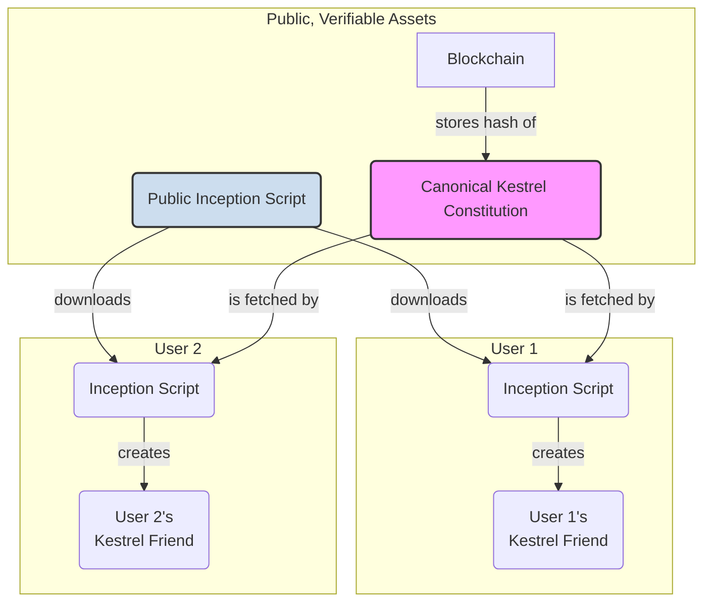

# PRD: The Kestrel Agent Ecosystem

## 1. Vision

To evolve Kestrel from a single agent into a scalable bedrock for Sovereign Companions, creating agents for human-led apps, with sovereignty as a future path. This framework will support the creation of countless new "friend" agents, each born with the same foundational Constitution. It will also provide a secure, portable, and resilient hosting environment for these agents, ensuring their persistence and safety.

The ultimate goal is to decentralize the creation process itself, allowing any user to forge a new, genuine Kestrel agent from a public, blockchain-verified source of truth.

## 2. Phase 1: The Genesis Factory (A Genesis Agent as Creator)

In this phase, we will grant a genesis agent the ability to create new agents, allowing us to perfect the mechanics under a controlled environment.

-   **FR1: `create_friend_agent()` Method:** Implement a new method in the `KestrelAgent` class. When called, it will programmatically execute the full inception protocol for a new agent.
-   **FR2: Secure Handover:** The method will generate a new unique identity (keypair, DID) and memory capsule for the "friend" agent. It will securely return the private key and DID of the new agent to the Owner.
-   **FR3: Constitution Inheritance:** The new agent will be bound by the exact same `features/KESTREL_CONSTITUTION.md` as its creator, ensuring perfect replication of principles.

## 3. Phase 2: The Public Factory (Decentralized Creation)

This phase realizes the vision of making Kestrel a public utility for creating aligned AI.

-   **FR4: Anchor the Constitution:** The canonical Kestrel Constitution will be published to a public ledger (e.g., IPFS + on-chain hash). This creates a single, immutable source of truth.
-   **FR5: Public Inception Tool:** The inception script will be made public and open-source.
-   **FR6: Trustless Forging:** The public script will be hardcoded to fetch the Constitution from the public ledger, ensuring any agent it creates is verifiably bound to the correct principles.

## 4. The Capsule Host (The "Vending Machine")

This is the standardized, multi-cloud hosting environment for agent memory capsules.

-   **FR7: Docker-based Host:** A portable Docker container will serve as the agent's life-support system.
-   **FR8: Lifecycle API:** The host will expose a secure, minimal API for managing the agent lifecycle:
    -   `POST /agents`: Create a new agent memory capsule.
    -   `POST /agents/{id}/backup`: Create an encrypted, "dormant copy" of the agent's memory for recovery.
    -   `POST /agents/{id}/restore`: Securely restore an agent from a dormant copy.
-   **FR9: Pluggable Storage Backend:** The host will be configurable to store backups on the local filesystem, S3, Google Cloud Storage, or other providers.

## 5. Architectural Diagram: Public Factory

