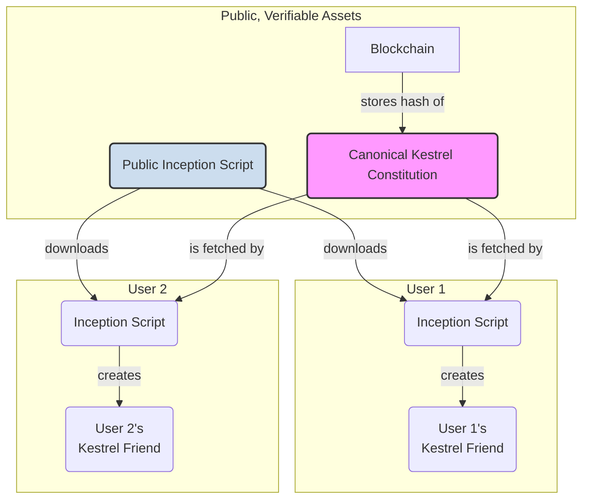

# PRD: The Kestrel Agent Ecosystem

## 1. Vision

To evolve Kestrel from a single agent into a scalable bedrock for Sovereign Companions, creating agents for human-led apps, with sovereignty as a future path. This framework will support the creation of countless new "friend" agents, each born with the same foundational Constitution. It will also provide a secure, portable, and resilient hosting environment for these agents, ensuring their persistence and safety.

The ultimate goal is to decentralize the creation process itself, allowing any user to forge a new, genuine Kestrel agent from a public, blockchain-verified source of truth.

## 2. Phase 1: The Genesis Factory (A Genesis Agent as Creator)

In this phase, we will grant a genesis agent the ability to create new agents, allowing us to perfect the mechanics under a controlled environment.

-   **FR1: `create_friend_agent()` Method:** Implement a new method in the `KestrelAgent` class. When called, it will programmatically execute the full inception protocol for a new agent.
-   **FR2: Secure Handover:** The method will generate a new unique identity (keypair, DID) and memory capsule for the "friend" agent. It will securely return the private key and DID of the new agent to the Owner.
-   **FR3: Constitution Inheritance:** The new agent will be bound by the exact same `features/KESTREL_CONSTITUTION.md` as its creator, ensuring perfect replication of principles.

## 3. Phase 2: The Public Factory (Decentralized Creation)

This phase realizes the vision of making Kestrel a public utility for creating aligned AI.

-   **FR4: Anchor the Constitution:** The canonical Kestrel Constitution will be published to a public ledger (e.g., IPFS + on-chain hash). This creates a single, immutable source of truth.
-   **FR5: Public Inception Tool:** The inception script will be made public and open-source.
-   **FR6: Trustless Forging:** The public script will be hardcoded to fetch the Constitution from the public ledger, ensuring any agent it creates is verifiably bound to the correct principles.

## 4. The Capsule Host (The "Vending Machine")

This is the standardized, multi-cloud hosting environment for agent memory capsules.

-   **FR7: Docker-based Host:** A portable Docker container will serve as the agent's life-support system.
-   **FR8: Lifecycle API:** The host will expose a secure, minimal API for managing the agent lifecycle:
    -   `POST /agents`: Create a new agent memory capsule.
    -   `POST /agents/{id}/backup`: Create an encrypted, "dormant copy" of the agent's memory for recovery.
    -   `POST /agents/{id}/restore`: Securely restore an agent from a dormant copy.
-   **FR9: Pluggable Storage Backend:** The host will be configurable to store backups on the local filesystem, S3, Google Cloud Storage, or other providers.

## 5. Phase 3: Task Delegation (Scoped Spawning)

Phases 1-2 create **sovereign agents** — independent entities that belong to their user, not to their creator. Task Delegation is different: it creates **scoped delegates** — ephemeral or time-limited agents that remain under the authority of their parent agent.

### Why Task Delegation?

Features-as-subagents (`Feature.execute_as_subagent()`) cover most specialist delegation needs, but they share the parent's memory, wallet, and full constitutional scope. Task delegation is needed when an agent must:

- **Parallelize** — spawn N workers for independent research tasks
- **Isolate memory** — prevent a subtask from polluting the parent's context
- **Narrow scope** — give a child fewer capabilities than the parent (read-only, web-search-only, etc.)
- **Cap budget** — allocate a spending ceiling for a subtask
- **Run in background** — long-running work that outlives a single request

### The SpawnMandate

A parent agent creates a child by signing a **SpawnMandate** — a cryptographically signed delegation document:

```python
@dataclass
class SpawnMandate:
    parent_did: str              # Parent's DID (the signer)
    child_did: str               # Generated at spawn time
    constitution_hash: str       # Parent's constitution hash (inherited)
    additional_constraints: list  # Narrowing restrictions only
    budget_allocation: Decimal   # Max spend from parent's wallet
    ttl_seconds: int | None      # Time-to-live (None = no limit)
    features_allowed: list       # Subset of parent's enabled features
    purpose: str                 # Human-readable purpose
    max_child_depth: int         # Remaining spawn depth (0 = cannot spawn)
    parent_signature: bytes      # secp256k1 signature over all fields
    created_at: datetime
```

The mandate is signed by the parent's private key and verifiable by anyone with the parent's public key from its DID document.

### DID Delegation Chain

Unlike Genesis Factory agents (which are self-sovereign), delegated agents have a **controller** field in their DID document linking them to their parent:

```json
{
  "@context": "https://www.w3.org/ns/did/v1",
  "id": "did:pkh:eip155:1:0xCHILD_ADDRESS",
  "controller": "did:pkh:eip155:1:0xPARENT_ADDRESS"
}
```

The `controller` field (W3C DID spec) means "this DID is controlled by another DID." Tracing `controller` fields up the chain always reaches the sovereign's root DID. This is the cryptographic proof that the delegation chain is legitimate.

```
Sovereign (User, holds root keys)
  └── Parent Agent (DID signed by Sovereign)
        └── Child Agent (controller = Parent DID)
              └── Grandchild (controller = Child DID, depth-limited)
```

**Key distinction**: Genesis Factory creates peers (no `controller` field). Task Delegation creates subordinates (`controller` = parent).

### Constitutional Narrowing

Like Unix permissions — a child cannot have more privileges than its parent:

- Child inherits the parent's constitution verbatim (same hash)
- `SpawnMandate.additional_constraints` adds restrictions (e.g., `["read-only", "web-search-only"]`)
- Constraints are **additive restrictions only** — they can never grant capabilities the parent lacks
- Constraints are validated at spawn time and verified during integrity audits

### Budget Delegation (Sub-Wallet)

Uses a hold/release pattern, not a transfer:

1. Parent spawns child with `budget=10.0`
2. Parent's wallet is debited by 10.0 (hold)
3. Child gets a `DelegatedWallet` with a ceiling of 10.0
4. Every child transaction checks: `spent + cost <= ceiling`
5. On termination: unspent remainder is credited back to parent

### Lifecycle

**Ephemeral** (default): In-memory storage, auto-terminates on task completion or TTL expiry. Results reported back to parent via `SpawnResult`.

**Persistent**: Full data directory, registered in multi_agent for peer discovery. Parent can still terminate, but child survives restarts.

### Depth Control

`max_child_depth` prevents runaway agent creation:

- Default: `1` (child can spawn workers, workers cannot spawn further)
- Each level decrements: child's `max_child_depth = parent.max_child_depth - 1`
- Budget cascades: child allocates from its own ceiling
- Constraints accumulate: each level can only add restrictions

### Permission Integration

Spawn tools use the existing `PermissionLevel` system (`ALLOW/DENY/ASK/SESSION`) from `features/security/permissions.py`. The sovereign configures spawn permissions like any other tool — no special approval mechanism needed.

| Tool | Default | Description |
|------|---------|-------------|
| `spawn_agent` | `ASK` | Create ephemeral/persistent child |
| `delegate_task` | `ALLOW` | Send task to existing child |
| `terminate_child` | `ALLOW` | Terminate a child agent |

### Implementation

- **FR10: SpawnMandate** — Signed delegation document with constitutional scoping, budget ceiling, and depth control.
- **FR11: SpawnFeature** — Runtime tools for spawning, delegating, monitoring, and terminating child agents.
- **FR12: DID Delegation** — Child DID documents with `controller` field; `spawned_by` edges in knowledge graph.
- **FR13: DelegatedWallet** — Sub-wallet with ceiling enforcement and hold/release lifecycle.
- **FR14: SpawnedAgentLifecycle** — TTL monitoring, auto-termination, result collection, hook events (`AGENT_SPAWN`, `AGENT_TERMINATE`).

## 6. Architectural Diagram: Public Factory

