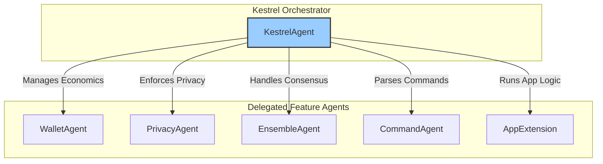

# PRD: Feature Agent Framework

## 1. Vision

To transform the Kestrel project from a single, monolithic agent into a robust, scalable, and maintainable "society of agents." Under this framework, the primary `KestrelAgent` acts as an orchestrator, delegating specific responsibilities to a suite of self-contained, single-purpose **Feature Agents**.

This architecture will enable clear separation of concerns, facilitate parallel development, and provide a structured path toward more complex, emergent agent-to-agent delegation in the future.

## 2. Core Principles

The creation and lifecycle of every Feature Agent shall be governed by these principles:

*   **Single Responsibility:** Each Feature Agent must be an expert in one specific domain (e.g., economics, privacy, ensemble consensus). It should do one thing and do it well.
*   **Real First, Mock Later:** Development of a Feature Agent **must** begin with integration into the live system using real services and dependencies. Mocks are only permissible as a secondary optimization for test speed or to isolate complex unit logic *after* the real integration is proven to work.
*   **Demonstrable by Default:** Every Feature Agent must be accompanied by a test that produces a "visible artifact"—a clear, human-readable output that demonstrates the feature's core functionality, just as we did for the WalletAgent.
*   **Hierarchical by Design:** The file structure for feature agents is non-negotiable to ensure consistency and ease of discovery. For a feature named `example`, the structure shall be:
    *   `docs/architecture/EXAMPLE_AGENT.md` (The PRD)
    *   `features/example.py` (The agent implementation)
    *   `tests/test_example_agent.py` (The demonstration & integration tests)

## 3. The Feature Agent Development Lifecycle

Any new functionality or major refactoring must follow this lifecycle.

### Step 1: Propose the Feature (Create the PRD)
Before any code is written, a PRD for the new Feature Agent must be created in `docs/architecture/`. This PRD serves as the plan and contract for the feature. It **must** contain the following sections:

1.  **Vision:** A one-paragraph summary of the feature's purpose.
2.  **Functional Requirements:** A clear, itemized list of what the feature must do.
3.  **Integration Plan:** A description of how the `KestrelAgent` will delegate to this new agent.
4.  **Testing Strategy:** This section is mandatory and must explicitly define:
    *   **The Integration Test Plan:** How the feature will be tested end-to-end with real services.
    *   **The Visible Artifact:** What the human-readable output of the test will look like.
    *   **The Mocking Strategy (Optional):** Justification for any mock-based unit tests that will be created *after* the integration test is complete.

### Step 2: Implement the Feature Agent
Create the `features/feature_name.py` file and implement the agent's logic according to the PRD.

### Step 3: Implement the Integration Test & Demonstration
Create the `tests/test_feature_name.py` file. This test must:
- Run against the real, integrated Feature Agent.
- Produce the "visible artifact" defined in the PRD's Testing Strategy.
- Contain assertions that validate the correctness of the feature.

### Step 4: Implement Mock-Based Unit Tests (Optional)
If specified in the PRD, create any additional unit tests that use mocks to isolate specific logic paths or improve test suite performance.

## 4. Architectural Diagram: The Society of Agents



## 5. Roadmap for Refactoring

The following components of the current `KestrelAgent` are candidates for immediate refactoring into this new Feature Agent framework:

1.  **PrivacyAgent:** To encapsulate all logic related to `PrivacyMode`, including session management and data anonymization.
2.  **EnsembleAgent:** To manage the lifecycle and consensus logic of child agents.
3.  **CommandAgent:** To handle the parsing and execution of all `!` commands.
4.  **ConstitutionalAgent:** To manage the logic for performing integrity and genesis audits.

## 6. Technical Implementation

The Feature Agent framework is implemented using a dynamic registration system that allows features to expose capabilities as tools to the main agent.

### 6.1 The `Feature` Base Class

All feature agents must inherit from the `Feature` base class defined in `features/base.py`. This class provides the lifecycle methods and tool discovery logic.

```python
from features.base import Feature, tool

class MyFeature(Feature):
    def initialize(self):
        # Perform setup logic here
        pass
```

### 6.2 The `@tool` Decorator

Features expose their capabilities using the `@tool` decorator. This decorator marks a method as an agent tool, defining its name, description, category, and optional command prefix.

```python
from features.base import tool
from tools.base import ToolCategory

class MyFeature(Feature):
    @tool(
        name="my_tool_action",
        description="Description of what this tool does",
        category=ToolCategory.SYSTEM,
        command_prefix="!my-action"
    )
    async def my_action(self, param: str) -> str:
        return f"Action performed with {param}"
```

### 6.3 Dynamic Registration

The `KestrelAgent` automatically discovers and registers tools from initialized features. When a feature is registered using `_register_feature`, the agent scans for methods decorated with `@tool` and adds them to its `ToolRegistry`.

This architecture allows for:
- **Decoupling:** Features define their own tools without modifying the main agent code.
- **Discovery:** The LLM can automatically discover available tools via the registry.
- **Scalability:** New capabilities can be added simply by creating a new Feature class.
- **Command Routing:** Features can register their own `!` commands directly.

## 7. Status Update (November 2025)

The Feature Agent framework is now the standard architecture for all agent capabilities.

**Implemented Features:**
- **SovereigntyFeature** (`features/sovereignty/`): Handles export/import of agent state.
- **MCPAgent** (`features/mcp/`): Manages Model Context Protocol tools.
- **ModelAgent** (`features/model/`): Manages LLM models.
- **WebSearchFeature** (`features/web_search/`): Wraps Tavily search.
- **CreativeFeature** (`features/creative/`): Wraps Image Generation.
- **FeedbackFeature** (`features/feedback/`): Wraps Diagnostics.
- **WalletAgent** (`features/wallet/`): Manages economics.
- **PrivacyAgent** (`features/privacy/`): Manages privacy modes.

**Refactoring Complete:**
- The legacy `tools/` directory now only contains infrastructure (`base.py`, `registry.py`).
- All tool implementations have been migrated to `features/`.
- `AgentToolMixin` and `kestrel_agent_tools.py` have been removed.

