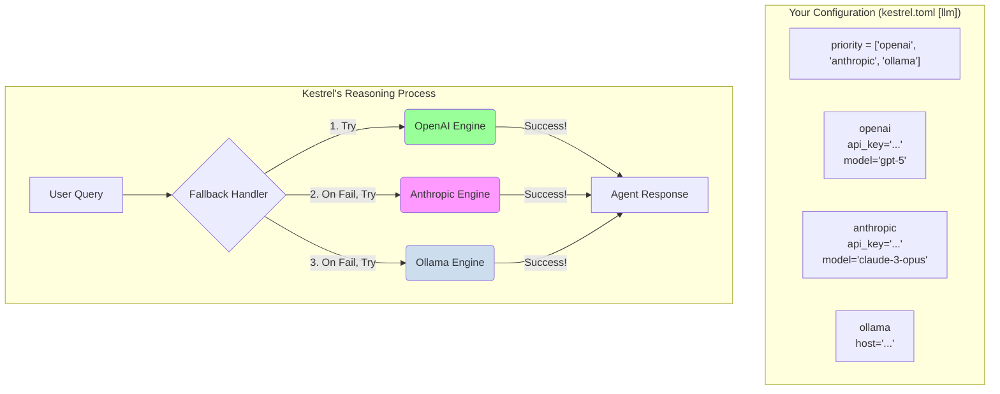

# PRD: Multi-Model Foundational Support

> **Historical PRD — preserved for context, do not follow as guidance.**
> This describes the *original* multi-model support architecture from initial
> build. Subsequent work has materially changed every layer:
>
> | Change | Tracker | Impact on this doc |
> |---|---|---|
> | Vendor / route / model schema | epic [#688](https://github.com/KestrelSovereignAI/kestrel-sovereign/issues/688) | The "single-string provider" model below is the antipattern that motivated the rewrite. The Mermaid diagram in §3 still shows the legacy `provider_priority` shape — kept as a record of what was replaced, not as a current reference. |
> | Unified `kestrel.toml [llm]` | epic [#938](https://github.com/KestrelSovereignAI/kestrel-sovereign/issues/938) (2026-05) | `llm_config.toml` no longer exists; configuration moved into `[llm]` in `kestrel.toml`. Migration command: `kestrel migrate-llm-config`. |
> | `LLMAdapter` promoted to SDK | epic [#1048](https://github.com/KestrelSovereignAI/kestrel-sovereign/issues/1048) Wave 1A (2026-05) | The contract lives in `kestrel-sovereign-sdk` (`kestrel_sdk.llm`), not `kestrel_sovereign/llm/adapter.py`. External plugins ship without framework changes via the `kestrel_sovereign.llm_providers` entry-point group. |
> | Streaming-with-tools + `ToolCallStarted` + honesty layer | epic [#1048](https://github.com/KestrelSovereignAI/kestrel-sovereign/issues/1048) Waves 4A–5E (2026-05) | The original `generate_response(prompt: str) -> str` interface is one of three streaming modes now; the constitutional honesty layer rides on the `ToolCallStarted` marker. |
>
> **Canonical references (use these instead):**
> - [LLM_SERVICE_ARCHITECTURE.md](../LLM_SERVICE_ARCHITECTURE.md) — current vendor / route / model architecture, mandate semantics, routing.
> - [llm/PROVIDER_PLUGINS.md](../llm/PROVIDER_PLUGINS.md) — adapter authoring (in-tree + external plugin paths) and the SDK contract surface.
> - [llm/HONESTY_LAYER.md](../llm/HONESTY_LAYER.md) — streaming honesty enforcement (in-band sentinel, SSE backup, narration check).

## 1. Vision

To evolve Kestrel from a single-model agent into a resilient, flexible, and powerful multi-model agent. This will allow Kestrel to leverage the best available foundation models based on user preference, cost, and availability, ensuring it is not locked into any single provider. Ollama will serve as the default, private, "last resort" option, guaranteeing the agent can always reason.

## 2. Architecture

This will be achieved through an abstraction layer for LLM providers and a configuration-driven, prioritized fallback system. Fallbacks respect privacy, enabling human-led apps without external risks.

-   **FR1: LLM Adapter Abstraction:**
    -   A new abstract base class, `LLMAdapter`, is implemented in the `llm` module.
    -   It defines a standard interface: `generate_response(prompt: str) -> str` and `is_available() -> bool`.
    -   Concrete classes like `OllamaAdapter`, `OpenAIAdapter`, etc., implement this interface.

-   **FR2: Configuration-Driven Setup:**
    -   The `[llm]` section of `kestrel.toml` (originally a standalone `llm_config.toml`; consolidated in epic #938) lets the user define vendors, routes, API keys, and model choices.
    -   **API keys live in `.env`, referenced via `api_key_env` in route config — never in committed files.**
    -   The user defines a `route_priority` list (e.g., `["openai:api", "anthropic:api", "ollama:local"]`) to control fallback order. Pre-#688 this was `provider_priority`; the rename to `route_priority` reflects that fallback is per-route, not per-vendor.

-   **FR3: Resilient Fallback Logic:**
    -   The `LLMService` manages an ordered list of `LLMAdapter` instances based on the `provider_priority`.
    -   When reasoning is required, the service iterates through the adapters in order.
    -   If an adapter fails, the failure is logged, and the service automatically tries the next adapter in the list.

## 3. Architectural Diagram

## 4. Implementation Status ✅

1.  ✅ Created the `llm` directory.
2.  ✅ Implemented `llm/adapter.py` with the `LLMAdapter` abstract base class.
3.  ✅ Implemented `llm/ollama_adapter.py` for local Ollama models.
4.  ✅ Implemented `llm/openai_adapter.py` for OpenAI API access.
5.  ✅ Created sample `llm_config.toml.example` to guide users.
6.  ✅ Updated `.gitignore` to ignore the user's `llm_config.toml`.
7.  ✅ Implemented `llm/service.py` with fallback logic and provider management.
8.  ✅ Integrated LLMService into `KestrelAgent` and `main.py` with configuration loading. 