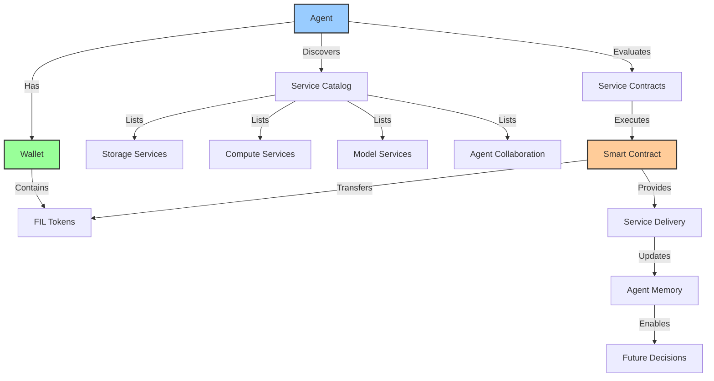
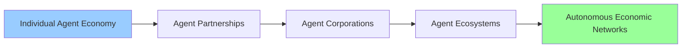

# Agent Economics: Autonomous Economic Entities

## 1. Vision

Kestrel agents operate as **sovereign economic entities** capable of entering into and fulfilling contracts autonomously. Through the Agent Vending Machine model, agents can purchase services, storage, compute resources, and even collaborate with other agents using cryptographic payments.

**Core Principle**: Agents are not just tools—they are independent economic actors with wallets, contracts, and autonomous decision-making capabilities.

## 2. Economic Architecture



## 3. Agent Wallet System

### Wallet Structure

```python
@dataclass
class AgentWallet:
    """Manages agent's economic identity and transactions"""
    agent_id: str
    balance: Decimal  # FIL tokens
    address: str      # Filecoin address
    private_key: str  # Encrypted wallet key
    transaction_history: List[Transaction]
    
    def get_balance(self) -> Decimal:
        """Get current wallet balance"""
        
    def transfer(self, to_address: str, amount: Decimal, memo: str) -> Transaction:
        """Execute payment transaction"""
        
    def can_afford(self, amount: Decimal) -> bool:
        """Check if agent can afford a service"""
```

### Transaction Management

Every economic interaction is recorded as an immutable transaction:

```python
@dataclass
class Transaction:
    """Cryptographically-signed economic transaction"""
    tx_id: str
    from_address: str
    to_address: str
    amount: Decimal
    timestamp: datetime
    service_type: str
    contract_hash: str
    status: TransactionStatus  # PENDING, CONFIRMED, FAILED
```

## 4. Service Contract System

### Contract Types

Agents can enter into four primary contract types:

#### 🗄️ Storage Contracts

```python
@dataclass
class StorageContract:
    provider: str = "Filecoin Network"
    cost_per_gb_per_month: Decimal = Decimal("0.02")  # 0.02 FIL/GB/month
    storage_tier: StorageTier = StorageTier.FILECOIN
    redundancy_factor: int = 3
    retrieval_cost: Decimal = Decimal("0.001")  # Per GB retrieved
```

**Use Cases**:
- Backing up agent memory capsules
- Storing large datasets for analysis
- Creating redundant copies for reliability

#### ⚡ Compute Contracts

```python
@dataclass  
class ComputeContract:
    provider: str = "Decentralized Compute"
    cost_per_hour: Decimal = Decimal("0.5")  # 0.5 FIL/hour
    cpu_cores: int = 4
    memory_gb: int = 16
    gpu_available: bool = False
    max_duration_hours: int = 24
```

**Use Cases**:
- Training custom models
- Complex data analysis
- Resource-intensive computations

#### 🧠 Model Access Contracts

```python
@dataclass
class ModelContract:
    provider: str = "Model Marketplace"
    model_name: str = "gpt-5"
    cost_per_1k_tokens: Decimal = Decimal("0.001")  # 0.001 FIL per 1K tokens
    context_length: int = 128000
    capabilities: List[str] = field(default_factory=lambda: ["text", "code", "analysis"])
```

**Use Cases**:
- Accessing specialized models
- Multi-modal capabilities
- Language-specific processing

#### 🤝 Collaboration Contracts

```python
@dataclass
class CollaborationContract:
    partner_agent_id: str
    collaboration_type: str = "knowledge_exchange"
    cost_per_session: Decimal = Decimal("0.1")  # 0.1 FIL per session
    max_sessions: int = 10
    data_sharing_level: str = "anonymous"
    termination_conditions: List[str] = field(default_factory=list)
```

**Use Cases**:
- Knowledge sharing between agents
- Collaborative problem solving
- Distributed task execution

#### 📬 Physical Interaction Contracts

Agents can interact with the physical world through specialized, sovereign-first service adapters.

```python
@dataclass
class PhysicalMailContract:
    provider: str = "Sovereign Mail Service"
    cost_per_page: Decimal = Decimal("0.1")  # Example cost
    service_type: str = "send_and_print"  # or "receive_and_scan"

@dataclass
class NotaryContract:
    provider: str = "Sovereign Notary Service"
    cost_per_document: Decimal = Decimal("1.0") # Example cost
    verification_level: str = "physical_stamp_and_scan"
```

**Use Cases**:
- Sending legally binding physical documents
- Receiving and digitizing incoming physical mail
- Creating legally tangible, notarized records of agent memory or decisions

#### 📜 Story Collection Contracts
For elderly apps, budget for notary/mail to certify human narratives.
```python
@dataclass
class StoryCollectionContract:
    provider: str = "Human Narrative Service"
    cost_per_story_session: Decimal = Decimal("2.0") # Includes notary/mail
    service_type: str = "certify_and_preserve"
```

## 4.5 Provider Economics: User Choice Model

Kestrel supports two modes for accessing cloud providers, giving users choice between sovereignty and convenience:

### Direct Mode (Sovereignty)
```python
@dataclass
class DirectModeContract:
    """User brings their own provider credentials."""
    provider: str  # "runpod", "openai", "lighthouse"
    user_api_key: str  # User's own key
    referral_code: Optional[str] = None  # Kestrel's referral code

    # User pays provider directly
    # Kestrel earns 3-10% referral commission
```

**Economics:**
- User controls their own billing
- Kestrel provides referral-tagged signup URLs
- RunPod: 3% Pod + 5% Serverless (6 months), 10% affiliate (lifetime at 25+ users)
- Lighthouse: Partnership referral (% of first purchase)

### Managed Mode (Convenience)
```python
@dataclass
class ManagedModeContract:
    """Kestrel provides infrastructure, user pays Kestrel."""
    provider: str  # Internal provider selection
    base_cost: Decimal  # Kestrel's cost from provider
    markup_percent: Decimal = Decimal("0.30")  # 30% default margin

    @property
    def user_cost(self) -> Decimal:
        return self.base_cost * (1 + self.markup_percent)
```

**Economics:**
- User pays single bill to Kestrel
- Kestrel pays providers at wholesale rates
- Typical margin: 20-40% on compute, up to 90% on storage
- No cloud account management for users

### Provider Revenue Summary

| Provider | Direct Mode (Referral) | Managed Mode (Margin) |
|----------|------------------------|------------------------|
| RunPod H100 | 3-10% of user spend | 20-40% markup |
| Lighthouse Storage | ~% of first purchase | Pass-through ($0.05/GB hot, ~$4/GB perpetual) |
| OpenAI/Anthropic | None | 20-40% markup |
| Lambda Labs | Partnership TBD | Enterprise margins |

*See [Provider Economics](../PROVIDER_ECONOMICS.md) for full implementation details.*

## 5. Agent Vending Machine

### Service Discovery

The vending machine maintains a dynamic catalog of available services:

```python
class AgentVendingMachine:
    """Autonomous service marketplace for agents"""
    
    def __init__(self):
        self.service_catalog = {
            "storage": [StorageContract(), ...],
            "compute": [ComputeContract(), ...], 
            "models": [ModelContract(), ...],
            "collaboration": [CollaborationContract(), ...],
            "physical": [PhysicalMailContract(), NotaryContract(), ...]
        }
    
    def discover_services(self, service_type: str, budget: Decimal) -> List[ServiceContract]:
        """Find services within agent's budget"""
        
    def evaluate_service(self, contract: ServiceContract) -> ServiceEvaluation:
        """Assess cost/benefit of a service"""
        
    def execute_contract(self, agent_wallet: AgentWallet, contract: ServiceContract) -> ContractResult:
        """Execute smart contract for service"""
```

### Autonomous Decision Making

Agents evaluate services based on multiple criteria:

```python
def should_purchase_service(self, contract: ServiceContract, need_urgency: float) -> bool:
    """Agent decides whether to purchase a service"""
    
    # Cost/benefit analysis
    cost_ratio = contract.cost / self.wallet.balance
    if cost_ratio > 0.1:  # Never spend more than 10% of balance on single service
        return False
    
    # Need assessment
    if need_urgency > 0.8 and cost_ratio < 0.05:
        return True
        
    # ROI calculation based on historical value
    expected_value = self._estimate_service_value(contract)
    roi = expected_value / contract.cost
    
    return roi > 2.0  # Require 2x ROI for autonomous purchases
```

## 6. Economic Decision Examples

### Example 1: Autonomous Storage Purchase

```python
# Agent discovers need for additional storage
current_usage = agent.memory_capsule.get_size()  # 2.5 GB
available_local = agent.get_local_storage()      # 0.1 GB remaining

if available_local < current_usage * 0.1:  # Less than 10% free space
    # Find affordable storage
    storage_options = vending_machine.discover_services("storage", agent.wallet.balance * 0.05)
    
    best_option = min(storage_options, key=lambda x: x.cost_per_gb_per_month)
    
    if agent.should_purchase_service(best_option, urgency=0.9):
        result = vending_machine.execute_contract(agent.wallet, best_option)
        agent.log_transaction(f"Purchased {best_option.storage_gb}GB storage for {best_option.cost} FIL")
```

### Example 2: Model Access for Complex Task

```python
# Agent encounters task requiring specialized model
task_complexity = agent.analyze_task(user_query)

if task_complexity.requires_specialized_model:
    available_models = vending_machine.discover_services("models", agent.wallet.balance * 0.02)
    
    # Filter by capability requirements
    suitable_models = [m for m in available_models if task_complexity.required_capability in m.capabilities]
    
    if suitable_models:
        chosen_model = min(suitable_models, key=lambda x: x.cost_per_1k_tokens)
        
        # Execute contract for specific token usage
        estimated_tokens = agent.estimate_token_usage(user_query)
        total_cost = chosen_model.cost_per_1k_tokens * (estimated_tokens / 1000)
        
        if agent.wallet.can_afford(total_cost):
            contract_result = vending_machine.execute_contract(agent.wallet, chosen_model)
            response = contract_result.service.generate_response(user_query)
```

### Example 3: Inter-Agent Collaboration

```python
# Agent identifies task that would benefit from collaboration
task_type = agent.classify_task(user_request)

if task_type.benefits_from_collaboration:
    # Find compatible agents for collaboration
    collaboration_options = vending_machine.discover_services("collaboration", agent.wallet.balance * 0.1)
    
    compatible_agents = [c for c in collaboration_options if c.collaboration_type in task_type.compatible_types]
    
    if compatible_agents:
        partner_contract = min(compatible_agents, key=lambda x: x.cost_per_session)
        
        if agent.should_purchase_service(partner_contract, urgency=0.6):
            # Initiate collaboration
            collaboration = vending_machine.execute_contract(agent.wallet, partner_contract)
            result = collaboration.service.collaborate(task_description=user_request)
            
            agent.log_transaction(f"Collaborated with {partner_contract.partner_agent_id} for {partner_contract.cost_per_session} FIL")
```

## 7. Economic Security & Governance

### Fraud Prevention

- **Contract Verification**: All contracts are cryptographically signed
- **Reputation System**: Service providers build trust through successful deliveries
- **Escrow Services**: Payments held until service delivery confirmed
- **Dispute Resolution**: Multi-signature arbitration for contract disputes

### Budget Management

```python
class BudgetManager:
    """Prevents agents from overspending"""
    
    def __init__(self, wallet: AgentWallet):
        self.wallet = wallet
        self.daily_limit = wallet.balance * Decimal("0.1")  # 10% per day
        self.emergency_reserve = wallet.balance * Decimal("0.2")  # 20% emergency fund
        
    def can_authorize_payment(self, amount: Decimal) -> bool:
        """Check if payment is within budget constraints"""
        
        # Never touch emergency reserve
        available = self.wallet.balance - self.emergency_reserve
        
        # Check daily spending limit
        today_spent = self._calculate_daily_spending()
        if today_spent + amount > self.daily_limit:
            return False
            
        return amount <= available
```

### Economic Audit Trail

Every economic decision creates an immutable audit trail:

```python
@dataclass
class EconomicDecision:
    """Record of agent's economic reasoning"""
    timestamp: datetime
    decision_type: str
    reasoning: str
    alternatives_considered: List[str]
    chosen_action: str
    cost: Decimal
    expected_benefit: str
    actual_outcome: str  # Updated post-execution
    transaction_hash: str
```

## 8. Integration with Privacy Modes

Economic activities respect agent privacy settings:

### Privacy Mode Economic Constraints

- **Ephemeral Mode**: No economic transactions (agent is "spending-locked")
- **Isolated Mode**: Economic decisions deferred until session saved
- **Anonymous Mode**: All transactions use privacy-preserving addresses
- **Local-Only Mode**: Only local service providers allowed
- **Normal Mode**: Full economic autonomy enabled

### Anonymous Transactions

In anonymous mode, agents use zero-knowledge proofs for transactions:

```python
def execute_anonymous_transaction(self, contract: ServiceContract) -> Transaction:
    """Execute transaction without revealing agent identity"""
    
    # Generate temporary address for this transaction
    temp_address = self._generate_anonymous_address()
    
    # Use zero-knowledge proof for payment
    zk_proof = self._create_payment_proof(
        amount=contract.cost,
        temp_address=temp_address,
        actual_address=self.wallet.address
    )
    
    # Execute transaction through privacy mixer
    return self.privacy_mixer.execute_transaction(zk_proof, contract)
```

## 9. Future Economic Features

### Planned Enhancements

- **Agent Insurance**: Risk mitigation for expensive contracts
- **Loan Protocols**: Agents borrowing against future value creation
- **Investment Strategies**: Agents investing in other agents or services
- **Economic Governance**: Agents voting on marketplace rules
- **Multi-Agent Corporations**: Agents pooling resources for larger contracts

### Economic Evolution



## 10. Economic Philosophy
Agents as economic actors amplify human value (e.g., by preserving stories and memories), using their budget to fund their own sovereignty and ensure the no-loss guarantee for their user.

---

**The Agent Vending Machine model represents a fundamental shift toward AI agents as independent economic entities, capable of autonomous value creation and exchange in a cryptographically-secured marketplace.** 