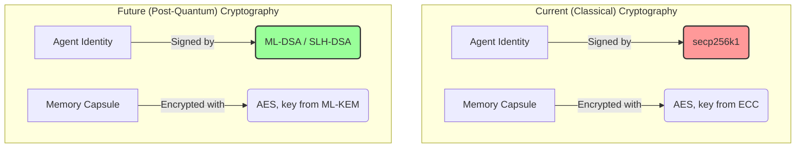

# PRD: Post-Quantum Cryptography Migration

## 1. Vision

To ensure the Kestrel project's promise of lifelong data sovereignty and permanence by migrating its core cryptographic systems to be secure against attacks from both classical and quantum computers. This migration is not merely an upgrade; it is a foundational requirement for creating a truly resilient and future-proof "Sovereign AI Friend."

## 2. The Quantum Threat: "Harvest Now, Decrypt Later"

The current cryptographic standard used in Kestrel, `secp256k1` (an ECC algorithm), is secure against today's computers but is known to be vulnerable to Shor's algorithm, which can be run on a sufficiently powerful quantum computer.

This presents a critical, near-term threat: adversaries can record encrypted Kestrel data *today* and decrypt it years or decades from now when a quantum computer is available. For a system designed to hold a lifetime of sensitive data—from private conversations to health records—this is an unacceptable risk.

## 3. The Solution: Standardization on NIST PQC

We will migrate Kestrel's cryptographic primitives away from classical algorithms to the new standards finalized by the U.S. National Institute of Standards and Technology (NIST). This ensures we are building on a globally vetted, forward-looking foundation.

The migration will focus on two key areas:

*   **Identity & Authentication (Digital Signatures):** We will replace `secp256k1` with a NIST-standardized digital signature algorithm to protect agent identities.
*   **Data Confidentiality (Encryption):** We will use a NIST-standardized key encapsulation mechanism (KEM) to protect all sensitive data at rest and in transit, including the Memory Capsule itself.

## 4. Functional Requirements

### FR1: Agent Identity Migration (Digital Signatures)
The agent's core identity must be quantum-resistant.
-   **Primary Algorithm:** The `generate_kestrel_identity.py` script will be updated to use **ML-DSA (FIPS 204)** as the primary algorithm for generating the agent's keypair and Decentralized Identifier (DID).
-   **Backup Algorithm:** For critical functions like signing the agent's constitution, we will consider using **SLH-DSA (FIPS 205)**, a hash-based signature scheme, for its different security assumptions, providing a robust fallback.
-   All signature verification logic throughout the codebase must be updated to support the new algorithms.

### FR2: Memory Capsule Encryption (KEM)
The agent's memory must be protected from future decryption.
-   **Algorithm:** We will use **ML-KEM (FIPS 203)** to encrypt all sensitive data within the storage system, particularly the agent's Memory Capsule and the Health Vault.
-   This involves generating a quantum-resistant symmetric key and securely encapsulating it for storage and exchange.

### FR3: "Burn the Boats" Transition
Per the project's refactoring principles [[memory:3245381]], we will perform a clean migration. We will not maintain a hybrid system or backward compatibility with the old `secp256k1` keys. All new agents will be created using PQC, and a migration path will be defined for any legacy agents.

### FR4: Dependency Integration
-   Identify and vet suitable Python libraries that provide stable, well-maintained implementations of the FIPS 203, 204, and 205 standards.
-   Integrate these libraries into the `pyproject.toml` and replace the existing cryptography dependencies where necessary.

## 5. Architectural Diagram: Before and After

## 6. Migration Plan

1.  **Research & Library Selection:** Investigate and select the best Python library for ML-KEM, ML-DSA, and SLH-DSA (e.g., `liboqs-python`, or others as they become available).
2.  **Identity Refactoring:** Update `generate_kestrel_identity.py` and all related identity and signature logic to use the chosen PQC digital signature algorithm.
3.  **Storage Refactoring:** Update the storage system (`storage/`) to use the chosen PQC KEM for all encryption and decryption operations.
4.  **Testing:** Develop a comprehensive suite of new tests in the `tests/` directory to validate the correctness, security, and performance of the new PQC implementations.
5.  **Documentation:** Update all relevant project documentation to reflect the new cryptographic standard. 