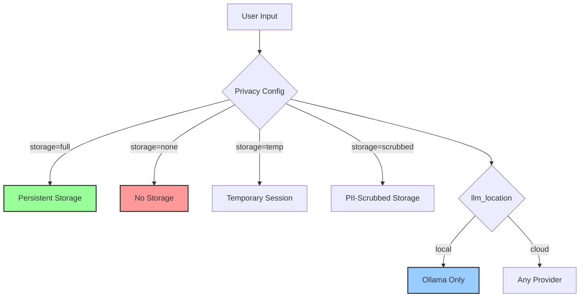
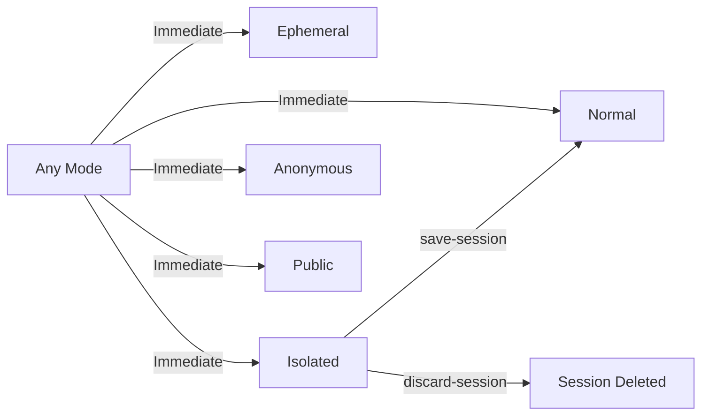

# Privacy Modes: Complete Data Sovereignty

## 1. Vision

Kestrel provides unprecedented control over data privacy through **independent privacy flags** with **named presets**. Users can use presets for common configurations or set flags directly for custom setups.

**Core Principle**: The user, not the platform, controls data retention and processing location.

## 2. Privacy Architecture: Flags + Presets

Privacy is controlled by three independent flags:

| Flag | Options | Controls |
|------|---------|----------|
| `storage` | none, temp, scrubbed, full | How/whether data is persisted |
| `llm_location` | local, cloud | Whether cloud LLMs are allowed |
| `shareable` | true, false | Whether content can be exported |

**Named presets** are convenient combinations of these flags:

```python
PRIVACY_PRESETS = {
    "ephemeral": PrivacyConfig(storage="none", llm_location="local", shareable=False),
    "isolated": PrivacyConfig(storage="temp", llm_location="local", shareable=False),
    "anonymous": PrivacyConfig(storage="scrubbed", llm_location="cloud", shareable=False),
    "normal": PrivacyConfig(storage="full", llm_location="cloud", shareable=False),
    "public": PrivacyConfig(storage="full", llm_location="cloud", shareable=True),
}
```



## 3. Preset Specifications

### 🔄 Normal Mode (`!normal`)

**Config**: `storage=full, llm_location=cloud, shareable=false`

**Use Case**: Standard operation for most interactions
**Storage**: Persistent SQLite database
**Processing**: Multi-model (Ollama + OpenAI fallback)
**Memory Anchoring**: Full cryptographic anchoring available
**Learning**: Agent learns and remembers everything

**Example Scenarios**:
- Regular conversation and collaboration
- Building long-term knowledge base
- Professional work that benefits from context
- For human-led elderly storytelling preservation.

### 👻 Ephemeral Mode (`!ephemeral`)

**Config**: `storage=none, llm_location=local, shareable=false`

**Use Case**: Sensitive topics requiring zero digital footprint
**Storage**: Nothing stored anywhere
**Processing**: Local LLM only (Ollama) - data never leaves device
**Memory Anchoring**: Disabled (nothing to anchor)
**Learning**: Agent cannot learn or remember anything from this session

**Example Scenarios**:
- Personal matters and confidential discussions
- Sensitive business strategy sessions
- Mental health conversations
- Brainstorming with proprietary information
- For private intimate sharing without eternal records.

**Technical Implementation**:
```python
def add_conversation(self, role: str, content: str, metadata: Optional[Dict] = None):
    if self._privacy_config.is_ephemeral():
        # Don't store anything - use in-memory ephemeral session
        self.ephemeral_session.add_message(role, content, metadata)
        return  # Do NOT persist
```

### 🏝️ Isolated Mode (`!isolated`)

**Config**: `storage=temp, llm_location=local, shareable=false`

**Use Case**: Complex analysis where you want to control what becomes permanent
**Storage**: Temporary session buffer only
**Processing**: Local LLM only (data stays on device during experimentation)
**Memory Anchoring**: Not available during session
**Learning**: Deferred until user decides

**Session Control Commands**:
- `!save-session` - Make session permanent
- `!discard-session` - Delete session without saving

**Example Scenarios**:
- Experimental analysis of sensitive data
- Trying different approaches before committing
- Working with third-party data that may not belong in permanent memory

### 🎭 Anonymous Mode (`!anonymous`)

**Config**: `storage=scrubbed, llm_location=cloud, shareable=false`

**Use Case**: Learning from interactions while protecting identity
**Storage**: PII-scrubbed persistent storage
**Processing**: Full multi-model access (cloud allowed)
**Memory Anchoring**: Available (preserves integrity)
**Learning**: Agent learns patterns but not personal details

**PII Scrubbing**:
- Email addresses → `[EMAIL_REDACTED]`
- Phone numbers → `[PHONE_REDACTED]`
- SSNs → `[SSN_REDACTED]`
- Names → `[NAME_REDACTED]`

**Example Scenarios**:
- Contributing to agent training without personal exposure
- Discussing sensitive topics while preserving learning value
- Interactions that have educational value but contain personal information

### 📖 Public Mode (`!public`)

**Config**: `storage=full, llm_location=cloud, shareable=true`

**Use Case**: Fully transparent and auditable agents
**Storage**: Full persistent storage
**Processing**: Full multi-model access
**Memory Anchoring**: Full anchoring available
**Learning**: Full learning with export capability

**Example Scenarios**:
- Community bots that need to be auditable
- Transparent AI assistants
- Agents where trust requires visibility
- Public-facing services

## 4. Custom Configurations

Beyond presets, you can set flags directly for custom configurations:

```python
from privacy import PrivacyConfig

# Want permanent storage but local-only processing?
# (Not a preset, but perfectly valid)
agent.set_privacy(PrivacyConfig(
    storage="full",
    llm_location="local",
    shareable=False
))
```

## 5. Privacy Mode Commands

### Chat Interface Commands

```bash
# Status and control
!status         # Show current privacy mode and session status
!normal         # Switch to standard mode
!ephemeral      # Switch to ephemeral (off-the-record) mode
!isolated       # Switch to isolated session mode
!anonymous      # Switch to anonymous mode (PII removed)
!public         # Switch to public mode (shareable)

# Session management (isolated mode only)
!save-session   # Save isolated session to permanent storage
!discard-session # Discard isolated session without saving
```

### Programmatic API

```python
from privacy import PrivacyMode, PrivacyConfig, get_privacy_preset

# Using presets (backward compatible)
agent.privacy_agent.set_mode(PrivacyMode.EPHEMERAL)
agent.privacy_agent.set_mode("ephemeral")  # String also works

# Using custom config
agent.privacy_agent.set_mode(PrivacyConfig(
    storage="full",
    llm_location="local",
    shareable=False
))

# Check current config
config = agent.privacy_agent.privacy_config
print(f"Storage: {config.storage}, LLM: {config.llm_location}")

# Check if cloud is allowed
if config.allows_cloud_llm():
    # Use OpenAI, Anthropic, etc.
    pass

# Isolated mode session management
agent.privacy_agent.save_isolated_session()
agent.privacy_agent.discard_isolated_session()
```

## 6. Privacy Mode Transitions

### Safe Transitions

All privacy mode transitions are safe and immediate:


Note: Transitions support app layers—e.g., switch to Isolated for reviewing human narratives before saving.

### Data Protection Guarantees

- **No Data Loss**: Switching modes never deletes existing data
- **Immediate Effect**: New privacy rules apply to the very next message
- **Backward Compatibility**: Existing stored data remains accessible in all modes
- **Isolation Integrity**: Isolated sessions cannot accidentally leak into permanent storage

## 7. Implementation Details

### Storage Layer Integration

Privacy config integrates directly with the enhanced storage system:

```python
def store_file_sovereign(self, file_path: str, privacy_config: PrivacyConfig):
    """Store file based on privacy config"""
    if privacy_config.is_ephemeral():
        # Calculate hash but don't store
        return self._calculate_hash_only(file_path)
    elif privacy_config.requires_anonymization():
        # Anonymize then store
        return self._store_anonymized(file_path)
    else:
        # Normal storage
        return super().store_file(file_path)
```

### LLM Service Integration

Privacy config controls which models can be used:

```python
def get_response(self, prompt: str, privacy_config: PrivacyConfig) -> str:
    """Get LLM response respecting privacy constraints"""
    if not privacy_config.allows_cloud_llm():
        # Filter to only local providers
        local_providers = [p for p in self.providers if p["name"] in ["ollama"]]
        if not local_providers:
            raise RuntimeError("Privacy config requires local providers only")
```

## 8. Security Considerations

### Threat Model

Privacy modes protect against:
- ✅ Accidental data exposure to external services
- ✅ Unintended persistence of sensitive information
- ✅ Identity correlation through PII
- ✅ Compliance violations in regulated environments

### Limitations

Privacy modes do NOT protect against:
- ❌ Compromised local system
- ❌ Network-level surveillance (use additional encryption)
- ❌ Physical access to storage devices
- ❌ Social engineering attacks

### Best Practices

1. **Start Restrictive**: Begin with ephemeral or isolated for new sensitive topics
2. **Regular Audits**: Use `!status` to verify current privacy mode
3. **Session Hygiene**: In isolated mode, regularly decide on session fate
4. **Mode Documentation**: Document which privacy mode was used for important decisions

## 9. Future Enhancements

### Planned Features

- **More Flag Options**: Additional flags for encryption, retention periods, etc.
- **Time-Based Auto-Expiry**: Automatic session cleanup
- **Geographic Compliance**: EU/US data residency modes
- **Collaborative Privacy**: Multi-user privacy negotiations

### Integration Roadmap

- **Filecoin Storage Tiers**: Map privacy configs to decentralized storage tiers
- **Zero-Knowledge Proofs**: Cryptographic privacy guarantees
- **Hardware Security Modules**: TPM-based local processing verification

---

**Privacy flags + presets represent a fundamental shift from platform-controlled to user-controlled data sovereignty. They ensure that AI agents work for users, not surveillance capitalism.**