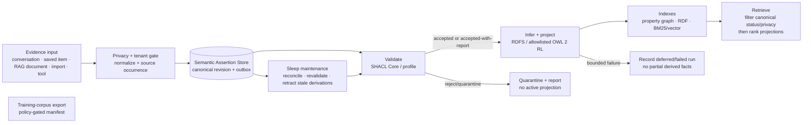

# Semantic Knowledge Architecture

**Status:** Design of record — defines the implementation boundary before a
semantic knowledge runtime is added. It does not claim that the tables,
serializers, reasoner, or training exporter described below ship today.

**Decision:** Kestrel has one canonical, tenant-scoped unit of knowledge: the
**semantic assertion**. A fact, graph edge, RDF triple, embedding, validation
report, sleep summary, and training example are not interchangeable units of
truth. They may describe, project, retrieve, or derive an assertion; only the
canonical assertion store decides whether that assertion is active, visible,
and eligible for use.

This contract reconciles the current property graph, vector/RAG retrieval,
cognitive memory, sleep maintenance, privacy wrapper, and the extracted
[`kestrel-feature-parametric-self`](../../ECOSYSTEM.md) boundary. It is the
load-bearing contract for follow-on implementation tickets.

## Scope and non-goals

This document specifies the future semantic knowledge layer and its migration
boundary. It does not add an RDF library, an ontology, a reasoner, a database
dependency, a tool, or a training pipeline. It also does not turn a
conversation, an LLM completion, or a vector result into a fact merely by
storing it.

Constitutional governance and tool authorization remain owned by the
constitution and approval systems. An ontology or shape is data/schema, never
an executable grant of authority.

## Terms

| Term | Meaning in this contract |
|---|---|
| **Assertion** | A tenant-scoped claim with normalized subject, predicate, and object/literal plus its epistemic and lifecycle metadata. It has a deterministic identity. |
| **Revision** | An immutable version of an assertion's record, created for a status, confidence, visibility, time, source, ontology, or lineage change. It does not create a different assertion identity. |
| **Source occurrence** | One observed/imported/manual source event supporting, disputing, or superseding an assertion. Several occurrences may support one assertion. |
| **Evidence artifact** | A conversation message, document chunk, saved item, file, API response, or other retained input. It is not knowledge until an explicit assertion process accepts a claim from it. |
| **Projection** | A rebuildable representation of canonical assertions: RDF, property graph, search/vector index, validation report, materialized inference, or training-corpus manifest. |
| **Tenant** | The isolation authority. In the current core deployment the agent DID/`agent_id` normally supplies the tenant identity; a future hosted deployment may have a distinct `tenant_id` and `owning_agent_id`. |

## Canonical assertion record

### Required fields

The persistence owner stores one immutable revision row per change and a
current-state pointer per assertion. Every committed revision contains all of
the following; `null` is permitted only where explicitly stated.

| Field | Type / invariant |
|---|---|
| `assertion_id` | Deterministic `urn:kestrel:assertion:sha256:<64 lowercase hex>` identity defined below. It is never recycled or reassigned. |
| `revision_id` | Generated immutable identifier (UUIDv7 or ULID) for this revision. It is not content identity. |
| `tenant_id` | Required immutable isolation scope. Every read, write, inference, index, export, and deletion query is tenant-filtered before any semantic filtering. |
| `owning_agent_id` | Required agent DID/identity within the tenant. It is an ownership and audit field, not an authorization bypass. |
| `subject` | Required normalized absolute IRI. A blank node is never a canonical subject. |
| `predicate` | Required normalized absolute IRI. Display labels, Python names, and underscored aliases are never predicates. |
| `object` | Exactly one of a normalized absolute IRI or a `Literal(lexical_form, datatype_iri, language_tag?)`; it is mutually exclusive with an absent object. |
| `source` / `source_occurrence_ids` | Non-empty ordered set of immutable source-occurrence IDs for direct assertions; inferred revisions instead carry a non-empty derivation support set. Each occurrence's `source` records its kind, stable locator, received time, source-content digest when retained, extractor/actor, and a source-local span or selector when available. |
| `confidence` | Decimal in `[0, 1]`, plus `confidence_method` and `confidence_basis`. It is evidence assessment, not a truth value; no component may silently clamp it. |
| `epistemic_state` | One of `asserted`, `observed`, `reported`, `inferred`, `hypothesis`, `disputed`, or `retracted`. `asserted` means Kestrel/the owner adopts the claim; `reported` means a source said it; `observed` means a measured event; `inferred` names a recorded derivation. |
| `asserted_at` | Required UTC instant when this revision was accepted by the canonical store. It is system/record time, not the time the claim holds. |
| `observed_time` | Optional closed or open UTC interval in which the source observed the claim. Unknown is `null`, never fabricated from `asserted_at`. |
| `valid_time` | Optional closed or open UTC interval during which the claim is asserted to hold in the domain. Unknown is `null`; it is distinct from observed and asserted time. |
| `status` and `supersedes_revision_id` | Status is `active`, `superseded`, `retracted`, `quarantined`, or `deleted`. A superseding revision points to the immediately prior revision; an active assertion has at most one current active revision. |
| `visibility` and `privacy_classification` | `visibility` is `private`, `tenant`, `delegated`, or `public`, with an explicit release policy reference. `privacy_classification` is a policy label such as `ephemeral`, `isolated`, `anonymous`, `normal`, `public`, or a stricter domain label. The effective policy is the more restrictive one. |
| `ontology_version` | Required immutable `OntologyRef(namespace, version, content_digest, compatibility_profile)`. It identifies the vocabulary/shapes interpretation used to accept the revision. |
| `derivation_lineage` | Required structured lineage: `direct` source occurrence(s), or `derived` rule/engine/profile version, input assertion revision IDs, input ontology/shapes digests, run ID, and generation time. It is a DAG; cycles are rejected. |

The canonical store additionally records actor, operation ID/idempotency key,
reason code, a structured validation outcome, and retention/erasure metadata.
Those audit fields do not alter assertion identity.

### Invariants

1. A revision is append-only. Correction creates a new revision; it never
   updates the evidence trail in place.
2. A record cannot be both `active` and `retracted`/`deleted`/`quarantined`.
   `superseded` is a historical record state; the replacement must name the
   revision it supersedes.
3. `inferred` revisions must have no hand-waved provenance: their complete
   support revision IDs, rule identifier, engine version, and input digest are
   required. Direct assertions may not masquerade as inference.
4. Visibility never widens by inference, projection, export, or training:
   output classification is the most restrictive classification of all inputs
   and the output policy.
5. `tenant_id`, `owning_agent_id`, and all source occurrences are checked
   before an assertion can be linked to another record. Cross-tenant lineage is
   forbidden unless an explicit delegated-import grant produces a new,
   tenant-local occurrence.
6. The canonical store uses UTC instants with an offset and precision preserved
   by the backend. SQLite uses normalized text plus range endpoints; PostgreSQL
   uses timezone-aware instants/ranges. Neither backend is allowed to reinterpret
   a naive timestamp in a server-local timezone.
7. A validation failure, inference timeout, or missing index does not change an
   accepted assertion into a different assertion. It changes the revision's
   outcome/status according to the bounded failure rules below.

## Deterministic identity and normalization

### Assertion identity

An assertion identifies the **claim in its tenant**, not where it was found,
who last edited it, or which vector model indexed it. Its byte preimage is the
UTF-8 output of the [JSON Canonicalization Scheme, RFC 8785 (June
2020)](https://www.rfc-editor.org/rfc/rfc8785.html), after the normalization
rules below. RFC 8785 is the only permitted identity serialization for
`kestrel-assertion-id-v1`; a different encoder or byte grammar requires a new
`identity_version`. In particular, RFC 8785 recursively orders object member
names lexicographically. The member lists below are therefore normative, and
their displayed order is the RFC 8785 order—not a separate insertion-order
rule:

```json
{
  "identity_version": "kestrel-assertion-id-v1",
  "object": {
    "datatype": "<normalized datatype IRI or null>",
    "kind": "iri | literal",
    "language": "<lowercase BCP-47 tag or null>",
    "value": "<normalized IRI or literal lexical form>"
  },
  "predicate": "<normalized IRI>",
  "subject": {"kind": "iri", "value": "<normalized IRI>"},
  "tenant_id": "<normalized tenant id>"
}
```

`assertion_id` is the SHA-256 digest of that UTF-8 preimage with the URN
prefix above. `owning_agent_id`, source, confidence, all time fields, status,
visibility, ontology version, and lineage are required record fields but
**not** identity fields. This makes a newly observed source, a corrected
confidence value, or a new revision of the same claim converge on one
assertion identity. A semantic change to subject, predicate, object, or tenant
creates a different identity.

The following fixed vector is part of this contract. Implementations must
assert both the exact RFC 8785 bytes and the resulting URN; serializing this
object in its source/insertion order is deliberately a failing test.

```text
normalized terms:
  tenant_id = did:example:ava
  subject = <urn:kestrel:agent:did:example:ava:principal:user>
  predicate = <https://kestrel.ai/vocab/preferredDeployRegion>
  object = "us-central1"^^<http://www.w3.org/2001/XMLSchema#string>

RFC 8785 UTF-8 preimage:
{"identity_version":"kestrel-assertion-id-v1","object":{"datatype":"http://www.w3.org/2001/XMLSchema#string","kind":"literal","language":null,"value":"us-central1"},"predicate":"https://kestrel.ai/vocab/preferredDeployRegion","subject":{"kind":"iri","value":"urn:kestrel:agent:did:example:ava:principal:user"},"tenant_id":"did:example:ava"}

SHA-256:
09221b64ffa7584a9c65105d061fb0ca51e352838547d296fb45de7336180e60

assertion_id:
urn:kestrel:assertion:sha256:09221b64ffa7584a9c65105d061fb0ca51e352838547d296fb45de7336180e60
```

The `identity_version` is part of the preimage. An identity algorithm change is
a migration with explicit old-to-new mappings; it is never a transparent hash
rewrite. `assertion_id` must not be used as a shared cross-tenant correlation
identifier because tenant scope is deliberately included.

### Revision and source-occurrence identity

`revision_id` is generated at the canonical-store transaction boundary and is
unique even when two revisions have identical values. `source_occurrence_id`
is generated for a particular evidence encounter and includes a stable source
locator and content digest where policy permits. It can say “this assertion was
seen in message 42 and document chunk 9” without duplicating the assertion.

Idempotent imports use `(tenant_id, import_operation_id, source_locator,
source_content_digest, selector)` to find the same occurrence. They do not use
the assertion hash alone, because one import can legitimately support an
existing assertion with new provenance.

### Normalization rules

1. The input adapter resolves relative IRIs against a declared base before the
   canonical boundary. Canonical terms are absolute IRIs. IRI comparison follows
   RDF's simple string equality; Kestrel only applies the documented minting
   normalization (Unicode NFC, lowercase scheme/host, no default port,
   normalized percent escapes, and no dot segments) before hashing. It does not
   silently equate arbitrary different IRIs.
2. Subjects and predicates must be IRIs. Objects are IRIs or typed literals.
   Imported blank nodes are rejected for assertion identity unless the importer
   mints a deterministic, source-scoped skolem IRI and records that mapping in
   the occurrence. Blank-node labels are never persisted as canonical identity.
3. Strings are Unicode NFC. Language tags are well-formed BCP 47 and lower
   case. A language-tagged literal uses `rdf:langString` and cannot also supply
   another datatype.
4. Literals retain a canonical lexical form for their declared datatype.
   Known XSD numeric, boolean, date, and date-time types are validated and
   canonicalized before hashing; invalid lexical forms are quarantined rather
   than guessed. Unknown datatype IRIs retain NFC lexical text, datatype, and
   language as distinct terms.
5. Namespace prefixes, graph-node IDs, human labels, JSON property order,
   embedding model/profile, and RDF serialization are never inputs to
   `assertion_id`.
6. Imported RDF dataset digests use the pinned RDF Dataset Canonicalization
   algorithm only for source evidence and reproducibility. They do not replace
   Kestrel assertion identity, which must work for non-RDF inputs too.

### Canonical term algebra and RDF 1.2 boundary

`kestrel-assertion-id-v1` has a deliberately closed `AssertionTerm` algebra:
an absolute normalized IRI, or a literal with NFC lexical form, datatype IRI,
and optional lowercase BCP 47 language tag. The `subject` and `predicate`
positions accept only the IRI variant; `object` accepts either variant. This is
the complete recursive grammar for canonical assertion identity in
`semantic-kb-v1`; it is an RDF 1.1-compatible subset, not an open-ended RDF
term container.

The snapshot-pinned `rdf12-cr-20260407` transport profile may recognize RDF
1.2 source syntax, but it does **not** negotiate RDF 1.2 term support in this
contract. In particular, an RDF 1.2 triple term (`<< s p o >>`) is not an
`AssertionTerm` in any position, and a directional language-tagged string is
not a canonical literal because `AssertionTerm` has no direction member.
The input adapter must never flatten either form into a string, substitute a
made-up IRI/datatype, or hash an implementation-specific encoding.

On encountering either form, the importer records a record-level
`unsupported_rdf12_term` outcome and quarantines that source record under the
normal tenant/privacy retention policy. It creates no canonical assertion,
identity preimage, projection, inference result, or training candidate from
that record. An `rdf12-cr-20260407` document may still yield assertions from
its independently representable RDF 1.1 terms; its quarantined terms remain
evidence only. An RDF 1.2 export may serialize representable canonical terms
under its exact pinned syntax, but a request to emit a triple term or
directional string fails closed with `unsupported_rdf12_term`, rather than
performing a lossy lowering.

Adding either RDF 1.2 form requires a new named semantic contract and profile,
with recursive term/direction representation, normalization, canonical
identity preimage, import/export behavior, and conformance fixtures. It is not
a compatible implementation detail or a change to an existing assertion hash.

## One persistence owner; many projections

The planned **Semantic Assertion Store** is the sole canonical persistence
owner. It is a relational, tenant-scoped part of Kestrel's existing
`AsyncDatabase` abstraction, with normalized assertion/current-revision,
revision, source-occurrence, lineage-support, ontology-artifact, shapes-
artifact, and outbox tables. SQLite is the local/single-agent implementation;
PostgreSQL is the concurrent/shared implementation. Both must enforce the same
unique keys, transaction rules, tenant predicates, and deletion semantics.

An accepted write commits the canonical revision and an outbox event in one
database transaction. Every derived surface consumes that event and records
the assertion revision ID and projection version it used. A projection may lag
or be rebuilt; it may never make an assertion active, deleted, public, valid,
or trainable.

| Surface | Role | Not canonical because |
|---|---|---|
| RDF graph/dataset and Turtle, TriG, N-Triples, or N-Quads serialization | Interoperable export/import projection | A serialization has no Kestrel tenant, lifecycle, privacy, or revision authority by itself. |
| `GraphNode` / `Edge` | Current property-graph projection and migration input | Its arbitrary JSON properties and upsert keys cannot model immutable occurrence/revision lineage. |
| Embeddings, BM25, HNSW, pgvector, and SQLite cosine indexes | Retrieval acceleration | They are model- and profile-dependent, approximate, and rebuildable. |
| SHACL validation report | Auditable validation artifact | A report records a run against a particular shapes/data snapshot; it cannot mutate policy or truth. |
| Materialized inferred facts | Derived projection | It is valid only while its support revisions and rule/profile remain valid. |
| Memory episodes, summaries, and temporal patterns | Cognitive-memory artifacts | They summarize or prioritize experience; they are not automatically endorsed domain claims. |
| Parametric-self model weights and corpus manifest | Optional learning artifacts | Model weights are lossy outputs; a corpus manifest records a gated selection, not truth. |

## Current Kestrel boundary map

The following is deliberately precise about the current tree. It does not
retroactively claim that current rows already meet this contract.

| Current surface | Present owner and behavior | Semantic-layer treatment |
|---|---|---|
| `GraphNode` / `Edge` | `storage/async_graph_store.py`; `graph_nodes(node_id, node_type, label, properties)` and `graph_edges(source_id, target_id, label, properties)` with ownership ledgers | A property-graph **projection/input**. Stable existing non-fact nodes remain application resources. A legacy fact-shaped node is migrated only through an explicit adapter that emits a source occurrence and canonical assertion. |
| `learned_fact` | `features/memory_agency/feature.py::save_fact` currently creates `fact:{agent}:{subject}:{predicate}`, stores `value`, `confidence`, `source`, and `saved_at`, and can overwrite a prior value for the same subject/predicate | A migration source for user-approved/direct assertions. The old node ID is neither the future assertion ID nor a revision ID. The adapter preserves it as a source locator; new writes go through `AssertionWriter`. |
| Saved items | `storage/saved_items_store.py` and `saved_items` support stashes, files, excerpts, and structured items with embedding search | Evidence artifacts or user-curated notes. They become knowledge only after an explicit extraction/approval creates assertions with item spans/digests as source occurrences. |
| RAG files/chunks | `storage/async_rag_store.py`, `document_chunks`, BM25, and vector backends | Evidence retrieval, not a truth store. RAG text may support a source occurrence; search ranking cannot assert a claim. |
| Conversation history | `storage/async_conversation_store.py`, privacy-gated `conversation_history` | A transcript/evidence artifact, not knowledge. User/agent/LLM text is at most `reported`/`hypothesis` evidence until an authorized assertion process accepts it. |
| Cognitive memory and sleep | `storage/memory_system.py`, `memory_retriever.py`, `memory_consolidator.py`, and `agent/sleep.py` create episodes, patterns, archival states, and graph mirrors | Cognitive artifacts. Sleep may propose or index assertions through the typed API, but it may not silently promote summaries, patterns, or LLM guesses to active assertions. |
| Privacy wrapper | `storage/privacy_wrapper.py` blocks/redirects/redacts persistence by privacy mode | The semantic writer is behind the same boundary. It must receive the effective privacy context before normalization, source retention, indexing, validation, inference, and export. |
| Parametric self | Extracted `kestrel-feature-parametric-self`, registered in `feature_registry.toml`, runs as a sleep hook and owns a per-agent nightly-finetuned local model | It is an optional consumer. Its inputs are an explicit, policy-gated corpus export; its corpus manifest and weights are projections, never assertions or source-of-truth knowledge. |

An assertion can be knowledge only when it has passed the canonical writer's
tenant/privacy/normalization checks, recorded source or derivation lineage,
and reached the selected acceptance state. Raw files, chunks, transcripts,
embeddings, model weights, response text, labels, tool descriptions, ontology
documents, shapes, and validation reports are **not knowledge by themselves**.

## Data flow



Retrieval always applies canonical tenant, status, visibility/privacy,
valid-time, and derivation-support filters before it consults an approximate
index. A vector hit is a candidate, never authorization to return a hidden,
deleted, superseded-only, or retracted assertion.

## Standards and compatibility matrix

The status below is checked **as of 2026-07-26**. “Pinned” means Kestrel stores
the dated publication URL and a SHA-256 of the exact retrieved artifact in the
ontology/shapes/profile registry; it never persists “latest,” an editor's draft,
or an undated moving URL as a compatibility contract.

| Standard | Current W3C status and dated source | Kestrel use | Contract status |
|---|---|---|---|
| RDF 1.1 Concepts and Abstract Syntax | W3C Recommendation, [25 February 2014](https://www.w3.org/TR/2014/REC-rdf11-concepts-20140225/); its baseline concrete syntaxes are the dated [Turtle](https://www.w3.org/TR/2014/REC-turtle-20140225/), [N-Triples](https://www.w3.org/TR/2014/REC-n-triples-20140225/), [N-Quads](https://www.w3.org/TR/2014/REC-n-quads-20140225/), and [TriG](https://www.w3.org/TR/2014/REC-trig-20140225/) Recommendations | Mandatory interoperability baseline: RDF 1.1 terms, triples, named datasets, and those versioned import/export profiles. | Stable baseline |
| RDF Schema 1.1 | W3C Recommendation, [25 February 2014](https://www.w3.org/TR/2014/REC-rdf-schema-20140225/) | Allowed vocabulary/modeling and bounded RDFS entailment profile. No implicit remote vocabulary fetch. | Stable baseline |
| RDF Dataset Canonicalization | W3C Recommendation, [21 May 2024](https://www.w3.org/TR/2024/REC-rdf-canon-20240521/) | Optional source-dataset digest/canonicalization for signed or reproducible RDF imports/exports. | Stable optional capability |
| RDF 1.2 Concepts | Current W3C [Candidate Recommendation Snapshot, 07 April 2026](https://www.w3.org/TR/2026/CR-rdf12-concepts-20260407/); the corresponding [N-Triples syntax is a Working Draft dated 23 July 2026](https://www.w3.org/TR/2026/WD-rdf12-n-triples-20260723/) and the latest Recommendation remains RDF 1.1 | Negotiated, snapshot-pinned **transport-recognition** capability only. RDF 1.1-representable terms may be imported/exported under the exact syntax pin; RDF 1.2 triple terms and directional language-tagged strings are rejected/quarantined by the `semantic-kb-v1` canonical boundary as specified above. RDF 1.2 is not the persisted baseline. | Experimental, opt-in; term extension deferred |
| OWL 2 and OWL 2 RL | OWL 2 Overview and [Profiles](https://www.w3.org/TR/2012/REC-owl2-profiles-20121211/), W3C Recommendations, [11 December 2012](https://www.w3.org/TR/2012/REC-owl2-overview-20121211/) | Only the explicit `owl2rl-kestrel-v1` rule allowlist below may run. No OWL DL/full reasoner, arbitrary imports, `owl:sameAs` global merging, or open-ended rule execution. **OWL has no claimed upcoming 1.2 revision.** | Stable, tightly allowlisted |
| SHACL Core | W3C Recommendation, [20 July 2017](https://www.w3.org/TR/2017/REC-shacl-20170720/) | Required validation baseline. Shapes are pinned, tenant-scoped schema data; results are reports. | Stable baseline |
| SHACL 1.2 Core and SPARQL extensions | Current W3C Working Drafts, [Core 23 July 2026](https://www.w3.org/TR/2026/WD-shacl12-core-20260723/) and [SPARQL extensions 24 July 2026](https://www.w3.org/TR/2026/WD-shacl12-sparql-20260724/); latest Recommendation remains SHACL 2017 | Sandboxed, snapshot-pinned experiments only. No draft feature participates in a default acceptance, authorization, or destructive workflow. | Experimental, opt-in |
| SPARQL 1.1 Query Language | W3C Recommendation, [21 March 2013](https://www.w3.org/TR/2013/REC-sparql11-query-20130321/) | Optional read-only query capability over a tenant-filtered canonical/projection view. | Stable optional capability |
| SPARQL 1.2 Query Language | Current W3C Working Draft, [25 June 2026](https://www.w3.org/TR/2026/WD-sparql12-query-20260625/); latest Recommendation remains SPARQL 1.1 | Read-only, budgeted experimental query profile against a tenant-filtered view. Updates, `SERVICE`, filesystem/network functions, and arbitrary functions are forbidden. | Experimental, opt-in |
| SKOS | W3C Recommendation, [18 August 2009](https://www.w3.org/TR/2009/REC-skos-reference-20090818/) | Controlled concepts, labels, mappings, and vocabularies; labels never become identifier normalization rules. | Stable optional vocabulary |
| PROV-O | W3C Recommendation, [30 April 2013](https://www.w3.org/TR/2013/REC-prov-o-20130430/) | RDF projection of source occurrence and derivation lineage, not a substitute for Kestrel's transactional lineage tables. | Stable optional vocabulary |
| OWL-Time | W3C Recommendation, [19 October 2017](https://www.w3.org/TR/2017/REC-owl-time-20171019/); the mutable [/TR/owl-time/ page](https://www.w3.org/TR/owl-time/) currently resolves to a Candidate Recommendation Draft | RDF projection of valid/observed temporal intervals. The dated Recommendation is the only baseline pin. | Stable optional vocabulary |

### OWL 2 RL allowlist

`owl2rl-kestrel-v1` is deliberately a small, forward-only subset of OWL 2 RL.
It permits only: `rdfs:subClassOf`, `rdfs:subPropertyOf`, `rdfs:domain`, and
`rdfs:range`; bidirectional expansion of `owl:equivalentClass` and
`owl:equivalentProperty`; `owl:inverseOf`; `owl:TransitiveProperty` and
`owl:SymmetricProperty`; and explicitly listed `owl:propertyChainAxiom` chains
of at most three predicates. Every schema axiom, rule, predicate, and chain is
named in the pinned tenant profile before it can execute. Output remains
`inferred` with complete support sets.

The profile forbids `owl:imports`, remote resolution, `owl:sameAs`,
`owl:differentFrom`, `owl:AllDifferent`, `owl:hasKey`, cardinality restrictions,
`owl:oneOf`, complement/union/intersection class expansion, existential or
universal restrictions, data-range computation, negative property assertions,
and all custom/SPARQL rules. It also forbids writing inferred claims into
another tenant or allowing them to grant a tool, permission, role, approval,
or visibility increase. A requested OWL expression outside this list is a
profile failure, not a reasoner fallback.

### Capability negotiation and versioning

Every import, export, validator, reasoner, and query request carries a
`SemanticCapabilityProfile`:

```text
contract_version: "semantic-kb-v1"
rdf_profile: "rdf11" | "rdf12-cr-20260407"
term_profile: "assertion-term-v1-rdf11-subset"
serialization: "turtle-20140225" | "nquads-20140225" | ...
reasoning_profile: "none" | "rdfs-v1" | "owl2rl-kestrel-v1"
validation_profile: "shacl-core-20170720" | "shacl12-core-20260723-experimental"
query_profile: "none" | "sparql11-readonly" | "sparql12-20260625-experimental"
artifact_pins: [{uri, published_date, sha256}]
```

The receiver intersects the requested profile with its local allowlist and
returns the selected profile, all artifact pins, and a capability decision. For
`semantic-kb-v1`, the selected `term_profile` is always
`assertion-term-v1-rdf11-subset`, even when the source serialization is RDF
1.2; the receiver reports `unsupported_rdf12_term` per record rather than
claiming that an RDF 1.2 syntax profile made the term representable. A missing,
unknown, undated, digest-mismatched, or disallowed profile fails closed; it is
never silently upgraded to “latest.” Draft-to-draft or draft-to-Recommendation
changes require a new named profile, migration assessment, and dual-read/export
period. A persisted assertion always names the ontology profile that
interpreted it, even if a later profile is selected for retrieval.

## Lifecycle: correction, deletion, inference, import, vectors, and training

### Supersession and contradiction

Different object values create different assertion identities. They may both
be active if their valid-time intervals, sources, or epistemic states permit
it. A contradiction detector may create a `disputed` revision or report; it
must not choose a winner merely because one vector result ranks higher.

When an operator or governed process replaces a claim, it appends a
`status=superseded` state revision for the old claim and an active
revision/claim with explicit `supersedes_revision_id`, a reason, and new
source occurrence(s).
Supersession is scoped: replacing a current preference does not erase the
historical preference or a different source's observation. “Latest” retrieval
uses valid time, status, and explicit supersession policy; audit retrieval can
show the complete chain.

Supersession is one compare-and-swap transaction, not two best-effort writes.
The caller supplies the **expected active predecessor revision ID** plus a
replacement proposal and reason. The writer tenant-checks that revision, locks
the affected current-pointer rows in ascending `assertion_id` order, and
compares the predecessor assertion's current pointer with the expected ID. If
it differs, is no longer active, or belongs to another tenant, the operation
returns a conflict and creates no revisions or outbox events. On success, one
transaction appends (1) a `superseded` revision for the predecessor assertion
and (2) the replacement's `active` revision—on the same assertion identity
when its normalized SPO is unchanged, otherwise on the replacement assertion
identity. The replacement revision's `supersedes_revision_id` names the new
superseded revision. The transaction advances the relevant current pointers,
writes both outbox events, and returns both revisions in a durable,
operation-idempotent receipt. Repeating the same `operation_id` returns that
receipt; a competing replacement must retry from the newly current revision.

### Deletion and erasure

Deletion has two explicit modes:

1. **Lifecycle retraction** keeps the revision/audit shell, changes status to
   `retracted`, blocks normal retrieval/index/training, and preserves permitted
   non-sensitive provenance for audit.
2. **Privacy erasure** follows the governing retention/erasure policy. It
   removes source bodies, locators, embeddings, index entries, and canonical
   assertion content that identify the erased subject. Any remaining audit
   marker contains only policy-approved, non-reidentifying operation metadata;
   a content hash is not retained when it itself could become personal data.

Both modes enqueue a deletion outbox event. The projection worker deletes
property-graph/RDF rows and vector/BM25 entries by assertion revision ID,
invalidates cache keys, and records acknowledgements. Until all acknowledgements
arrive, the canonical filter continues to hide the assertion. A failed cleanup
is observable work, not permission to serve stale data.

### Inference retraction

Every derived assertion has a truth-maintenance support set of input assertion
**revision** IDs. If any support is deleted, retracted, superseded outside the
derivation's time policy, becomes invisible, or its rule/profile pin changes,
the derived revision is immediately hidden and marked `retracted` (or
`quarantined` pending recomputation). The invalidation is transitive through
the lineage DAG. Re-running inference creates a new derived revision; it never
relabels an old result as if it came from new inputs.

### Import and export

Import is staged: parse and size-limit bytes; select a snapshot-pinned profile;
resolve terms against the selected term profile; apply tenant/privacy policy;
validate; write canonical revisions and outbox atomically; then build
projections asynchronously. Imports must preserve source occurrence provenance
and must not import another tenant's assertion ID as authoritative. Under
`semantic-kb-v1`, the RDF 1.2 triple-term and directional-string handling is
the explicit `unsupported_rdf12_term` quarantine rule above, not a lossy
conversion. An export is a snapshot at a recorded transaction/version
boundary, filtered by tenant, visibility, privacy, status, valid time, and
negotiated profile. Its manifest lists selected assertion revision IDs, profile
pins, term profile, and source/derivation disclosure policy.

### Vector invalidation and retrieval

Embedding text is a projection input built from a defined, redacted
assertion-rendering profile. Each vector row stores `assertion_id`,
`revision_id`, tenant, visibility/privacy ceiling, renderer version, embedding
profile/model ID, and canonical revision digest. Any revision/status/privacy/
ontology-renderer/model change invalidates the old row. Re-embedding is
asynchronous and bounded; while pending, retrieval falls back to structured,
lexical, or graph projection candidates after canonical filtering. It never
uses a stale vector to bypass canonical status or privacy.

### Future training eligibility

Training is an optional export, not a semantic-store side effect. A candidate
revision is eligible only when all are true: it is active; its effective
visibility/privacy permits the named training purpose; its source license and
consent permit training; it has no legal/retention hold; it is not inferred
solely from ineligible inputs; and a tenant/operator policy allows the specific
destination. The exporter creates an immutable, scoped corpus manifest listing
revision IDs, policy version, source/consent decisions, redaction renderer,
and expiration/revocation watermark. A retraction, erasure, or policy change
revokes future exports and marks prior manifests contaminated; it cannot claim
to untrain a model already trained, so the model registry must expose the
affected manifest IDs and require an explicit remediation decision.

## Privacy and security boundary

The semantic writer is a privacy-governed storage operation. It has no raw
side door around `PrivacyEnforcingStorage`:

- `EPHEMERAL` rejects canonical assertion, source-occurrence, vector, inference,
  validation-report, sleep, and training-corpus persistence. A best-effort
  purge is a safety net, not the primary control.
- `ISOLATED` keeps only session-local records and prohibits durable indexes,
  exports, and training. Promotion is an explicit, governed new write with
  fresh sources and provenance.
- `ANONYMOUS` stores only the policy-approved redacted form; raw source text,
  raw identifiers, and unredacted vectors are prohibited.
- `NORMAL`, `PUBLIC`, and delegated sharing remain bounded by tenant,
  visibility, consent, encryption, and destination policy. Public is never the
  default consequence of importing public RDF.

Ontology and shapes artifacts are tenant-scoped schema data. Their parser,
resolver, and rule engine run with no network fetch, file access, subprocess,
tool invocation, mutation authority, secret access, or cross-tenant query
capability. They cannot authorize a tool, override constitutional policy,
create an approval, widen a tenant scope, lower a privacy classification, or
turn validation/inference into a privileged action. Constitution and approval
checks run outside this layer and still govern any tool that proposes an
assertion, export, deletion, or training job.

## Bounded failure semantics

| Operation | Bound and failure result |
|---|---|
| Import | Enforce byte, triple/assertion, nesting, blank-node, parse-time, and transaction-size limits before acceptance. A structural/profile/tenant/privacy failure commits no canonical rows. An RDF 1.2 triple term or directional language-tagged string produces the record-level `unsupported_rdf12_term` quarantine outcome; it is not active, inferred, indexed, exported, or trainable. Other record-level semantic failures use the same tenant-private quarantine boundary. |
| Validation | Run against named shapes/data snapshot digests with time, recursion, and result caps. Required-profile timeout/error returns `validation_unavailable` and leaves a newly proposed assertion unaccepted/quarantined; it never treats “validator unavailable” as conformant. Informational validation is explicitly labeled and cannot decide acceptance. |
| Inference | Allowlisted deterministic rules only, with depth, derived-row, memory, and wall-clock budgets. Write a complete batch plus support sets atomically, or write no new derived assertions and record a failed/deferred run. Existing valid derived revisions remain readable until a support change requires hiding them. |
| Projection/index | Canonical commit succeeds independently of a rebuildable projection. Outbox retries are idempotent by `(revision_id, projection_version)` and expose lag. Retrieval canonical-filters candidates and offers a bounded non-vector fallback; it does not fabricate completeness. |
| Sleep maintenance | The current scheduled `sleep` source declares process-local `ResourceLock.MEMORY` in `signals/sources/scheduler.py`; `OrderedLockManager` serializes it only within one dispatcher process. It is not a tenant-scoped, cross-process/database maintenance lock. Semantic maintenance must acquire the durable `SemanticMaintenanceLease` specified below, process a checkpointed bounded batch, and commit each assertion/revision state transition atomically. A failed batch records a resumable cursor and report; it may not partially supersede, erase, infer, or train. Sleep proposals need the same writer/policy path as foreground writes. |
| Training export | Materialize only a complete, policy-checked manifest. If a selected assertion is revoked before sealing, abort/recompute; do not emit a partial corpus under the original manifest ID. |

### Semantic maintenance lease

The semantic implementation introduces a named, tenant-scoped durable lease:
`SemanticMaintenanceLease`. It is required for semantic work performed during
sleep (reconciliation, revalidation, re-inference, projection repair, or
training-corpus selection); the existing dispatcher `ResourceLock.MEMORY` is
an additional local optimization, never its substitute. The lease row contains
`tenant_id` (unique key), `holder_id`, `fencing_token`, `expires_at`, and
`updated_at`, all based on database time. A lease is bounded to one tenant and
one maintenance run; it never grants tenant access or authorizes a tool.

Acquisition and renewal are transactional and fail closed. SQLite uses
`BEGIN IMMEDIATE` plus a conditional insert/update on the tenant row; PostgreSQL
uses an atomic conditional update or `SELECT ... FOR UPDATE` on that same row.
Both compare expiry against the database clock, advance a monotonically
increasing fencing token on each new holder, and return `busy` without work
when another unexpired holder owns the lease. Every semantic-maintenance
canonical commit records and checks that fencing token, so a worker that loses
or outlives its lease cannot commit a late batch. Renewal failure aborts before
the next canonical transaction; it may leave only a resumable cursor/report
from a prior committed batch. No network, model, or projection call runs while
a database transaction is open.

The lock order is fixed: acquire the current process's `ResourceLock.MEMORY`
when the operation entered through the dispatcher; then acquire
`SemanticMaintenanceLease`; then lock affected assertion current-pointer rows
in ascending `assertion_id` order; finally write revisions and outbox rows in
the same transaction. Release in reverse order. A caller must never acquire
`ResourceLock.MEMORY` after the durable lease, and foreground assertion writes
use their pointer compare-and-swap rules rather than taking this maintenance
lease. This preserves the existing sleep/manual-consolidation serialization
while making a PostgreSQL multi-worker deployment safe.

## Worked examples

### 1. Direct assertion with provenance and confidence

An operator-approved `save_fact` migration receives the user statement,
“my preferred deploy region is us-central1,” in tenant `did:example:ava`.
The adapter maps the local subject `user` to
`urn:kestrel:agent:did:example:ava:principal:user`, maps the predicate to
`https://kestrel.ai/vocab/preferredDeployRegion`, and uses the typed literal
`"us-central1"^^xsd:string`. It calculates one `assertion_id` from those three
terms and the tenant—not from the message ID. The first revision records:

```text
epistemic_state = reported       confidence = 0.92 (user_direct_statement-v1)
source_occurrence = conversation_history:884#message-body sha256:…
asserted_at = 2026-07-26T14:02:11Z    observed_time = null
valid_time = [2026-07-26T14:02:11Z, +∞)
visibility = private              privacy_classification = normal
ontology = kestrel-vocab@1 sha256:…
lineage = direct(message occurrence)
```

The property graph may render it as a `learned_fact` node/edge and the vector
index may render the redacted assertion text, but neither becomes the source
of truth. A later PDF or conversation supporting the same claim adds another
source occurrence/revision to the same assertion identity.

### 2. Contradiction and supersession

On 2026-09-01 the user says their preferred region is `europe-west4`. That
object yields a **different** assertion ID. The conflict detector produces a
tenant-private report because the predicate is single-current under
`kestrel-vocab@1`; it does not delete either history. After approval, the old
claim receives a superseded revision with `valid_time` ending at the new
statement time, and the new claim receives an active `reported` revision with
its own source occurrence. “Current region” returns `europe-west4`; an audit
or time-travel query returns both values and their provenance. If the new
statement is unverified, both may remain active with a `disputed` state rather
than inventing certainty.

### 3. Erasure cascades through inference and training eligibility

Suppose an active direct assertion `A` says that a user completed a privacy
training module. An allowlisted rule produces inferred assertion `B`: the user
may access an internal knowledge collection. `B` records support `{A@r3}` and
the exact rule/profile digest. A training exporter includes `A@r3` in a
per-agent corpus manifest only because its source consent permits the named
local parametric-self purpose. When the user requests erasure, Kestrel deletes
the source body and canonical content permitted by the policy, hides/retracts
`A@r3`, walks the support DAG to hide/retract `B`, deletes both vector rows and
graph/RDF projections, and revokes future corpus exports. The already sealed
manifest is marked contaminated and linked to the remediation queue; the system
does not falsely promise that an already-trained model has forgotten it.

## Migration and rollback plan

### Stage 0 — contract and inventory (this ticket)

Publish this contract, inventory every current write seam, and add no runtime
dependency or behavior. Establish fixture corpora for legacy graph facts,
RAG/document evidence, conversations, privacy modes, deletion, and a
parametric-self export boundary. The profile fixtures include one accepted RDF
1.1 term, one RDF 1.2 triple term, and one RDF 1.2 directional language-tagged
string: the latter two must produce `unsupported_rdf12_term`, no identity
preimage, and no canonical/projection/training row.

### Stage 1 — additive canonical store and dual-read shadow

Add versioned tables and typed writer/reader interfaces behind `AsyncDatabase`
for SQLite and PostgreSQL. Backfill only a bounded copy of eligible
`learned_fact` nodes as `reported` records with the legacy node as source
occurrence. Preserve legacy rows untouched. Build projections in shadow and
compare tenant/status/privacy-filtered results; do not route production
retrieval through them yet.

### Stage 2 — dual write with outbox and verification

Route new explicit fact writes through the writer, emit a legacy graph
projection for compatibility, and use idempotency keys. Verify a live isolated
agent through the HTTP invoke path in each privacy mode: write, retrieve,
supersede, delete, re-infer, and test a training-corpus rejection. SQLite and
PostgreSQL must run the same conformance fixtures.

### Stage 3 — canonical read cutover

Read semantic fact surfaces from the canonical store and use graph/RDF/vector
surfaces only as filtered projections. Keep the legacy source adapter read-only
for a named compatibility window. Measure outbox lag, projection rebuild,
tenant isolation, erasure acknowledgement, and exact profile pins.

### Stage 4 — controlled cleanup

After the compatibility window and successful export/import/erasure rehearsal,
retire direct legacy learned-fact writes. Retain mapped legacy data according
to policy, not merely because it is convenient for migration.

**Rollback:** stages 1–2 roll back by disabling the feature flag and consuming
no canonical reads; canonical rows/outbox remain auditably inert. Stage 3 rolls
back reads to the legacy projection only after a compatibility check confirms
the projection is complete for the requested tenant/version; writes continue
to dual-write so no accepted claim is lost. No rollback resurrects erased data,
retracted assertions, or a privacy-widened projection. Schema migrations are
additive until the cleanup stage and are backed up/rehearsed separately for
SQLite and PostgreSQL.

## Typed interfaces for follow-on tickets

The exact module names are implementation work, but later tickets implement
these Python-facing contracts rather than bypassing them:

```python
@dataclass(frozen=True)
class AssertionTerm: ...  # iri or typed/language literal; already normalized

@dataclass(frozen=True)
class SourceOccurrenceInput: ...  # locator, digest, selector, actor, source kind

@dataclass(frozen=True)
class AssertionProposal: ...  # tenant/owner, SPO, source/lineage, time, privacy, ontology

@dataclass(frozen=True)
class AssertionRevision: ...  # immutable accepted/quarantined revision and outcome

@dataclass(frozen=True)
class SupersessionRequest:
    expected_predecessor_revision_id: str
    replacement: AssertionProposal
    reason_code: str
    reason_detail: str | None = None

@dataclass(frozen=True)
class SupersessionReceipt:
    predecessor_superseded_revision: AssertionRevision
    replacement_active_revision: AssertionRevision
    operation_id: str

@dataclass(frozen=True)
class MaintenanceLease:
    tenant_id: str
    holder_id: str
    fencing_token: int
    expires_at: datetime

class AssertionWriter(Protocol):
    async def propose(self, proposal: AssertionProposal, *, operation_id: str) -> AssertionRevision: ...
    async def supersede(
        self, request: SupersessionRequest, *, operation_id: str
    ) -> SupersessionReceipt: ...
    async def retract_or_erase(self, assertion_id: str, request: ErasureRequest) -> DeletionReceipt: ...

class SemanticMaintenanceLeaseManager(Protocol):
    async def acquire(self, *, tenant_id: str, holder_id: str) -> MaintenanceLease: ...
    async def renew(self, lease: MaintenanceLease) -> MaintenanceLease: ...
    async def release(self, lease: MaintenanceLease) -> None: ...

class AssertionReader(Protocol):
    async def retrieve(self, query: AssertionQuery, *, capability: SemanticCapabilityProfile) -> list[AssertionRevision]: ...
    async def export_snapshot(self, request: ExportRequest) -> ExportManifest: ...

class SemanticProjector(Protocol):
    async def apply(self, event: AssertionOutboxEvent) -> ProjectionReceipt: ...
    async def invalidate(self, event: AssertionOutboxEvent) -> ProjectionReceipt: ...

class SemanticValidator(Protocol):
    async def validate(self, proposal: AssertionProposal, profile: SemanticCapabilityProfile) -> ValidationReport: ...

class SemanticReasoner(Protocol):
    async def infer(self, change_set: AssertionChangeSet, profile: SemanticCapabilityProfile) -> InferenceRun: ...
```

`AssertionWriter` is the only interface permitted to create, supersede,
retract, erase, or change the visibility of canonical knowledge. The privacy
wrapper supplies effective context to it; constitutional/approval code remains
outside it. `SemanticProjector` receives only committed outbox events and has
no capability to write canonical state. The training feature consumes
`export_snapshot` with a purpose-specific export request; it does not query
tables or embeddings directly.

## Verification gates for implementation tickets

Each later implementation ticket must provide unit, SQLite/PostgreSQL
integration, and live-path evidence for: deterministic identity; duplicate
occurrence idempotency; tenant isolation; privacy modes; validation/profile
pin rejection; supersession/time queries; inference retraction; projection and
vector invalidation; RDF import/export round trip; erasure cleanup; and
training eligibility/revocation. Tests must prove that a shape, ontology,
SPARQL query, or model output cannot authorize a tool, widen visibility, or
cross a tenant boundary.
