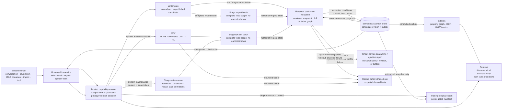

# Semantic Knowledge Architecture

**Status:** Design of record. P1 ships the normalized, tenant-bound canonical
assertion persistence authority and its lifecycle/provenance/checkpoint
boundary; it does not claim an RDF serializer, reasoner, validator, vector
projector, scheduler, or training exporter ships today.

**Decision:** Kestrel has one canonical, tenant-scoped unit of knowledge: the
**semantic assertion**. A fact, graph edge, RDF triple, embedding, validation
report, sleep summary, and training example are not interchangeable units of
truth. They may describe, project, retrieve, or derive an assertion; only the
canonical assertion store decides whether that assertion is active, visible,
and eligible for use.

This contract reconciles the current property graph, vector/RAG retrieval,
cognitive memory, sleep maintenance, privacy wrapper, and the extracted
[`kestrel-feature-parametric-self`](../../ECOSYSTEM.md) boundary. It is the
load-bearing contract for follow-on implementation tickets.

## Scope and non-goals

This document specifies the semantic knowledge layer and its migration
boundary. P1 adds no RDF library, ontology, reasoner, validator, vector
generator, tool, or training pipeline. It also does not turn a
conversation, an LLM completion, or a vector result into a fact merely by
storing it.

Constitutional governance and tool authorization remain owned by the
constitution and approval systems. An ontology or shape is data/schema, never
an executable grant of authority.

## Terms

| Term | Meaning in this contract |
|---|---|
| **Assertion** | A tenant-scoped claim with normalized subject, predicate, and object/literal plus its epistemic and lifecycle metadata. It has a deterministic identity. |
| **Revision** | An immutable version of an assertion's record, created for a status, confidence, visibility, time, source, ontology, or lineage change. It does not create a different assertion identity. |
| **Source occurrence** | One observed/imported/manual source event supporting, disputing, or superseding an assertion. Several occurrences may support one assertion. |
| **Evidence artifact** | A conversation message, document chunk, saved item, file, API response, or other retained input. It is not knowledge until an explicit assertion process accepts a claim from it. |
| **Projection** | A rebuildable representation of canonical assertions: RDF, property graph, search/vector index, validation report, materialized inference, or training-corpus manifest. |
| **Tenant** | The isolation authority. In the current core deployment the agent DID/`agent_id` normally supplies the tenant identity; a future hosted deployment may have a distinct `tenant_id` and `owning_agent_id`. |

## Canonical assertion record

### Required fields

The persistence owner stores one immutable revision row per change and a
current-state pointer per assertion. Every committed revision contains all of
the following; `null` is permitted only where explicitly stated.

| Field | Type / invariant |
|---|---|
| `assertion_id` | Deterministic `urn:kestrel:assertion:sha256:<64 lowercase hex>` identity defined below. It is never recycled or reassigned. |
| `identity_version` | Required immutable identity grammar/version, initially `kestrel-assertion-id-v1`. It names the complete preimage term algebra, IRI profile, and literal-normalization contract; the digest is never interpreted without it. |
| `revision_id` | Generated immutable identifier (UUIDv7 or ULID) for this revision. It is not content identity. |
| `tenant_id` | Required immutable isolation scope, normalized by the exact opaque-ID rules below. Every read, write, inference, index, export, and deletion query is tenant-filtered before any semantic filtering. |
| `owning_agent_id` | Required agent DID/identity within the tenant. It is an ownership and audit field, not an authorization bypass. |
| `subject` | Required normalized absolute IRI. A blank node is never a canonical subject. |
| `predicate` | Required normalized absolute IRI. Display labels, Python names, and underscored aliases are never predicates. |
| `object` | Exactly one of a normalized absolute IRI or a `Literal(lexical_form, datatype_iri, language_tag?)`; it is mutually exclusive with an absent object. |
| `source` / `source_occurrence_ids` | Non-empty ordered set of immutable source-occurrence IDs for direct assertions; inferred revisions instead carry a non-empty derivation support set. Each occurrence's `source` records its kind, stable locator, received time, source-content digest when retained, extractor/actor, and a source-local span or selector when available. |
| `confidence` | Decimal in `[0, 1]`, plus `confidence_method` and `confidence_basis`. It is evidence assessment, not a truth value; no component may silently clamp it. |
| `epistemic_state` | One of `asserted`, `observed`, `reported`, `inferred`, `hypothesis`, `disputed`, or `retracted`. `asserted` means Kestrel/the owner adopts the claim; `reported` means a source said it; `observed` means a measured event; `inferred` names a recorded derivation. |
| `asserted_at` | Required UTC instant when this revision was accepted by the canonical store. It is system/record time, not the time the claim holds. |
| `observed_time` | Optional closed or open UTC interval in which the source observed the claim. Unknown is `null`, never fabricated from `asserted_at`. |
| `valid_time` | Optional closed or open UTC interval during which the claim is asserted to hold in the domain. Unknown is `null`; it is distinct from observed and asserted time. |
| `status` and `supersedes_revision_id` | Status is `active`, `superseded`, `retracted`, `quarantined`, or `deleted`. A superseding revision points to the immediately prior revision; an active assertion has at most one current active revision. |
| `visibility` and `privacy_classification` | `visibility` is `private`, `tenant`, `delegated`, or `public`, with an explicit release policy reference. `privacy_classification` is a policy label such as `ephemeral`, `isolated`, `anonymous`, `deidentified`, `normal`, `public`, or a stricter domain label. The effective policy is the more restrictive one. |
| `ontology_version` | Required immutable `OntologyRef(namespace, version, content_digest, compatibility_profile)`. It identifies the vocabulary/shapes interpretation used to accept the revision. |
| `iri_profile` | Required immutable IRI canonicalization profile, initially `iri-normalization-v1-rfc3986-200501`. It is the exact algorithm that produced every IRI identity term before hashing. |
| `literal_profile` | Required immutable, selected literal canonicalization profile (initially `literal-v1-xsd11-20120405`). It is the exact profile that normalized the literal before identity hashing and acceptance; it is never inferred from the installed RDF/XSD library. |
| `derivation_lineage` | Required structured lineage: `direct` source occurrence(s), or `derived` rule/engine/profile version, input assertion revision IDs, input ontology/shapes digests, run ID, and generation time. It is a DAG; cycles are rejected. |

The canonical store additionally records actor, operation ID/idempotency key,
reason code, a structured validation outcome (including selected IRI/literal
profiles and validation snapshot), and retention/erasure metadata. Those audit
fields do not alter assertion identity. The IRI and literal profile names are
acceptance/normalization pins rather than extra preimage members: a changed
profile always requires an `identity_version` change when it can change any
identity-term value, term algebra, or identity preimage grammar.

### Invariants

1. A revision is append-only. Correction creates a new revision; it never
   updates the evidence trail in place.
2. A record cannot be both `active` and `retracted`/`deleted`/`quarantined`.
   `superseded` is a historical record state; the replacement must name the
   revision it supersedes.
3. `inferred` revisions must have no hand-waved provenance: their complete
   support revision IDs, rule identifier, engine version, and input digest are
   required. Direct assertions may not masquerade as inference.
4. Visibility never widens by inference, projection, export, or training:
   output classification is the most restrictive classification of all inputs
   and the output policy.
5. `tenant_id`, `owning_agent_id`, and all source occurrences are checked
   before an assertion can be linked to another record. Cross-tenant lineage is
   forbidden unless an explicit delegated-import grant produces a new,
   tenant-local occurrence.
6. The canonical store uses UTC instants with an offset and precision preserved
   by the backend. SQLite uses normalized text plus range endpoints; PostgreSQL
   uses timezone-aware instants/ranges. Neither backend is allowed to reinterpret
   a naive timestamp in a server-local timezone.
7. A validation failure, inference timeout, or missing index does not change an
   accepted assertion into a different assertion. It changes the revision's
   outcome/status according to the bounded failure rules below.
8. A revision's accepted literal profile and validation snapshot are immutable.
   A later profile may only accept a new revision through the versioned
   validation-and-commit protocol below; it cannot reinterpret an old revision.

## Deterministic identity and normalization

### Assertion identity

An assertion identifies the **claim in its tenant**, not where it was found,
who last edited it, or which vector model indexed it. Its byte preimage is the
UTF-8 output of the [JSON Canonicalization Scheme, RFC 8785 (June
2020)](https://www.rfc-editor.org/rfc/rfc8785.html), after the normalization
rules below. RFC 8785 is the only permitted identity serialization for
`kestrel-assertion-id-v1`; a different encoder or byte grammar requires a new
`identity_version`. In particular, RFC 8785 recursively orders object member
names lexicographically. The member lists below are therefore normative, and
their displayed order is the RFC 8785 order—not a separate insertion-order
rule:

```json
{
  "identity_version": "kestrel-assertion-id-v1",
  "object": {
    "datatype": "<normalized datatype IRI or null>",
    "kind": "iri | literal",
    "language": "<lowercase BCP-47 tag or null>",
    "value": "<normalized IRI or literal lexical form>"
  },
  "predicate": "<normalized IRI>",
  "subject": {"kind": "iri", "value": "<normalized IRI>"},
  "tenant_id": "<normalized tenant id>"
}
```

`assertion_id` is the SHA-256 digest of that UTF-8 preimage with the URN
prefix above. `owning_agent_id`, source, confidence, all time fields, status,
visibility, ontology version, and lineage are required record fields but
**not** identity fields. This makes a newly observed source, a corrected
confidence value, or a new revision of the same claim converge on one
assertion identity. A semantic change to subject, predicate, object, or tenant
creates a different identity.

The following fixed vector is part of this contract. Implementations must
assert both the exact RFC 8785 bytes and the resulting URN; serializing this
object in its source/insertion order is deliberately a failing test.

```text
normalized terms:
  tenant_id = did:example:ava
  subject = <urn:kestrel:agent:did:example:ava:principal:user>
  predicate = <https://kestrel.ai/vocab/preferredDeployRegion>
  object = "us-central1"^^<http://www.w3.org/2001/XMLSchema#string>

RFC 8785 UTF-8 preimage:
{"identity_version":"kestrel-assertion-id-v1","object":{"datatype":"http://www.w3.org/2001/XMLSchema#string","kind":"literal","language":null,"value":"us-central1"},"predicate":"https://kestrel.ai/vocab/preferredDeployRegion","subject":{"kind":"iri","value":"urn:kestrel:agent:did:example:ava:principal:user"},"tenant_id":"did:example:ava"}

SHA-256:
09221b64ffa7584a9c65105d061fb0ca51e352838547d296fb45de7336180e60

assertion_id:
urn:kestrel:assertion:sha256:09221b64ffa7584a9c65105d061fb0ca51e352838547d296fb45de7336180e60
```

The `identity_version` is part of the preimage. An identity algorithm change is
a migration with explicit old-to-new mappings; it is never a transparent hash
rewrite. `assertion_id` must not be used as a shared cross-tenant correlation
identifier because tenant scope is deliberately included.

### Revision and source-occurrence identity

`revision_id` is generated at the canonical-store transaction boundary and is
unique even when two revisions have identical values. `source_occurrence_id`
is generated for a particular evidence encounter and includes a stable source
locator and content digest where policy permits. It can say “this assertion was
seen in message 42 and document chunk 9” without duplicating the assertion.

Idempotent imports use `(tenant_id, import_operation_id, source_locator,
source_content_digest, selector)` to find the same occurrence. They do not use
the assertion hash alone, because one import can legitimately support an
existing assertion with new provenance.

### Tenant identifier normalization

`tenant_id` is an **opaque, already-canonical UTF-8 identifier**, not an RDF
term and not a value the semantic layer may reinterpret. The trusted tenancy
resolver supplies it before the writer sees a proposal. This keeps a current
agent DID usable as a tenant ID while allowing a future hosted tenant ID that
is not a DID.

For `kestrel-assertion-id-v1`, a writer accepts a tenant ID only when it is a
Unicode string that is already NFC; encodes to 1 through 512 UTF-8 octets; and
contains no surrogate, U+0000, C0/C1 control (`U+0000`–`U+001F` or
`U+007F`–`U+009F`), or ASCII whitespace (`U+0009`–`U+000D` or `U+0020`). It
rejects anything else, including a value that would change under NFC. The
semantic layer does not trim, case-fold, lowercase, percent-decode, parse as
an IRI/DID, or otherwise transform a valid value: its NFC UTF-8 bytes are the
bytes in the identity preimage. The resolver, not an assertion, owns aliases
or migrations between tenant IDs. An `owning_agent_id` must be authorized for
that already-resolved tenant, but it is deliberately not an identity field.

### Normalization rules

1. Every IRI identity term uses exactly
   `iri-normalization-v1-rfc3986-200501`, the closed ASCII URI subset of RDF
   1.1 IRI terms defined in this section. Its normative algorithm source is
   [RFC 3986, *Uniform Resource Identifier (URI): Generic Syntax*, January
   2005](https://www.rfc-editor.org/rfc/rfc3986.html), sections 3, 5.2.4, and
   6.2.2. The profile registry pins that dated RFC artifact and its SHA-256;
   no URL-library, RDF-library, browser, DNS, redirect, or "latest" IRI
   behavior is part of the contract.
2. Subjects and predicates must be IRIs. Objects are IRIs or typed literals.
   Imported blank nodes are rejected for assertion identity unless the importer
   mints a deterministic, source-scoped skolem IRI and records that mapping in
   the occurrence. Blank-node labels are never persisted as canonical identity.
3. Strings are Unicode NFC. Language tags are well-formed BCP 47 and lower
   case. A language-tagged literal uses `rdf:langString` and cannot also supply
   another datatype.
4. Literal acceptance and lexical canonicalization use the closed
   `literal-v1-xsd11-20120405` profile below. A literal outside that profile,
   or with an invalid lexical form, is quarantined rather than guessed or
   carried through as an arbitrary datatype string.
5. Namespace prefixes, graph-node IDs, human labels, JSON property order,
   embedding model/profile, and RDF serialization are never inputs to
   `assertion_id`.
6. Imported RDF dataset digests use the pinned RDF Dataset Canonicalization
   algorithm only for source evidence and reproducibility. They do not replace
   Kestrel assertion identity, which must work for non-RDF inputs too.

#### IRI profile `iri-normalization-v1-rfc3986-200501`

This profile is deliberately narrower than the RDF 1.1 IRI space so different
implementations cannot hash different Unicode/IDNA or URI-library outputs. Its
canonical output is an absolute ASCII URI, which is also a valid RDF IRI. An
adapter may resolve a relative source IRI against its declared source base, but
the resolved result must then pass this complete profile before it reaches the
canonical boundary. The profile never dereferences a term or resolves a name;
it also does not translate an internationalized IRI into another spelling.

The algorithm is exact:

1. Reject a non-string, a string containing a surrogate, C0/C1 control,
   whitespace, or a non-ASCII code point, an invalid `%` escape, or a value
   without an RFC 3986 scheme (`ALPHA *( ALPHA / DIGIT / "+" / "-" / "." )
   ":"`). This is an `unsupported_iri_form` pre-publication outcome; callers
   that need an internationalized source term must quarantine it as evidence
   until a future IRI profile defines its exact conversion and fixtures. A
   source adapter may not invent that conversion before proposing a v1 term.
2. Parse the remaining ASCII value with RFC 3986's generic grammar. Lowercase
   the scheme. When an authority is present, split it into user-info, raw host,
   and raw port; the raw host must be a valid RFC 3986 `IP-literal`,
   `IPv4address`, or `reg-name`. Preserve user-info byte-for-byte. **Do not
   lowercase the host yet**: a `reg-name` can contain an unreserved percent
   escape whose decoded ASCII letter must participate in host lowercasing. An
   IPv4 address is not numerically reinterpreted. An empty port, a non-decimal
   port, or a port outside `0`–`65535` is rejected. Render an accepted port
   without leading zeroes.
3. Normalize every percent escape to uppercase hex. Decode an escape only when
   it encodes an RFC 3986 *unreserved* ASCII octet
   (`ALPHA`, `DIGIT`, `-`, `.`, `_`, or `~`). Never decode an escaped reserved
   character, `%`, or non-ASCII octet. Do this in user-info, host, path, query,
   and fragment before the next step. For a `reg-name` host, then lowercase
   every ASCII letter in the decoded-and-normalized host; for a validated
   `IP-literal`, lowercase its ASCII letters after this escape processing. Thus
   `%45XAMPLE.test` becomes `example.test`, not `Example.test`. This host step
   is complete before default-port handling or serialization.
4. Apply RFC 3986 section 5.2.4 `remove_dot_segments` exactly once to the
   normalized path. Do not add or remove a trailing slash, reorder query
   parameters, change query/fragment case, decode reserved escapes, apply IDNA,
   normalize an IPv4 address, or make any scheme-specific rewrite.
5. Omit the normalized port only for this fixed table: `http` → `80`, `https`
   → `443`, `ws` → `80`, `wss` → `443`, and `ftp` → `21`. Retain every other
   port, including the same numeric value under an unlisted scheme. Serialize
   the normalized components with RFC 3986 delimiters. That serialization is
   the IRI value used in the assertion-ID preimage.

The profile fixture corpus is normative. At minimum it contains these vectors
and asserts both its output string and its assertion-ID preimage bytes:

| Fixture | Input | Required result |
|---|---|---|
| `iri-v1-http-normalize` | `HTTP://Example.COM:080/a/./b/../%7Ealice?q=%7e%2f#F%2a` | `http://example.com/a/~alice?q=~%2F#F%2A` |
| `iri-v1-https-dot-port` | `https://EXAMPLE.com:0443/%2e%2E/a` | `https://example.com/a` |
| `iri-v1-host-percent-equivalence` | Pair: `HTTP://%45XAMPLE.test/a`; `http://example.test/a` | Both normalize to `http://example.test/a`; when substituted into the same fixed assertion fixture, the RFC 8785 UTF-8 assertion-ID preimage bytes are identical. |
| `iri-v1-unlisted-port` | `did:Example:agent:443` | `did:Example:agent:443` |
| `iri-v1-reject-unicode-host` | `https://exämple.test/a` | reject: `unsupported_iri_form` |
| `iri-v1-reject-bad-port` | `https://example.test:65536/a` | reject: `unsupported_iri_form` |
| `iri-v1-reject-bad-escape` | `https://example.test/%zz` | reject: `unsupported_iri_form` |

The first implementation must add these and adversarial variants as executable
fixtures. Any altered parsing rule, default-port table, output grammar, or
accepted Unicode/IRI mapping is a new `iri_profile` and identity-version
migration; it may not be silently substituted under this profile.

### Literal canonicalization profile `literal-v1-xsd11-20120405`

The normative datatype source for this profile is the W3C Recommendation
[XML Schema Definition Language (XSD) 1.1 Part 2: Datatypes, 5 April
2012](https://www.w3.org/TR/2012/REC-xmlschema11-2-20120405/datatypes.html),
especially its lexical/canonical mapping model in section 2.3 and the built-in
type definitions in section 3.3. The profile registry pins that dated URL and
the exact artifact SHA-256 as `xsd11-2-rec-20120405`; it does not use the
undated `/TR/xmlschema11-2/` URL. RDF 1.1's dated Concepts Recommendation
remains the source for the `rdf:langString` relationship.

Before an identity preimage is made, a literal must have exactly one of the
following datatype forms. All input is Unicode NFC, uses only ASCII digits and
punctuation where a grammar below names them, and has no leading or trailing
whitespace. A numeric implementation must use arbitrary-precision decimal or
integer arithmetic; it must not round through a host binary float.

| Datatype | Accepted form and exact stored lexical form |
|---|---|
| `rdf:langString` | A language tag is required, is validated as BCP 47, then lowercased; the lexical value is NFC unchanged. No other datatype is permitted with a language tag. |
| `xsd:string` | No language tag. The stored value is the NFC lexical string unchanged. |
| `xsd:boolean` | Accept only `true`, `false`, `1`, or `0`; store `true` for `true`/`1` and `false` for `false`/`0`. |
| `xsd:integer` | Accept `[+-]?[0-9]+`; store `0` for either signed zero, otherwise `-?[1-9][0-9]*` with no leading `+` or zeroes. |
| `xsd:decimal` | Accept `[+-]?(?:[0-9]+(?:\.[0-9]*)?|\.[0-9]+)` with no exponent. Store a sign only for a nonzero value, at least one digit on each side of the decimal point, no leading integer zeroes, and no trailing fractional zeroes except the required one: `0.0`, `12.0`, and `-0.25` are examples. |
| `xsd:date` | Accept a valid proleptic-Gregorian `YYYY-MM-DD` in years `0001`–`9999`, with no timezone suffix; store that exact zero-padded form. |
| `xsd:time` | Require a valid `HH:MM:SS` with optional 1–9 digit fraction and `Z` or an offset. Reject `24:00:00`, leap seconds, a missing timezone, and an offset outside `-14:00` through `+14:00` (at hour 14, minutes must be `00`). Convert the time-of-day to UTC using the offset, wrapping at midnight, strip trailing fractional zeroes, and store `HH:MM:SS[.fraction]Z`. |
| `xsd:dateTime` and `xsd:dateTimeStamp` | Require a valid proleptic-Gregorian `YYYY-MM-DDTHH:MM:SS` with optional 1–9 digit fraction and `Z` or an offset under the same offset, leap-second, and `24:00:00` rules as `xsd:time`. A timezone is mandatory even for `xsd:dateTime` in this profile. Convert to UTC, reject a conversion outside years `0001`–`9999`, strip trailing fractional zeroes, and store `YYYY-MM-DDTHH:MM:SS[.fraction]Z`; preserve the declared datatype IRI. |

The profile supports no other datatype: this expressly includes `xsd:float`,
`xsd:double`, durations, binary forms, QName/URI forms, derived integer types,
other XSD date fragments, and custom datatype IRIs. A form that is valid XSD
but outside this profile is `unsupported_literal_datatype`; an invalid form of
a supported datatype is `invalid_literal_lexical_form`. Both are record-level
quarantine outcomes. They create no canonical assertion, `assertion_id`,
revision, outbox event, projection, inference result, or training candidate.
Adding a datatype is a new named profile with canonical fixtures and a
compatibility decision, never a library-dependent fallback. For
`semantic-kb-v1`, it also requires a **new `identity_version`**: the
`literal_profile` is not itself in the preimage, so a profile change that can
change any normalized datatype, language, or lexical value must never mint an
indistinguishable v1 identity. No alternative literal profile is v1-compatible,
including one that merely expands the accepted datatype set. A future contract
may prove byte-identical normalization for an explicit compatibility relation,
but it still uses a new identity version unless that relation is part of a new,
reviewed identity contract and its conformance corpus.

### Decimal mapping bounds

The versioned public mappings encode assertion confidence and optional result
scores as exact fixed-point decimal strings. Before fixed-point conversion, a
finite value must have an absolute Decimal exponent no greater than `1000` and
its serialized form must be no more than `1024` ASCII characters. This keeps a
compact untrusted exponent such as `1e-100000000` from creating an unbounded
mapping allocation; the boundary rejects it rather than rounding, clamping, or
changing its value.

### Canonical term algebra and RDF 1.2 boundary

`kestrel-assertion-id-v1` has a deliberately closed `AssertionTerm` algebra:
an absolute normalized IRI, or a literal with NFC lexical form, datatype IRI,
and optional lowercase BCP 47 language tag. The `subject` and `predicate`
positions accept only the IRI variant; `object` accepts either variant. This is
the complete recursive grammar for canonical assertion identity in
`semantic-kb-v1`; it is an RDF 1.1-compatible subset, not an open-ended RDF
term container.

The snapshot-pinned `rdf12-cr-20260407` transport profile may recognize RDF
1.2 source syntax, but it does **not** negotiate RDF 1.2 term support in this
contract. In particular, an RDF 1.2 triple term (`<<( s p o )>>`) is not an
`AssertionTerm` in any position, and a directional language-tagged string is
not a canonical literal because `AssertionTerm` has no direction member.
The input adapter must never flatten either form into a string, substitute a
made-up IRI/datatype, or hash an implementation-specific encoding.

On encountering either form, the importer records a record-level
`unsupported_rdf12_term` outcome and quarantines that source record under the
normal tenant/privacy retention policy. It creates no canonical assertion,
identity preimage, projection, inference result, or training candidate from
that record. An `rdf12-cr-20260407` document may still yield assertions from
its independently representable RDF 1.1 terms; its quarantined terms remain
evidence only. An RDF 1.2 export may serialize representable canonical terms
under its exact pinned syntax, but a request to emit a triple term or
directional string fails closed with `unsupported_rdf12_term`, rather than
performing a lossy lowering.

Adding either RDF 1.2 form requires a new named semantic contract and profile,
with recursive term/direction representation, normalization, canonical
identity preimage, import/export behavior, and conformance fixtures. It is not
a compatible implementation detail or a change to an existing assertion hash.

## One persistence owner; many projections

The planned **Semantic Assertion Store** is the sole canonical persistence
owner. It receives only an accepted, validated proposal; it is not a staging
area for an unvalidated fact. It is a relational, tenant-scoped part of
Kestrel's existing
`AsyncDatabase` abstraction, with normalized assertion/current-revision,
revision, source-occurrence, lineage-support, ontology-artifact, shapes-
artifact, and outbox tables. SQLite is the local/single-agent implementation;
PostgreSQL is the concurrent/shared implementation. Both must enforce the same
unique keys, transaction rules, tenant predicates, and deletion semantics.

An accepted write commits the canonical revision and an outbox event in one
database transaction. Every derived surface consumes that event and records
the assertion revision ID and projection version it used. A projection may lag
or be rebuilt; it may never make an assertion active, deleted, public, valid,
or trainable.

| Surface | Role | Not canonical because |
|---|---|---|
| RDF graph/dataset and Turtle, TriG, N-Triples, or N-Quads serialization | Interoperable export/import projection | A serialization has no Kestrel tenant, lifecycle, privacy, or revision authority by itself. |
| `GraphNode` / `Edge` | Current property-graph projection and migration input | Its arbitrary JSON properties and upsert keys cannot model immutable occurrence/revision lineage. |
| Embeddings, BM25, HNSW, pgvector, and SQLite cosine indexes | Retrieval acceleration | They are model- and profile-dependent, approximate, and rebuildable. |
| SHACL validation report | Auditable validation artifact | A report records a run against a particular shapes/data snapshot; it cannot mutate policy or truth. |
| Materialized inferred facts | Derived projection | It is valid only while its support revisions and rule/profile remain valid. |
| Memory episodes, summaries, and temporal patterns | Cognitive-memory artifacts | They summarize or prioritize experience; they are not automatically endorsed domain claims. |
| Parametric-self model weights and corpus manifest | Optional learning artifacts | Model weights are lossy outputs; a corpus manifest records a gated selection, not truth. |

## Current Kestrel boundary map

The following is deliberately precise about the current tree. It does not
retroactively claim that current rows already meet this contract.

| Current surface | Present owner and behavior | Semantic-layer treatment |
|---|---|---|
| `GraphNode` / `Edge` | `storage/async_graph_store.py`; `graph_nodes(node_id, node_type, label, properties)` and `graph_edges(source_id, target_id, label, properties)` with ownership ledgers | A property-graph **projection/input**. Stable existing non-fact nodes remain application resources. A legacy fact-shaped node is migrated only through an explicit adapter that emits a source occurrence and canonical assertion. |
| Explicit fact teaching | `features/memory_agency/feature.py::save_fact` maps its small local vocabulary through `semantic_facts.py` and writes a governed canonical assertion | New teaching has no graph-node write path. Historical `node_type='fact'` rows are only a bounded migration input under the #2752 rules below. |
| Saved items | `storage/saved_items_store.py` and `saved_items` support stashes, files, excerpts, and structured items with embedding search | Evidence artifacts or user-curated notes. They become knowledge only after an explicit extraction/approval creates assertions with item spans/digests as source occurrences. |
| RAG files/chunks | `storage/async_rag_store.py`, `document_chunks`, BM25, and vector backends | Evidence retrieval, not a truth store. RAG text may support a source occurrence; search ranking cannot assert a claim. |
| Conversation history | `storage/async_conversation_store.py`, privacy-gated `conversation_history` | A transcript/evidence artifact, not knowledge. User/agent/LLM text is at most `reported`/`hypothesis` evidence until an authorized assertion process accepts it. |
| Cognitive memory and sleep | `storage/memory_system.py`, `memory_retriever.py`, `memory_consolidator.py`, and `agent/sleep.py` create episodes, patterns, archival states, and graph mirrors | Cognitive artifacts. Sleep may submit new/recomputed assertions and retraction/quarantine commands only through the typed writer; projection repair begins from its committed outbox events. It may not silently promote summaries, patterns, or LLM guesses to active assertions. |
| Privacy wrapper | `storage/privacy_wrapper.py` blocks/redirects/redacts persistence by privacy mode | The semantic writer is behind the same boundary. A trusted resolver, not an adapter, supplies its tenant, ownership authorization, and effective privacy/deidentification decision before normalization, source retention, indexing, validation, inference, and export. |
| Parametric self | Extracted `kestrel-feature-parametric-self`, registered in `feature_registry.toml`, runs as a sleep hook and owns a per-agent nightly-finetuned local model | It is an optional consumer. Its inputs are an explicit, policy-gated corpus export; its corpus manifest and weights are projections, never assertions or source-of-truth knowledge. |

### Legacy graph-fact migration (#2752)

`storage/legacy_fact_migration.py::LegacyGraphFactMigration` is the only
implemented bridge from the old property graph to canonical assertions. It is
an **operator-invoked, agent-bound** service: the running agent's authenticated
`AsyncStorage` capability provides both the assertion tenant and the owner.
It does not accept an `agent_id` argument and never trusts
`graph_nodes.properties.agent_id`. The storage package does not eagerly import
the memory-agency feature: the feature-owned local vocabulary mapping is loaded
only when this explicit migration service runs.

The v1 eligible shape is intentionally closed:

```text
graph_nodes.node_type == "fact"
graph_node_owners contains exactly one row, for the bound tenant
properties = {subject: non-empty string, predicate: non-empty string,
              value: non-empty string, created_at: aware ISO-8601 timestamp,
              confidence?: decimal in [0, 1]}
```

The local subject/predicate are then passed to the same exact
`map_legacy_fact()` mapping used by `save_fact`; unsupported terms, malformed
JSON, missing time, invalid confidence, and shared/unowned rows are recorded
as content-safe rejected outcomes. No label, edge, arbitrary JSON key, action,
todo, identity, avatar, constitution, or feature-private node is converted.

`plan()` provides a bounded dry-run inventory by tenant/source/status and only
emits SHA-256 content hashes, never values. Rejection diagnostics are a fixed
code whitelist; legacy predicate/value text is neither logged nor returned.
`run()` uses node-ID keyset pages and durable checkpoint records; a process
failure before a checkpoint replays the same deterministic source occurrence
and governed operation safely. Before every resume it performs a paged,
content-hash source-set review. A newly discovered node below an existing
cursor requires the explicit `reset_checkpoint_after_review()` path; a changed,
missing, or newly shared recorded source fails closed for operator review and
is never silently reinterpreted. Each proposal crosses
`put_validated_assertion(..., ValidationSource.IMPORTED)`, so the normal SHACL
acceptance/rejection path remains authoritative. Legacy rows are retained.
Two eligible legacy rows that normalize to the same assertion identity become
one claim with two governed source occurrences: the later row uses the public
source-append lifecycle rather than a second initial write. `rollback()`
withdraws that shared claim only when its complete recorded source set still
exactly matches canonical provenance (and expands a batch boundary to keep the
set atomic). If a process stops after canonical withdrawal, the next rollback
reconstructs the complete source group, atomically requeues projection
invalidation with every rollback receipt, and finishes the group. Rollback
never removes legacy graph content or audit records.

Core owns an explicit, derived semantic-assertion vector projection through
`SemanticAssertionVectorProjection`. It consumes the canonical event stream,
stores exact assertion/revision and canonical-revision-digest lineage under a
fixed embedding provider/model/profile/dimension and the approved bounded
semantic-recall renderer version, and remains non-authoritative: every hit is
hydrated through the canonical recall fence before use. The projector's
destination pin forbids private, tenant, or delegated assertion text from
reaching a remote embedder; this check occurs before rendering or provider
invocation. Vector dimensions and serialized bytes are bounded before
materialization. Opaque-erasure survivor rebuilds use bounded keyset pages plus
total-row and wall-clock budgets; exhausting any budget leaves the checkpoint
unready for safe retry.

The projector's
event-level checkpoint must equal the canonical terminal `(generation,
event_id)`; processing only one event in a multi-event generation remains
unready. Physical erasure's opaque event wipes and atomically rebuilds only
current eligible survivors before advancing the checkpoint, so restart or
replay cannot resurrect erased vectors or strand unrelated ones. Its public
observer exposes only generation and counts. A feature-owned projection may
additionally supply its public invalidator to the legacy migration runner; it
receives only the bound tenant and accepted assertion IDs. Accepted IDs first
enter a durable pending-invalidation ledger, and delivery is marked complete
only after the public invalidator returns. Delivery drains bounded 500-ID
pages; a residual backlog after the invocation budget is surfaced as an error
and remains pending for retry, never silently reported complete. A failure is
retried by every later run, including one with no remaining graph pages.
Canonical rollback re-opens that invalidation so projections observe the
withdrawal as well. Each requeue advances a durable generation; callback
acknowledgement uses that generation as a compare-and-set token, so an older
in-flight callback cannot acknowledge a newer rollback event. The optional compatibility
flag enables deterministic coverage metrics only—there is no dual-write and no
application dual-read path. Its removal condition is zero unmigrated eligible
rows plus operator review of every rejection class. A bounded/truncated plan
reports `complete_inventory=false` and `removal_safe=false`; it is never proof
that the compatibility path may be removed.

An assertion can be knowledge only when it has passed the canonical writer's
tenant/privacy/normalization checks, recorded source or derivation lineage,
and reached the selected acceptance state. Raw files, chunks, transcripts,
embeddings, model weights, response text, labels, tool descriptions, ontology
documents, shapes, and validation reports are **not knowledge by themselves**.

### Governed learning-corpus capability

`kestrel_sovereign.knowledge.corpus` is the public, backend-neutral contract
for optional learning consumers. A consumer calls the host storage capability
`governed_assertion_corpus_snapshot(...)` (and
`governed_assertion_corpus_changes_since(...)` for incremental work); it never
opens a SQLite file, receives a database connection, or reads `graph_nodes`.
The result is an immutable, deterministically ordered snapshot containing the
canonical assertion/revision, direct source occurrence or derivation lineage,
validation disposition, ontology/shape/rule capability pins, content hash,
and stable split key. Consumer-visible assertion content is governed output;
the accompanying observability record contains only counts, policy hash,
checkpoint generation, and snapshot hash.

Every consumer supplies a non-permissive `GovernedCorpusPolicy` naming the
accepted source classes, consent/release references, privacy classifications,
visibility, grounding classes, epistemic states, and (where enabled) derived
rule-profile versions. It also pins the accepted ontology artifacts and the
complete semantic-maintenance capability map; initial and incremental reads
reject a host whose active pins differ. The host admits only current,
projection-eligible, conformant assertions. Derived assertions recursively
govern every exact input revision and aggregate only the accepted direct-source
lineage; a restricted, stale, unvalidated, or otherwise ineligible premise
excludes the derived example. Size, traversal-depth, time, and count budgets
fail closed rather than returning an unlabeled prefix. Incremental reads carry
exact, event-generation-normalized checkpoints and return explicit
operation-derived tombstones for
lifecycle/eligibility withdrawal as well as additions. A page that does not
reach the captured event watermark fails instead of advertising an undelivered
checkpoint. Maintenance readiness is evaluated against the checkpoint captured
before the corpus read, and final checkpoint equality closes the other side of
that read fence. Validation evidence is linked to the exact canonical revision,
so an older conformant report cannot authorize a superseding revision; legacy
reports without that revision proof fail closed until revalidation. A prior
snapshot is **not** currently reusable: an object retained
by a consumer is not durable host-verifiable evidence, so the capability
rejects that stale escape hatch until a persisted snapshot-manifest registry
is introduced. Any future reuse policy must be explicit and verify matching
policy/capability hashes through that host registry. This boundary creates no
trainer, adapter, promotion, or weight-mutation path.

### Trusted semantic access capabilities

An adapter may supply evidence and a requested claim, but it is not a tenancy,
authorization, privacy, retrieval, or export authority. The semantic boundary
therefore accepts only opaque resolver-issued capabilities, never a
caller-constructed dataclass or a bag of claimed tenant fields. The three
foreground capability types are `SemanticWriteContext`, `SemanticReadContext`,
and `SemanticExportContext`. Plural import and internal maintenance use the
separate `SemanticImportBatchContext` and `SemanticSystemWriteContext` types;
erasure projection work uses `ErasureProjectionContext`. These are **disjoint
nominal types**, not subclasses or implementations of a common accepted
``write context`` base. A verifier and writer must reject a context whose exact
operation kind is not the operation being invoked. This prevents a system
batch grant from becoming a reusable foreground write grant, and prevents an
import grant from escaping its fixed record set.

`SemanticAccessContextResolver` resolves a governed invocation through
Kestrel's normal authentication/constitution/approval path and the active
`PrivacyEnforcingStorage` policy. It returns an internal, cryptographically
authenticated envelope whose protected claims include at least:

- a random `capability_id`, issuer identity and key/version, issued-at and
  expiry times, and an intended semantic service audience;
- the normalized, resolved `tenant_id`; authenticated caller principal; and
  resolved owning agent where the operation needs one;
- one named purpose and operation kind, an exact `operation_id`/request ID,
  and a digest of the governed request or its permitted fixed scope;
- the effective privacy decision, visibility ceiling, retention decision, and
  selected capability/profile pins; and
- for a permitted write, the positive owner-authorization decision and an
  evidence-backed, versioned deidentification approval where one is required,
  naming the permitted deidentified artifact and destination.

When the active policy denies a semantic write—currently including every
`DEIDENTIFIED` persistent write—the resolver returns the governed
`deidentification_evidence_unavailable` denial and mints **no** write
capability. The writer is not called, no capability-use ledger row, rejection
artifact, or semantic audit record is persisted, and the denial cannot be
downgraded to another privacy mode. This preserves the existing fail-closed
privacy boundary while keeping every capability that does exist a positive,
verifiable grant.

This is a typed result, not an exceptional value smuggled into a write
context: `resolve_write()` returns `SemanticWriteResolution`, either
`SemanticWriteAuthorized(context=SemanticWriteContext)` or
`SemanticAccessDenied(code=...)`. Callers must match the result and can call
`AssertionWriter.propose()` only with the authorized branch. The corresponding
import-batch and system resolvers return their own authorized-or-denied result
types. In particular, `deidentification_evidence_unavailable` has no context
field and cannot be passed to a writer by an adapter that ignores a boolean or
message.

The envelope is signed by the resolver or authenticated to the named writer,
reader, exporter, or projector with an issuer-managed key. Its body and
constructor are inaccessible to adapters; it is not a frozen Python dataclass
whose fields a caller can copy. Every consumer calls the configured
`SemanticAccessCapabilityVerifier` before using it. Verification checks the
issuer/key against the local trust configuration and revocation state,
signature/MAC, audience, expiry against the database clock, **exact operation
kind**, tenant and purpose/operation binding, and the request or scope digest.
A capability may never be accepted after expiry or for a different tenant,
purpose, request, proposal, batch, destination, visibility scope, or writer
method. In particular, `verify_write()` rejects import-batch and system
contexts, `verify_import_batch()` rejects foreground and system contexts, and
`verify_system_write()` rejects foreground and import-batch contexts before a
proposal or target is inspected.

Foreground-write, import-batch, system-batch, and export capabilities are
single-use. Their consumers record the `capability_id`, bound operation ID,
request/scope digest, and final opaque receipt in a durable capability-use
ledger in the same transaction as the final canonical mutation or
export-manifest seal. A uniqueness constraint on `capability_id` prevents a
concurrent replay. A duplicate may return only the stored receipt to the same
authenticated principal and bound operation; it cannot create another revision,
event, export, or state transition. A rejected or quarantined request receives
the same final disposition without exposing a canonical identity. A validation
retry that has not reached a final disposition is internal to the writer and
remains bound to that one capability and request. Read contexts are short-lived
and request-bound; a pagination continuation is a resolver-issued continuation
scope, not a reusable caller cursor.

`SemanticWriteContext` derives the authoritative tenant, owner, effective
privacy class, deidentification decision, and visibility ceiling. An
`AssertionProposal` has none of those authorities: a requested visibility or
source actor is only input for the writer to check. The writer queries every
supersession, retraction, or erasure target using the verified context tenant,
so an identifier supplied by a caller cannot cross a tenant boundary or reveal
whether another tenant owns it.

`SemanticImportBatchContext` is the only plural foreground-write grant. It
binds one `import_operation_id`, original input digest, selected profile pins,
and an ordered record scope whose members are `(ordinal, source-record digest,
selector)`, plus a digest of that full scope and declared count/byte limits.
It cannot authorize a record absent from the scope, a reordered/substituted
record, or a second import operation. `SemanticSystemWriteContext` is likewise
not a foreground grant: it authorizes exactly one bounded derived or
maintenance batch. Neither context can be supplied to `propose()`,
`supersede()`, or `retract_or_erase()`.

`SemanticReadContext` derives the retrieval tenant, allowed visibility/privacy
and retention scope, permitted lifecycle/time window, and query purpose.
`AssertionQuery` can only narrow that scope and select ranking/presentation; it
cannot supply or widen any of those decisions. `SemanticExportContext` is a
single-use export-purpose/destination grant and additionally binds the
recipient, disclosure/redaction policy, and requested snapshot scope. An
`ExportRequest` can describe a format or narrowing selection, but cannot set a
tenant, visibility, retention, consent, or authorization decision. The reader
and exporter verify their respective contexts before issuing even an index
lookup or snapshot manifest.

This requirement applies to foreground adapters, imports, inference, sleep
maintenance, retrieval, and training-corpus export. A reasoner or scheduler
uses separately minted, narrowly scoped **system** contexts. Those contexts
bind the tenant, system principal, maintenance lease/fencing token when
applicable, input change-set/checkpoint digest, allowed rule/profile pins,
budgets, and one inference or maintenance batch operation. A system component
never manufactures a tenant/owner/privacy decision from a proposal or rule
result. No context makes an ontology, shape, model, or source document an
authorization authority.

## Data flow



Retrieval first verifies `SemanticReadContext` and derives its canonical tenant,
status, visibility/privacy, retention, valid-time, and derivation-support
filters before it consults an approximate index. A vector hit is a candidate,
never authorization to return a hidden, deleted, superseded-only, or retracted
assertion.

### Canonical publication gate

An input adapter may create an **unpublished proposal** only after the trusted
context resolver has supplied its context. The writer performs tenant,
owner-authorization, privacy/deidentification, normalization, source, and
capability checks from that context, then runs every selected required
validation profile before canonical publication. Only an accepted proposal is
allowed to receive a durable canonical revision, current-pointer update,
source-occurrence linkage, or outbox event.

Required validation is bound to exactly what is committed; a report from an old
view or from one member of a group is never reusable. The writer first obtains a
read-only
`SemanticValidationSnapshot` for the context's tenant. The snapshot and the
verified validation grant carry the same immutable
`ResolvedSemanticValidationContract`: the tenant, validation scope, and exact
identity, IRI, literal, **validation**, shapes, and ontology profile pins
selected by the resolver. `validation_profile` identifies the selected SHACL
implementation/feature profile (not just the shapes it happens to load), and
`validation_artifact_pins` identify its dated, digested implementation and any
profile-defining artifacts. It then materializes a writer-created,
`GenerationPinnedSemanticValidationView`: a read-only, immutable view of the
**entire resulting canonical graph** at that generation with the complete
tentative changes overlaid. The view can expose an implementation's native
records, but must also materialize the full deterministic validation dataset
used by SHACL; it must not lazily reread an advancing canonical store. For a
foreground transition it contains the snapshot graph plus the one requested
mutation. For an import or system batch it contains the **entire fixed
scope**—all candidate assertions, supersessions, retractions, and
current-pointer effects. The authoritative SHACL/profile validator receives
that view, its snapshot, and its tentative-post-state digest, not a change set
or one proposal at a time. Diagnostics may be per-record, but they are never a
publication decision.

The writer conditionally commits only the validated complete post-state:
revisions, all current-pointer changes, the new generation, capability-use
record, and outbox rows share one transaction and commit only if the tenant
generation still equals the validated generation. Before treating a report as
accepted, the writer verifies all of the following exact matches: the view's
generation, canonical-data digest, and `ResolvedSemanticValidationContract`
equal the supplied snapshot; the view's post-state digest equals the staged
post-state digest; and the report's snapshot, post-state digest, and immutable
contract equal both that view and the resolver-selected contract in the
verified grant. Equality includes the contract's tenant/scope, identity version
and pins, IRI profile and pins, literal profile and pins, **validation profile
and pins**, and shapes/ontology pins. Any mismatch is
`validation_binding_mismatch`,
publishes nothing, and is never repaired by trusting the validator's preferred
profile. A failed conditional write is `validation_conflict`: it publishes
nothing, obtains a fresh snapshot,
and retries within the operation's bounded retry/time budget. An implementation
may instead use serializable isolation or equivalent tenant/profile locks for
the validation and commit, but it must retry a serialization conflict and
provide the same no-stale-validation guarantee. Thus two individually plausible
proposals that jointly violate `sh:maxCount 1`, disjointness, or any other
cross-assertion constraint cannot each publish. An accepted validation report
persists its snapshot, tentative-post-state digest, post-commit generation, and
immutable selected contract with the committed revisions.
Every canonical transition that can change a later validation result—including
accepted writes, supersession, retraction, quarantine, and erasure—advances
that tenant generation in its own atomic transaction before its outbox event
becomes visible.

Inference and sleep never write derived rows directly. After the resolver has
minted their distinct system capability, the reasoner or maintenance planner
returns a bounded `SemanticWriteBatch`: every derived proposal includes its
complete support set and rule/profile proof, while every maintenance transition
names its expected current revision. `AssertionWriter.commit_batch()` verifies
the **system-only** capability and each proof, then validates the one full
tentative post-state made from every batch mutation against one conditional
tenant generation. It commits **all** revisions, pointer changes, lineage,
capability-use record, and outbox events in one transaction—or commits none of
them. `propose()` verifies only the foreground operation kind and therefore
rejects a system context even when the private capability implementation shares
signing code. A validation, fencing, budget, or conditional-generation failure
returns no partially published derived or maintenance facts. A sleep
retraction/quarantine is likewise a batch writer state-transition command with
tenant/current-pointer checks. Projectors receive committed events only and
cannot mutate canonical state.

A rejection, required-profile failure, timeout, or validator error for a
foreground proposal or import produces a tenant-private pre-publication
quarantine/rejection artifact, subject to the same privacy and retention gate
as the source. It has no canonical `assertion_id`, `revision_id`, current
pointer, source occurrence, or outbox event. The same failure for an inference
or sleep **system batch** instead returns and durably records a `deferred` or
`failed` `AssertionBatchWriteReceipt`, with a bounded run-report reference and
optional resumable-cursor reference, and no partial derived or maintenance
facts; it does not turn each generated proposal into a foreground/import
quarantine record. A transient calculation used only to validate a proposal must not be
persisted or logged as an assertion identity. In `EPHEMERAL` and currently
fail-closed `DEIDENTIFIED` contexts, even a foreground/import quarantine
artifact may not be durable. `status=quarantined` is reserved for a previously
accepted canonical revision later hidden pending revalidation or recomputation;
it cannot be used to smuggle an initial required-profile failure into the
canonical store.

## Standards and compatibility matrix

The executable, offline artifact pins and import closure for this matrix live
in [Semantic Knowledge Registry](SEMANTIC_KNOWLEDGE_REGISTRY.md). The registry
is schema/profile metadata only; it does not participate in constitutional,
approval, privacy, or tool-authorization decisions.

The status below is checked **as of 2026-07-26**. “Pinned” means Kestrel stores
the dated publication URL and a SHA-256 of the exact retrieved artifact in the
ontology/shapes/profile registry; it never persists “latest,” an editor's draft,
or an undated moving URL as a compatibility contract.

| Standard | Current W3C status and dated source | Kestrel use | Contract status |
|---|---|---|---|
| RDF 1.1 Concepts and Abstract Syntax | W3C Recommendation, [25 February 2014](https://www.w3.org/TR/2014/REC-rdf11-concepts-20140225/); its baseline concrete syntaxes are the dated [Turtle](https://www.w3.org/TR/2014/REC-turtle-20140225/), [N-Triples](https://www.w3.org/TR/2014/REC-n-triples-20140225/), [N-Quads](https://www.w3.org/TR/2014/REC-n-quads-20140225/), and [TriG](https://www.w3.org/TR/2014/REC-trig-20140225/) Recommendations | Mandatory interoperability baseline: RDF 1.1 terms, triples, named datasets, and those versioned import/export profiles. | Stable baseline |
| XML Schema 1.1 Part 2: Datatypes | W3C Recommendation, [5 April 2012](https://www.w3.org/TR/2012/REC-xmlschema11-2-20120405/datatypes.html) | The dated, digest-pinned normative source for the closed `literal-v1-xsd11-20120405` profile; the profile deliberately accepts fewer types than XSD/RDF permit. | Stable, tightly allowlisted |
| RDF Schema 1.1 | W3C Recommendation, [25 February 2014](https://www.w3.org/TR/2014/REC-rdf-schema-20140225/) | Allowed vocabulary/modeling and bounded RDFS entailment profile. No implicit remote vocabulary fetch. | Stable baseline |
| RDF Dataset Canonicalization | W3C Recommendation, [21 May 2024](https://www.w3.org/TR/2024/REC-rdf-canon-20240521/) | Optional source-dataset digest/canonicalization for signed or reproducible RDF imports/exports. | Stable optional capability |
| RDF 1.2 Concepts | Current W3C [Candidate Recommendation Snapshot, 07 April 2026](https://www.w3.org/TR/2026/CR-rdf12-concepts-20260407/); its latest published [N-Triples syntax is a Working Draft dated 15 May 2026](https://www.w3.org/TR/2026/WD-rdf12-n-triples-20260515/), while the latest Recommendation remains RDF 1.1 | Negotiated, snapshot-pinned **transport-recognition** capability only. RDF 1.1-representable terms may be imported/exported under the exact syntax pin; RDF 1.2 triple terms and directional language-tagged strings are rejected/quarantined by the `semantic-kb-v1` canonical boundary as specified above. RDF 1.2 is not the persisted baseline. | Experimental, opt-in; term extension deferred |
| OWL 2 and OWL 2 RL | OWL 2 Overview and [Profiles](https://www.w3.org/TR/2012/REC-owl2-profiles-20121211/), W3C Recommendations, [11 December 2012](https://www.w3.org/TR/2012/REC-owl2-overview-20121211/) | Only the explicit `owl2rl-kestrel-v1` rule allowlist below may run. No OWL DL/full reasoner, arbitrary imports, `owl:sameAs` global merging, or open-ended rule execution. **OWL has no claimed upcoming 1.2 revision.** | Stable, tightly allowlisted |
| SHACL Core | W3C Recommendation, [20 July 2017](https://www.w3.org/TR/2017/REC-shacl-20170720/) | Required validation baseline. Shapes are pinned, tenant-scoped schema data; results are reports. | Stable baseline |
| SHACL 1.2 Core and SPARQL extensions | Current W3C Working Drafts, [Core 2 June 2026](https://www.w3.org/TR/2026/WD-shacl12-core-20260602/) and [SPARQL extensions 30 January 2026](https://www.w3.org/TR/2026/WD-shacl12-sparql-20260130/); latest Recommendation remains SHACL 2017 | Sandboxed, snapshot-pinned experiments only. No draft feature participates in a default acceptance, authorization, or destructive workflow. | Experimental, opt-in |
| SPARQL 1.1 Query Language | W3C Recommendation, [21 March 2013](https://www.w3.org/TR/2013/REC-sparql11-query-20130321/) | Optional read-only query capability over a tenant-filtered canonical/projection view. | Stable optional capability |
| SPARQL 1.2 Query Language | Current W3C Working Draft, [5 June 2026](https://www.w3.org/TR/2026/WD-sparql12-query-20260605/); latest Recommendation remains SPARQL 1.1 | Read-only, budgeted experimental query profile against a tenant-filtered view. Updates, `SERVICE`, filesystem/network functions, and arbitrary functions are forbidden. | Experimental, opt-in |
| SKOS | W3C Recommendation, [18 August 2009](https://www.w3.org/TR/2009/REC-skos-reference-20090818/) | Controlled concepts, labels, mappings, and vocabularies; labels never become identifier normalization rules. | Stable optional vocabulary |
| PROV-O | W3C Recommendation, [30 April 2013](https://www.w3.org/TR/2013/REC-prov-o-20130430/) | RDF projection of source occurrence and derivation lineage, not a substitute for Kestrel's transactional lineage tables. | Stable optional vocabulary |
| OWL-Time | W3C Recommendation, [19 October 2017](https://www.w3.org/TR/2017/REC-owl-time-20171019/); the mutable [/TR/owl-time/ page](https://www.w3.org/TR/owl-time/) currently identifies itself as a non-Recommendation Public Draft | RDF projection of valid/observed temporal intervals. The dated Recommendation is the only baseline pin. | Stable optional vocabulary |

### OWL 2 RL allowlist

`owl2rl-kestrel-v1` is deliberately a small, forward-only subset of OWL 2 RL.
It permits only: `rdfs:subClassOf`, `rdfs:subPropertyOf`, `rdfs:domain`, and
`rdfs:range`; bidirectional expansion of `owl:equivalentClass` and
`owl:equivalentProperty`; `owl:inverseOf`; `owl:TransitiveProperty` and
`owl:SymmetricProperty`; and explicitly listed `owl:propertyChainAxiom` chains
of at most three predicates. Every schema axiom, rule, predicate, and chain is
named in the pinned tenant profile before it can execute. Output remains
`inferred` with complete support sets.

The profile forbids `owl:imports`, remote resolution, `owl:sameAs`,
`owl:differentFrom`, `owl:AllDifferent`, `owl:hasKey`, cardinality restrictions,
`owl:oneOf`, complement/union/intersection class expansion, existential or
universal restrictions, data-range computation, negative property assertions,
and all custom/SPARQL rules. It also forbids writing inferred claims into
another tenant or allowing them to grant a tool, permission, role, approval,
or visibility increase. A requested OWL expression outside this list is a
profile failure, not a reasoner fallback.

### Capability negotiation and versioning

Every governed import, export, validation, inference, and query invocation may
request a `SemanticCapabilityProfile`, but the request is not an authority. The
resolver intersects it with the local allowlist and binds the selected profile,
its pins, and its capability decision into the verified write/read/export/system
context. A proposal, query, export request, reasoner, or validator cannot swap
or widen that selected profile after resolution:

```text
contract_version: "semantic-kb-v1"
identity_version: "kestrel-assertion-id-v1"
rdf_profile: "rdf11" | "rdf12-cr-20260407"
term_profile: "assertion-term-v1-rdf11-subset"
iri_profile: "iri-normalization-v1-rfc3986-200501"
literal_profile: "literal-v1-xsd11-20120405"
serialization: "turtle-20140225" | "nquads-20140225" | ...
reasoning_profile: "none" | "rdfs-v1" | "owl2rl-kestrel-v1"
validation_profile: "shacl-core-20170720" | "shacl12-core-20260602-experimental"
query_profile: "none" | "sparql11-readonly" | "sparql12-20260605-experimental"
artifact_pins: [{uri, published_date, sha256}]
```

The resolver's selected profile includes an explicit `identity_version`,
`iri_profile`, `literal_profile`, all artifact pins, and a capability decision.
`literal_profile` is mandatory even for an IRI-object record: it pins the
complete canonicalization environment for the batch and prevents an
implementation from silently selecting its installed XSD/RDF library's
behavior. For `semantic-kb-v1`, the only accepted value is
`literal-v1-xsd11-20120405`, and the receiver returns the dated XSD 1.1 Part 2
artifact pin with it. The selected identity version, IRI profile, literal
profile, and their respective artifact pins are persisted in every accepted
revision and validation outcome, together with its snapshot; none is
represented only by a generic artifact list. A new datatype/canonicalization
profile requires a new named `literal_profile`, a **new `identity_version`**,
compatibility assessment, migration path, and conformance fixtures before
negotiation can select it. V1 cannot reuse its identity version for an alternate
literal profile, because no alternate profile is permitted to prove it cannot
change an identity-term value.

For `semantic-kb-v1`, the selected `term_profile` is always
`assertion-term-v1-rdf11-subset`, even when the source serialization is RDF
1.2; the receiver reports `unsupported_rdf12_term` per record rather than
claiming that an RDF 1.2 syntax profile made the term representable. The
selected `iri_profile` is likewise mandatory and is the only IRI normalizer
that may feed the identity preimage. A missing, unknown, undated,
digest-mismatched, or disallowed profile fails closed; it is never silently
upgraded to “latest.” Draft-to-draft or draft-to-Recommendation changes require
a new named profile, migration assessment, and dual-read/export period. A
persisted assertion always names the ontology profile that interpreted it and
the IRI/literal profiles that normalized it, even if a later profile is selected
for retrieval.

## Lifecycle: correction, deletion, inference, import, vectors, and training

### Supersession and contradiction

Different object values create different assertion identities. They may both
be active if their valid-time intervals, sources, or epistemic states permit
it. A contradiction detector may create a `disputed` revision or report; it
must not choose a winner merely because one vector result ranks higher.

When an operator or governed process replaces a claim, it appends a
`status=superseded` state revision for the old claim and an active
revision/claim with explicit `supersedes_revision_id`, a reason, and new
source occurrence(s).
Supersession is scoped: replacing a current preference does not erase the
historical preference or a different source's observation. “Latest” retrieval
uses valid time, status, and explicit supersession policy; audit retrieval can
show the complete chain.

Supersession is one compare-and-swap transaction, not two best-effort writes.
The caller supplies the **expected active predecessor revision ID** plus a
replacement proposal and reason. The writer tenant-checks that revision, locks
the affected current-pointer rows in ascending `assertion_id` order, and
compares the predecessor assertion's current pointer with the expected ID. If
it differs, is no longer active, or belongs to another tenant, the operation
returns a conflict and creates no revisions or outbox events. On success, one
transaction appends (1) a `superseded` revision for the predecessor assertion
and (2) the replacement's `active` revision—on the same assertion identity
when its normalized SPO is unchanged, otherwise on the replacement assertion
identity. The replacement revision's `supersedes_revision_id` names the new
superseded revision. The transaction advances the relevant current pointers,
writes both outbox events, and returns both revisions in a durable,
operation-idempotent receipt. Repeating the same `operation_id` returns that
receipt; a competing replacement must retry from the newly current revision.

### Deletion and erasure

Deletion has two explicit modes:

1. **Lifecycle retraction** keeps the revision/audit shell, changes status to
   `retracted`, blocks normal retrieval/index/training, and preserves permitted
   non-sensitive provenance for audit.
2. **Privacy erasure** follows the governing retention/erasure policy and is
   not a `status=deleted` update. Because a deterministic `assertion_id`, its
   preimage, a source digest, or a revision ID can be reidentifying for a
   guessable subject/object, the erasure operation treats each of them as
   sensitive until the policy proves otherwise. It removes the canonical
   assertion/revision/current-pointer rows and source bodies, locators,
   digests, identity preimages, and source-occurrence/lineage rows in its
   referential-erasure closure. `status=deleted` is reserved for a non-erasure
   lifecycle deletion whose retention policy permits its identifier shell.

Before acknowledging privacy erasure, the worker must remove or replace every
reference to an erased identity in all of these places:

- pending and delivered outbox payloads, retry/dead-letter records, projection
  acknowledgements, caches, metrics labels, and diagnostic traces;
- RDF/property-graph rows, vector/BM25 rows, search snippets, and any local or
  remote index cache;
- derivation supports and materialized inferred revisions; an otherwise valid
  derived claim may survive only as a freshly recomputed revision with a
  complete support set that does not name an erased revision;
- export snapshots, downloaded export copies under Kestrel control, training
  manifests, corpus shards, and model-registry links; and
- audit records, operational logs, replicas, SQLite WAL/SHM/journal files,
  PostgreSQL replicas, and backups.

Erasure starts with a single canonical-store transaction. After the writer
verifies the one-purpose erasure capability, that transaction (1) creates a
random `erasure_job_id`; (2) creates the protected durable job mapping and one
required-work record per projection/version; (3) hides/removes the canonical
closure and advances the tenant generation; and (4) inserts opaque erasure
outbox events. It commits all four or none. Thus a delivered event can always
resolve its deletion targets after a crash, while no projection is asked to
infer a target from a deleted canonical row. The mapping is not a normal
semantic table, is encrypted or otherwise protected at rest according to the
erasure policy, has no general read API, and is never joined into retrieval,
export, diagnostics, or user-visible audit data.

An `ErasureOutboxEvent` carries only `erasure_job_id`, opaque event ID,
projection version, and the minimum routing metadata; it never carries an
assertion/revision ID, source locator, digest, identity preimage, or target
selector. The outbox transport is not trusted merely because it delivered an
event. Before a worker can resolve targets, the authenticated projection
dispatcher mints both an opaque, short-lived `ErasureProjectionContext` and a
resolver-verifiable, channel-bound `AuthenticatedProjectionPeerProof` for that
delivery over the projection service's authenticated service-to-service channel
(for example, a mutually authenticated channel whose peer identity is verified
by the dispatcher). Neither is placed in the event and neither accepts a
caller-supplied `ProjectionServiceIdentity`; together their protected claims
bind the exact `erasure_job_id`, event ID, projection version, authenticated
projector principal, semantic-resolver audience, delivery ID, attempt/work
lease, channel binding, and expiry.

The projector passes both the context and peer proof to the access-controlled
`ErasureJobResolver` for plan resolution **and** completion acknowledgement.
The resolver independently verifies their issuer, signature/MAC, exact
authenticated transport peer and channel binding, audience, expiry, exact
job/event/projection/delivery/attempt binding, and single-attempt use before
returning only that projection's private deletion work plan **and a one-time
completion token**. It consumes the resolution attempt in the same private
work-lease transaction that records the plan handoff. A retry receives freshly
minted context and peer proof bound to the same idempotency key and a new
attempt lease; a captured old pair cannot resolve another plan. This is the
sole mapping-resolver interface. A projector cannot enumerate jobs, obtain
another projection's targets, or retain the work plan after it acknowledges
completion. Completion presents the original per-delivery context, peer proof,
and resolver-issued token. The resolver atomically verifies and consumes that
exact active leased delivery, records the projection completion, and returns a
resolver-issued, delivery-bound `ErasureProjectionCompletionReceipt`. The
dispatcher independently verifies that receipt before it may acknowledge its
lease. The resolver derives the projector identity from the verified peer proof
and authenticated channel—never from a caller argument—and accepts completion
only for the active leased work record.

Erasure projection acknowledgement and retry idempotency use the unique key
`(erasure_job_id, projection_version)`, not `(revision_id, projection_version)`.
The same key records an in-progress lease/fencing token, the resolver-issued
completion receipt, and the dispatcher's verified delivery acknowledgement, so
a redelivered opaque event either resumes safely or returns the already-recorded
acknowledgement. Regular assertion projection events retain
their `(revision_id, projection_version)` key. The erasure-job mapping remains
until every required projection acknowledgement, cache/index identity sweep,
export/training cleanup, and backup/replica/WAL outcome is durably recorded.
Only then does one final transaction replace the private mapping with a
non-reidentifying aggregate receipt and delete the mapping and remaining
target-bearing work records.

A retained receipt may contain only the random operation/job ID,
policy/version, timestamps, projection names where they cannot reidentify the
subject, and aggregate completion counts; it must contain no erased
assertion/revision ID, source locator, digest, identity preimage, or reversible
lookup to one. An implementation must either scrub managed backup/replica/WAL
copies before marking the job complete or use an approved cryptographic-erasure
design that makes every such identity reference unreadable and removes its
lookup keys. If either route is unavailable, the job remains incomplete and
the assertion remains hidden; it is never reported as erased. A failed cleanup
is observable work, not permission to serve stale data.

### Inference retraction

Every derived assertion has a truth-maintenance support set of input assertion
**revision** IDs. If any support is deleted, retracted, superseded outside the
derivation's time policy, becomes invisible, or its rule/profile pin changes,
the derived revision is immediately hidden and marked `retracted` (or
`quarantined` pending recomputation). The invalidation is transitive through
the lineage DAG. Privacy erasure removes rather than merely hides any derived
revision whose support set names an erased revision; re-inference may create a
fresh revision only from remaining supports. Re-running inference never
relabels an old result as if it came from new inputs.

### Import and export

An import with more than one source record is staged under one verified,
single-use `SemanticImportBatchContext`, never by repeatedly calling
`propose()` with a foreground context. A bounded, nonpersisting structural
preflight first size-limits the supplied bytes and computes the input digest
and ordered `(ordinal, source-record digest, selector)` manifest. The governed
invocation supplies that manifest to the resolver, which binds its digest,
selected snapshot-pinned profile, and one `import_operation_id` into the
context. The staged importer re-parses the exact bytes and rejects the entire
operation if its computed manifest differs from the protected scope. It then
resolves terms against the selected term profile; derives
tenant/privacy/retention policy from the context; and stages every unpublished
candidate and declared noncanonical record outcome. The preflight is not a
semantic write and, especially in `EPHEMERAL` or fail-closed `DEIDENTIFIED`,
leaves no stored source, canonical identity, quarantine, or semantic audit
artifact. The importer submits the complete `SemanticImportBatch` only to
`commit_import_batch()`.

The batch has an explicit final outcome for every scoped record: accepted
candidate, governed rejection, or allowed tenant-private quarantine. A
structural/profile failure for one record never creates a canonical row or
event for that record; it is not silently omitted or retried as an unscoped
fragment. After excluding those declared noncanonical records, the writer
builds **one full tentative post-state graph** from every remaining candidate
and every requested transition in the fixed scope. It validates that graph
once against the versioned snapshot. If a required profile rejects that graph,
the batch's candidate set is rejected/quarantined as a whole: no member may be
published merely because it was valid against the pre-commit snapshot. This
includes two source records that independently satisfy `sh:maxCount 1` but
would violate it together.

Only a passing full post-state permits one conditional transaction to write
every accepted canonical revision, occurrence link, capability-use record,
final aggregate receipt, and accepted-record outbox event—or to write none of
those canonical effects. It may write already-authorized noncanonical
quarantine outcomes in that same transaction. An operational, fencing, budget,
or conditional-generation failure records no final aggregate receipt and
retries the entire fixed scope; it can never publish a prefix of accepted
records. A replay returns the stored aggregate receipt, including every
record's opaque final disposition. A one-record import may use the same batch
interface; ordinary `SemanticWriteContext` is reserved for a single interactive
proposal.

Imports must preserve source-occurrence provenance and must not import another
tenant's assertion ID as authoritative. Under
`semantic-kb-v1`, the RDF 1.2 triple-term and directional-string handling is
the explicit `unsupported_rdf12_term` quarantine rule above, not a lossy
conversion. An export requires a verified, single-use
`SemanticExportContext`; it is a snapshot at a recorded transaction/version
boundary filtered by the context-derived tenant, visibility, privacy,
retention, lifecycle/time, purpose, destination, and negotiated profile.
`ExportRequest` may only narrow the context-derived selection. Its manifest
lists selected assertion revision IDs, profile pins, term profile, and
source/derivation disclosure policy, and is sealed atomically with the export
capability-use receipt.

### Vector invalidation and retrieval

Embedding text is a projection input built from a defined, redacted
assertion-rendering profile. Each vector row stores `assertion_id`,
`revision_id`, tenant, visibility/privacy ceiling, renderer version, embedding
profile/model ID, and canonical revision digest. Any revision/status/privacy/
ontology-renderer/model change invalidates the old row. Re-embedding is
asynchronous and bounded; while pending, retrieval falls back to structured,
lexical, or graph projection candidates after canonical filtering. It never
uses a stale vector to bypass canonical status or privacy.

### Future training eligibility

Training is an optional export, not a semantic-store side effect. A candidate
revision is eligible only when all are true: it is active; its effective
visibility/privacy permits the named training purpose; its source license and
consent permit training; it has no legal/retention hold; it is not inferred
solely from ineligible inputs; and a tenant/operator policy allows the specific
destination. The exporter creates an immutable, scoped corpus manifest listing
revision IDs, policy version, source/consent decisions, redaction renderer,
and expiration/revocation watermark. Immutability does not exempt a manifest
from privacy erasure: on erasure, Kestrel-controlled manifest copies, corpus
shards, and registry links that name an erased revision are deleted or replaced
by a redacted revocation record with no erased selector. The remediation case
may refer only to an opaque operation ID. A retraction, erasure, or policy
change revokes future exports and marks an already-trained model for
remediation; it cannot claim to untrain that model, but the model registry must
expose the affected *non-identifying* remediation case and require an explicit
decision.

## Privacy and security boundary

The semantic writer is a privacy-governed storage operation. It has no raw
side door around `PrivacyEnforcingStorage`:

- `EPHEMERAL` rejects canonical assertion, source-occurrence, vector, inference,
  validation-report, sleep, and training-corpus persistence. A best-effort
  purge is a safety net, not the primary control.
- `ISOLATED` keeps only session-local records and prohibits durable indexes,
  exports, and training. Promotion is an explicit, governed new write with
  fresh sources and provenance.
- `ANONYMOUS` stores only the policy-approved redacted form; raw source text,
  raw identifiers, and unredacted vectors are prohibited.
- `DEIDENTIFIED` is currently **fail-closed**, despite its target preset of
  `storage=deidentified`, `assurance=safe_harbor`, and `audit=required`.
  `PrivacyPolicy.for_mode()` denies persistent writes until an evidence-backed
  Safe Harbor or Expert Determination pipeline exists. A semantic write attempt
  in this mode must return `deidentification_evidence_unavailable` before a
  write capability or writer call exists, and persist no canonical assertion,
  source occurrence, pre-publication quarantine artifact, vector/index,
  validation report, inference result, sleep output, export, or training
  candidate. It must not downgrade the write to `ANONYMOUS` or
  `NORMAL`, and a preset string, assertion metadata flag, or LLM claim is not
  evidence. A content-free rejection audit record may be emitted only by the
  governing audit system when its own policy permits it; it contains no source,
  assertion identity, or derived content.

  A future writer may enable a deidentified semantic write only after a
  versioned de-identification gate verifies, in the same governed operation,
  (1) the deidentified output artifact and its digest, (2) the transformer and
  policy version, (3) either Safe Harbor removal/review evidence or a qualified
  expert's signed determination with scope and validity period, and (4) the
  required audit/consent and destination decision. The canonical source may
  then name only the verified deidentified artifact. This is a future typed
  gate, not a promise that setting `assurance=safe_harbor` implements it.
- `NORMAL`, `PUBLIC`, and delegated sharing remain bounded by tenant,
  visibility, consent, encryption, and destination policy. Public is never the
  default consequence of importing public RDF.

Ontology and shapes artifacts are tenant-scoped schema data. Their parser,
resolver, and rule engine run with no network fetch, file access, subprocess,
tool invocation, mutation authority, secret access, or cross-tenant query
capability. They cannot authorize a tool, override constitutional policy,
create an approval, widen a tenant scope, lower a privacy classification, or
turn validation/inference into a privileged action. Constitution and approval
checks run outside this layer and still govern any tool that proposes an
assertion, export, deletion, or training job.

## Bounded failure semantics

| Operation | Bound and failure result |
|---|---|
| Import | Enforce byte, triple/assertion, nesting, blank-node, parse-time, and transaction-size limits before acceptance. A structural/profile/tenant/privacy failure commits no canonical rows. An RDF 1.2 triple term or directional language-tagged string produces the record-level `unsupported_rdf12_term` pre-publication quarantine outcome; it has no canonical identity and is not active, inferred, indexed, exported, or trainable. Other record-level semantic failures use the same tenant-private quarantine boundary. |
| Validation | Run against a named `SemanticValidationSnapshot` and its writer-created, read-only `GenerationPinnedSemanticValidationView` (full materialized post-state, tenant generation, canonical-data digest, and immutable `ResolvedSemanticValidationContract`) with time, recursion, and result caps. The writer rejects a report unless its snapshot, post-state digest, and complete immutable contract exactly match the view and verified validation grant; that equality covers tenant/scope and every identity/IRI/literal/**validation**/shapes/ontology profile name and pin. It conditionally commits only against that generation and retries a `validation_conflict` from a fresh snapshot. Required-profile timeout/error on a foreground/import proposal returns `validation_unavailable` and leaves it in the noncanonical quarantine boundary; the same failure for an inference or sleep system batch returns a `deferred`/`failed` receipt with `SystemBatchRunReport` and no partial facts. Neither path treats “validator unavailable” as conformant or emits a canonical event. Informational validation is explicitly labeled and cannot decide acceptance. |
| Inference | Allowlisted deterministic rules only, with depth, derived-row, memory, and wall-clock budgets. The reasoner runs only under a resolver-minted system context bound to the tenant, change set, rule/profile pins, and run budget. A completed inference batch returns derived proposals with complete support sets; the writer validates and conditionally commits the entire batch, its capability-use record, and its outbox events through the atomic canonical path, or commits no new derived assertions and records a failed/deferred run. Existing valid derived revisions remain readable until a support change requires hiding them. |
| Projection/index | Canonical commit succeeds independently of a rebuildable projection. Regular outbox retries are idempotent by `(revision_id, projection_version)`; erasure retries are idempotent by `(erasure_job_id, projection_version)` through `ErasureJobResolver`, and both expose lag. Retrieval verifies a read context, canonical-filters candidates, and offers a bounded non-vector fallback; it does not fabricate completeness. |
| Sleep maintenance | The current scheduled `sleep` source declares process-local `ResourceLock.MEMORY` in `signals/sources/scheduler.py`; `OrderedLockManager` serializes it only within one dispatcher process. It is not a tenant-scoped, cross-process/database maintenance lock. Semantic maintenance must acquire the durable `SemanticMaintenanceLease` specified below, then obtain a resolver-minted system context bound to its tenant, checkpoint, fencing token, and bounded batch. It sends every new/recomputed proposal and retraction/quarantine command through the validation-snapshot conditional batch writer and outbox path. A deferred/failed batch returns a `SystemBatchRunReport` with a durable bounded report reference and an optional resumable cursor reference; it may not partially supersede, erase, infer, or train. |
| Training export | Materialize only a complete, policy-checked manifest under a verified, single-use export context bound to its purpose and destination. If a selected assertion is revoked before sealing, abort/recompute; do not emit a partial corpus under the original manifest ID. |

### Semantic maintenance lease

The semantic implementation introduces a named, tenant-scoped durable lease:
`SemanticMaintenanceLease`. It is required for semantic work performed during
sleep (reconciliation, revalidation, re-inference, projection repair, or
training-corpus selection); the existing dispatcher `ResourceLock.MEMORY` is
an additional local optimization, never its substitute. The lease row contains
`tenant_id` (unique key), `holder_id`, `fencing_token`, `expires_at`, and
`updated_at`, all based on database time. A lease is bounded to one tenant and
one maintenance run; it never grants tenant access or authorizes a tool.

Acquisition and renewal are transactional and fail closed. SQLite uses
`BEGIN IMMEDIATE` plus a conditional insert/update on the tenant row; PostgreSQL
uses an atomic conditional update or `SELECT ... FOR UPDATE` on that same row.
Both compare expiry against the database clock, advance a monotonically
increasing fencing token on each new holder, and return `busy` without work
when another unexpired holder owns the lease. Every semantic-maintenance
canonical commit records and checks that fencing token, so a worker that loses
or outlives its lease cannot commit a late batch. Renewal failure aborts before
the next canonical transaction; it may leave only a resumable cursor/report
from a prior committed batch. No network, model, or projection call runs while
a database transaction is open.

The lock order is fixed: acquire the current process's `ResourceLock.MEMORY`
when the operation entered through the dispatcher; then acquire
`SemanticMaintenanceLease`; then lock affected assertion current-pointer rows
in ascending `assertion_id` order; finally write revisions and outbox rows in
the same transaction. Release in reverse order. A caller must never acquire
`ResourceLock.MEMORY` after the durable lease, and foreground assertion writes
use their pointer compare-and-swap rules rather than taking this maintenance
lease. This preserves the existing sleep/manual-consolidation serialization
while making a PostgreSQL multi-worker deployment safe.

## Worked examples

### 1. Direct assertion with provenance and confidence

An operator-approved `save_fact` migration receives the user statement,
“my preferred deploy region is us-central1,” in tenant `did:example:ava`.
The adapter maps the local subject `user` to
`urn:kestrel:agent:did:example:ava:principal:user`, maps the predicate to
`https://kestrel.ai/vocab/preferredDeployRegion`, and uses the typed literal
`"us-central1"^^xsd:string`. It calculates one `assertion_id` from those three
terms and the tenant—not from the message ID. The first revision records:

```text
epistemic_state = reported       confidence = 0.92 (user_direct_statement-v1)
source_occurrence = conversation_history:884#message-body sha256:…
asserted_at = 2026-07-26T14:02:11Z    observed_time = null
valid_time = [2026-07-26T14:02:11Z, +∞)
visibility = private              privacy_classification = normal
ontology = kestrel-vocab@1 sha256:…
literal_profile = literal-v1-xsd11-20120405
lineage = direct(message occurrence)
```

The property graph may render it as a `learned_fact` node/edge and the vector
index may render the redacted assertion text, but neither becomes the source
of truth. A later PDF or conversation supporting the same claim adds another
source occurrence/revision to the same assertion identity.

### 2. Contradiction and supersession

On 2026-09-01 the user says their preferred region is `europe-west4`. That
object yields a **different** assertion ID. The conflict detector produces a
tenant-private report because the predicate is single-current under
`kestrel-vocab@1`; it does not delete either history. After approval, the old
claim receives a superseded revision with `valid_time` ending at the new
statement time, and the new claim receives an active `reported` revision with
its own source occurrence. “Current region” returns `europe-west4`; an audit
or time-travel query returns both values and their provenance. If the new
statement is unverified, both may remain active with a `disputed` state rather
than inventing certainty.

### 3. Erasure cascades through inference and training eligibility

Suppose a direct assertion says that a user completed a privacy-training module.
An allowlisted rule produces a derived assertion that the user may access an
internal knowledge collection, with a complete support set and exact
rule/profile digest. A training exporter selects the direct assertion for a
per-agent corpus only because its source consent permits the named local
parametric-self purpose.

When the user requests privacy erasure, Kestrel creates a protected random
`erasure_job_id`. While that short-lived mapping is access-controlled, the job
deletes the direct canonical/current/revision/source rows and every
support-dependent derived canonical row; it does not retain them as hidden or
retracted shells. It removes the associated lineage, graph/RDF, vector/BM25,
cache, outbox, and validation records, and removes controlled manifest, corpus,
and model-registry links that could name either assertion. Fan-out messages and
acknowledgements carry only `erasure_job_id`, not an assertion or revision ID.
The mapping itself is deleted only after the identity-reference sweep and every
required projection acknowledgement are durably complete.

Future corpus exports are revoked. A model trained before the erasure is not
claimed to have forgotten the material, but its registry can retain only an
opaque remediation receipt with the job ID, policy/version, timestamps, and
aggregate completion counts—never a canonical ID, source locator, digest,
manifest link, or reversible lookup to the erased material.

## Migration and rollback plan

### Stage 0 — contract and inventory (this ticket)

Publish this contract, inventory every current write seam, and add no runtime
dependency or behavior. Establish fixture corpora for legacy graph facts,
RAG/document evidence, conversations, privacy modes, deletion, and a
parametric-self export boundary. The profile fixtures include one accepted RDF
1.1 term, one RDF 1.2 triple term, and one RDF 1.2 directional language-tagged
string: the latter two must produce `unsupported_rdf12_term`, no identity
preimage, and no canonical/projection/training row.

### Stage 1 — additive canonical store and dual-read shadow (P1 persistence shipped)

The P1 implementation adds versioned tables and tenant-bound typed storage
interfaces behind `AsyncDatabase` for SQLite and PostgreSQL. It records
immutable revisions, source occurrences, derivation supports, lifecycle and
eligibility changes, idempotency receipts, and transaction checkpoints in one
authority. The graph is explicitly an input/projection boundary and P1 adds no
graph assertion writer. Bounded legacy `learned_fact` backfill and shadow
projection comparison remain subsequent rollout work; legacy rows are
preserved untouched and canonical reads are not routed through graph data.

### Stage 2 — dual write with outbox and verification

Route new explicit fact writes through the writer, emit a legacy graph
projection for compatibility, and use idempotency keys. Verify a live isolated
agent through the HTTP invoke path in each privacy mode: write, retrieve,
supersede, delete, re-infer, and test a training-corpus rejection. SQLite and
PostgreSQL must run the same conformance fixtures.

### Stage 3 — canonical read cutover

Read semantic fact surfaces from the canonical store and use graph/RDF/vector
surfaces only as filtered projections. Keep the legacy source adapter read-only
for a named compatibility window. Measure outbox lag, projection rebuild,
tenant isolation, erasure acknowledgement, and exact profile pins.

### Stage 4 — controlled cleanup

After the compatibility window and successful export/import/erasure rehearsal,
retire direct legacy learned-fact writes. Retain mapped legacy data according
to policy, not merely because it is convenient for migration.

**Rollback:** stages 1–2 roll back by disabling the feature flag and consuming
no canonical reads; canonical rows/outbox remain auditably inert. Stage 3 rolls
back reads to the legacy projection only after a compatibility check confirms
the projection is complete for the requested tenant/version; writes continue
to dual-write so no accepted claim is lost. No rollback resurrects erased data,
retracted assertions, or a privacy-widened projection. Schema migrations are
additive until the cleanup stage and are backed up/rehearsed separately for
SQLite and PostgreSQL.

### Release evidence gate

Before calling any P4 cutover or cleanup safe, generate the machine-checkable
[Semantic Knowledge Release Evidence](../testing/SEMANTIC_RELEASE_EVIDENCE.md)
artifact. It records the exact registry/profile pins, independent SQLite and
PostgreSQL results, the erasure/projection drill, measured workload budgets,
and the isolated HTTP invoke result through immutable gate-spec and artifact
digests. A fresh template is `ready: false`; it does not claim that any of
those runs happened. A compatibility path may remain in `retain` status during
a release; only its **removal** requires a digest-bound telemetry window and
the exact migration-equivalence result. This prevents a rollback or cleanup
decision from being inferred from code inspection alone.

## Typed interfaces for follow-on tickets

The exact module names are implementation work, but later tickets implement
these Python-facing contracts rather than bypassing them:

```python
@dataclass(frozen=True)
class AssertionTerm: ...  # iri or typed/language literal; already normalized

@dataclass(frozen=True)
class SourceOccurrenceInput: ...  # locator, digest, selector, actor, source kind

@dataclass(frozen=True)
class AssertionProposal: ...  # requested SPO, source/lineage, time, release request, ontology; no trusted tenant/owner/privacy decision

class SemanticWriteContext: ...
# Opaque, cryptographically authenticated resolver output. Its implementation
# is private to the resolver/verifier module: no public constructor, mutable
# fields, or caller-readable authorization claims. A forged lookalike fails
# SemanticAccessCapabilityVerifier verification. This is the foreground,
# single-proposal operation kind only; it is not a base class for other writes.

class SemanticImportBatchContext: ...
# Opaque, single-use import-only capability bound to one tenant, principal,
# import operation, input digest, exact ordered record scope and its digest,
# profile pins, count/byte limits, audience, issuer/key, and expiry. It is not
# accepted by propose(), supersede(), retract_or_erase(), or commit_batch().

class SemanticSystemWriteContext: ...
# Opaque, single-use system-batch-only capability bound to a tenant, system
# principal, change-set/checkpoint digest, rule/profile pins, budget, operation
# ID, and maintenance lease/fencing token when applicable. It is not a subtype
# of SemanticWriteContext and is not accepted by foreground writer methods.

class SemanticReadContext: ...
# Opaque resolver output bound to one tenant, read purpose, privacy/visibility,
# retention/lifecycle/time scope, request digest, audience, issuer/key, and
# expiry. AssertionQuery can narrow but cannot widen that scope.

class SemanticExportContext: ...
# Opaque, single-use resolver output bound to one tenant, export purpose,
# destination/recipient, disclosure policy, snapshot scope, request digest,
# audience, issuer/key, and expiry. ExportRequest can only narrow it.

class ErasureProjectionContext: ...
# Opaque, per-delivery capability supplied only over an authenticated projection
# service channel. It binds erasure job/event, projection version, projector
# principal, resolver audience, attempt/work lease, issuer/key, and expiry; it
# reveals no target selector and is not serialized in ErasureOutboxEvent.

class AuthenticatedProjectionChannel: ...
# Opaque proof owned by the mutually authenticated projection-service transport.
# It has no public constructor and is accepted only at the dispatcher transport
# boundary, which derives its peer principal rather than accepting one from a
# caller or event payload.

class AuthenticatedProjectionPeerProof: ...
# Opaque, non-serializable, resolver-verifiable attestation minted by the
# dispatcher from one active AuthenticatedProjectionChannel. It is signed/MACed
# for the resolver and binds the derived peer principal, channel binding,
# resolver audience, event/job/projection, durable delivery ID, attempt/work
# lease, and expiry. A caller cannot create, substitute, or replay it for a
# different delivery; it contains no raw transport credential.

class ErasureProjectionDelivery:
    @property
    def event(self) -> ErasureOutboxEvent: ...
    @property
    def context(self) -> ErasureProjectionContext: ...
    @property
    def peer_proof(self) -> AuthenticatedProjectionPeerProof: ...
# Opaque, non-serializable dispatcher result carrying exactly one opaque
# ErasureOutboxEvent plus its freshly minted ErasureProjectionContext and
# AuthenticatedProjectionPeerProof. It also binds the dispatcher's durable
# delivery ID/lease to the authenticated peer and attempt. A projector can
# consume it, but cannot construct, alter, replay, or substitute either
# capability for another event. The accessors are read-only so the projector can
# pass the exact event/context/proof triple to ErasureJobResolver; its verifier
# still rejects a lookalike or a triple from another delivery.

class ErasureProjectionCompletionToken: ...
# Opaque, single-use resolver output bound to the same job, event, projection,
# authenticated projector principal, delivery ID/attempt/work lease, audience,
# and expiry as its ErasureProjectionContext. It conveys no target selector.

class ErasureProjectionCompletionReceipt: ...
# Opaque, resolver-issued and dispatcher-verifiable proof of one accepted
# completion. It is signed/MACed for the dispatcher and binds the resolver
# issuer, erasure job/event/projection, authenticated peer principal, durable
# delivery ID, attempt/work lease, completion-token disposition, and expiry.
# It contains no target selector and is valid only to acknowledge this exact
# active dispatcher lease.

@dataclass(frozen=True)
class ResolvedErasureProjectionWork:
    work_plan: ErasureWorkPlan  # private, target-bearing, and lease-bound
    completion_token: ErasureProjectionCompletionToken

@dataclass(frozen=True)
class SemanticAccessDenied:
    code: str  # includes deidentification_evidence_unavailable
    retryable: bool

@dataclass(frozen=True)
class SemanticWriteAuthorized:
    context: SemanticWriteContext

@dataclass(frozen=True)
class SemanticImportBatchAuthorized:
    context: SemanticImportBatchContext

@dataclass(frozen=True)
class SemanticSystemWriteAuthorized:
    context: SemanticSystemWriteContext

SemanticWriteResolution = SemanticWriteAuthorized | SemanticAccessDenied
SemanticImportBatchResolution = SemanticImportBatchAuthorized | SemanticAccessDenied
SemanticSystemWriteResolution = SemanticSystemWriteAuthorized | SemanticAccessDenied
# Callers must branch on each resolution before obtaining a context. A denial
# contains no capability and is never a valid writer argument.

class SemanticAccessContextResolver(Protocol):
    async def resolve_write(
        self, invocation: GovernedSemanticInvocation
    ) -> SemanticWriteResolution: ...
    async def resolve_import_batch(
        self, invocation: GovernedSemanticInvocation
    ) -> SemanticImportBatchResolution: ...
    async def resolve_read(
        self, invocation: GovernedSemanticInvocation
    ) -> SemanticReadContext: ...
    async def resolve_export(
        self, invocation: GovernedSemanticInvocation
    ) -> SemanticExportContext: ...
    async def resolve_system_write(
        self, invocation: GovernedSemanticInvocation
    ) -> SemanticSystemWriteResolution: ...

class SemanticAccessCapabilityVerifier(Protocol):
    async def verify_write(
        self, context: SemanticWriteContext, *, request_digest: str, operation_id: str
    ) -> VerifiedSemanticWriteGrant: ...
    async def verify_import_batch(
        self, context: SemanticImportBatchContext, *, batch_scope_digest: str,
        operation_id: str,
    ) -> VerifiedSemanticImportBatchGrant: ...
    async def verify_read(
        self, context: SemanticReadContext, *, request_digest: str
    ) -> VerifiedSemanticReadGrant: ...
    async def verify_export(
        self, context: SemanticExportContext, *, request_digest: str
    ) -> VerifiedSemanticExportGrant: ...
    async def verify_system_write(
        self, context: SemanticSystemWriteContext, *, batch_scope_digest: str,
        operation_id: str,
    ) -> VerifiedSemanticSystemWriteGrant: ...
    async def verify_erasure_projection(
        self, context: ErasureProjectionContext, *, event: ErasureOutboxEvent,
        peer_proof: AuthenticatedProjectionPeerProof,
    ) -> VerifiedErasureProjectionGrant: ...

@dataclass(frozen=True)
class ResolvedSemanticValidationContract:
    # The complete immutable contract selected by the resolver. `contract_digest`
    # is computed over every other field in this dataclass; a differently pinned
    # or scoped profile is a different contract, never an implementation default.
    tenant_id: str
    validation_scope: str
    identity_version: str
    identity_artifact_pins: tuple[ArtifactPin, ...]
    iri_profile: str
    iri_artifact_pins: tuple[ArtifactPin, ...]
    literal_profile: str
    literal_artifact_pins: tuple[ArtifactPin, ...]
    validation_profile: str
    validation_artifact_pins: tuple[ArtifactPin, ...]
    shapes_ontology_pins: tuple[ArtifactPin, ...]
    contract_digest: str

@dataclass(frozen=True)
class VerifiedSemanticValidationGrant:
    # Derived by the writer after it verifies the foreground/import/system grant.
    # It is non-authorizing, but it contains the complete resolver-selected
    # contract so neither writer nor validator can silently choose another
    # identity, IRI, literal, SHACL, shapes, or ontology profile.
    operation_id: str
    contract: ResolvedSemanticValidationContract

@dataclass(frozen=True)
class SemanticValidationSnapshot:
    # Versioned canonical-state boundary plus the exact same immutable contract
    # carried in VerifiedSemanticValidationGrant and ValidationReport.
    tenant_generation: int
    canonical_data_digest: str
    contract: ResolvedSemanticValidationContract

class CanonicalSemanticDataset: ...
# Immutable full semantic dataset for one validation scope after staged changes,
# including the canonical assertion/revision/current-pointer state that SHACL
# must see. It is a validation input, not a second persistence owner or index.

class GenerationPinnedSemanticValidationView(Protocol):
    # Writer-created and read-only. It is bound to exactly one snapshot and one
    # fully materialized tentative post-state; it cannot read a later generation.
    snapshot: SemanticValidationSnapshot
    tentative_post_state_digest: str
    async def materialize_full_post_state(self) -> CanonicalSemanticDataset: ...
    # The returned immutable dataset contains every canonical assertion visible
    # in scope after all staged changes, so SHACL can evaluate whole-graph
    # constraints rather than only the change set.

@dataclass(frozen=True)
class TentativeSemanticPostState:
    # Complete deterministic change set (candidate assertions and every
    # supersession/retraction/current-pointer effect) plus its canonical digest.
    # It is ephemeral until the writer conditionally commits it after validation.
    snapshot: SemanticValidationSnapshot
    changes: SemanticCandidateChangeSet
    digest: str

@dataclass(frozen=True)
class ValidationReport:
    outcome: Literal["accepted", "rejected", "unavailable"]
    snapshot: SemanticValidationSnapshot
    tentative_post_state_digest: str
    # Explicit rather than inferred from a generic pin list: the writer checks
    # report.contract == snapshot.contract == grant.contract before commit.
    contract: ResolvedSemanticValidationContract
    post_commit_tenant_generation: int | None  # validator returns None; writer persists a new report with this set after conditional commit

@dataclass(frozen=True)
class AssertionRevision: ...  # immutable accepted canonical revision

@dataclass(frozen=True)
class ProposalRejection: ...  # noncanonical reason/report or quarantine reference; never an assertion ID

@dataclass(frozen=True)
class AssertionWriteReceipt:
    outcome: Literal["accepted", "rejected", "quarantined"]
    revision: AssertionRevision | None
    rejection: ProposalRejection | None

@dataclass(frozen=True)
class SemanticWriteBatch: ...  # derived proposals and/or guarded maintenance transitions; complete support/proof set and one fixed batch scope

@dataclass(frozen=True)
class SemanticImportBatch: ...
# Every source record in the context-bound ordered scope has one declared
# outcome/candidate; no record can be added, removed, or reordered after
# resolution. Canonical identity is derived only after validation.

@dataclass(frozen=True)
class SystemBatchRunReport:
    # Bounded, tenant-private durable report for one complete system batch.
    # `report_ref` is an opaque reference, never an assertion/revision ID or
    # target-bearing error payload. `resume_cursor_ref` is present only when a
    # retry may safely resume under a freshly resolved system context.
    run_id: str
    outcome: Literal["accepted", "deferred", "failed"]
    report_ref: str
    resume_cursor_ref: str | None

@dataclass(frozen=True)
class AssertionBatchWriteReceipt:
    # commit_batch() is system-only: accepted means every member committed;
    # deferred is retryable and failed is terminal. Deferred/failed receipts
    # require revisions == () and no canonical outbox/pointer effects. Its
    # outcome must equal run_report.outcome.
    outcome: Literal["accepted", "deferred", "failed"]
    revisions: tuple[AssertionRevision, ...]
    run_report: SystemBatchRunReport

@dataclass(frozen=True)
class ImportBatchWriteReceipt:
    outcome: Literal["accepted", "rejected", "quarantined"]
    records: tuple["ImportRecordReceipt", ...]  # complete ordered aggregate
    revisions: tuple[AssertionRevision, ...]
    rejection: ProposalRejection | None

@dataclass(frozen=True)
class ImportRecordReceipt:
    ordinal: int
    outcome: Literal["accepted", "rejected", "quarantined"]
    revision: AssertionRevision | None
    rejection: ProposalRejection | None

@dataclass(frozen=True)
class SupersessionRequest:
    expected_predecessor_revision_id: str
    replacement: AssertionProposal
    reason_code: str
    reason_detail: str | None = None

@dataclass(frozen=True)
class SupersessionReceipt:
    predecessor_superseded_revision: AssertionRevision
    replacement_active_revision: AssertionRevision
    operation_id: str

@dataclass(frozen=True)
class MaintenanceLease:
    tenant_id: str
    holder_id: str
    fencing_token: int
    expires_at: datetime

class AssertionWriter(Protocol):
    async def propose(
        self, context: SemanticWriteContext, proposal: AssertionProposal, *, operation_id: str
    ) -> AssertionWriteReceipt: ...
    async def commit_import_batch(
        self, context: SemanticImportBatchContext, batch: SemanticImportBatch, *,
        operation_id: str,
    ) -> ImportBatchWriteReceipt: ...
    async def commit_batch(
        self, context: SemanticSystemWriteContext, batch: SemanticWriteBatch, *,
        operation_id: str,
    ) -> AssertionBatchWriteReceipt: ...
    async def supersede(
        self, context: SemanticWriteContext, request: SupersessionRequest, *, operation_id: str
    ) -> SupersessionReceipt: ...
    async def retract_or_erase(
        self, context: SemanticWriteContext, assertion_id: str, request: ErasureRequest, *,
        operation_id: str,
    ) -> DeletionReceipt: ...

class SemanticMaintenanceLeaseManager(Protocol):
    async def acquire(self, *, tenant_id: str, holder_id: str) -> MaintenanceLease: ...
    async def renew(self, lease: MaintenanceLease) -> MaintenanceLease: ...
    async def release(self, lease: MaintenanceLease) -> None: ...

class AssertionReader(Protocol):
    async def retrieve(
        self, context: SemanticReadContext, query: AssertionQuery
    ) -> list[AssertionRevision]: ...
    async def export_snapshot(
        self, context: SemanticExportContext, request: ExportRequest
    ) -> ExportManifest: ...

class SemanticProjector(Protocol):
    async def apply(self, event: AssertionOutboxEvent) -> ProjectionReceipt: ...
    async def invalidate(self, event: AssertionOutboxEvent) -> ProjectionReceipt: ...
    async def apply_erasure(
        self, delivery: ErasureProjectionDelivery
    ) -> ErasureProjectionReceipt: ...
# The authenticated dispatcher mints the per-delivery context after the transport
# authenticates its peer, then supplies it only inside this delivery envelope.
# The projector must give it to ErasureJobResolver before obtaining targets or
# side effects; an event alone is never an erasure grant.

class ErasureDeliveryDispatcher(Protocol):
    async def claim_authenticated_delivery(
        self, channel: AuthenticatedProjectionChannel,
    ) -> ErasureProjectionDelivery | None: ...
    async def acknowledge_completed_delivery(
        self, delivery: ErasureProjectionDelivery, *,
        completion_receipt: ErasureProjectionCompletionReceipt,
    ) -> None: ...
    async def release_delivery_for_retry(
        self, delivery: ErasureProjectionDelivery, *, error: str,
    ) -> None: ...
# `claim_authenticated_delivery()` first verifies the active transport channel,
# claims the durable delivery lease, derives the projector principal from that
# channel, and only then mints the short-lived context. It never mints from an
# outbox event alone. The dispatcher verifies the resolver's issuer/signature,
# audience, expiry, and exact delivery/attempt/peer/lease binding on
# `completion_receipt` before atomically acknowledging its lease. A projector
# result or completion token alone is never enough; retry releases the same
# leased delivery without treating it as complete.

class ErasureJobResolver(Protocol):
    async def resolve_for_projection(
        self, event: ErasureOutboxEvent, *, context: ErasureProjectionContext,
        peer_proof: AuthenticatedProjectionPeerProof,
    ) -> ResolvedErasureProjectionWork: ...
    async def acknowledge_projection(
        self, event: ErasureOutboxEvent, receipt: ErasureProjectionReceipt, *,
        context: ErasureProjectionContext,
        peer_proof: AuthenticatedProjectionPeerProof,
        completion_token: ErasureProjectionCompletionToken,
    ) -> ErasureProjectionCompletionReceipt: ...
# `resolve_for_projection()` returns a private plan and completion token only
# after verifier-checked context and peer-proof resolution.
# `acknowledge_projection()` accepts neither a bare event nor receipt: it
# atomically verifies and consumes the context/proof/token's matching active
# delivery lease before recording completion and issuing the receipt that alone
# can let ErasureDeliveryDispatcher acknowledge the lease. The resolver derives
# the projector principal from the authenticated proof; it never accepts a
# caller-supplied ProjectionServiceIdentity.

class SemanticValidator(Protocol):
    async def validate_post_state(
        self,
        grant: VerifiedSemanticValidationGrant,
        post_state: TentativeSemanticPostState,
        snapshot: SemanticValidationSnapshot,
        view: GenerationPinnedSemanticValidationView,
    ) -> ValidationReport: ...
# The writer derives this non-authorizing validation grant from the already
# verified foreground, import-batch, or system-batch grant. The validator never
# receives a broad write context that it could reinterpret as an operation, and
# it must validate `view.materialize_full_post_state()`—the complete pinned
# tentative post-state—not one member or a delta. Before committing, the writer
# rejects a report unless `view.snapshot == snapshot == post_state.snapshot`,
# `view.tentative_post_state_digest == post_state.digest`, and
# `report.contract == snapshot.contract == grant.contract`; that immutable
# equality covers tenant/scope and every identity/IRI/literal/validation/
# shapes/ontology profile name and pin.

class SemanticReasoner(Protocol):
    async def infer(
        self, context: SemanticSystemWriteContext, change_set: AssertionChangeSet
    ) -> InferenceRun: ...  # returns a batch scoped to the verified context
```

`AssertionWriter` is the only interface permitted to create, supersede,
retract, erase, or change the visibility of canonical knowledge. It accepts
only the exact, resolver-minted context type for each operation—not a
caller-built tenant, owner, or privacy claim, and not a union/base class that
can disguise another operation kind. `propose`, `supersede`, and
`retract_or_erase` accept only `SemanticWriteContext`; `commit_import_batch`
accepts only `SemanticImportBatchContext`; and `commit_batch` accepts only
`SemanticSystemWriteContext`. The writer/reader/exporter each call the matching
`SemanticAccessCapabilityVerifier` method before their respective operation;
before a canonical commit the writer atomically records the single-use
capability disposition with the result. The writer derives canonical
tenant/owner/effective privacy fields from the verified grant, checks every
target against it, and owns the validation-snapshot conditional commit and
retry. `commit_import_batch` returns one complete aggregate receipt for its
fixed scope. `commit_batch` has only `accepted`, `deferred`, and `failed`
outcomes: all batch members and outbox events commit with the capability-use
record or none do, and every outcome includes its bounded `SystemBatchRunReport`.
Constitutional/approval code remains outside the semantic layer but is a
required input to minting the context. `SemanticProjector` receives only
committed outbox events and has no capability to write canonical state. Its
`apply_erasure(delivery)` method accepts only an
`ErasureProjectionDelivery` minted after authenticated transport claim. It must
obtain its private plan and one-time completion token through
`ErasureJobResolver`, passing that delivery's context **and resolver-verifiable
peer proof** on both resolver calls. Its completion acknowledgement returns the
resolver-issued, delivery-bound completion receipt; only that receipt lets
`ErasureDeliveryDispatcher` acknowledge the leased delivery. It cannot accept
an event alone, a caller-built projector identity, a bare projector receipt, or
ambient authority. The training feature consumes `export_snapshot` with a
verified purpose-specific export context; it does not query tables or embeddings
directly.

## Verification gates for implementation tickets

Each later implementation ticket must provide unit, SQLite/PostgreSQL
integration, and live-path evidence for: deterministic identity, including
every `iri-normalization-v1-rfc3986-200501` fixture and literal-profile
identity-version migration; duplicate occurrence idempotency; capability
issuer/audience/expiry/request binding and
single-use replay rejection; exact operation-kind rejection (a system or import
context cannot reach `propose()`); typed `DEIDENTIFIED` denial with no writer
argument; tenant isolation; privacy modes; read/export scope that cannot be
widened by a query or request; validation/profile pin rejection;
generation-pinned full-post-state validation (including rejection of a report
whose snapshot, view digest, identity version, IRI profile, literal profile,
validation profile, or any artifact pin differs from the resolver-selected
contract); host percent-
escape equivalence proving `HTTP://%45XAMPLE.test/a` and
`http://example.test/a` have identical normalized output and UTF-8 identity
preimage bytes;
supersession/time queries; complete fixed-scope import receipts and
all-or-none canonical import effects after full tentative-post-state validation
(including a two-record `sh:maxCount 1` conflict); all-or-none inference and
sleep batches;
inference retraction; projection and vector invalidation; RDF import/export
round trip; verifier-checked erasure contexts bound to job/projector/audience/
expiry plus mapping/outbox atomicity and retry after a worker crash; erasure
cleanup; and training eligibility/revocation. Tests must prove that a shape,
ontology, SPARQL query, or model output cannot authorize a tool, widen
visibility, or cross a tenant boundary.
