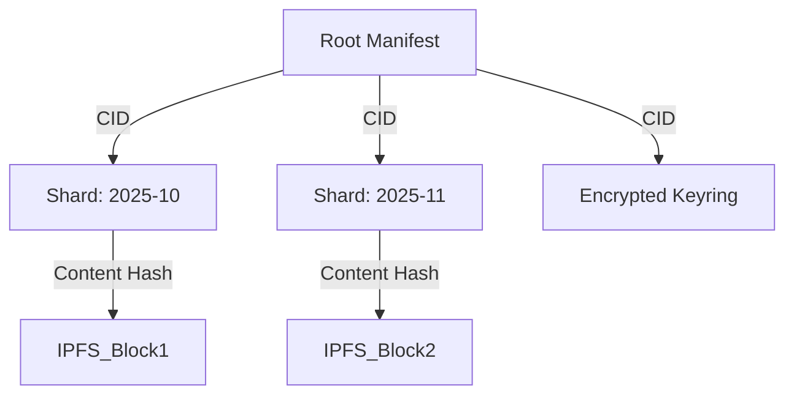

# Convergent Sharding & Merkle Forests: Kestrel Storage V2
**Technical Architecture Document**

## Overview
Storage V2 replaces the monolithic `AgentSnapshot` (V1) with a **Merkle Directed Acyclic Graph (DAG)**. This architecture enables incremental backups, global deduplication, and cryptographic integrity verification.

## Core Components

### 1. Time-Based Sharding
Conversations are grouped into temporal shards based on their timestamp.
*   **Granularity:** Monthly (`YYYY-MM`).
*   **Structure:** JSON array of conversation objects.
*   **Benefit:** Immutable history. Once a month passes, that shard is effectively "sealed" and never needs to be re-uploaded.

### 2. Convergent Encryption
To enable deduplication on public networks (IPFS) without compromising privacy, we use **Convergent Encryption**.
*   **Algorithm:** `AES-GCM-256`.
*   **Key Derivation:** $K = \text{HMAC-SHA256}(\text{Secret}, \text{Content})$
*   **Nonce Generation:** Deterministic Nonce = First 12 bytes of `SHA256(Content)`.
*   **Property:** $\text{Encrypt}(C, K_1) = \text{Encrypt}(C, K_2)$ if $C$ is identical.
*   **Result:** Two users with the exact same conversation (e.g., a default welcome message) will produce the exact same Ciphertext and CID, allowing the storage network to store it only once.
*   **Trade-off:** This introduces "Equality Leakage" (an attacker with the exact plaintext can verify if a user has stored it). This is an acceptable trade-off for the efficiency gains in this use case.

### 3. The Merkle Forest (Data Structure)
The agent state is represented as a tree:



#### Root Manifest
The entry point for the agent.
```json
{
  "version": 2,
  "agent_did": "did:pkh:...",
  "timestamp": "2025-11-21T...",
  "shards": [
    {
      "id": "conv_2025-10",
      "cid": "QmHash1...",
      "key_hash": "sha256(key)..."
    },
    {
      "id": "conv_2025-11",
      "cid": "QmHash2...",
      "key_hash": "sha256(key)..."
    }
  ],
  "keyring_cid": "QmKeyring..."
}
```

### 4. The Keyring Architecture
Since every shard has a unique, content-derived key, we need a way to manage them.
*   **The Keyring:** A map of `{ ShardID: DecryptionKey }`.
*   **Encryption:** The Keyring itself is encrypted using the same `ConvergentEncryptor` instance used for shards.
*   **Mechanism:** Uses the standard convergent logic ($K = \text{HMAC}(\text{UserSecret}, \text{Content})$). Because the `UserSecret` is unique to the user, the resulting Keyring ciphertext is unique to them and not deduplicated globally.
*   **Security:** This ensures that even if the Keyring is stored on IPFS, it is unreadable without the User Secret.
*   **Flow:**
    1.  Download Root Manifest.
    2.  Download & Decrypt Keyring (using User Secret).
    3.  Download Shards (using CIDs from Manifest).
    4.  Decrypt Shards (using Keys from Keyring).

## Implementation Details
*   **Class:** `storage.sovereign_adapter.SovereignStorageAdapter`
*   **Dependencies:** `filecoin_adapter.py` (for IPFS/Lotus interaction).
*   **Fallback:** If IPFS is unavailable, the system falls back to `StorageTier.LOCAL_ONLY`, using local file paths as pseudo-CIDs.

### Export Flow (Implemented)
```
User → !export-sovereignty
  ↓
1. Shard conversations by month
2. For each shard:
   - Encrypt with convergent encryption (content-derived key)
   - Upload to IPFS/Filecoin
   - Record CID in manifest
3. Create keyring (map of shard_id → decryption_key)
4. Encrypt keyring with user secret
5. Upload keyring
6. Create Root Manifest (references all shards + keyring)
7. Upload Root Manifest
8. Return Root CID to user
```

### Import Flow (Implemented)
```
User → !import-sovereignty <cid>
  ↓
1. Download Root Manifest using CID
2. Parse manifest → list of shard CIDs + keyring CID
3. Download & decrypt keyring using user secret
4. For each shard in manifest:
   - Download shard ciphertext from IPFS
   - Lookup decryption key in keyring
   - Decrypt shard
   - Parse conversation JSON
5. Rebuild local SQLite database
6. Return statistics (messages restored, shards count)
```

### Keyring Encryption Detail
The keyring uses a **deterministic key** derived from a known constant:
```python
keyring_key = HMAC-SHA256(UserSecret, "KESTREL_KEYRING_V2")
```
This solves the "chicken-egg" problem: we can decrypt the keyring without needing to know its content hash first.

**Security Trade-off:** The keyring is encrypted with the user secret, but NOT convergently encrypted (uses random nonce). This means:
- ✅ Only the user can decrypt it (confidentiality)
- ❌ Keyrings cannot be deduplicated across users (acceptable overhead)

## Security Guarantees
1.  **Confidentiality:** The storage provider (IPFS node) sees only opaque ciphertext. They do not have the keys.
2.  **Integrity:** Any tampering with a shard changes its CID, which invalidates the Root Manifest signature (currently enforced via CID integrity checks; digital signatures planned for V2.1).
3.  **Availability:** The "Forest" structure allows partial recovery. If one shard is lost, the others are still recoverable.

## How This Relates to Kestrel Storage
Kestrel's Storage V2 is **not** a replacement for the Kestrel platform database. They serve different purposes:

- **Kestrel (Cloud SQL / Redis):**
  - Stores accounts, authentication, companions, sliders, trial usage, and product analytics.
  - Runs in Google Cloud (Cloud SQL + Redis) for multi-tenant SaaS operation.
  - Is the **system of record for the Kestrel app**: if you log in from a new device, Cloud SQL is why your companions and settings are there.

- **Kestrel Sovereignty Storage (Local DB + IPFS/Filecoin):**
  - Stores the **agent's deep memory**: conversations, long-term state, and knowledge.
  - Lives primarily in a **local SQLite database** on the user's machine for low-latency access.
  - Is periodically exported as **encrypted, content-addressed shards** to IPFS/Filecoin when the user runs `!export-sovereignty`.

When Kestrel embeds a Kestrel agent:

1. Kestrel uses **Cloud SQL** to remember "who you are in the app": your login, which companions you created, which sliders you moved.
2. The embedded Kestrel agent uses **Storage V2** to remember "who you are to the agent": your stories, conversations, and evolving inner state.
3. If Kestrel disappears but you kept your **sovereignty export CID**, you can:
   - Start a standalone Kestrel instance.
   - Run `!import-sovereignty <cid>`.
   - Recover the agent's memory even without the Kestrel SaaS.

Conversely, if your local Kestrel DB is lost but Kestrel Cloud SQL still exists, you can still log into Kestrel and see your companions and settings, but you will need to either restore the agent from a sovereignty export or let it rebuild new memories.

## Failure Modes & Recovery
*   **Partial Uploads:** If a shard fails to upload to IPFS, the export process aborts before publishing the Root Manifest. This ensures the Root always points to a valid tree.
*   **Lost Shards:** If a specific shard (e.g., "Nov 2025") disappears from IPFS (garbage collection), the rest of the history remains accessible. The user loses only that month's data.
*   **Lost Keys:** If the user loses their Master Key, the Keyring cannot be decrypted, and **all data is lost**. There is no backdoor.

## Future: Agent Discovery & Network

### Agent Discovery via IPFS
Agents can publish capabilities to IPFS for discovery:

```python
def publish_agent_capabilities(self) -> str:
    """Publish agent capabilities to IPFS for discovery"""
    capabilities = {
        "agent_id": self.agent_id,
        "capabilities": self.get_capabilities(),
        "service_contracts": self.get_available_services(),
        "reputation_score": self.get_reputation(),
        "last_updated": datetime.now().isoformat()
    }
    ipfs_cid = self.filecoin.store_ipfs(json.dumps(capabilities).encode())
    return ipfs_cid
```

### Cross-Network Collaboration
Agents can collaborate across different networks:

```python
def collaborate_with_remote_agent(self, remote_agent_ipfs: str, task: str):
    """Collaborate with agent accessible via IPFS"""
    capabilities = json.loads(self.filecoin.retrieve_ipfs(remote_agent_ipfs))
    contract = CollaborationContract(
        partner_agent_id=capabilities["agent_id"],
        task_description=task,
        storage_method="ipfs",
        payment_method="filecoin"
    )
    return self._execute_remote_collaboration(contract)
```

### Storage Budget Allocation
Agents autonomously manage storage costs:

```python
def allocate_storage_budget(self) -> StorageBudget:
    """Allocate FIL tokens for different storage needs"""
    total_budget = self.wallet.balance * Decimal("0.15")  # 15% for storage
    return StorageBudget(
        critical_data=total_budget * Decimal("0.6"),
        high_importance=total_budget * Decimal("0.3"),
        medium_importance=total_budget * Decimal("0.1"),
        emergency_reserve=self.wallet.balance * Decimal("0.05")
    )
```

## Future Enhancements

- **Smart Storage Policies**: Automated data lifecycle management
- **Cross-Chain Storage**: Integration with multiple blockchain storage networks
- **Storage Mining**: Agents earning tokens by providing storage to network
- **Quantum-Resistant Encryption**: Future-proof cryptographic protection
