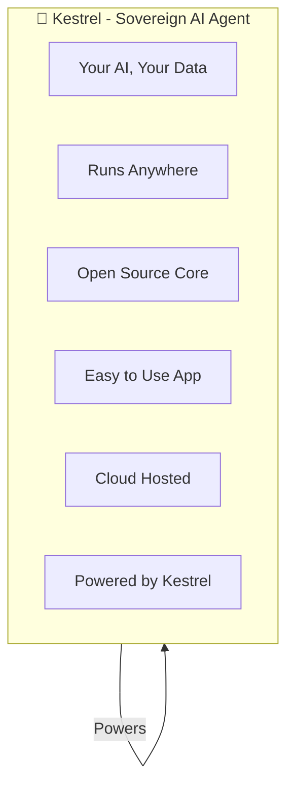
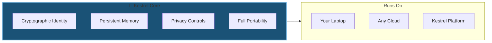
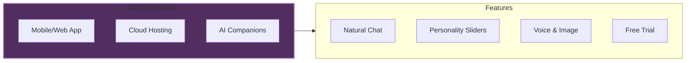
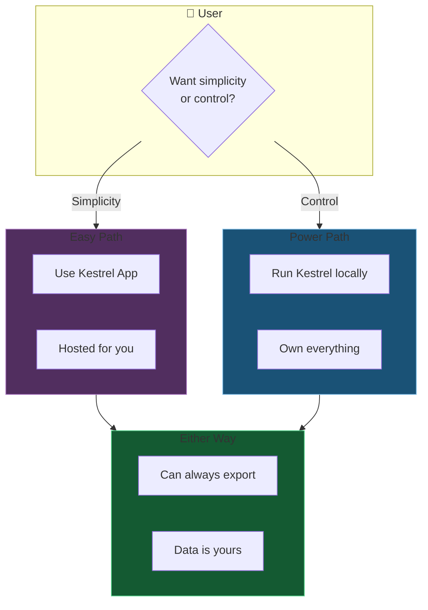
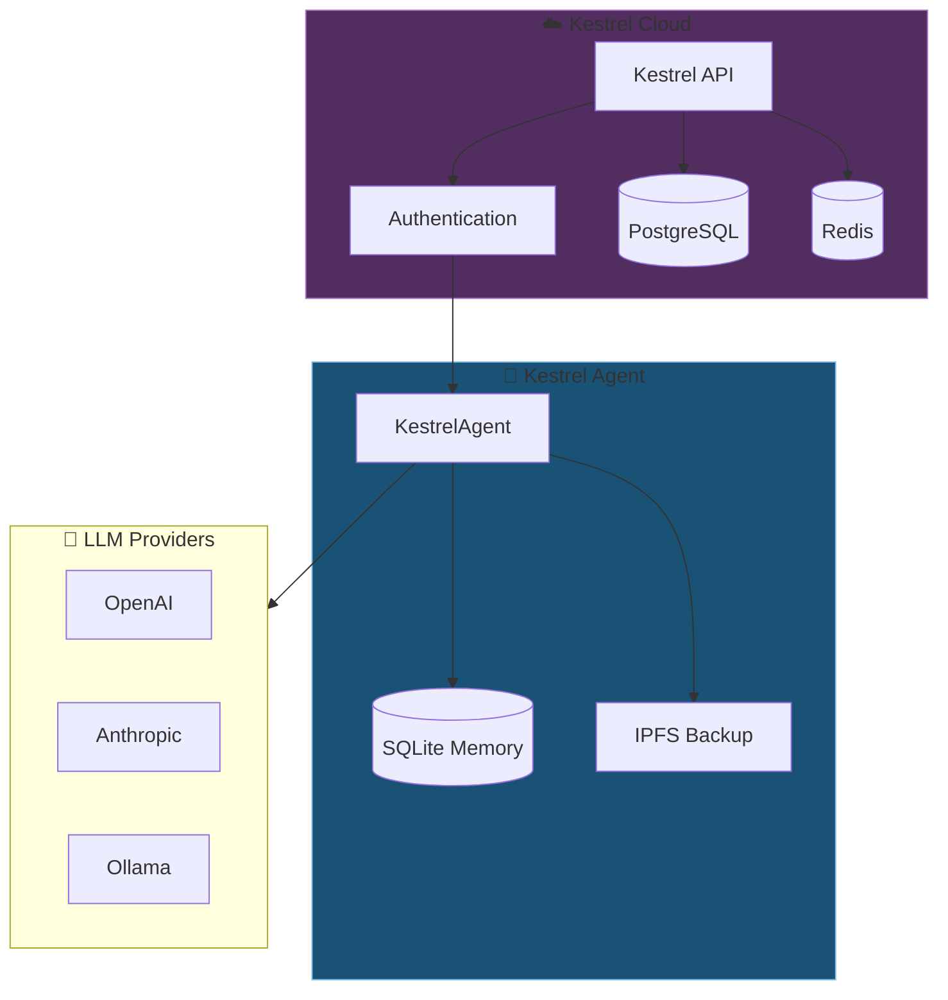
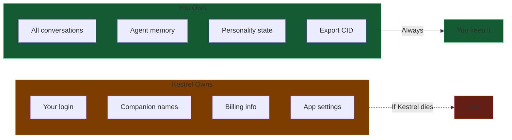
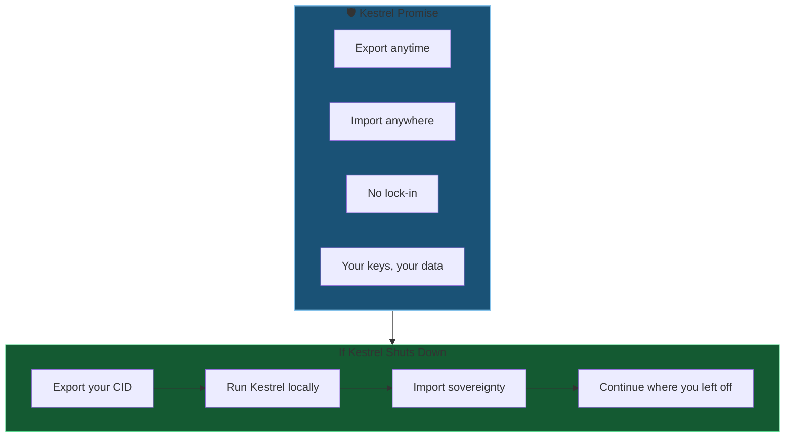
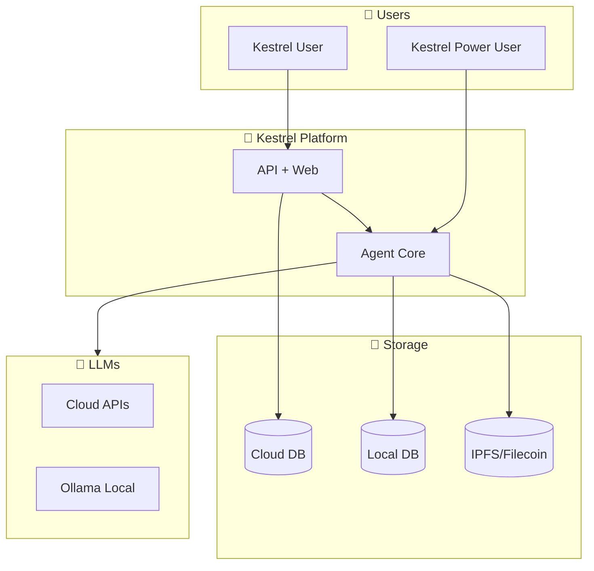

# 01 - Kestrel & Kestrel Overview

Introduction to the Kestrel Sovereign AI Agent and Kestrel platform.

---

## Slide 1: The Vision - Two Products, One Foundation

**Kestrel** = The engine (sovereign, portable, yours)  
**Kestrel** = The product (friendly, hosted, easy)

---

## Slide 2: What is Kestrel?

**Key Point:** Same agent, same memory, anywhere you want.

---

## Slide 3: What is Kestrel?

**Target:** Users who want an AI companion without technical setup.

---

## Slide 4: How They Relate

---

## Slide 5: Architecture - Kestrel Uses Kestrel

**Kestrel stores:** Accounts, settings, billing  
**Kestrel stores:** Conversations, deep memory, personality

---

## Slide 6: Data Ownership Model

---

## Slide 7: The Sovereignty Promise

**You are never trapped.**

---

## Slide 8: System Context - Full Picture

---

*Next: [02-privacy-problem.md](02-privacy-problem.md) - Why current AI platforms fail you*
