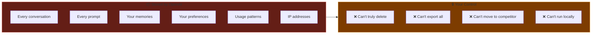
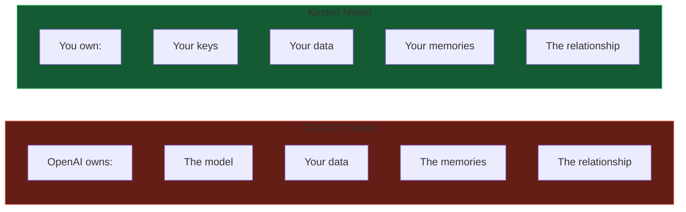
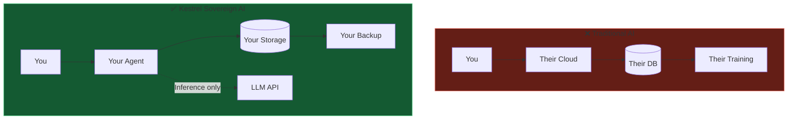
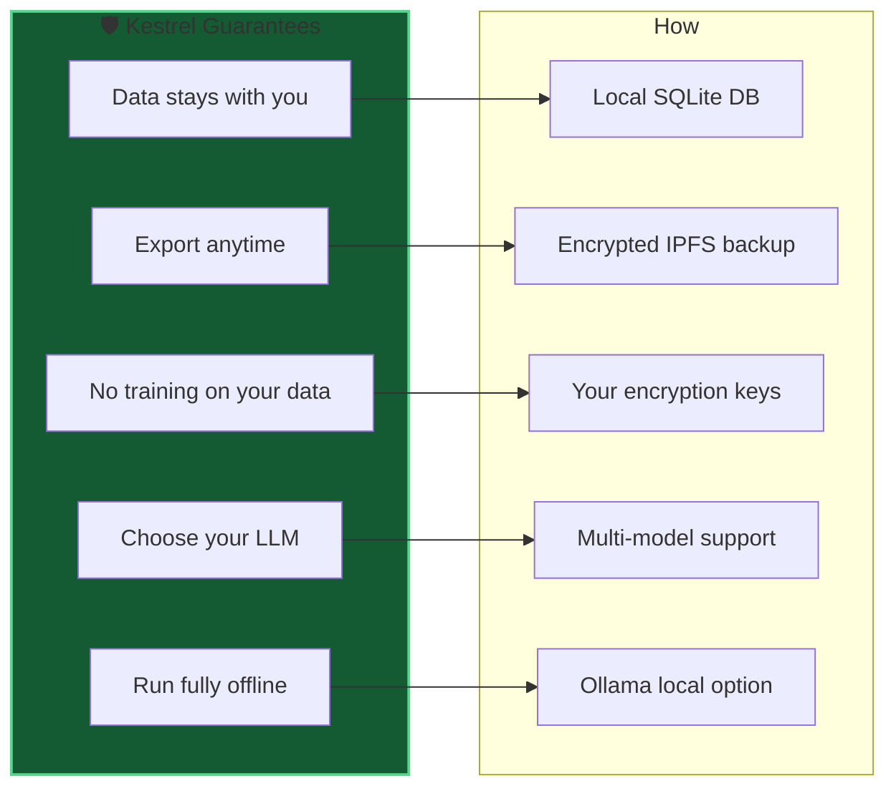
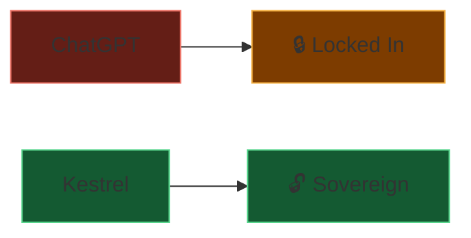

# 02 - The Privacy Problem

Why current AI platforms like ChatGPT fail you, and why data sovereignty matters.

---

## Slide 1: How ChatGPT Works Today

```mermaid
graph TB
    subgraph you["👤 You"]
        MSG[Your message]
        HIST[Your history]
        MEM[Your memories]
    end
    
    subgraph openai["🏢 OpenAI Servers"]
        API[Their API]
        DB[(Their Database)]
        TRAIN[Their Training]
    end
    
    MSG --> API
    API --> DB
    DB --> TRAIN
    HIST --> DB
    MEM --> DB
    
    style you fill:#641e16,stroke:#ec7063
    style openai fill:#0e4d45,stroke:#45b39d
```

**Reality:** Every word you type lives on their servers, forever.

---

## Slide 2: What OpenAI Stores

---

## Slide 3: The Memory Feature Trap

```mermaid
graph TD
    subgraph chatgpt["ChatGPT Memory"]
        MEM[Memories enabled]
        SAVE[AI saves facts about you]
        PERS[Personalizes responses]
    end
    
    subgraph reality["The Reality"]
        R1[Stored on OpenAI servers]
        R2[Used for training]
        R3[You can't export]
        R4[Deletion is fuzzy]
    end
    
    subgraph risk["Risks"]
        LEAK[Data breaches]
        POLICY[Policy changes]
        SHUTDOWN[Service shutdown]
        CENSOR[Content moderation]
    end
    
    chatgpt --> reality --> risk
    
    style chatgpt fill:#0e4d45,stroke:#45b39d
    style reality fill:#7d3c00,stroke:#f5b041
    style risk fill:#641e16,stroke:#ec7063
```

**Your "personal AI" isn't personal at all.**

---

## Slide 4: Who Really Owns Your AI Relationship?

---

## Slide 5: The Kestrel Difference

**Key:** LLM sees your prompt, but doesn't keep your history.

---

## Slide 6: What Kestrel Guarantees

---

## Slide 7: Comparison Summary

| Feature | ChatGPT | Kestrel |
|---------|---------|---------|
| Data location | OpenAI servers | Your device/cloud |
| Export | Limited | Full sovereignty |
| Training | Yes (default) | Never |
| Offline mode | No | Yes (Ollama) |
| Model choice | GPT only | Any LLM |
| Delete data | Uncertain | Cryptographic |
| Survives shutdown | No | Yes |

---

*Next: [03-privacy-modes.md](03-privacy-modes.md) - Kestrel's 5-tier privacy system*
