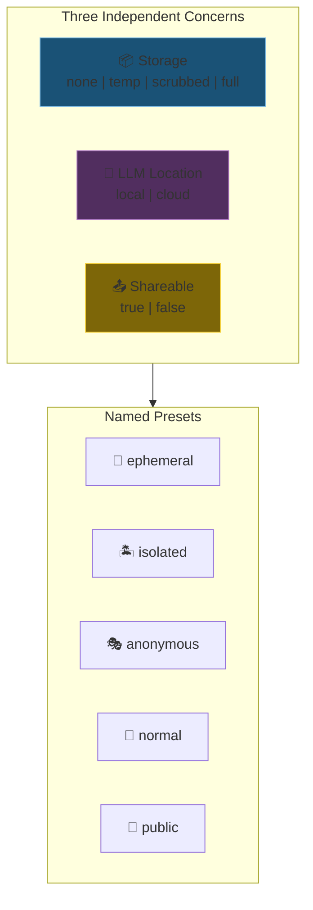
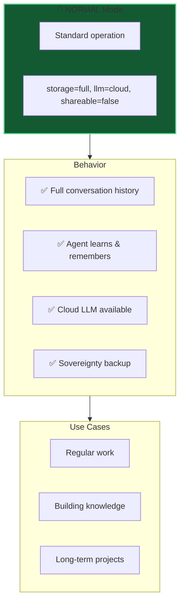
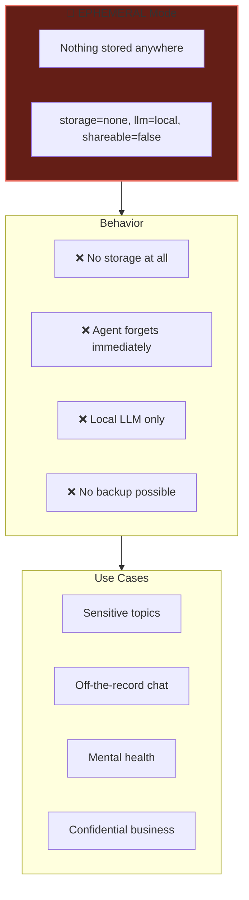
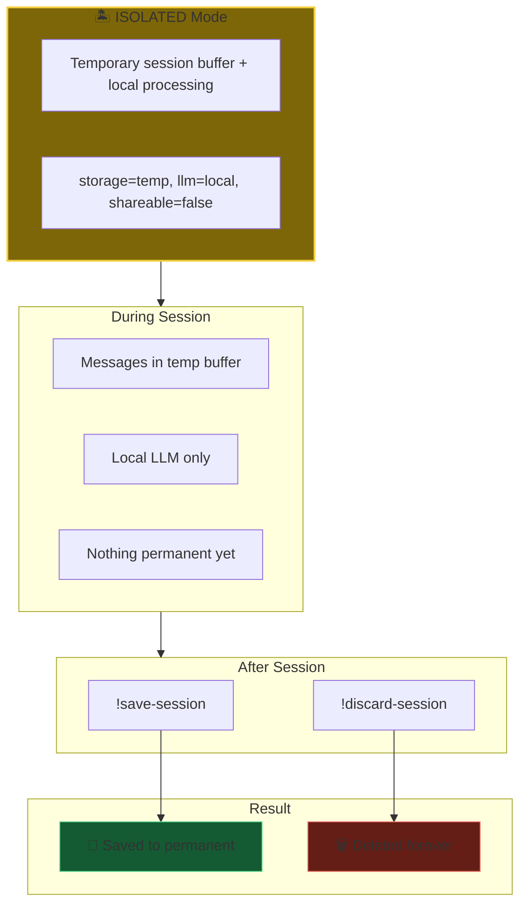
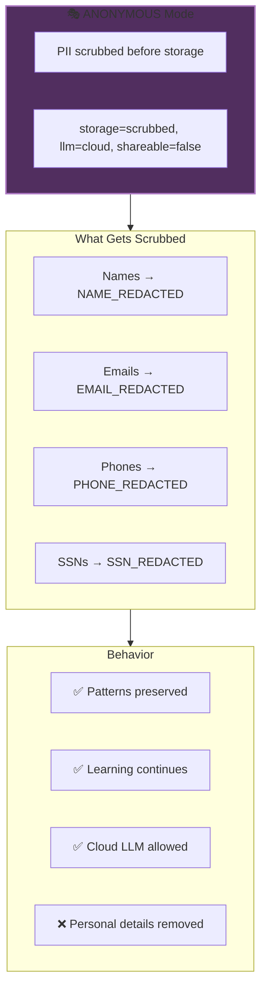
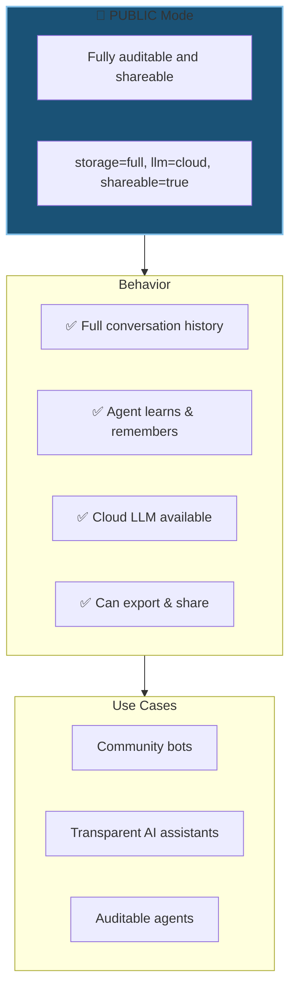
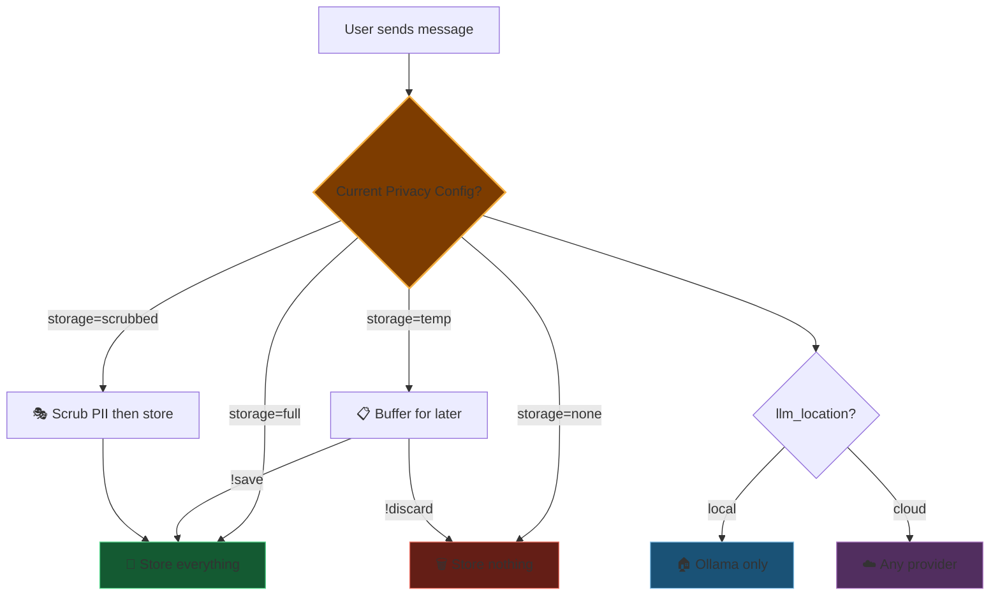
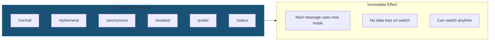

# 03 - Privacy Modes

Kestrel's privacy system uses **independent flags** with **named presets** for complete control.

---

## Slide 1: Privacy as Independent Flags



**Presets are convenience.** Flags are the truth.

---

## Slide 2: The Five Presets

| Preset | Storage | LLM | Shareable | Purpose |
|--------|---------|-----|-----------|---------|
| 👻 ephemeral | none | local | no | Maximum privacy - nothing stored, local only |
| 🏝️ isolated | temp | local | no | Session sandbox - decide later |
| 🎭 anonymous | scrubbed | cloud | no | Learn from me, don't know me |
| 🔄 normal | full | cloud | no | Standard operation |
| 📖 public | full | cloud | yes | Transparent/auditable agent |


---

## Slide 3: Normal Mode - Full Features



**Default mode.** Your agent grows with you.

---

## Slide 4: Ephemeral Mode - Zero Trace



**Like it never happened.** Message exists only in memory.

---

## Slide 5: Isolated Mode - Sandbox with Local LLM



**Experiment safely.** Local processing, commit only what you want.

---

## Slide 6: Anonymous Mode - Learn Without Identity



**Agent learns how to help you, not who you are.**

---

## Slide 7: Public Mode - Full Transparency



**Nothing to hide.** Full transparency for trust.

---

## Slide 8: Privacy Mode Decision Flow



---

## Slide 9: Switching Modes - Commands



**Instant switching.** Your conversation, your rules.

---

## Slide 10: Custom Configurations

Beyond presets, you can set flags directly:

```python
# Want permanent storage but local-only processing?
agent.set_privacy(PrivacyConfig(
    storage="full",
    llm_location="local",
    shareable=False
))

# Or use a preset
agent.set_privacy_preset("ephemeral")
```

**Presets are named combinations. Flags give you full control.**

---

*Next: [04-feature-framework.md](04-feature-framework.md) - Dynamic feature system architecture*
