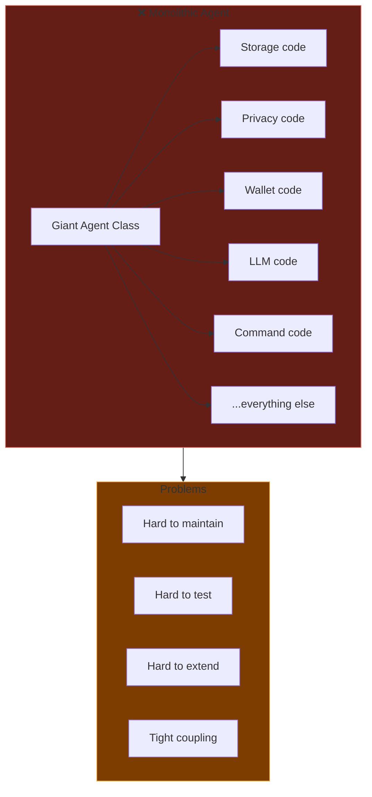
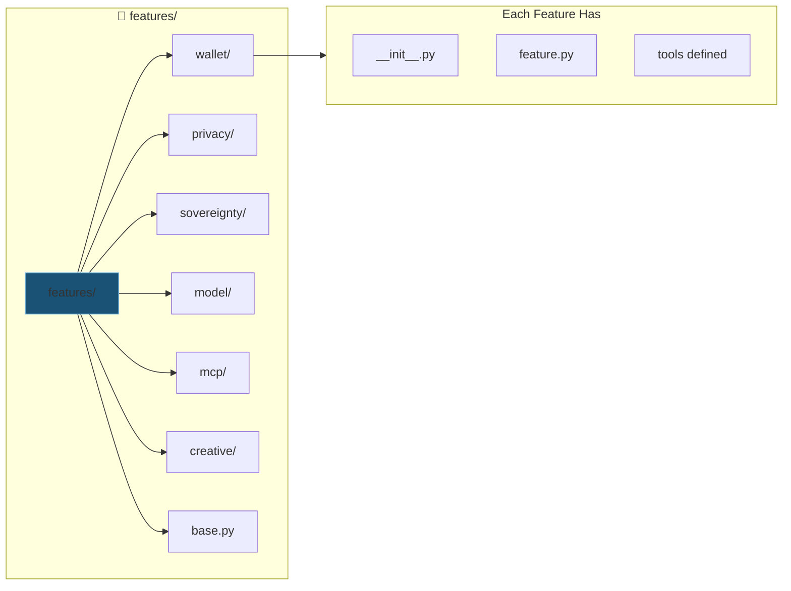
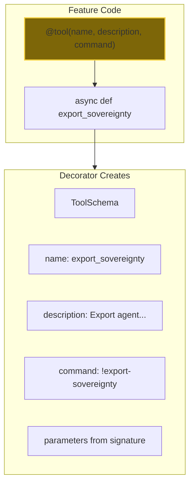
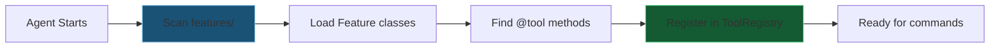
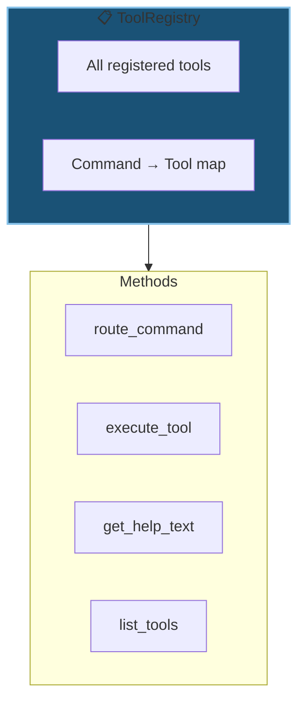
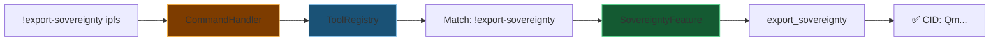
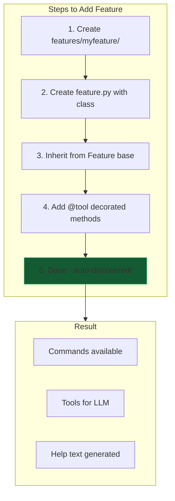
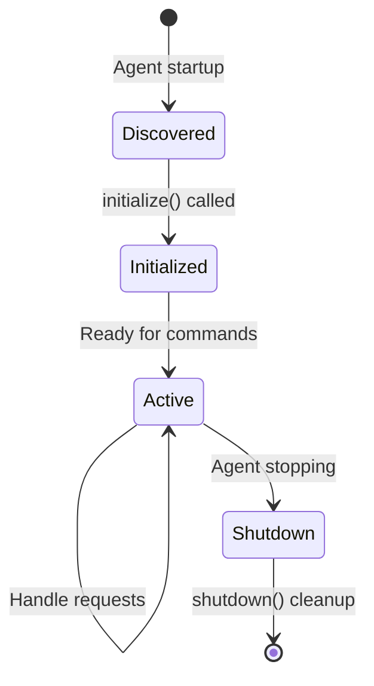

# 04 - Feature Framework

Kestrel's dynamic feature system - how capabilities are built, discovered, and extended.

---

## Slide 1: The Problem with Monolithic Agents

---

## Slide 2: The Feature Agent Solution

```mermaid
graph TD
    subgraph orchestrator["🦅 KestrelAgent - Orchestrator"]
        KA[Delegates to features]
    end
    
    subgraph features["Feature Agents"]
        F1[💰 WalletAgent]
        F2[🔒 PrivacyAgent]
        F3[📦 SovereigntyFeature]
        F4[🧠 ModelAgent]
        F5[🔌 MCPAgent]
        F6[🎨 CreativeFeature]
    end
    
    KA --> F1 & F2 & F3 & F4 & F5 & F6
    
    style KA fill:#1a5276,stroke:#85c1e9,stroke-width:3px
    style orchestrator fill:#1a3c5c,stroke:#5dade2
```

**Single Responsibility:** Each feature does one thing well.

---

## Slide 3: Feature Directory Structure

**Convention over configuration.** Drop a feature, it works.

---

## Slide 4: The @tool Decorator

**Metadata from code.** No separate config files.

---

## Slide 5: Auto-Discovery Flow

**Zero boilerplate.** Add feature → auto-available.

---

## Slide 6: Tool Registry - The Router

**Central routing.** Commands find their features.

---

## Slide 7: Command Flow - User to Feature

---

## Slide 8: Current Features Overview

```mermaid
graph TB
    subgraph core["Core Features"]
        SOV["📦 SovereigntyFeature<br/>Export/Import backups"]
        PRIV["🔒 PrivacyAgent<br/>Mode management"]
        MODEL["🧠 ModelAgent<br/>LLM switching"]
        SEC["🛡️ SecurityFeature<br/>Permissions & approval"]
    end

    subgraph extended["Extended Features"]
        WALLET["💰 WalletAgent<br/>Economics"]
        MCP["🔌 MCPAgent<br/>Tool protocols"]
        COMPUTE["🖥️ ComputeFeature<br/>Script execution"]
        FEEDBACK["📝 FeedbackFeature<br/>Self-observation"]
    end

    subgraph tools["Tool Features"]
        GITHUB["🐙 GitHubFeature<br/>Code introspection"]
        SEARCH["🔍 WebSearchFeature<br/>Tavily search"]
        VISUAL["🎨 VisualIdentity<br/>Avatar generation"]
        CLOUD["⚡ Cloud providers<br/>entry-point packages"]
    end

    style core fill:#1a5276,stroke:#85c1e9
    style extended fill:#512e5f,stroke:#af7ac5
    style tools fill:#0e4d45,stroke:#48c9b0
```

**12 Features.** Modular, discoverable, extensible.

---

## Slide 9: Adding a New Feature

**Extensible by design.** Third-party features welcome.

---

## Slide 10: Feature Lifecycle

**Clean lifecycle.** Features manage their own resources.

---

*Next: [05-storage-sovereignty.md](05-storage-sovereignty.md) - Storage V2 and sovereignty backup*
