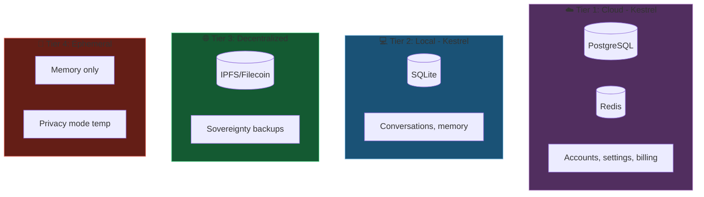
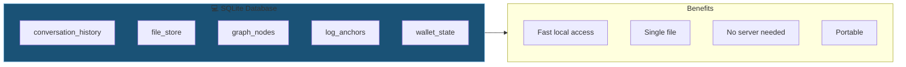
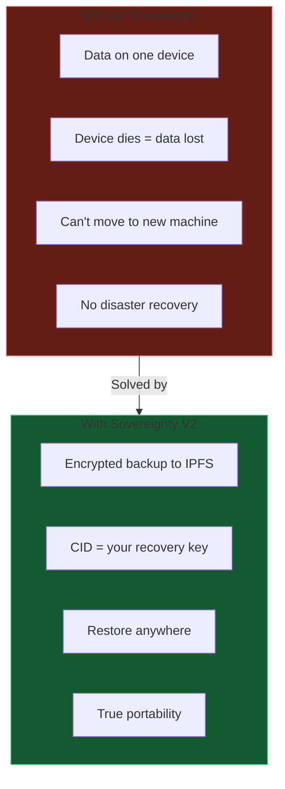
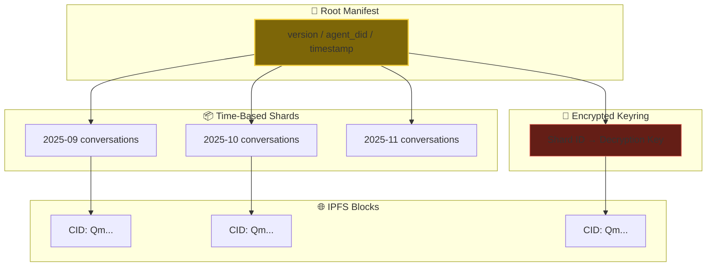
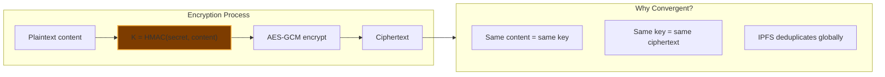
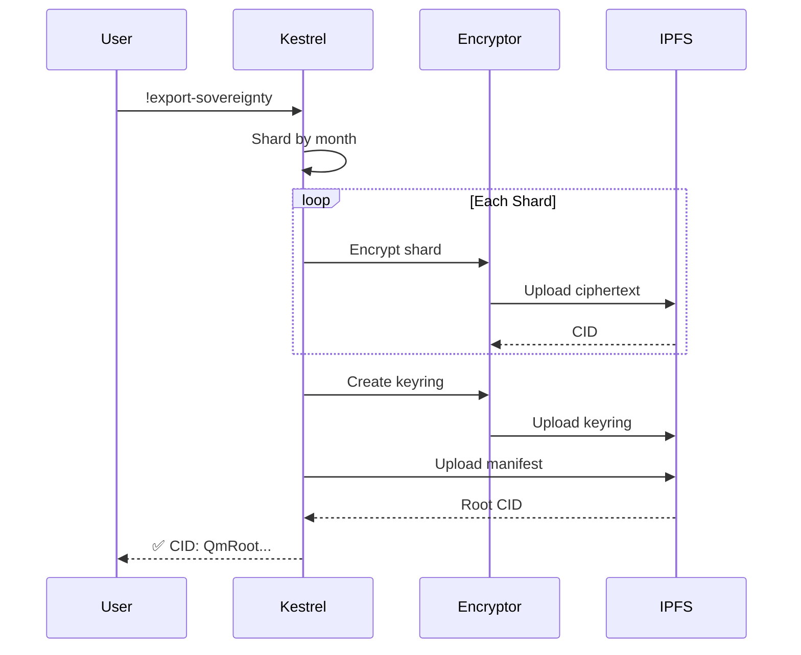
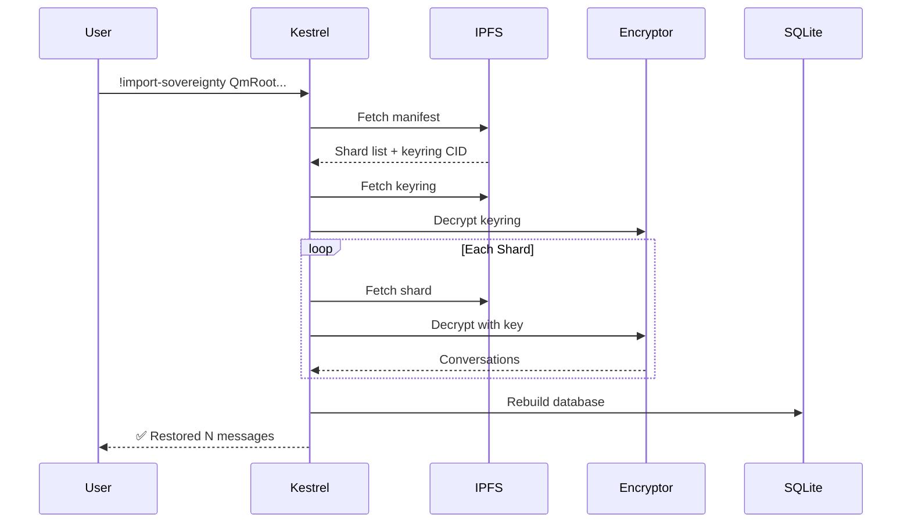
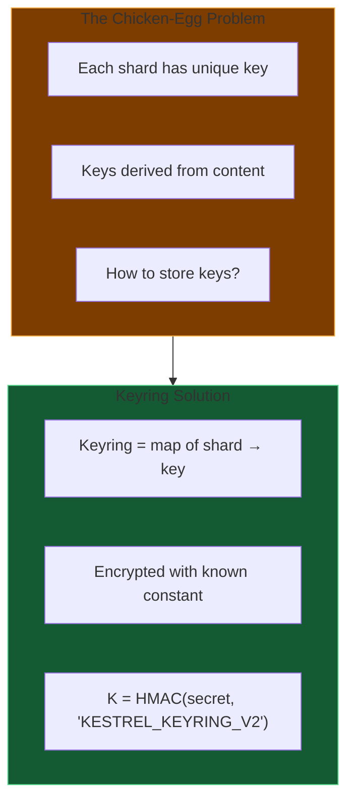
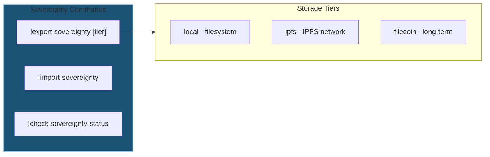
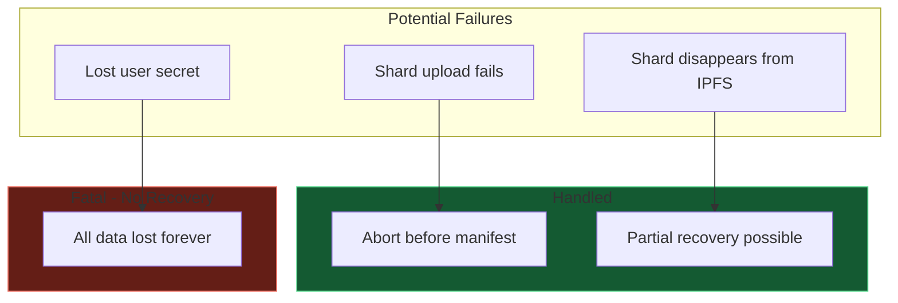

# 05 - Storage & Sovereignty

Kestrel's multi-tier storage and the Sovereignty V2 backup system.

---

## Slide 1: Multi-Tier Storage Architecture

**Right storage for right purpose.**

---

## Slide 2: Local Storage - SQLite

**Your data, your file.** `agent_data/{agent_id}.db`

---

## Slide 3: The Sovereignty Problem

---

## Slide 4: Sovereignty V2 - The Merkle Forest

**Incremental.** Only changed months re-upload.

---

## Slide 5: Convergent Encryption

**Efficiency + Privacy.** Deduplicated but encrypted.

---

## Slide 6: Export Flow - !export-sovereignty

**One CID to rule them all.** Your entire agent state.

---

## Slide 7: Import Flow - !import-sovereignty

**Full recovery.** From any device, anytime.

---

## Slide 8: The Keyring Solution

**Deterministic key for keyring.** Always recoverable with your secret.

---

## Slide 9: Storage Commands

---

## Slide 10: Failure Modes & Recovery

**Your secret is sacred.** Lose it, lose everything. No backdoor.

---

*Next: [06-llm-management.md](06-llm-management.md) - Multi-model fallback and GPU integration*
