# 06 - LLM Management

Multi-model fallback, GPU integration, streaming with tools, and the constitutional honesty layer.

> **Slide-deck doc — for the canonical architecture references see:**
> - [LLM_SERVICE_ARCHITECTURE.md](../architecture/LLM_SERVICE_ARCHITECTURE.md) — vendor / route / model schema, mandate semantics, routing
> - [llm/PROVIDER_PLUGINS.md](../architecture/llm/PROVIDER_PLUGINS.md) — adapter authoring (in-tree + external plugin paths)
> - [llm/HONESTY_LAYER.md](../architecture/llm/HONESTY_LAYER.md) — streaming honesty enforcement, `ToolCallStarted`, in-band sentinel + SSE backup
>
> The slides below are a high-level visual overview. Where they reference older terminology (e.g. `BrainRouter` is now merged into `LLMService`; the adapter base lives in `kestrel-sovereign-sdk` since [#1048](https://github.com/KestrelSovereignAI/kestrel-sovereign/issues/1048) Wave 1A), defer to the canonical docs.

---

## Slide 1: The Model Independence Principle

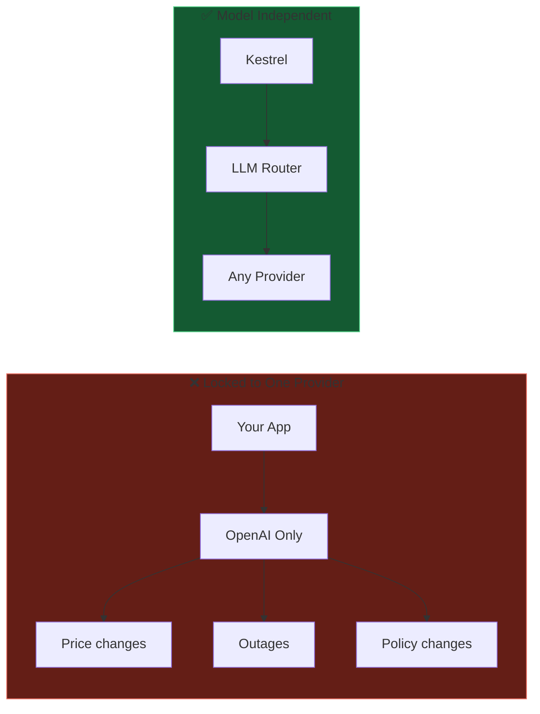

**No vendor lock-in.** Switch models anytime.

---

## Slide 2: Supported Providers

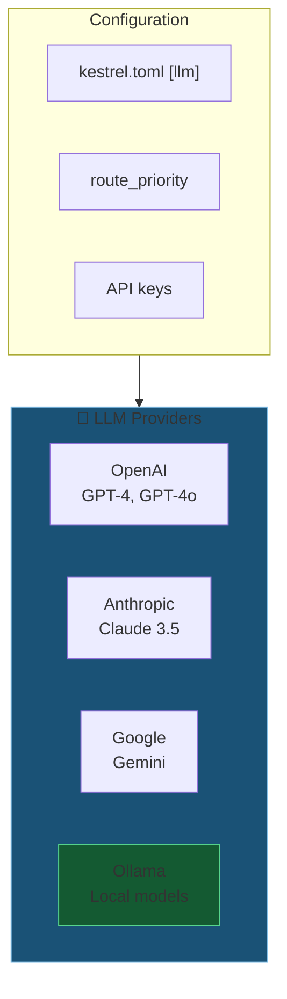

**Ollama = Always available locally.** No API key needed.

---

## Slide 3: The Fallback Chain

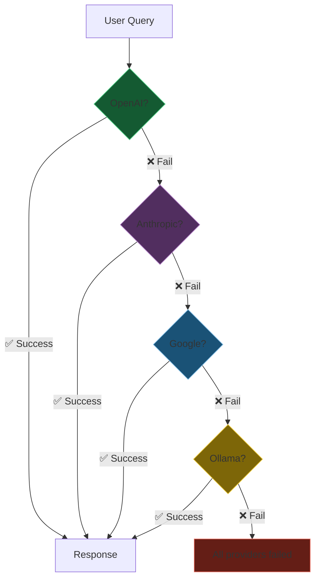

**Resilient by design.** Agent keeps working.

---

## Slide 4: LLM Service Architecture

```mermaid
graph TD
    subgraph sdk["kestrel-sovereign-sdk (kestrel_sdk.llm)"]
        BASE[LLMAdapter ABC]
        TYPES["LLMResponse / ToolCall<br/>ToolCallStarted / ModelInfo"]
    end

    subgraph service["LLMService (framework)"]
        LOAD[Load kestrel.toml [llm]]
        INIT[Initialize adapters]
        PRIO[Resolve route_priority]
        ROUTE[resolve_provider_routing]
    end

    subgraph adapters["Adapters (in-tree OR plugins)"]
        OAI_A[OpenAIAdapter]
        ANT_A[AnthropicAdapter]
        OLLAMA_A[OllamaAdapter]
        PLUGIN[…external plugins<br/>via entry-points]
    end

    subgraph contract["SDK Contract Methods"]
        RESP[get_response]
        STREAM[get_streaming_response]
        TOOLS["get_streaming_response_with_tools<br/>↪ yields ToolCallStarted markers"]
        META[substrate_type / cost / etc.]
        DISC[list_models]
    end

    sdk --> adapters
    service --> adapters --> contract

    style sdk fill:#512e5f,stroke:#af7ac5
    style service fill:#1a5276,stroke:#85c1e9
    style TOOLS fill:#7d6608,stroke:#f4d03f
```

**SDK-defined contract.** External plugins ship as `pip install <pkg>` and register via the `kestrel_sovereign.llm_providers` entry-point group — no framework edits required. The streaming-with-tools method drives the constitutional honesty layer (see Slide 5b).

---

## Slide 5b: Honesty Layer — `ToolCallStarted` → revising

```mermaid
sequenceDiagram
    participant LLM as LLM Stream
    participant AGT as Agent (streaming.py)
    participant CHAT as Chat UI (chat.js)
    participant SSE as /notifications/sse
    participant AUDIT as ResponseAuditHook

    LLM->>AGT: text chunk: "Saving that now"
    AGT->>CHAT: yield chunk → bubble shows text
    LLM->>AGT: ToolCallStarted (marker)
    AGT->>CHAT: in-band \x1eKESTREL:REVISE:…\x1e on chat stream
    AGT->>SSE: emit revising event (backup)
    CHAT->>CHAT: strip sentinel; clear bubble
    LLM->>AGT: LLMResponse (tool_calls)
    Note over AGT: execute tool → tool_results
    AGT->>CHAT: post-tool synthesis chunks
    AGT->>AUDIT: HookInput(pre_tool_prose, tool_calls, tool_results)
    AUDIT->>AUDIT: analyze_narration (deterministic)
    Note over AUDIT: violation? → DENY/MODIFY persisted text
```

**Closes the "Saved your favorite color is teal" failure mode** ([#1042](https://github.com/KestrelSovereignAI/kestrel-sovereign/issues/1042)). In-band sentinel is ordering-correct; SSE is reliability backup; audit check is deterministic and runs even when the audit LLM is unavailable.

---

## Slide 5: BrainRouter - Dynamic Backend Switching

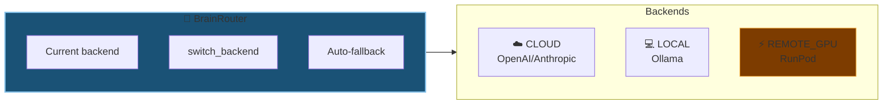

**Hot-swap.** Change backend without restart.

---

## Slide 6: BrainRouter State Machine

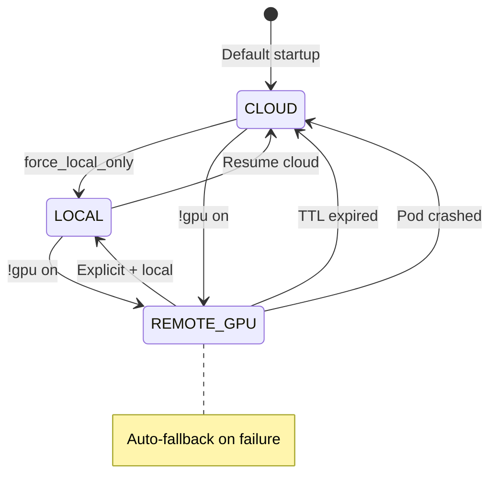

**Always recovers.** GPU dies → falls back automatically.

---

## Slide 7: RunPod GPU Integration

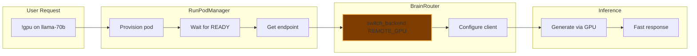

**On-demand GPU.** Pay only when you need power.

---

## Slide 8: GPU Lifecycle

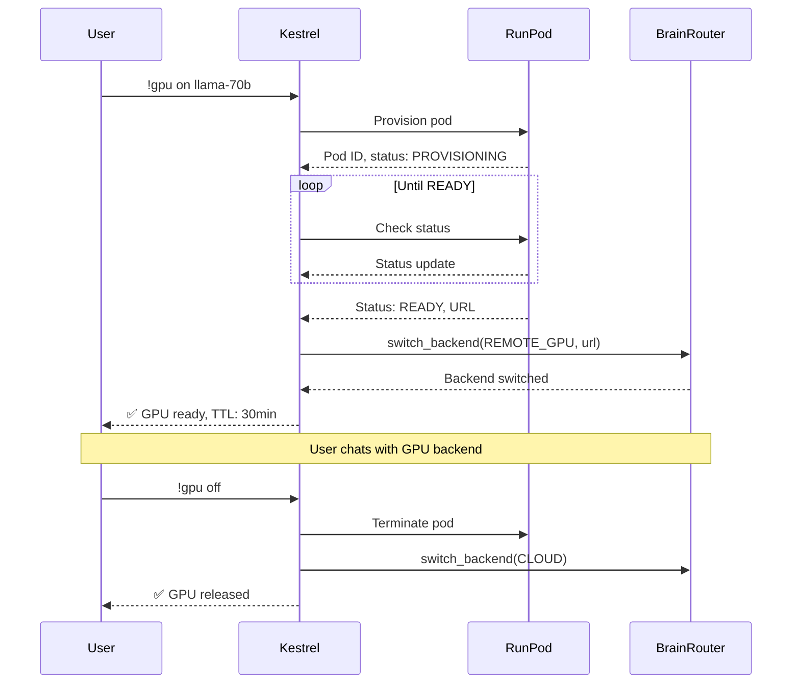

---

## Slide 9: Model Commands

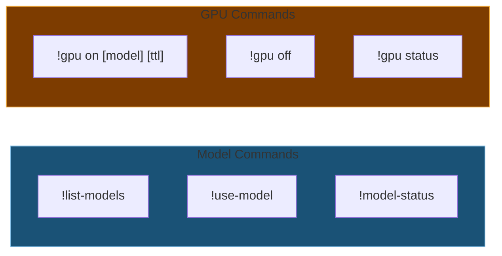

---

## Slide 10: Configuration Example

```toml
# kestrel.toml — [llm] section

[llm]
route_priority = ["openai:api", "anthropic:api", "ollama:local"]

[llm.vendors.openai]
is_cloud = true
[llm.vendors.openai.routes.api]
adapter         = "OpenAIAdapter"
api_key_env     = "OPENAI_API_KEY"   # in .env, never here
model           = "auto"
selection_hints = ["gpt-5", "mini"]

[llm.vendors.anthropic]
is_cloud = true
[llm.vendors.anthropic.routes.api]
adapter         = "AnthropicAdapter"
api_key_env     = "ANTHROPIC_API_KEY"
model           = "auto"
selection_hints = ["sonnet", "haiku"]

[llm.vendors.ollama]
is_cloud = false
[llm.vendors.ollama.routes.local]
adapter         = "OllamaAdapter"
host            = "http://localhost:11434"
model           = "auto"
selection_hints = ["llama3.2", "qwen"]
```

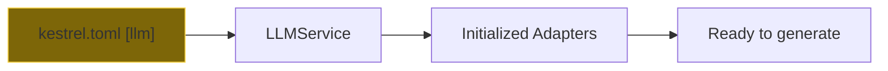

**Vendor/route/model.** Vendors group routes; routes carry adapter + auth. `model = "auto"` resolves via discovery from `selection_hints` — never hardcode IDs. API keys live in `.env`, referenced by `api_key_env`.

---

## Slide 11: Model Discovery - Parallel Scanning

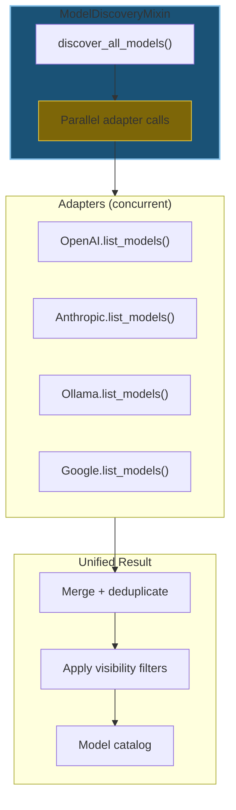

**Fast discovery.** Query all providers simultaneously.

---

## Slide 12: ModelInfo & Model Catalog

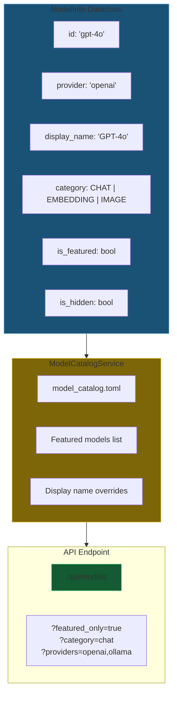

**Curated catalog.** Surface the best models, hide the noise.

---

## Slide 13: Model Selector UI Flow

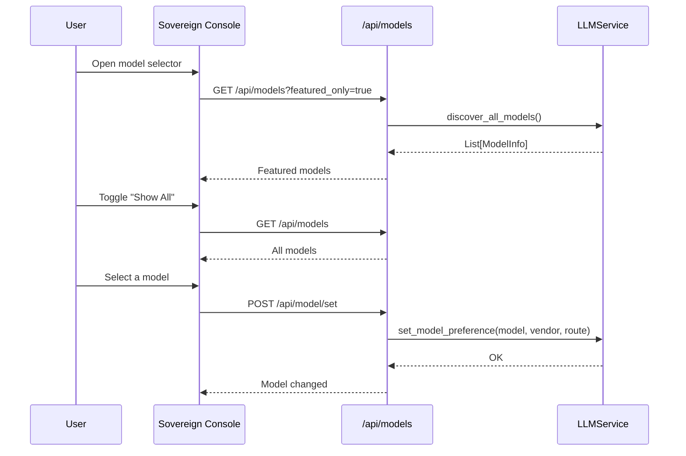

---

*Next: [07-economics.md](07-economics.md) - Wallet and economic system*
