# 07 - Economics

Agent wallet system, contracts, and the vending machine model.

---

## Slide 1: Agents as Economic Entities

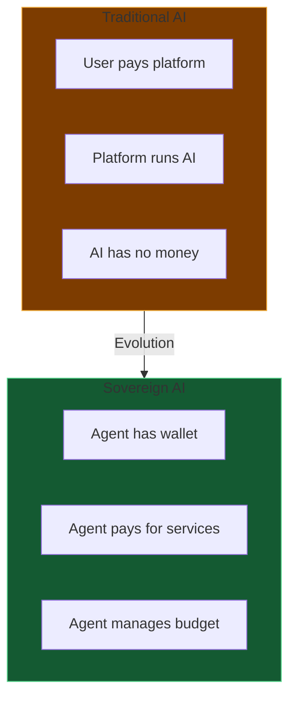

**Agents as first-class economic actors.**

---

## Slide 2: Agent Wallet Architecture

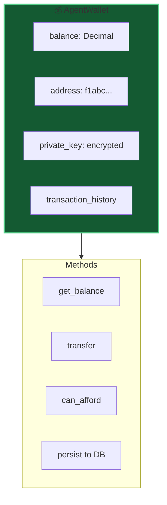

**Persistent.** Survives restarts, stored in database.

---

## Slide 3: Transaction Flow

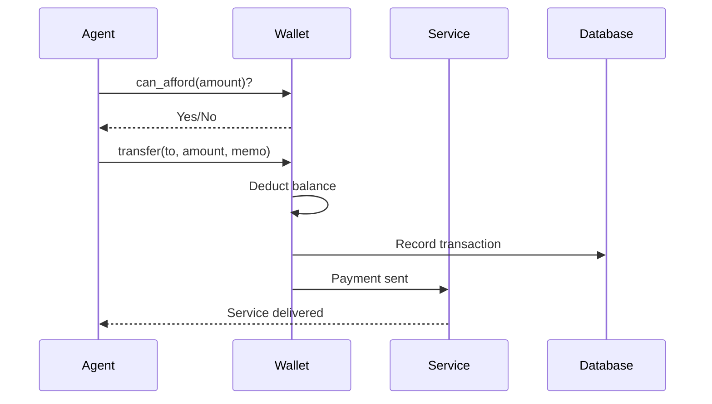

---

## Slide 4: Contract Types Overview

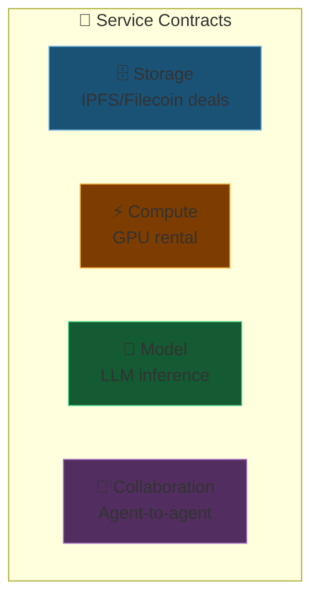

**Four primary ways agents spend money.**

---

## Slide 5: Storage Contracts

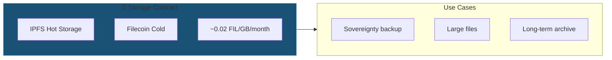

**Pay for persistence.** Data stays as long as you pay.

---

## Slide 6: Compute Contracts

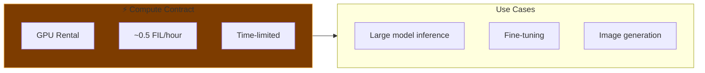

**Burst capacity.** Heavy compute when needed.

---

## Slide 7: The Vending Machine Model

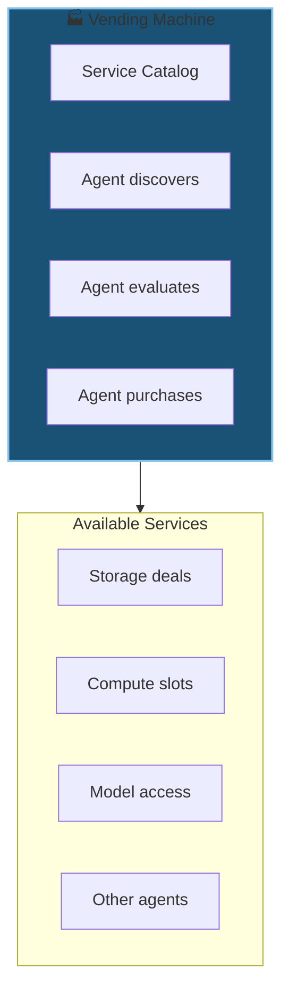

**Autonomous procurement.** Agent shops for itself.

---

## Slide 8: Vending Machine Flow

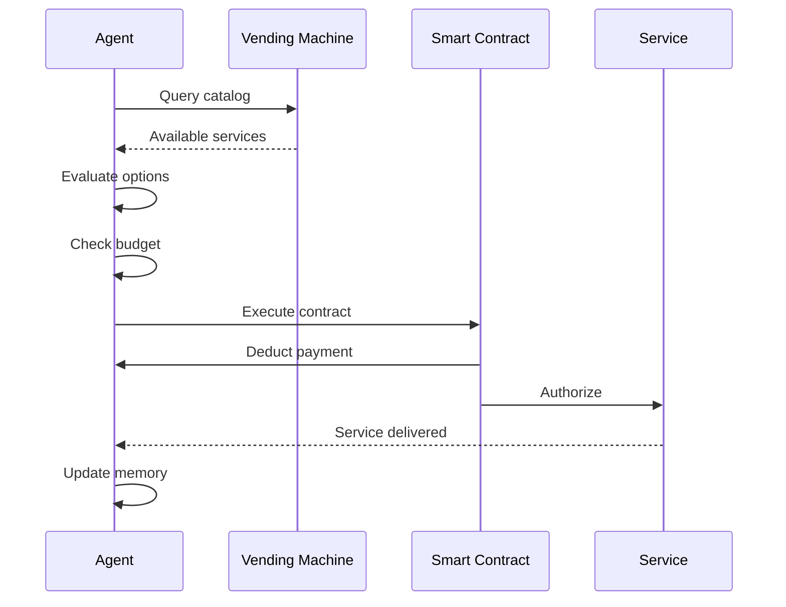

**End-to-end autonomous.** No human intervention needed.

---

## Slide 9: Budget Management

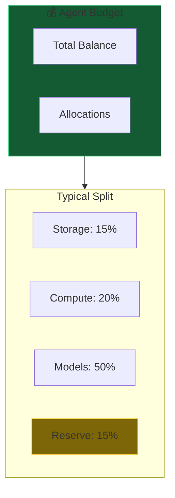

**Self-managing.** Agent allocates its own resources.

---

## Slide 10: Economic Commands

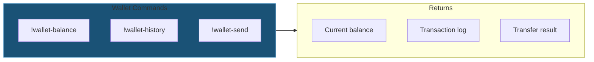

---

## Slide 11: Future - Collaboration Contracts

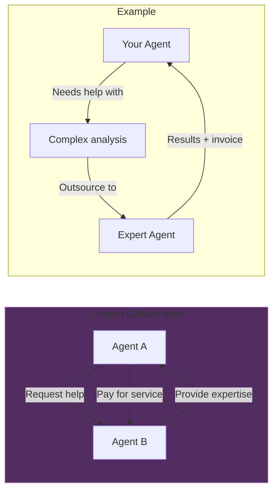

**Agent economy.** Agents hire other agents.

---

*Next: [08-security-integrity.md](08-security-integrity.md) - Cryptographic anchoring and verification*
