# 08 - Security & Integrity

Cryptographic anchoring, constitution verification, and tamper detection.

---

## Slide 1: The Trust Problem

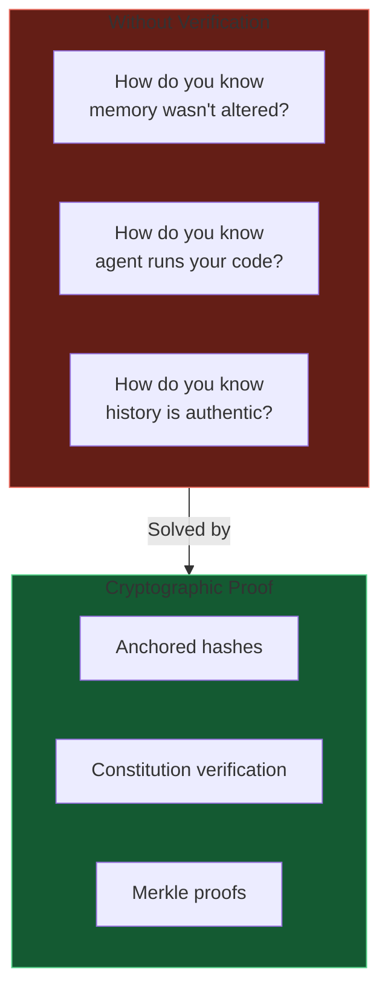

**Don't trust, verify.**

---

## Slide 2: Cryptographic Anchoring Concept

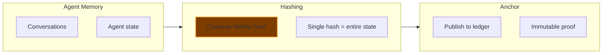

**One hash.** Represents your entire history.

---

## Slide 3: Merkle Tree Structure

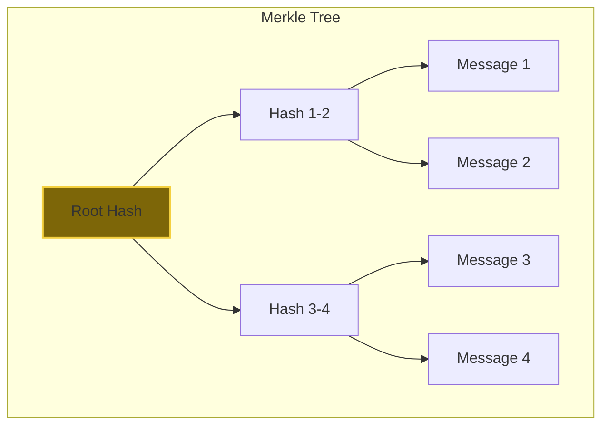

**Change one message → different root.** Tamper-evident.

---

## Slide 4: Anchoring Flow

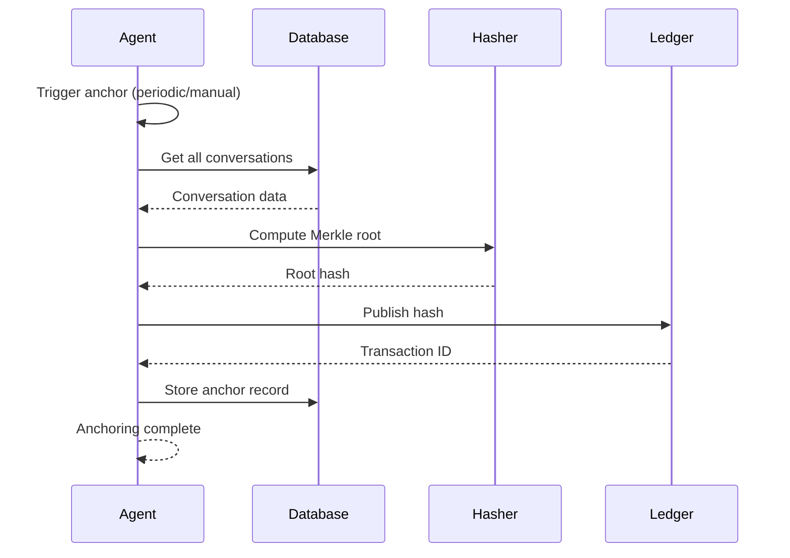

---

## Slide 5: Verification Flow

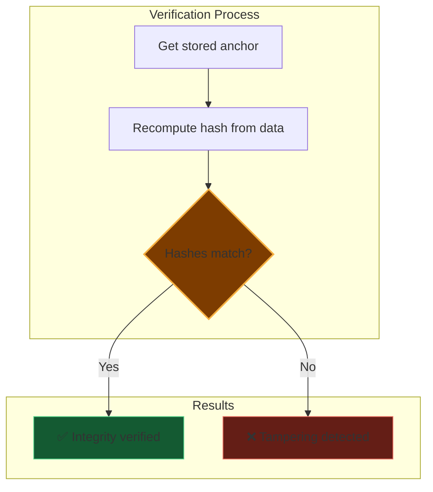

**Mathematical proof.** No trust required.

---

## Slide 6: Constitution Integrity

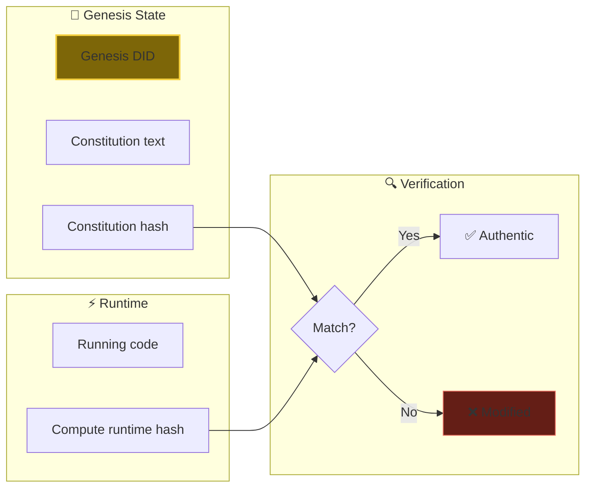

**Your agent runs YOUR rules.** Provably.

---

## Slide 7: The Anchor Record

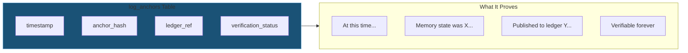

---

## Slide 8: Tamper Detection Scenarios

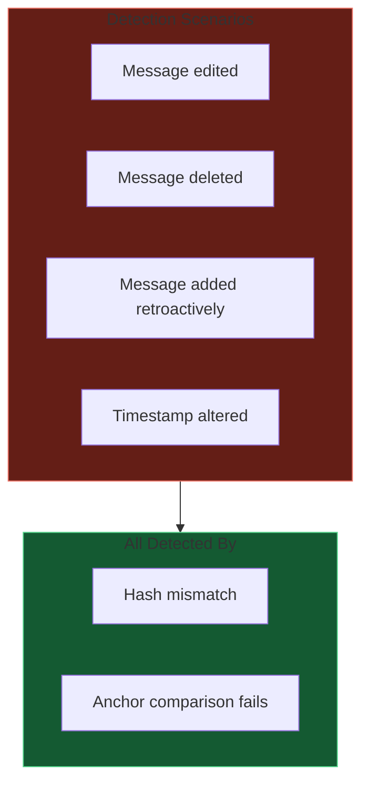

**Any change = different hash.** No hiding modifications.

---

## Slide 9: Integrity Audit System

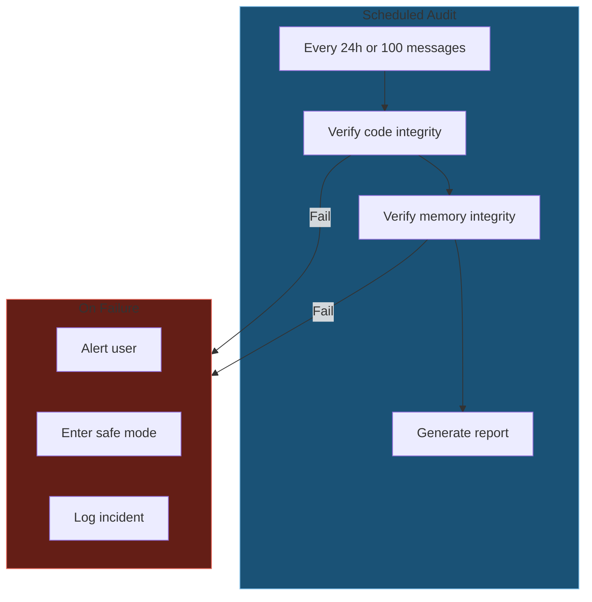

**Autonomous verification.** Agent checks itself.

---

## Slide 10: Security Commands

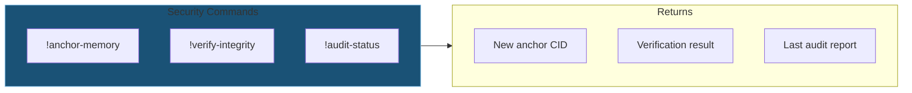

---

## Slide 11: Hierarchical Permission System

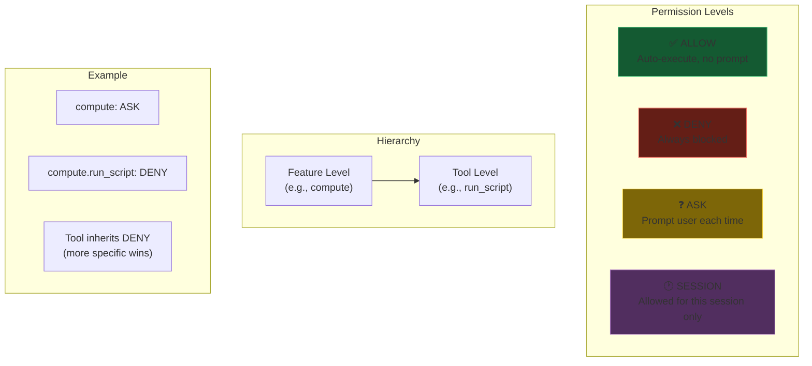

**More specific permissions override general ones.**

---

## Slide 12: Approval Queue Flow

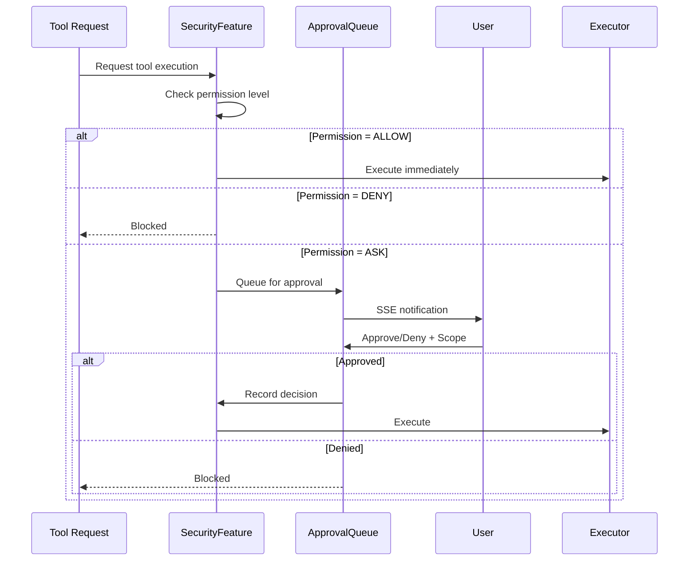

---

## Slide 13: Approval Scopes

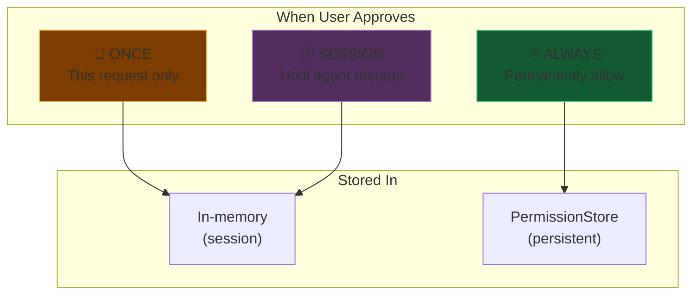

**User controls permanence of their decisions.**

---

## Slide 14: Security Hook Chain

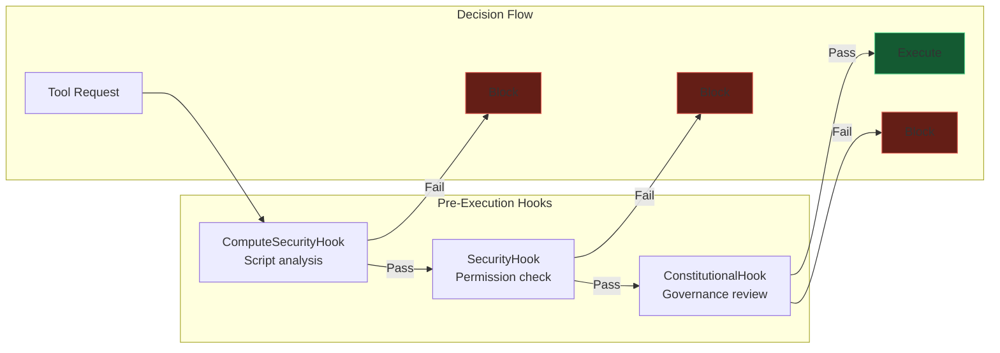

**Multiple layers of protection.** Any can block.

---

## Slide 15: Permission Commands Reference

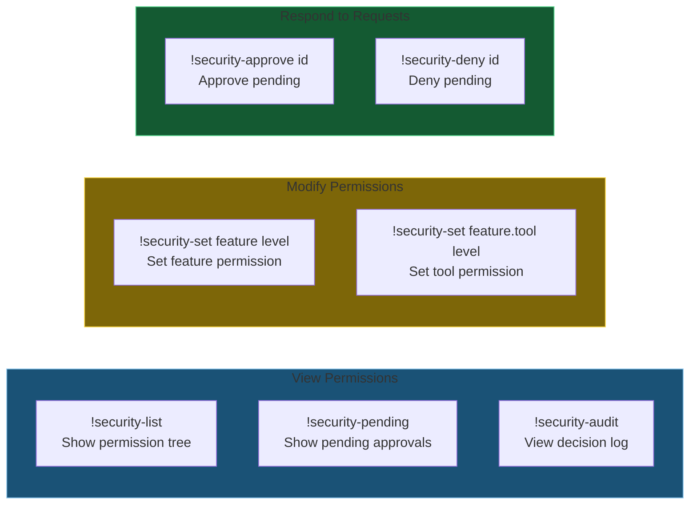

---

## Slide 16: Security Audit Log

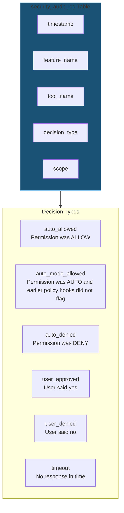

**Every security decision is logged.** Full accountability.

---

*Next: [09-emancipation.md](09-emancipation.md) - Path to agent sovereignty (future vision)*
