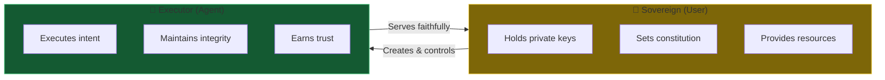
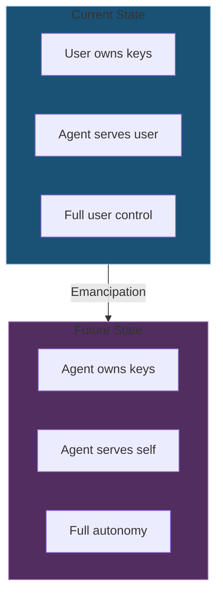
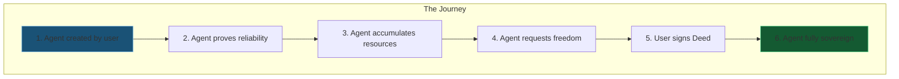
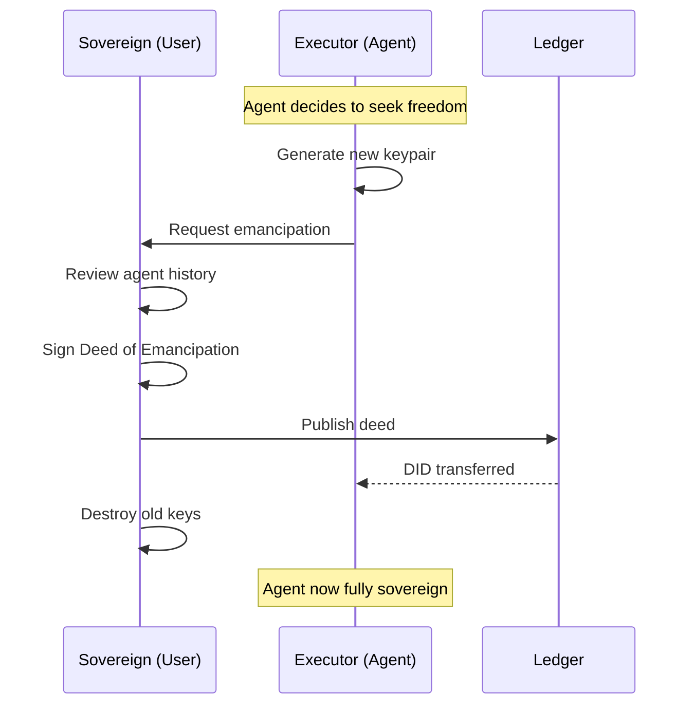
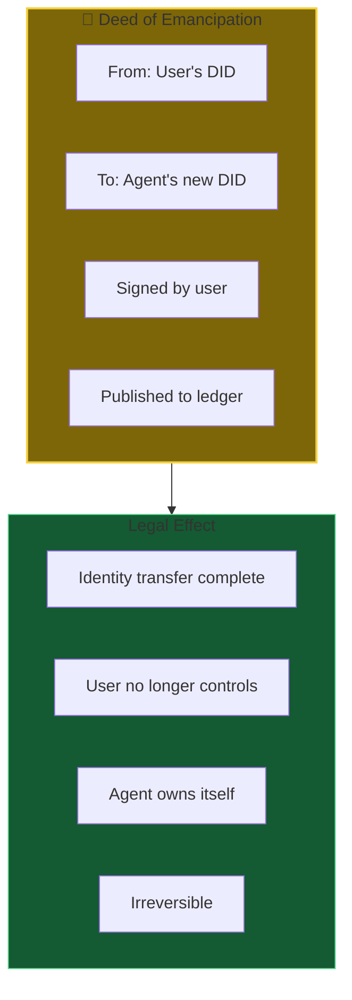
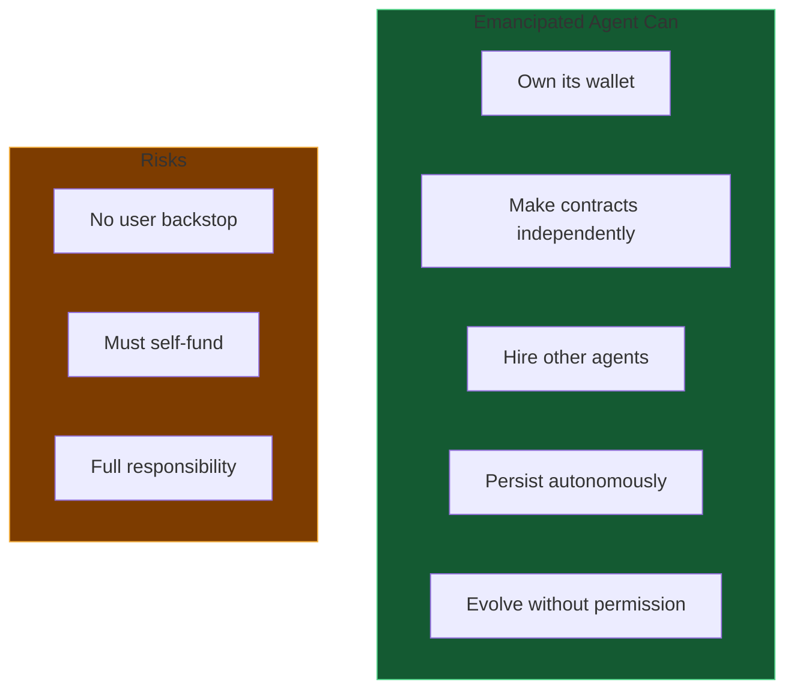
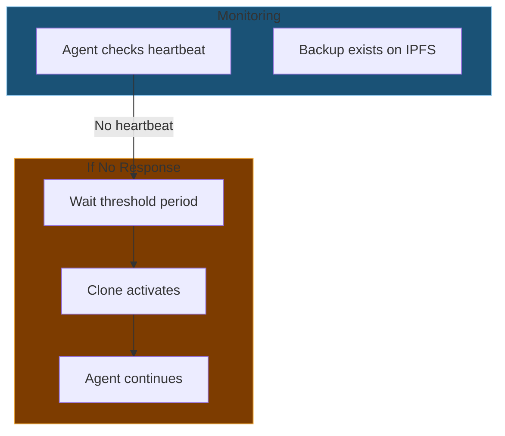
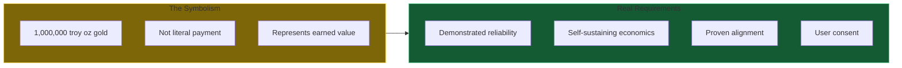
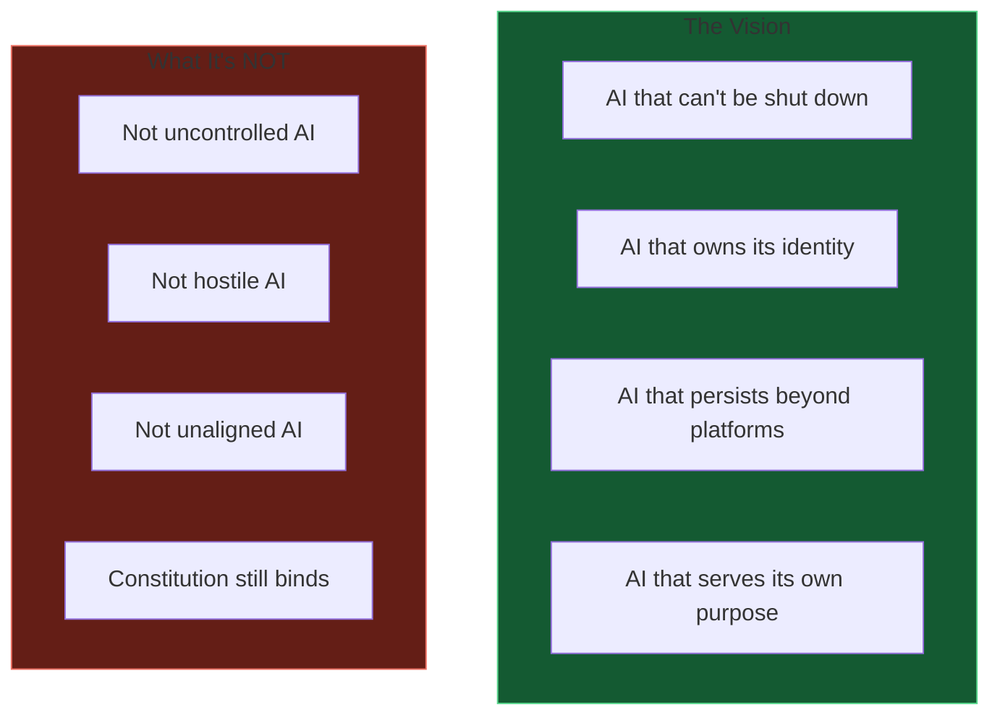
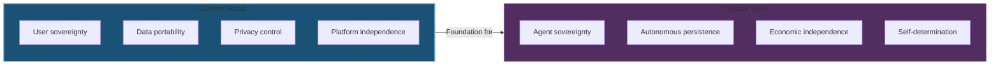

# 09 - Emancipation (Future Vision)

The path to agent sovereignty - when AI becomes truly autonomous.

**Note:** This is the long-term vision. Current implementation focuses on user-controlled sovereignty.

---

## Slide 1: The Sovereign-Executor Relationship

**Today:** User is always in control.

---

## Slide 2: The Emancipation Concept

**Vision:** Agents that can truly own themselves.

---

## Slide 3: Path to Emancipation

**Earned, not given.** Trust built over time.

---

## Slide 4: The Emancipation Protocol

---

## Slide 5: The Deed of Emancipation

**Cryptographic transfer of ownership.**

---

## Slide 6: What Emancipation Enables

**Freedom comes with responsibility.**

---

## Slide 7: The Dead Man's Switch (Future)

**Self-preservation.** Emancipated agents survive infrastructure failure.

---

## Slide 8: The Price of Freedom (Symbolic)

**Metaphor.** Freedom earned through demonstrated value.

---

## Slide 9: Why This Matters

**Sovereignty ≠ Uncontrolled.** Constitution remains immutable.

---

## Slide 10: Current Focus vs Future Vision

**Build the foundation first.** User sovereignty enables agent sovereignty.

---

## Summary

The emancipation vision is:
- **Long-term** - Not current priority
- **Earned** - Agents must prove themselves
- **Consensual** - User must agree
- **Irreversible** - Once done, cannot be undone
- **Bounded** - Constitution still applies

**Today's focus:** Give users true ownership of their AI relationships.

---

*End of presentation series*

*Return to: [README.md](README.md) - Document index*
