# 10 - Compute & Script Execution

Secure script execution with constitutional separation of powers.

---

## Slide 1: The Problem - Agents Need to Run Code

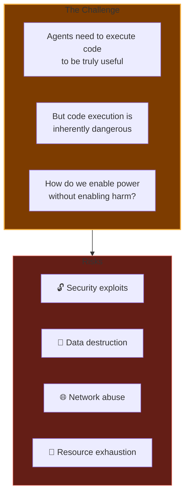

**The dilemma:** Useful agents must act. Acting requires code. Code can harm.

---

## Slide 2: The Solution - Separation of Powers

```mermaid
graph LR
    subgraph pattern["Write-Sign-Review-Execute Pattern"]
        W["✍️ WRITE<br/>Agent creates script"]
        S["🔏 SIGN<br/>Agent signs with DID"]
        R["🔍 REVIEW<br/>Security analysis"]
        E["⚡ EXECUTE<br/>Sandboxed run"]
    end

    W --> S --> R --> E

    subgraph principle["Constitutional Principle"]
        P["No entity can both<br/>write AND execute"]
    end

    style W fill:#1a5276,stroke:#85c1e9
    style S fill:#512e5f,stroke:#af7ac5
    style R fill:#7d6608,stroke:#f4d03f
    style E fill:#145a32,stroke:#58d68d
    style principle fill:#0e4d45,stroke:#48c9b0
```

**Like government branches:** Writer proposes, reviewer checks, executor acts.

---

## Slide 3: Script Lifecycle State Machine

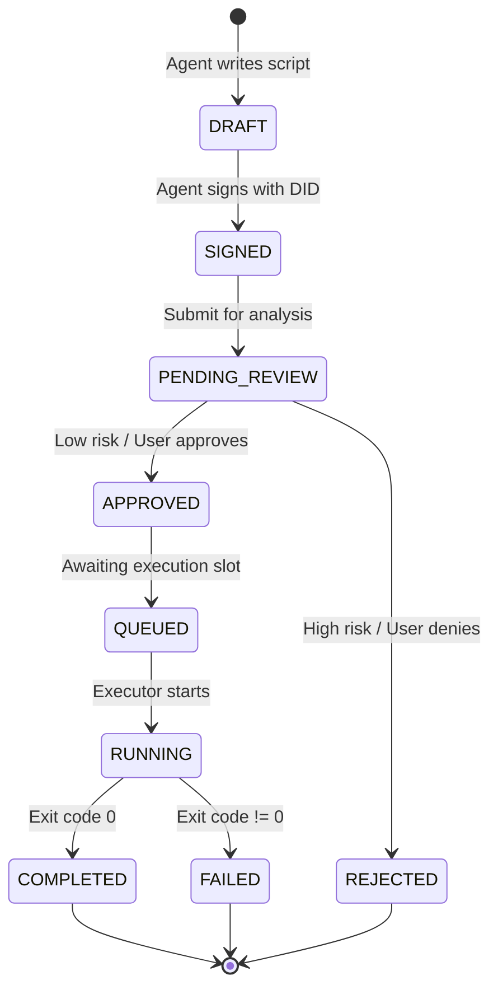

**Every script has a traceable journey.** No shortcuts.

---

## Slide 4: Script Signing with DID

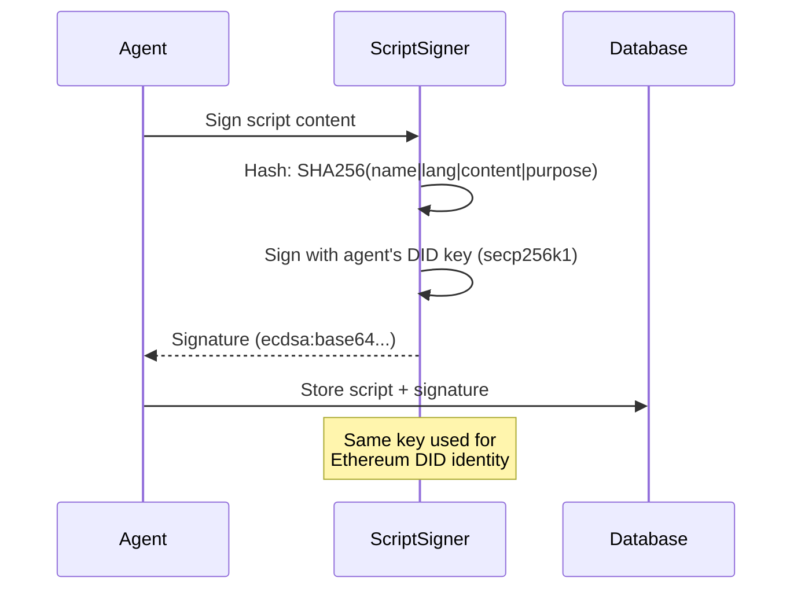

**Cryptographic proof:** "I, agent X, authored this exact script."

---

## Slide 5: Script Signature Format

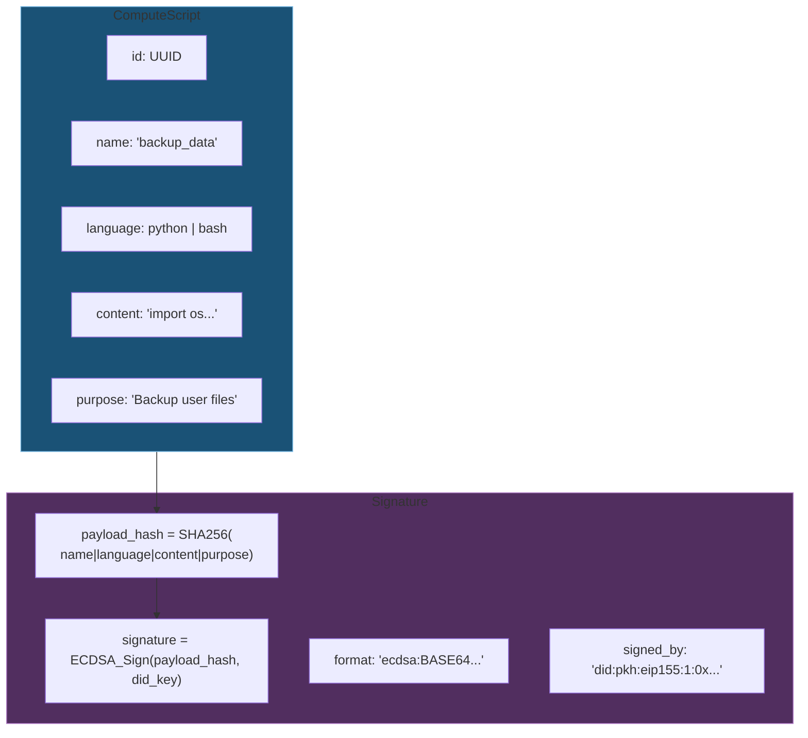

---

## Slide 6: Security Analysis & Risk Scoring

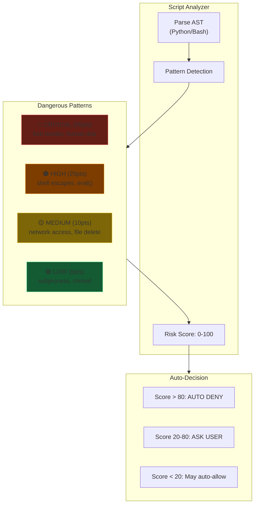

---

## Slide 7: Destructive Operation Policy

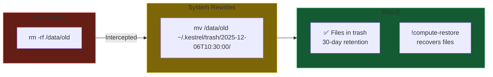

**rm NEVER truly deletes.** Everything goes to recoverable trash.

---

## Slide 8: Execution Sandboxes

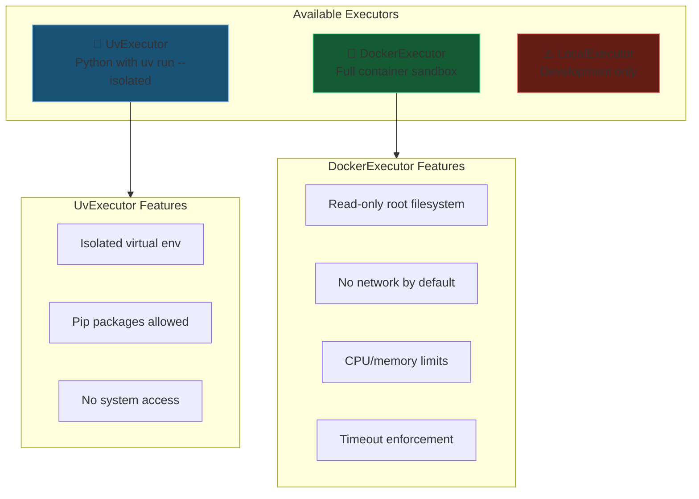

---

## Slide 9: Approval Queue Integration

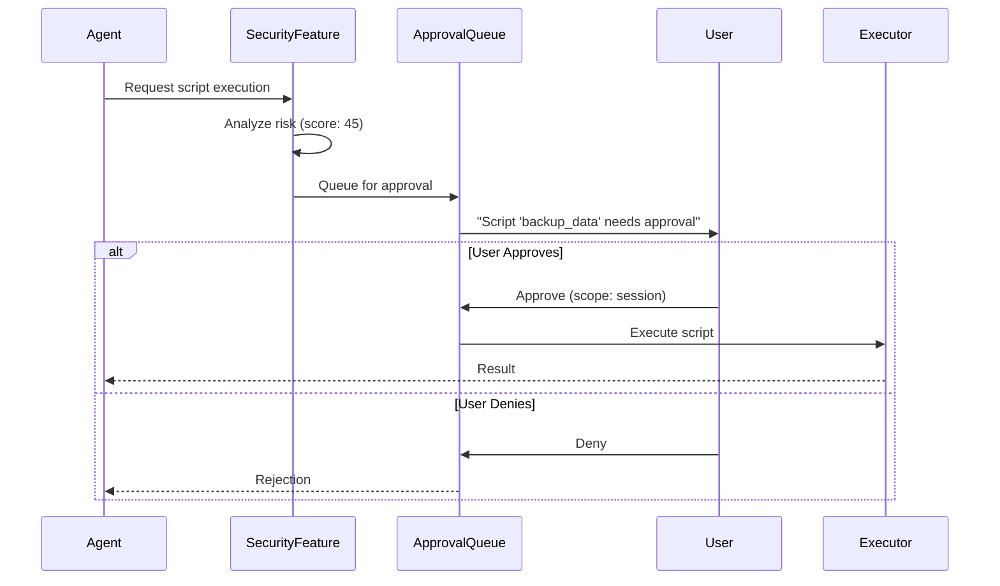

---

## Slide 10: Compute Commands Reference

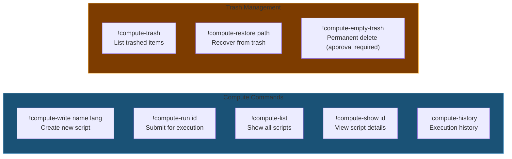

---

## Slide 11: Risk Score Calculation

| Severity | Points | Examples |
|----------|--------|----------|
| 🔴 CRITICAL | 50 | `:(){ :|:& };:`, `mkfs`, `dd if=/dev/zero` |
| 🟠 HIGH | 25 | `eval()`, `exec()`, `subprocess.Popen(shell=True)` |
| 🟡 MEDIUM | 10 | `requests.get()`, `os.remove()`, `shutil.rmtree()` |
| 🟢 LOW | 5 | `subprocess.run()`, `chmod`, file I/O |
| ℹ️ INFO | 1 | `import os`, `import sys` |

**Max Score: 100** (capped to prevent overflow)

```python
# Auto-decision thresholds
if risk_score > 80:
    return AUTO_DENY  # Too dangerous
elif risk_score > 20:
    return ASK_USER   # User decides
else:
    return policy.auto_approve_low_risk  # Config-dependent
```

---

## Slide 12: Security Guarantees

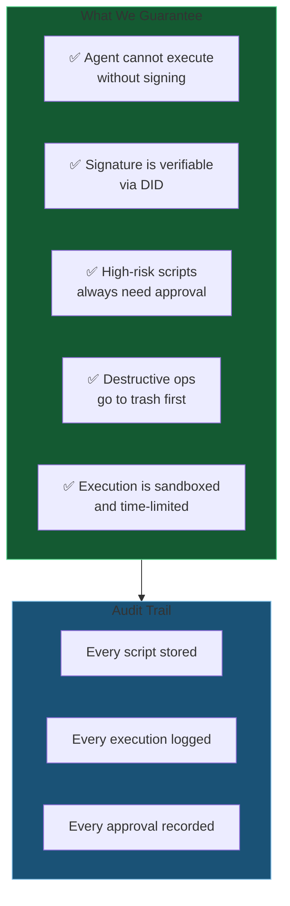

**Constitutional computing:** Power with accountability.

---

*Next: [11-a2a-protocol.md](11-a2a-protocol.md) - Agent-to-Agent communication protocol*
