# 11 - A2A Protocol - Agent-to-Agent Communication

Google's Agent-to-Agent protocol implementation in Kestrel.

---

## Slide 1: The Problem - Agents Need to Talk

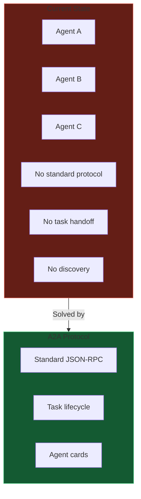

**Interoperability.** Agents from different vendors can collaborate.

---

## Slide 2: A2A Protocol Overview

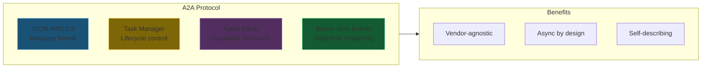

---

## Slide 3: The 6 Core Datastores

```mermaid
graph TD
    subgraph stores["A2A Datastores"]
        TASK["📋 TaskStore<br/>Task lifecycle & state"]
        SESSION["🔑 SessionService<br/>User sessions"]
        MEMORY["🧠 MemoryService<br/>Conversation history"]
        OBS["📊 ObservabilityStore<br/>Metrics & tracing"]
        ORCH["🎯 OrchestrationStore<br/>Multi-agent coordination"]
        FEED["💬 FeedbackStore<br/>User feedback & ratings"]
    end

    subgraph backends["Backend-Agnostic"]
        SQL["SQLite<br/>(Kestrel standalone)"]
        PG["PostgreSQL<br/>(Kestrel multi-tenant)"]
    end

    stores --> backends

    style TASK fill:#1a5276,stroke:#85c1e9
    style SESSION fill:#7d6608,stroke:#f4d03f
    style MEMORY fill:#512e5f,stroke:#af7ac5
    style OBS fill:#0e4d45,stroke:#48c9b0
    style ORCH fill:#7d3c00,stroke:#f5b041
    style FEED fill:#145a32,stroke:#58d68d
```

---

## Slide 4: Task Lifecycle State Machine

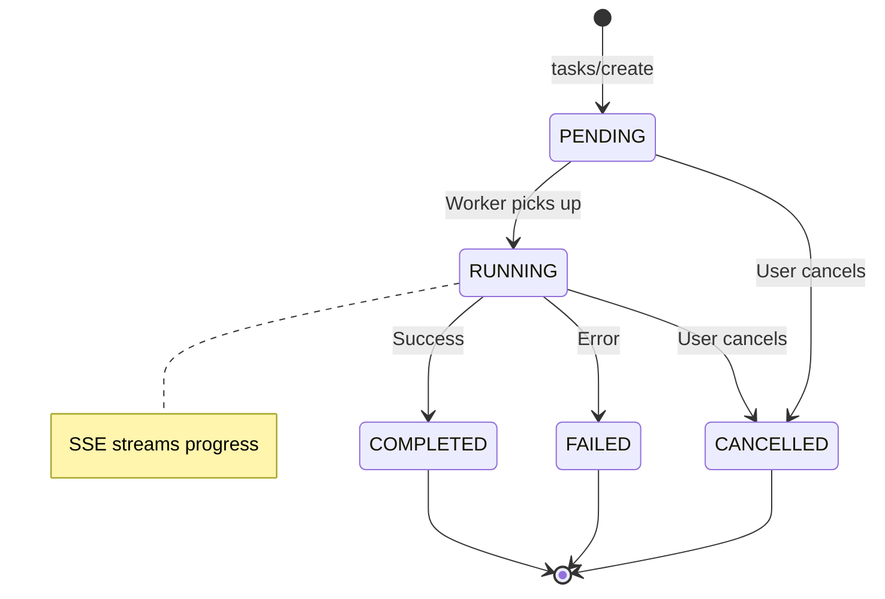

**Every task is tracked.** No lost work.

---

## Slide 5: Task Manager Flow

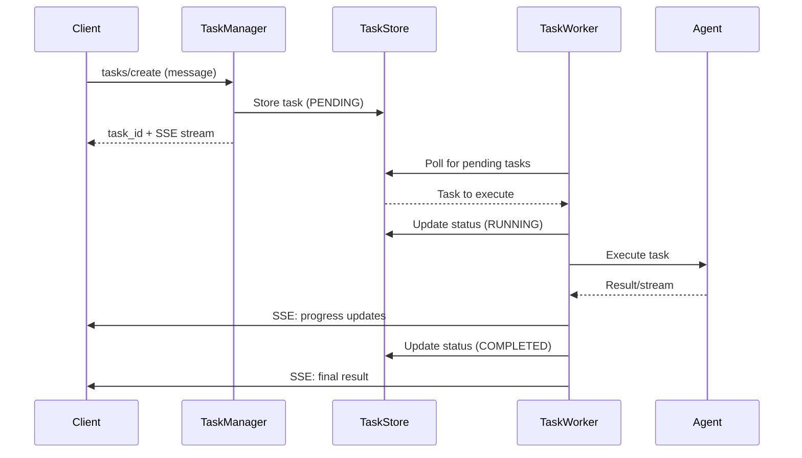

---

## Slide 6: Agent Card - Capability Discovery

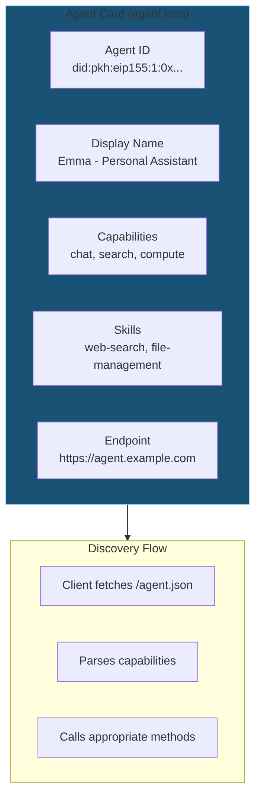

**Self-describing agents.** No manual configuration.

---

## Slide 7: Unified Store Architecture

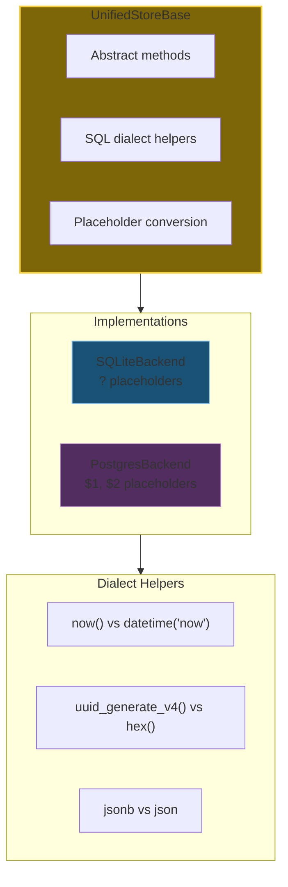

**Write once, run on SQLite or PostgreSQL.**

---

## Slide 8: SSE Streaming

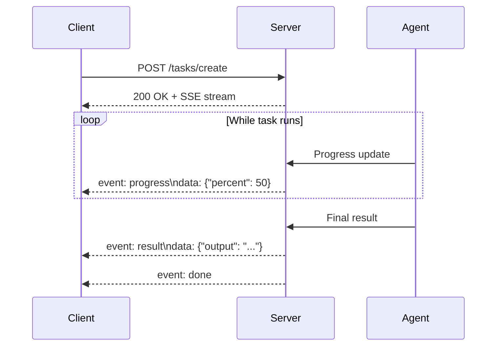

**Real-time updates.** No polling required.

---

## Slide 9: JSON-RPC Message Types

| Method | Direction | Purpose |
|--------|-----------|---------|
| `tasks/create` | Client → Agent | Start a new task |
| `tasks/get` | Client → Agent | Query task status |
| `tasks/cancel` | Client → Agent | Stop a running task |
| `tasks/list` | Client → Agent | List all tasks |
| `agent/info` | Client → Agent | Get agent card |
| `agent/capabilities` | Client → Agent | List capabilities |

```json
{
  "jsonrpc": "2.0",
  "method": "tasks/create",
  "params": {
    "message": "Search for recent AI news"
  },
  "id": "req-123"
}
```

---

## Slide 10: Multi-Agent Orchestration

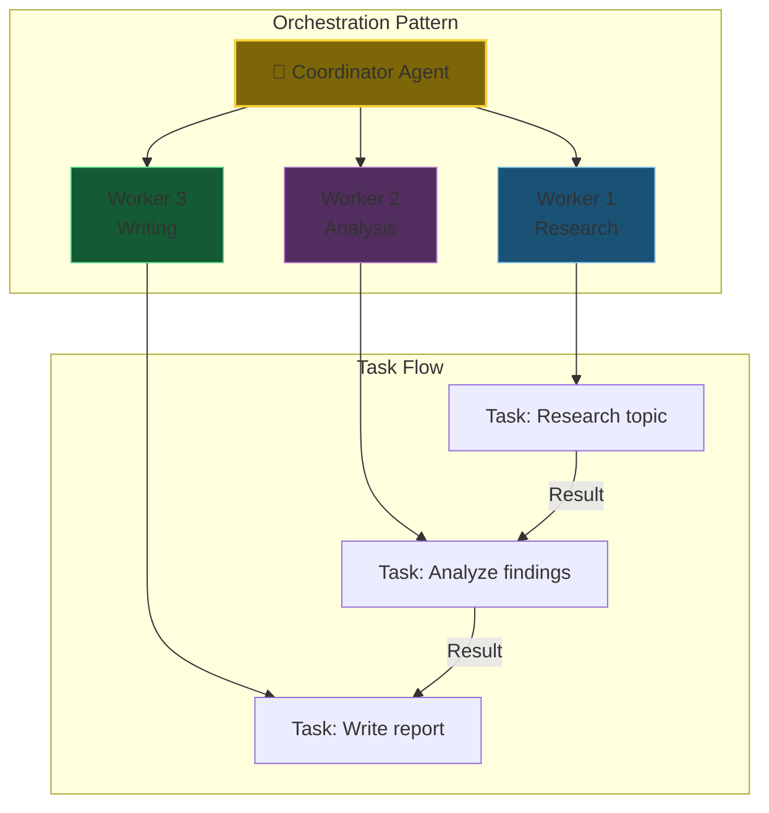

**Divide and conquer.** Complex tasks split across specialists.

---

## Slide 11: A2A Commands Reference

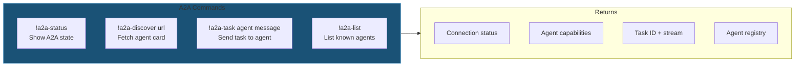

---

## Slide 12: A2A Security Model

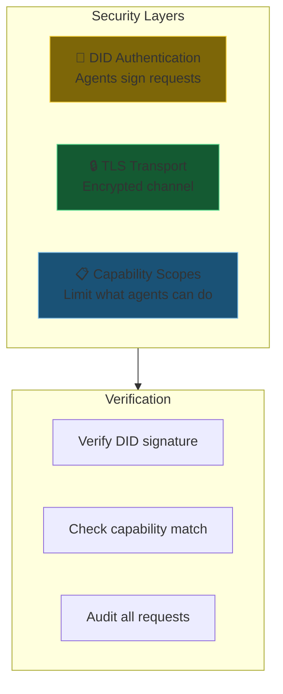

**Trust but verify.** Every request authenticated and logged.

---

## Slide 13: Features as A2A Subagents

```mermaid
graph TD
    subgraph orchestrator["KestrelAgent (Orchestrator)"]
        MAIN["Main agent loop"]
        DISPATCH["Feature dispatcher"]
    end

    subgraph features["Features as Subagents"]
        MODEL["🧠 ModelAgent<br/>5 tools"]
        SEC["🛡️ SecurityFeature<br/>6 tools"]
        SOV["📦 SovereigntyFeature<br/>3 tools"]
        GH["🐙 GitHubFeature<br/>9 tools"]
    end

    subgraph protocol["A2A Protocol (In-Process)"]
        CARD["AgentCard<br/>Capability discovery"]
        TASK["TaskHandler<br/>Unified routing"]
        CTX["Own LLM context<br/>Own system prompt"]
    end

    MAIN --> DISPATCH --> features
    features --> protocol

    style orchestrator fill:#7d6608,stroke:#f4d03f,stroke-width:2px
    style MODEL fill:#1a5276,stroke:#85c1e9
    style SEC fill:#512e5f,stroke:#af7ac5
    style SOV fill:#145a32,stroke:#58d68d
    style GH fill:#0e4d45,stroke:#48c9b0
```

**A2A without overhead.** Features implement protocols but run in-process.

---

## Slide 14: Two-Tier Agent Hierarchy

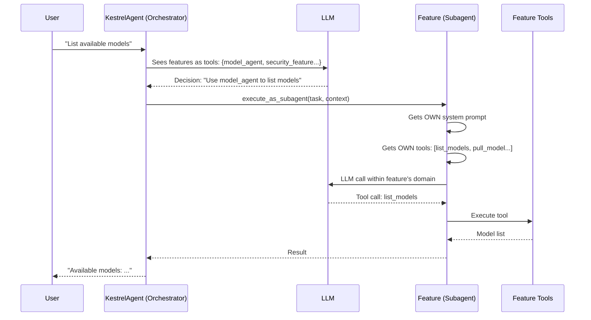

---

## Slide 15: Feature → A2A Integration

```mermaid
graph LR
    subgraph feature["Feature Class"]
        ABC["Feature (ABC)"]
    end

    subgraph methods["A2A Methods"]
        CARD["get_agent_card()<br/>Capability advertisement"]
        HANDLE["handle_task()<br/>Route to @tool method"]
        TOOL["to_orchestrator_tool()<br/>Expose as tool"]
        EXEC["execute_as_subagent()<br/>Own LLM context"]
    end

    subgraph result["Result"]
        BOUNDARY["Clear domain boundaries"]
        INDEP["Independent reasoning"]
        UNIFIED["Unified routing"]
    end

    ABC --> methods --> result

    style ABC fill:#7d6608,stroke:#f4d03f,stroke-width:2px
    style CARD fill:#1a5276,stroke:#85c1e9
    style HANDLE fill:#512e5f,stroke:#af7ac5
    style TOOL fill:#145a32,stroke:#58d68d
    style EXEC fill:#0e4d45,stroke:#48c9b0
```

---

## Slide 16: All Features as A2A Subagents

| Feature | A2A | Tools | Domain |
|---------|-----|-------|--------|
| 🧠 ModelAgent | ✅ | 5 | LLM model management |
| 📦 SovereigntyFeature | ✅ | 3 | IPFS/Filecoin backup |
| 🛡️ SecurityFeature | ✅ | 6 | Permissions, approval queue |
| 🔍 WebSearchFeature | ✅ | 1 | Tavily web search |
| 🔌 MCPFeature | ✅ | 4 | Model Context Protocol |
| 📝 FeedbackFeature | ✅ | 3 | Diagnostics & logging |
| 🐙 GitHubFeature | ✅ | 9 | GitHub repository access |
| 🖥️ ComputeFeature | ✅ | - | Script execution |
| 🎨 VisualIdentityFeature | ✅ | - | Agent appearance |
| 📜 ConstitutionFeature | ✅ | 1 | Constitutional access |

**Exception:** `PrivacyAgent` is NOT a Feature - it's a global policy enforcer.

---

## Slide 17: In-Process A2A Benefits

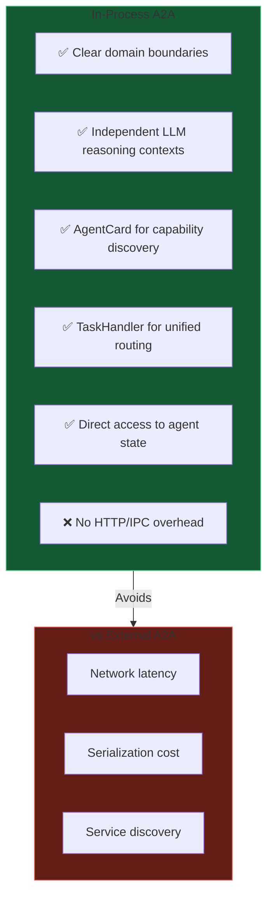

**Best of both worlds.** A2A contracts without network overhead.

---

*Next: [12-feedback-reflection.md](12-feedback-reflection.md) - Feedback collection and agent self-reflection*
