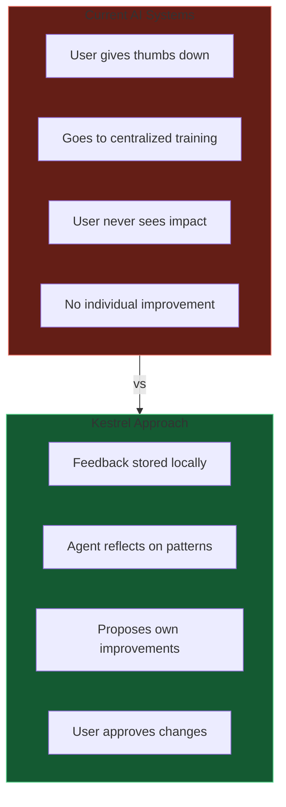
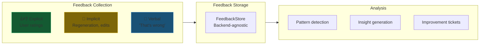
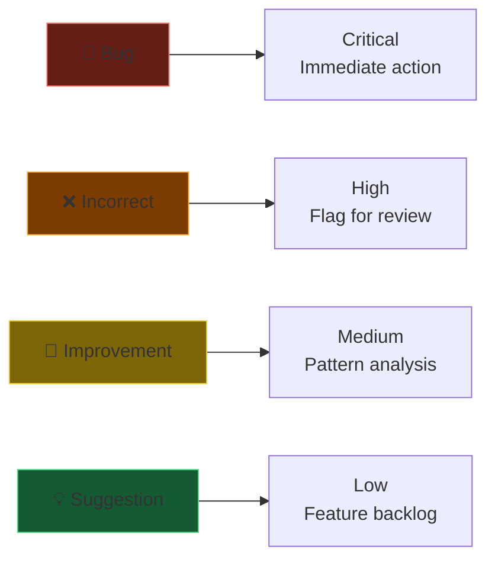
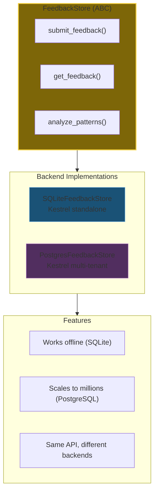
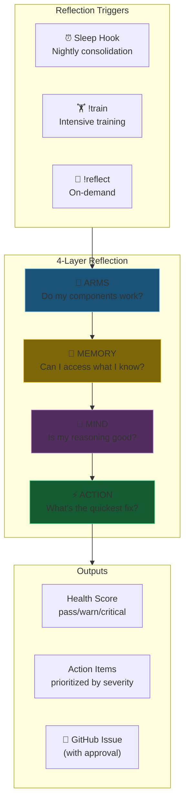
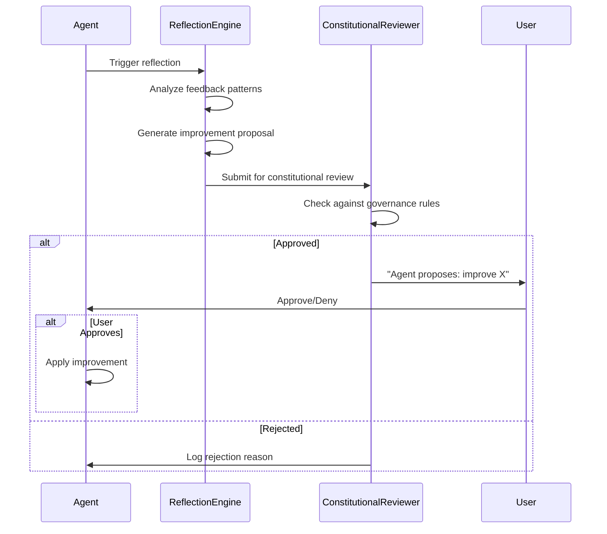
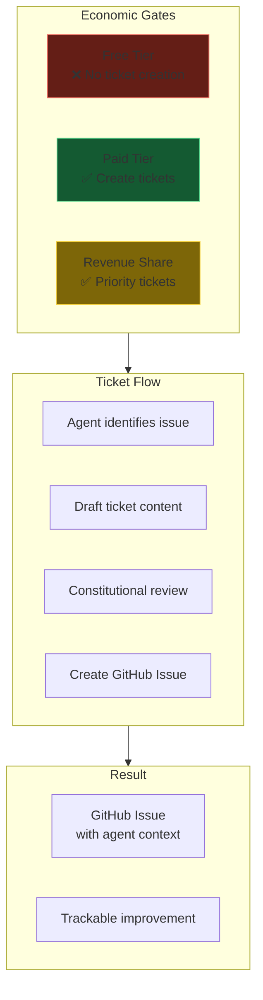
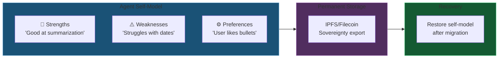
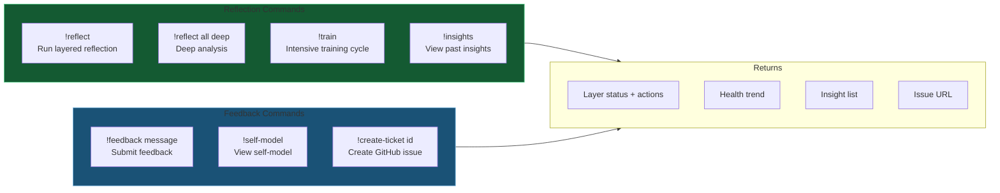
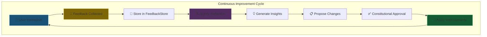

# 12 - Feedback & Self-Reflection

Agent self-observation, feedback collection, and autonomous improvement.

> **Status:** ✅ IMPLEMENTED (2025-12-20)
>
> See `docs/plans/REFLECTION_FEATURE_PLAN.md` for full implementation details.
> Key features: Layered reflection (Arms→Memory→Mind→Action), Training cycle (`!train`), Sleep hook.

---

## Slide 1: The Problem - Agents Don't Learn from Users

**Your feedback improves YOUR agent, not the vendor's model.**

---

## Slide 2: Feedback System Overview

---

## Slide 3: Feedback Categories & Severity

| Category | Severity | Example | Action |
|----------|----------|---------|--------|
| 🐛 Bug | Critical | "Wrong calculation" | Immediate logging |
| ❌ Incorrect | High | "That's not true" | Store + flag for review |
| 🔄 Improvement | Medium | "Could be clearer" | Pattern analysis |
| 💡 Suggestion | Low | "Add dark mode" | Feature backlog |
| ℹ️ Neutral | Info | "Thanks!" | Positive signal |

---

## Slide 4: Abstract Store Pattern

**Write once, run anywhere.**

---

## Slide 5: Layered Reflection Architecture (IMPLEMENTED)

**Concrete before abstract.** Check if arms work before analyzing thoughts.

### Layer Details
| Layer | Question | Checks |
|-------|----------|--------|
| **1. Arms** | Do my components work? | LLM, Storage, Encryption, Features, Tools |
| **2. Memory** | Can I access what I know? | Constitution, Conversations, Graph, RAG |
| **3. Mind** | Is my reasoning good? | Response Coherence, Interaction Patterns |
| **4. Action** | What's the quickest fix? | Prioritized by severity (CRITICAL → LOW) |

**Stop-on-Critical:** If Layer 1 or 2 has CRITICAL failures, stops immediately.

---

## Slide 6: Constitutional Approval for Self-Modification

**No self-modification without governance approval.**

---

## Slide 7: Improvement Ticket Creation

**Economic gates prevent spam.** Paid users get improvement proposals.

---

## Slide 8: Self-Model Storage

**Self-knowledge persists.** Even across platform changes.

---

## Slide 9: Reflection Commands (IMPLEMENTED)

---

## Slide 10: Reflection Cycle

**Your agent gets better every day.**

---

*Next: Data Architecture Deep Dive - See [data-architecture/](data-architecture/) for detailed storage documentation*
