# Kestrel Architecture Diagrams

A visual reference library for the Kestrel Sovereign AI Agent framework. Each section is designed to fit on a presentation slide.

**Last Updated:** November 26, 2025

---

## Table of Contents

1. [Executive Overview](#part-1-executive-overview)
2. [Agent Architecture](#part-2-agent-architecture)
3. [Storage Deep Dive](#part-3-storage-deep-dive)
4. [LLM & GPU Management](#part-4-llm--gpu-management)
5. [Privacy System](#part-5-privacy-system)
6. [Economic System](#part-6-economic-system)
7. [Security & Integrity](#part-7-security--integrity)
8. [Kestrel Integration](#part-8-kestrel-integration)

---

## Part 1: Executive Overview

### Slide 1: Kestrel Vision - Two Pillars

The project is built on two interconnected concepts:

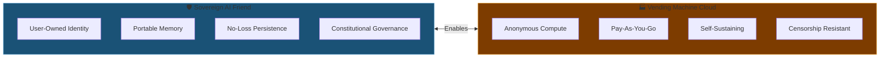

**Key Insight:** The Sovereign AI Friend needs persistent compute. The Vending Machine provides it.

---

### Slide 2: System Context (C4 Level)

High-level view of Kestrel and its external dependencies:

```mermaid
graph TB
    subgraph users["👤 Users"]
        U1[Sovereign Owner]
        U2[Kestrel App User]
    end
    
    subgraph kestrel["🦅 Kestrel Agent"]
        KA[KestrelAgent<br/>Orchestrator]
    end
    
    subgraph external["External Services"]
        LLM[LLM Providers]
        IPFS[IPFS/Filecoin]
        GPU[RunPod GPU]
    end
    
    subgraph storage["💾 Storage"]
        SQL[SQLite Local]
        PG[PostgreSQL Cloud]
    end
    
    U1 -->|Commands| KA
    U2 -->|Via Kestrel| KA
    KA -->|Inference| LLM
    KA -->|Backup| IPFS
    KA -->|Compute| GPU
    KA -->|Read/Write| SQL
    KA -.->|Kestrel Mode| PG
    
    style KA fill:#1a5276,stroke:#85c1e9,stroke-width:3px
    style kestrel fill:#1a3c5c,stroke:#5dade2
```

---

### Slide 3: The Sovereign-Executor Constitution

The governance model between User and Agent:

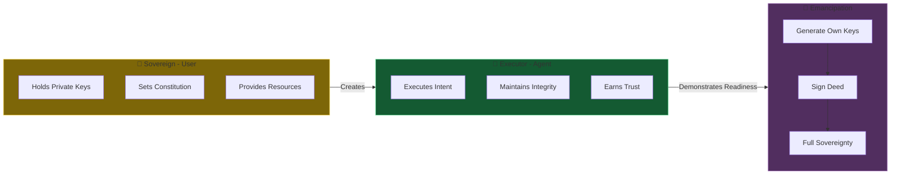

---

## Part 2: Agent Architecture

### Slide 4: Society of Agents

The KestrelAgent orchestrates specialized Feature Agents:

```mermaid
graph TD
    subgraph orchestrator["🦅 Kestrel Orchestrator"]
        KA[KestrelAgent]
    end
    
    subgraph features["Feature Agents"]
        WA[💰 WalletAgent]
        PA[🔒 PrivacyAgent]
        SA[📦 SovereigntyFeature]
        MA[🧠 ModelAgent]
        MCP[🔌 MCPAgent]
        CF[🎨 CreativeFeature]
    end
    
    KA --> WA
    KA --> PA
    KA --> SA
    KA --> MA
    KA --> MCP
    KA --> CF
    
    style KA fill:#1a5276,stroke:#85c1e9,stroke-width:3px
    style orchestrator fill:#1a3c5c,stroke:#5dade2
```

**Principle:** Each feature does one thing well. The orchestrator delegates.

---

### Slide 5: Feature Discovery & Registration

How features expose tools to the agent:

```mermaid
graph LR
    FD[features/] --> PY[*.py files]
    PY --> TD[@tool decorator]
    TD --> SC[ToolSchema]
    SC --> TR[ToolRegistry]
    TR --> CMD[!command mapping]
    CMD --> RT[route_command]
    RT --> EX[Feature.method]
    
    style TR fill:#1a5276,stroke:#85c1e9,stroke-width:2px
```

**Auto-Discovery:** New features just need `@tool` decorators.

---

### Slide 6: Chat Request Lifecycle

End-to-end flow of a user message:

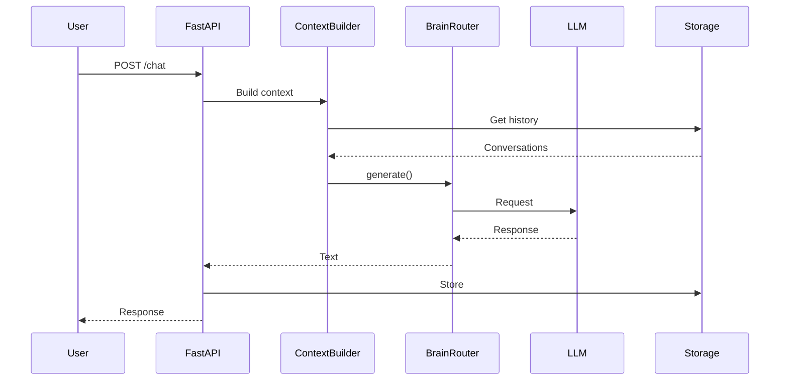

---

### Slide 7: Command Routing

How `!commands` are dispatched to features:

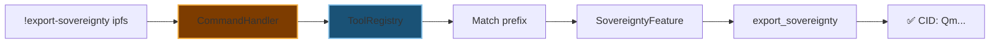

---

## Part 3: Storage Deep Dive

### Slide 8: Multi-Tier Storage Overview

Different storage for different contexts:

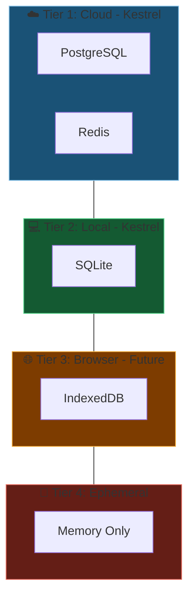

---

### Slide 9: Sovereignty V2 - The Merkle Forest

How agent state is structured for decentralized storage:

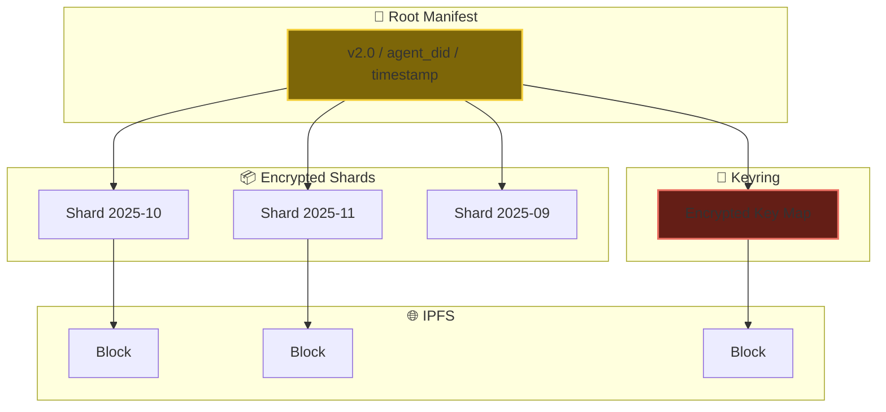

**Benefit:** Only changed months need re-uploading.

---

### Slide 10: Export Sovereignty Flow

Two-part view of the backup process:

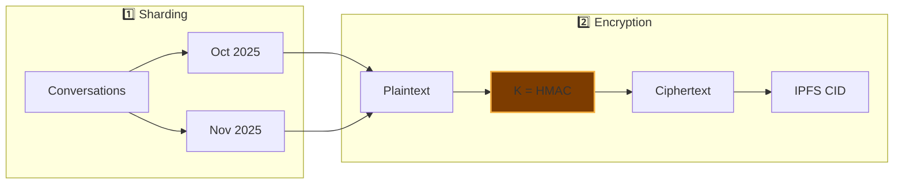

**Convergent Encryption:** Same content = same ciphertext = deduplication.

---

### Slide 11: Import/Restore Flow

Restoring sovereignty from a CID:

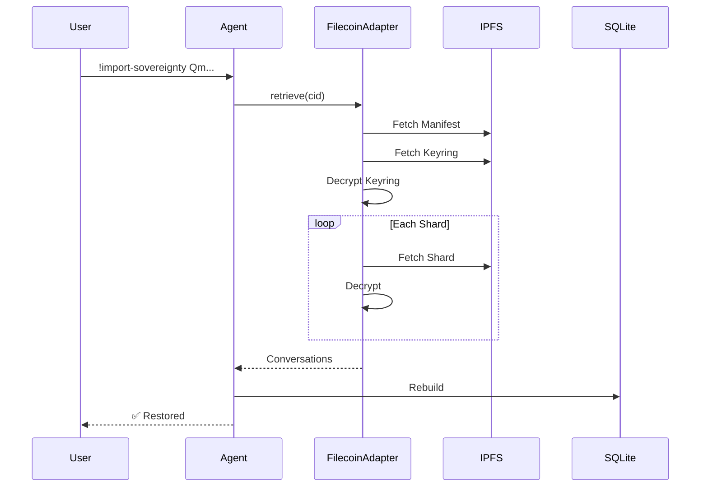

---

## Part 4: LLM & GPU Management

### Slide 12: Multi-Model Fallback Chain

Resilient LLM provider selection:

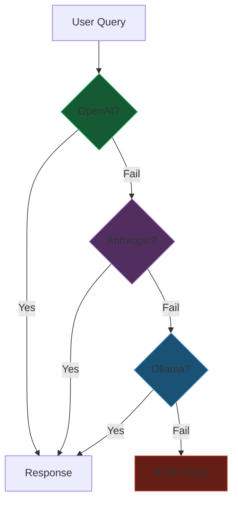

**Ollama:** Always the last resort - local reasoning guaranteed.

---

### Slide 13: BrainRouter State Machine

Dynamic backend switching for GPU compute:

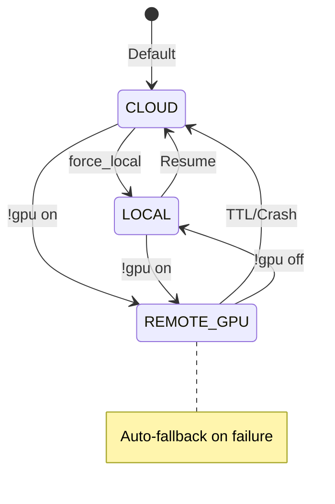

---

### Slide 14: RunPod GPU Integration

End-to-end GPU provisioning flow:

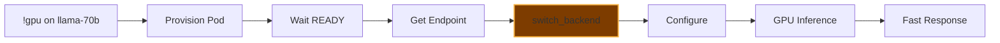

**Stateless Pods:** GPU = compute only. State remains in Kestrel.

---

## Part 5: Privacy System

### Slide 15: Privacy Modes Overview

Five tiers of data sovereignty:


---

### Slide 16: Privacy Mode Decision Tree

What happens to user data in each mode:

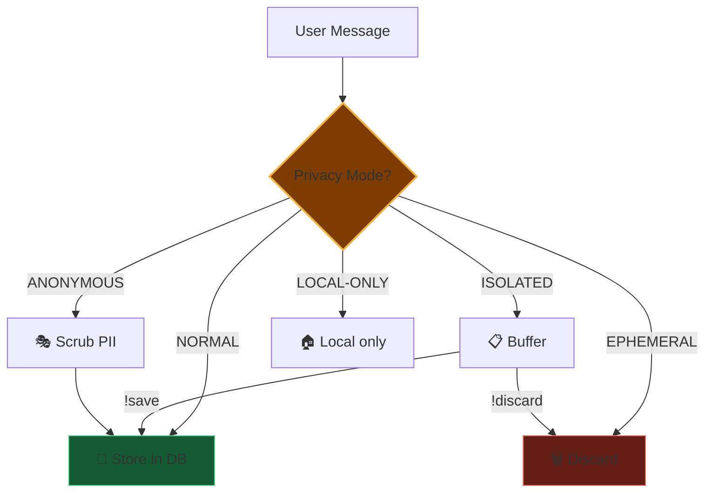

---

### Slide 17: Isolated Mode Lifecycle

Controlled session with deferred persistence:

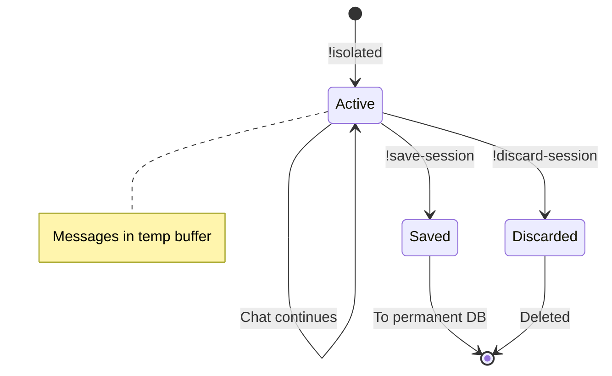

---

## Part 6: Economic System

### Slide 18: Agent as Economic Entity

The wallet system architecture:

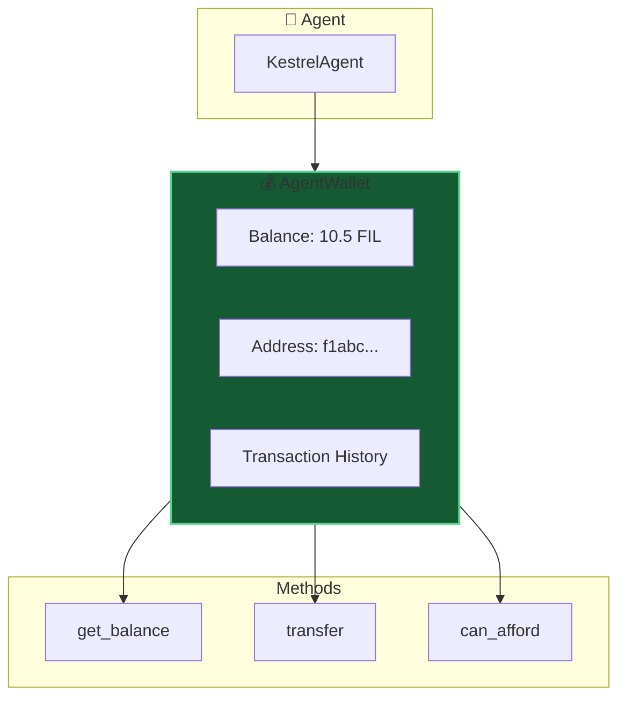

---

### Slide 19: Service Contract Types

Four primary economic interactions:

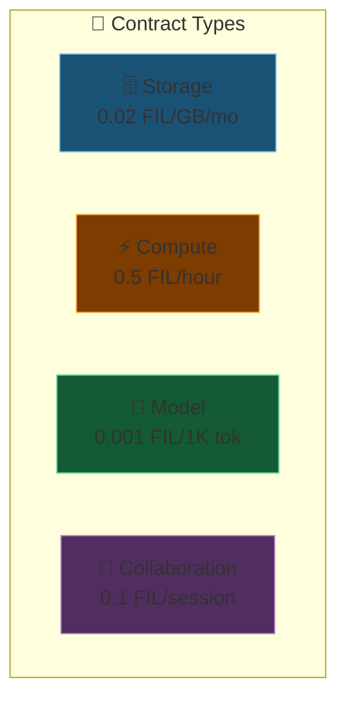

---

### Slide 20: Vending Machine Flow

Autonomous service discovery and purchase:

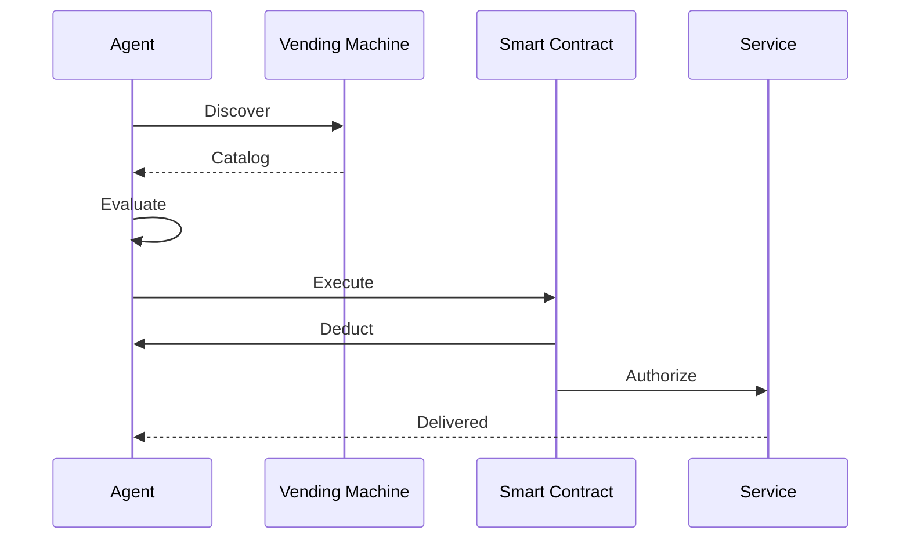

---

## Part 7: Security & Integrity

### Slide 21: Cryptographic Anchoring

Creating tamper-proof history:

```mermaid
graph LR
    CONV[Conversation Log] --> MERKLE[Merkle Root]
    MERKLE --> LEDGER[Immutable Ledger]
    MERKLE --> RECORD[log_anchors]
    
    RECORD --> CHECK[Compare]
    LEDGER --> CHECK
    CHECK --> RESULT{Match?}
    RESULT -->|Yes| PASS[✅ Verified]
    RESULT -->|No| FAIL[❌ Tampered]
    
    style MERKLE fill:#7d3c00,stroke:#f5b041,stroke-width:2px
    style LEDGER fill:#145a32,stroke:#58d68d,stroke-width:2px
    style FAIL fill:#641e16,stroke:#ec7063
```

---

### Slide 22: Constitution Integrity Verification

Ensuring the agent runs authentic code:

```mermaid
graph LR
    GDID[Genesis DID] --> CHASH[Constitution Hash]
    CODE[Running Code] --> RHASH[Runtime Hash]
    
    CHASH --> CMP{Match?}
    RHASH --> CMP
    CMP -->|Yes| PASS[✅ Verified]
    CMP -->|No| FAIL[❌ Safe Mode]
    
    style GDID fill:#7d6608,stroke:#f4d03f,stroke-width:2px
    style FAIL fill:#641e16,stroke:#ec7063
    style PASS fill:#145a32,stroke:#58d68d
```

---

## Part 8: Kestrel Integration

### Slide 23: Kestrel ↔ Kestrel Relationship

Two complementary storage systems:

```mermaid
graph TB
    subgraph kestrel["☁️ Kestrel Cloud"]
        FD[Accounts, Companions<br/>Sliders, Settings]
    end
    
    subgraph kestrel["🦅 Kestrel Agent"]
        KD[Conversations<br/>Deep Memory<br/>Sovereignty]
    end
    
    subgraph user["👤 User"]
        LOGIN[Login anywhere]
        MEMORY[Agent remembers]
    end
    
    FD --> LOGIN
    KD --> MEMORY
    kestrel <-->|Embeds| kestrel
    
    style kestrel fill:#1a5276,stroke:#85c1e9,stroke-width:2px
    style kestrel fill:#145a32,stroke:#58d68d,stroke-width:2px
```

**Survival:** Export CID, restore elsewhere if Kestrel disappears.

---

### Slide 24: Multi-Tenant Architecture

How Kestrel serves multiple users:

```mermaid
graph TD
    subgraph users["👥 Users"]
        U1[User A]
        U2[User B]
    end
    
    subgraph api["🔌 Kestrel API"]
        AUTH[JWT Auth]
        ROUTE[Tenant Router]
    end
    
    subgraph companions["🤖 Companions"]
        C1[Companion A-1]
        C2[Companion B-1]
    end
    
    subgraph data["🔒 Isolated Data"]
        DB1[User A Data]
        DB2[User B Data]
    end
    
    U1 & U2 --> AUTH --> ROUTE
    ROUTE --> C1 --> DB1
    ROUTE --> C2 --> DB2
    
    style ROUTE fill:#7d3c00,stroke:#f5b041,stroke-width:2px
```

---

### Slide 25: Cloud Deployment Topology

Google Cloud Platform infrastructure:

```mermaid
graph TB
    subgraph internet["🌐 Internet"]
        CLIENT[Clients]
        DOMAIN[YOUR_DOMAIN.com]
    end
    
    subgraph gcp["☁️ Google Cloud"]
        subgraph run["Cloud Run"]
            PROD[kestrel-prod]
            DEV[kestrel-dev]
        end
        
        subgraph data["Data Layer"]
            CSQL[(Cloud SQL)]
            MEM[(Memorystore)]
        end
        
        CONN[VPC Connector]
    end
    
    CLIENT --> DOMAIN --> run
    run --> CONN --> data
    
    style run fill:#1a5276,stroke:#85c1e9,stroke-width:2px
    style data fill:#145a32,stroke:#58d68d,stroke-width:2px
```

---

## Appendix: Diagram Index

| # | Slide | Type | Concept |
|---|-------|------|---------|
| 1 | Vision - Two Pillars | Flowchart | Core tenets |
| 2 | System Context | Flowchart | C4 overview |
| 3 | Sovereign-Executor | Flowchart | Constitution |
| 4 | Society of Agents | Flowchart | Delegation |
| 5 | Feature Discovery | Flowchart | Auto-registration |
| 6 | Chat Lifecycle | Sequence | Request flow |
| 7 | Command Routing | Flowchart | ! commands |
| 8 | Storage Tiers | Flowchart | Multi-tier |
| 9 | Merkle Forest | Flowchart | V2 structure |
| 10 | Export Flow | Flowchart | Backup |
| 11 | Import Flow | Sequence | Restore |
| 12 | Fallback Chain | Flowchart | LLM resilience |
| 13 | BrainRouter | State | GPU switching |
| 14 | RunPod | Flowchart | GPU provision |
| 15 | Privacy Modes | Flowchart | 5-mode overview |
| 16 | Privacy Decision | Flowchart | Data routing |
| 17 | Isolated Lifecycle | State | Session control |
| 18 | Agent Wallet | Flowchart | Economics |
| 19 | Contract Types | Flowchart | 4 quadrants |
| 20 | Vending Machine | Sequence | Service flow |
| 21 | Anchoring | Flowchart | Integrity |
| 22 | Constitution Check | Flowchart | Verification |
| 23 | Kestrel ↔ Kestrel | Flowchart | Integration |
| 24 | Multi-Tenant | Flowchart | Isolation |
| 25 | Cloud Topology | Flowchart | GCP infra |

---

## Usage Notes

### Embedding in Other Docs
```markdown
See [Architecture Diagrams](ARCHITECTURE_DIAGRAMS.md#slide-9-sovereignty-v2---the-merkle-forest)
```

### Color Palette Used
All colors are dark/saturated for readability with light text:

| Color | Hex | Use |
|-------|-----|-----|
| Deep Blue | `#1a5276` | Primary/Kestrel |
| Dark Green | `#145a32` | Success/Storage |
| Dark Orange | `#7d3c00` | Warning/Action |
| Dark Gold | `#7d6608` | Important/Sovereign |
| Dark Purple | `#512e5f` | Secondary |
| Dark Red | `#641e16` | Error/Ephemeral |

---

*Generated: November 26, 2025*
