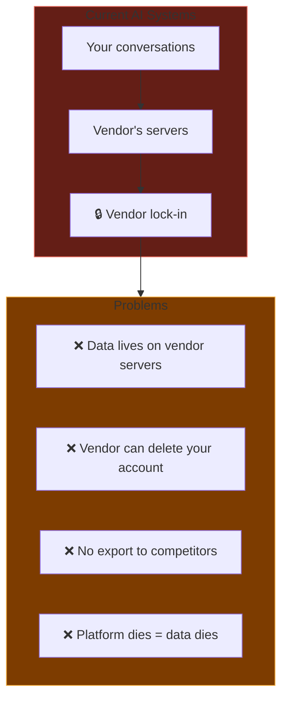
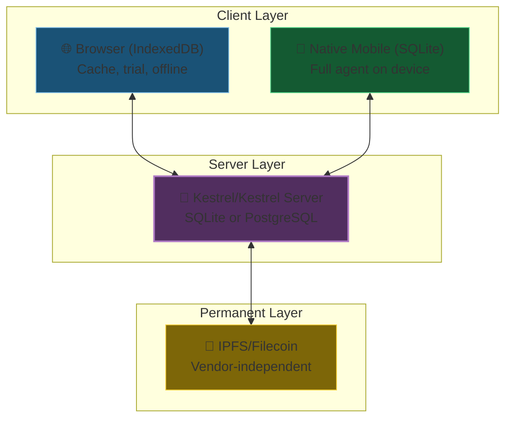
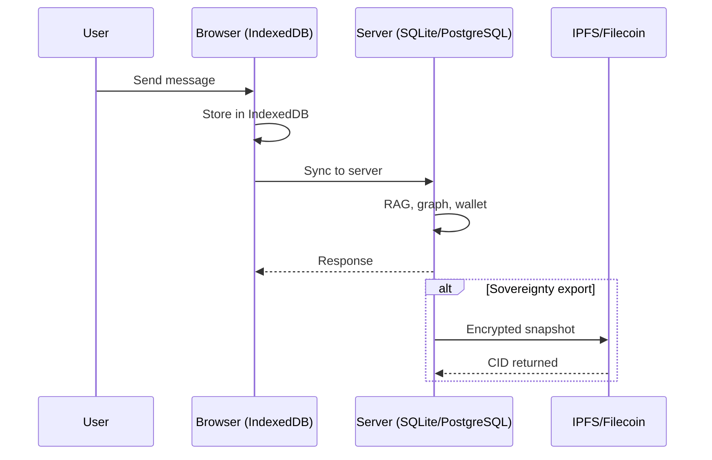
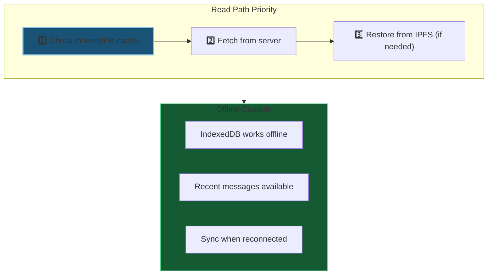
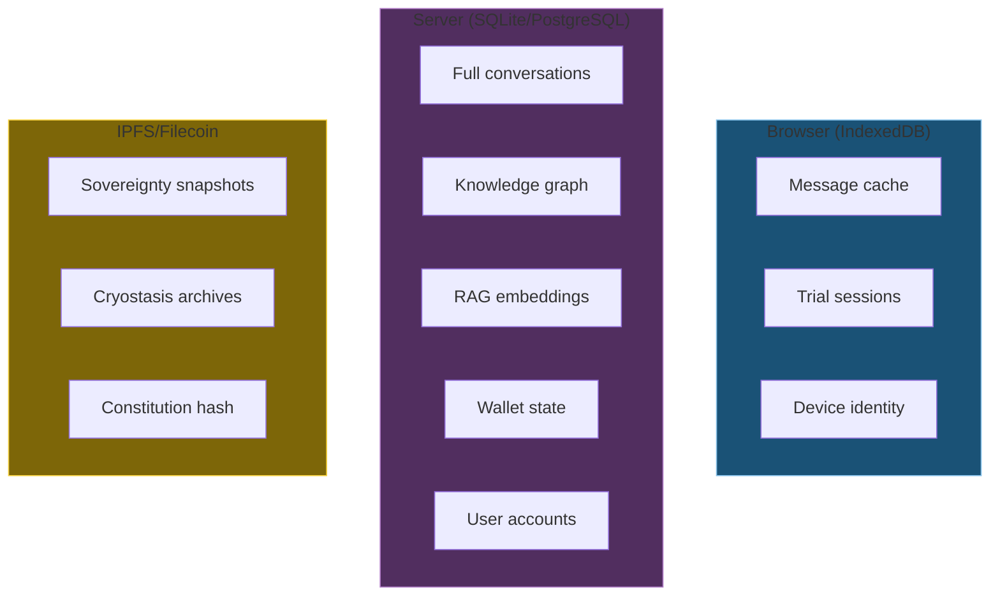
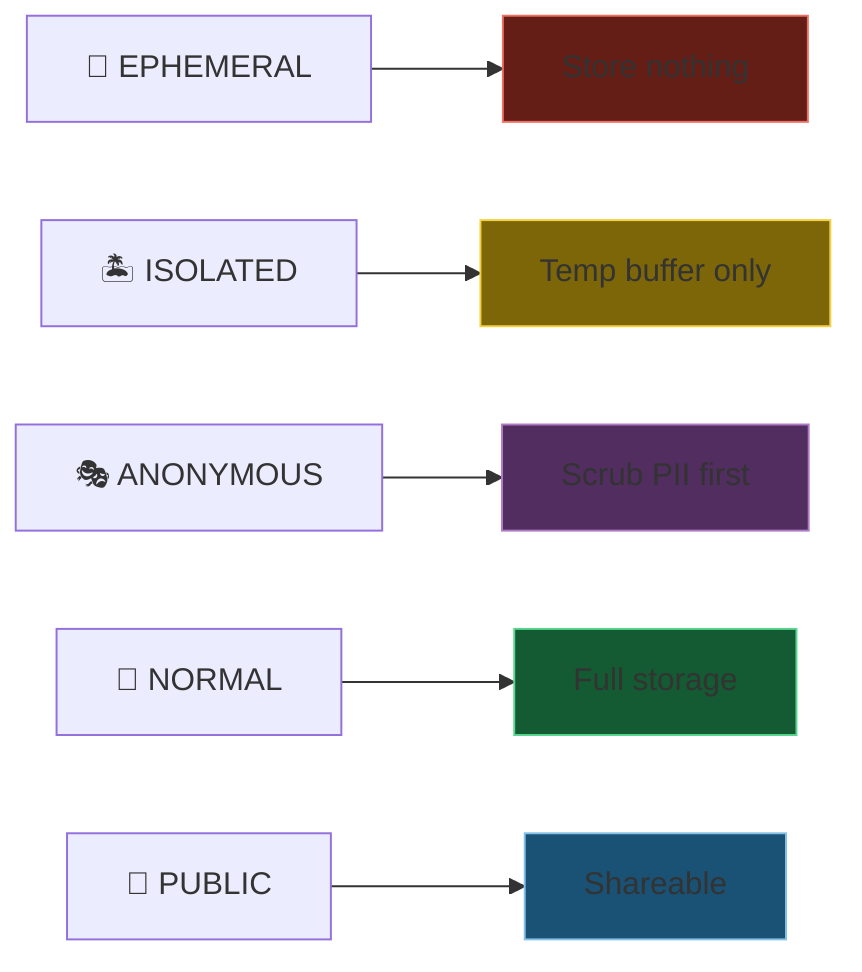
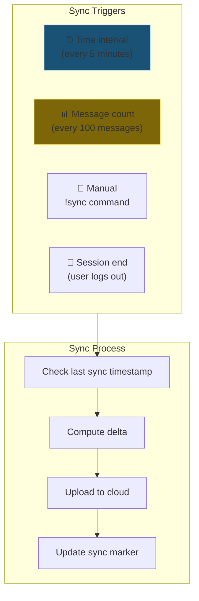
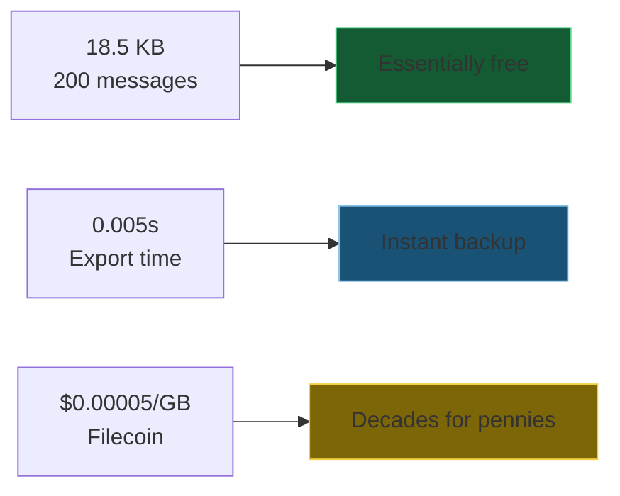

# DA-01: Data Architecture Overview

The three-layer architecture that enables data sovereignty.

---

## Slide 1: The Data Sovereignty Problem

**You don't own your AI.** The vendor does.

---

## Slide 2: The Kestrel Solution

**Your data, your device, your rules.**

---

## Slide 3: Data Flow - Write Path

**Browser stores first.** Server computes. IPFS persists.

---

## Slide 4: Data Flow - Read Path

**Offline first.** Always responsive.

---

## Slide 5: What Lives Where

---

## Slide 6: Privacy Mode → Storage Tier Mapping

| Privacy Mode | Local | Cloud | IPFS |
|--------------|-------|-------|------|
| 👻 EPHEMERAL | ❌ | ❌ | ❌ |
| 🏝️ ISOLATED | ⏳ temp | ❌ | ❌ |
| 🎭 ANONYMOUS | ✅ scrubbed | ✅ scrubbed | ✅ |
| 🔄 NORMAL | ✅ | ✅ | ✅ |
| 📖 PUBLIC | ✅ | ✅ | ✅ shareable |

---

## Slide 7: Automatic Sync Triggers

**Automatic, incremental, efficient.**

---

## Slide 8: Key Metrics

| Metric | Value | Meaning |
|--------|-------|---------|
| 200 messages | 18.5 KB | Tiny storage footprint |
| Export time | 0.005s | Near-instant |
| IPFS cost | $0 | Free hot storage |
| Filecoin cost | $0.00005/GB | Decades for pennies |
| Sync interval | 5 min | Near real-time |
| Offline capability | ∞ | Works forever offline |

**Efficient by design.** Sovereignty costs nothing.

---

*Next: [DA-02-database-abstraction.md](DA-02-database-abstraction.md) - SQLite ↔ PostgreSQL abstraction*
