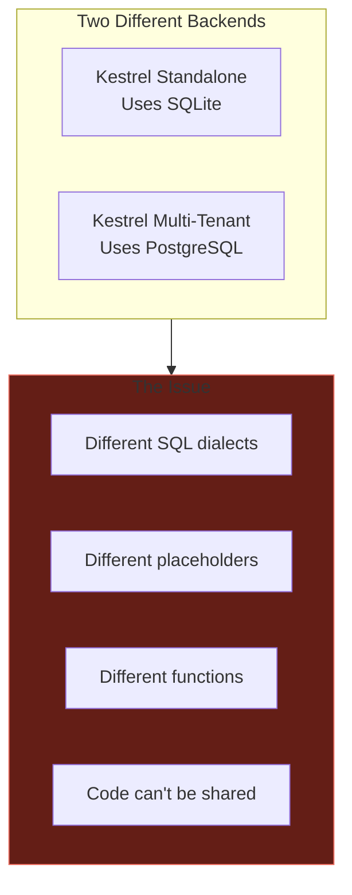
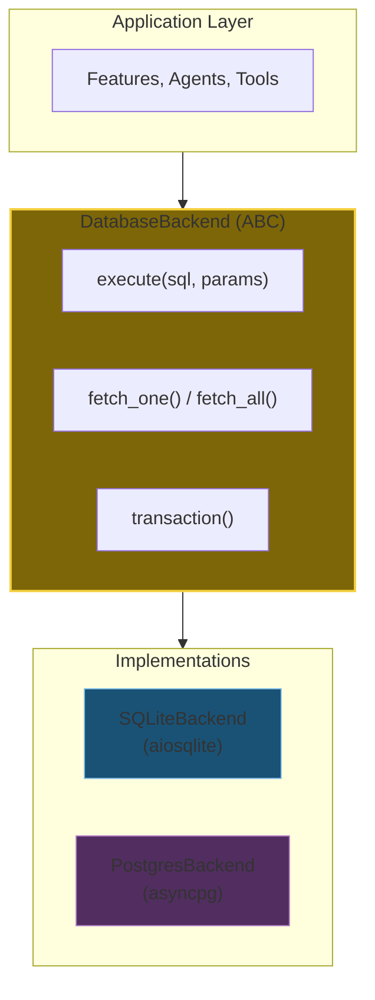
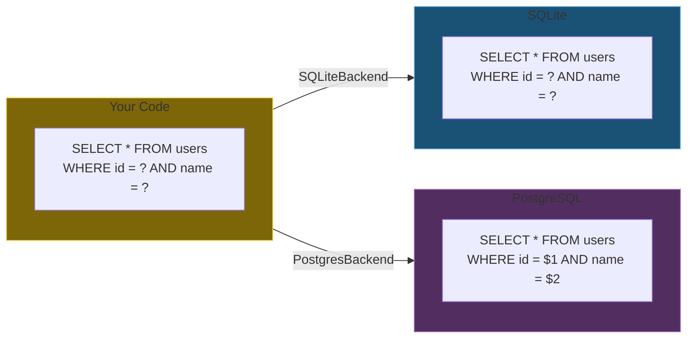
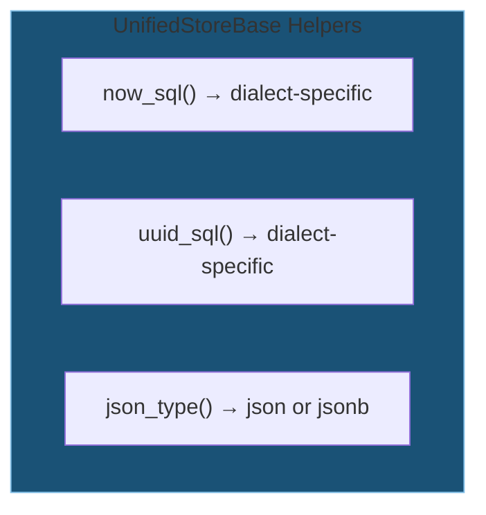
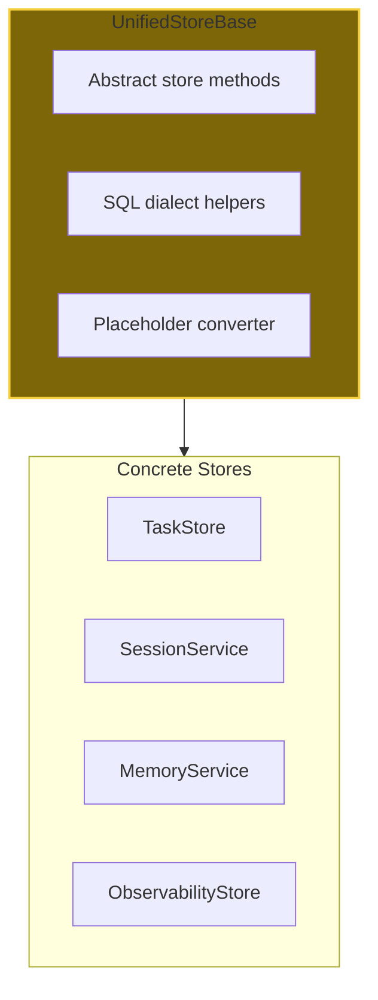
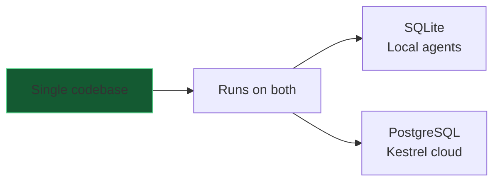

# DA-02: Database Abstraction Layer

One codebase, two backends: SQLite and PostgreSQL.

---

## Slide 1: The Problem



**Two backends, one codebase?** We need abstraction.

---

## Slide 2: The Solution - DatabaseBackend ABC



**Write once.** Run on either backend.

---

## Slide 3: Placeholder Conversion



**Automatic conversion.** `?` → `$1, $2, $3`

---

## Slide 4: SQL Dialect Helpers

| Function | SQLite | PostgreSQL |
|----------|--------|------------|
| Current time | `datetime('now')` | `NOW()` |
| UUID generation | `hex(randomblob(16))` | `uuid_generate_v4()` |
| JSON type | `json` | `jsonb` |
| Boolean | `0/1` | `true/false` |
| Text concat | `||` | `||` |



---

## Slide 5: UnifiedStoreBase



**Base class.** All A2A stores inherit from it.

---

## Slide 6: Usage Example

```python
# Works on BOTH SQLite and PostgreSQL!

class TaskStore(UnifiedStoreBase):
    async def get_task(self, task_id: str) -> Task:
        sql = """
            SELECT * FROM tasks
            WHERE id = ? AND created_at > ?
        """
        # Automatically converts:
        # SQLite: ... WHERE id = ? AND created_at > ?
        # Postgres: ... WHERE id = $1 AND created_at > $2

        row = await self.db.fetch_one(sql, [task_id, cutoff])
        return Task(**row)
```



---

*Next: [DA-03-local-storage.md](DA-03-local-storage.md) - AsyncStorage facade and specialized stores*
