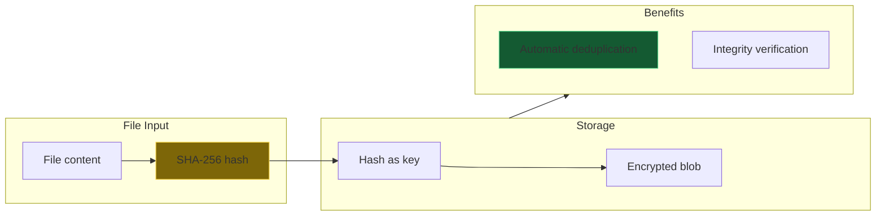
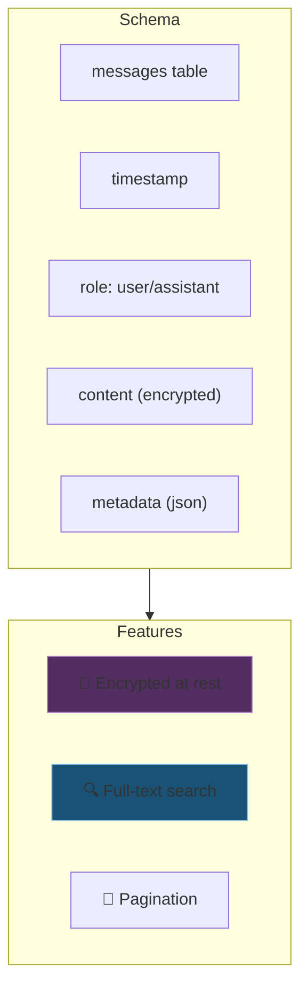
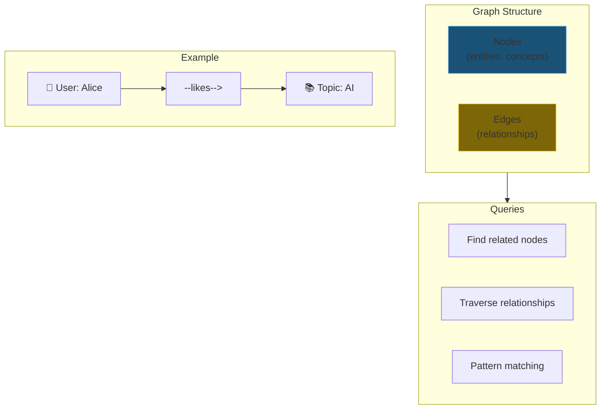
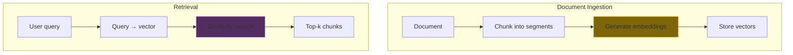
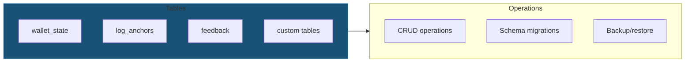
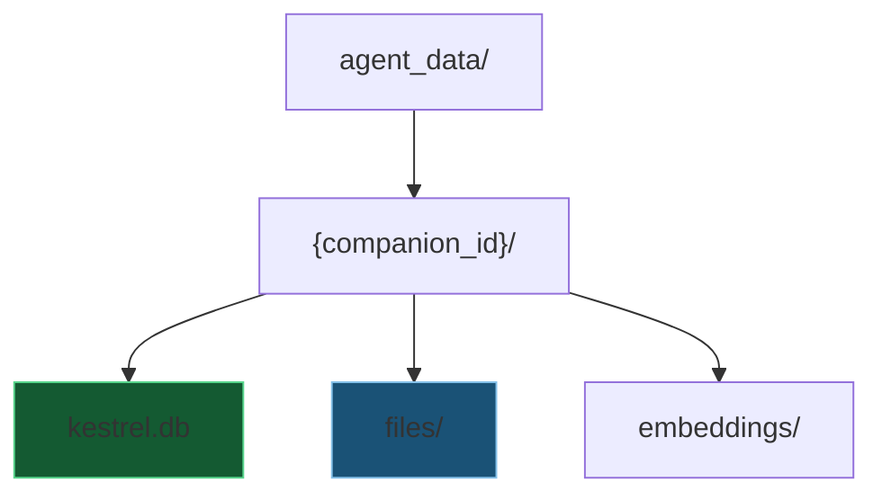
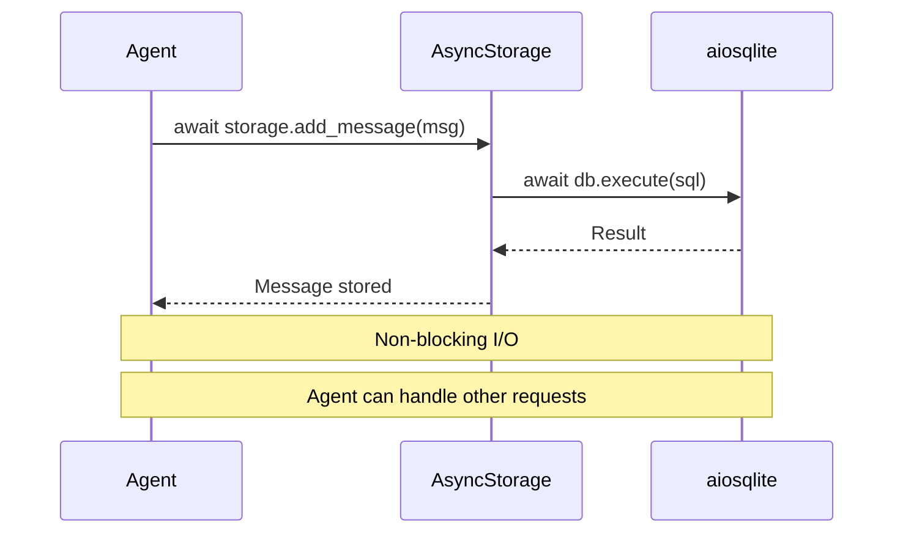

# DA-03: Local Storage (SQLite)

AsyncStorage facade and five specialized stores.

---

## Slide 1: The AsyncStorage Facade

```mermaid
graph TD
    subgraph facade["AsyncStorage"]
        UNIFIED["Single interface"]
        ASYNC["Fully async"]
    end

    subgraph stores["Specialized Stores"]
        FILES["📁 FileStore"]
        CONV["💬 ConversationStore"]
        GRAPH["🕸️ GraphStore"]
        RAG["🔍 RAGStore"]
        DB["💾 DatabaseStore"]
    end

    facade --> stores

    style facade fill:#7d6608,stroke:#f4d03f,stroke-width:2px
    style FILES fill:#1a5276,stroke:#85c1e9
    style CONV fill:#512e5f,stroke:#af7ac5
    style GRAPH fill:#0e4d45,stroke:#48c9b0
    style RAG fill:#7d3c00,stroke:#f5b041
    style DB fill:#145a32,stroke:#58d68d
```



**One interface.** Five specialized backends.

---

## Slide 2: FileStore - Content-Addressable



**Content-addressed.** Same content = same key = deduplicated.

---

## Slide 3: ConversationStore



**Encrypted + searchable.** Via KESTREL_DATA_KEY.

---

## Slide 4: GraphStore - Knowledge Graph



**Semantic relationships.** Agent's understanding of the world.

---

## Slide 5: RAGStore - Retrieval Augmented Generation



**Semantic search.** Find relevant context for any query.

---

## Slide 6: DatabaseStore - Generic Tables



**Catch-all.** For everything that isn't files, conversations, graph, or RAG.

---

## Slide 7: Directory Structure

```
agent_data/
└── {companion_id}/
    ├── kestrel.db          # Main SQLite database
    ├── files/              # Content-addressed files
    │   ├── ab/
    │   │   └── cd1234...   # SHA-256 hash prefix
    │   └── ef/
    │       └── gh5678...
    └── embeddings/         # Vector embeddings cache
```



---

## Slide 8: Async All The Way



**aiosqlite.** Non-blocking SQLite for async Python.

---

*Next: [DA-04-multi-tenant-cloud.md](DA-04-multi-tenant-cloud.md) - Kestrel PostgreSQL multi-tenancy*
