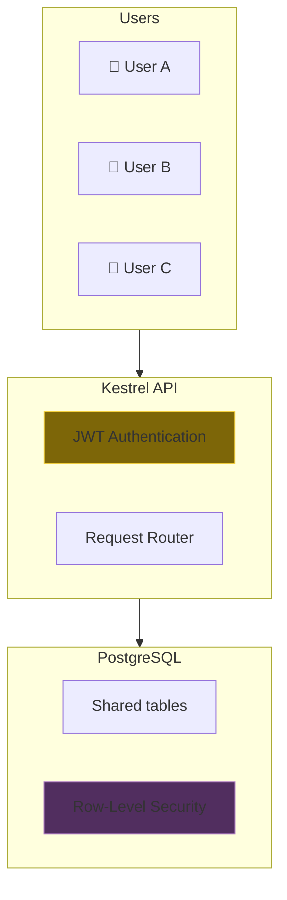
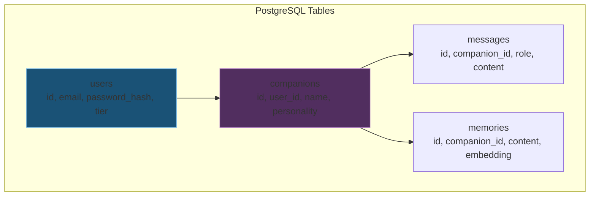
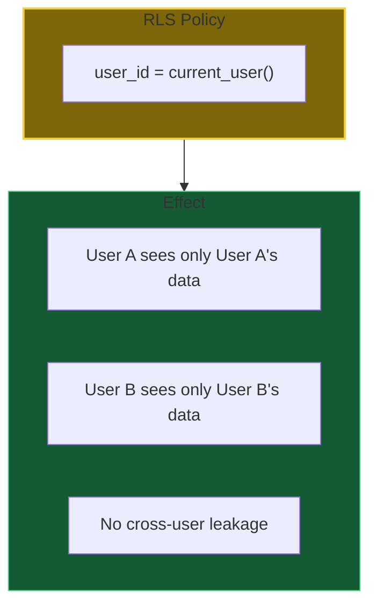
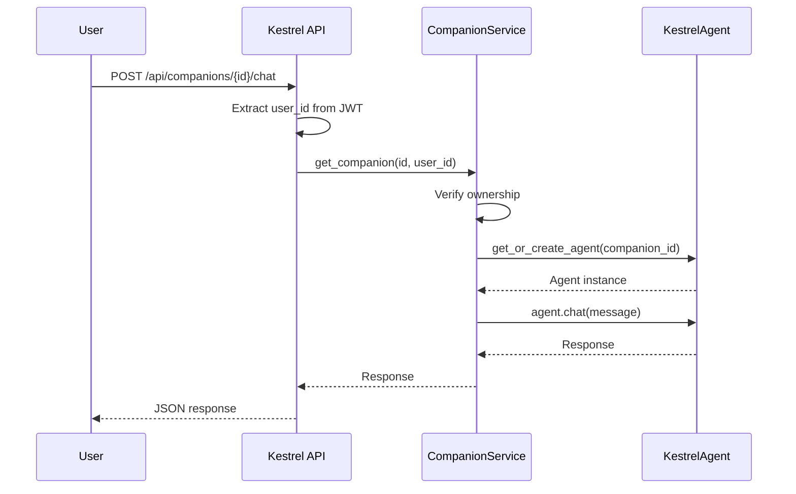
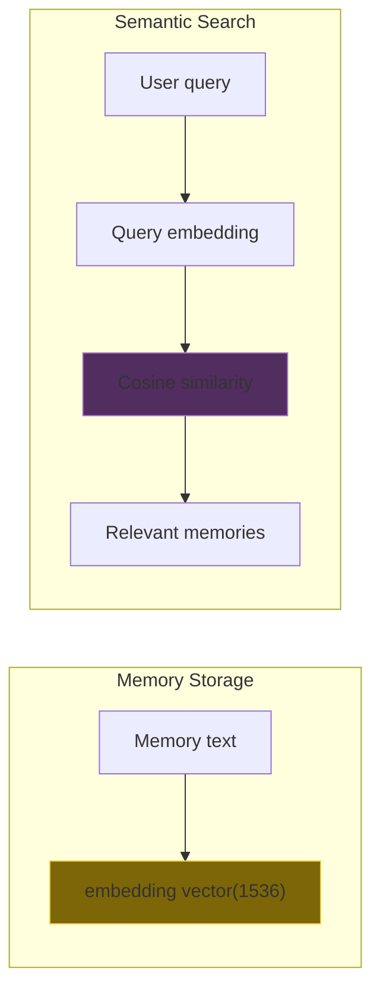
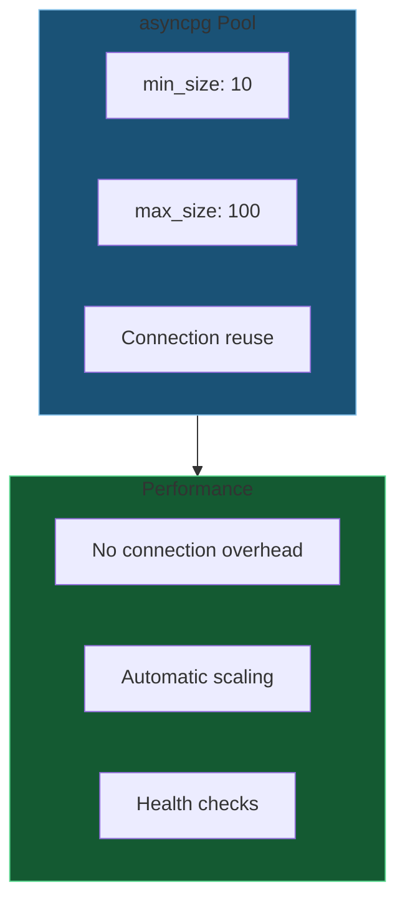
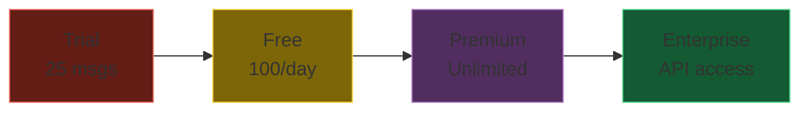
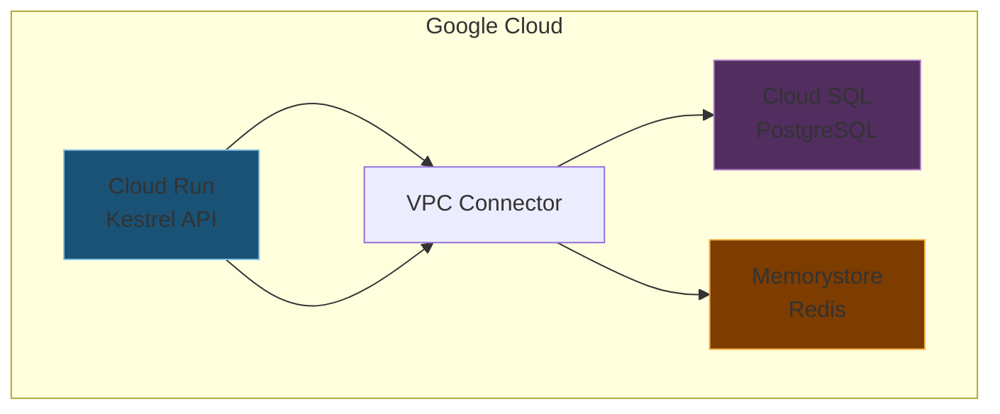

# DA-04: Multi-Tenant Cloud (Kestrel PostgreSQL)

Kestrel cloud architecture with row-level security.

---

## Slide 1: Kestrel Multi-Tenant Architecture

**Shared database.** Isolated data per user.

---

## Slide 2: Core Tables

**Hierarchical.** User → Companions → Messages/Memories.

---

## Slide 3: Row-Level Security

**Database-enforced isolation.** Can't leak data even with SQL injection.

---

## Slide 4: Companion → KestrelAgent Mapping

**Each companion = One KestrelAgent.**

---

## Slide 5: Vector Embeddings (pgvector)

**pgvector extension.** Native vector similarity search in PostgreSQL.

---

## Slide 6: Connection Pooling

**Efficient connections.** Pool handles concurrency.

---

## Slide 7: Subscription Tiers

| Tier | Messages | Companions | Features |
|------|----------|------------|----------|
| Trial | 25 free | 1 | Basic chat |
| Free | 100/day | 3 | + Memory |
| Premium | Unlimited | 10 | + Image gen, priority |
| Enterprise | Unlimited | 100 | + API access, SLA |

---

## Slide 8: Cloud Infrastructure

**Production stack.** Cloud Run + Cloud SQL + Memorystore.

---

*Next: [DA-05-ipfs-sovereignty.md](DA-05-ipfs-sovereignty.md) - IPFS sharding and convergent encryption*
