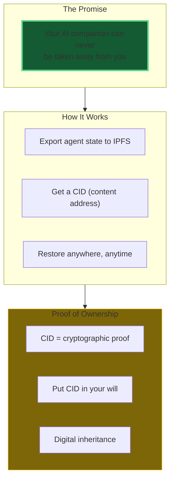
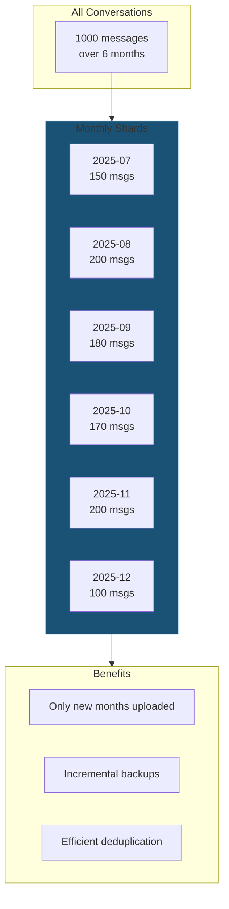
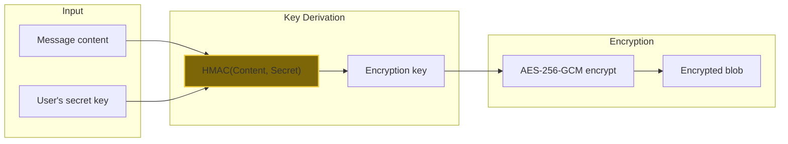
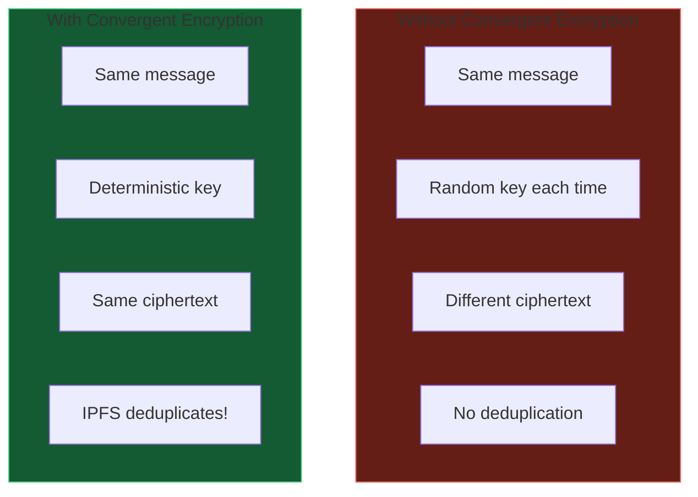
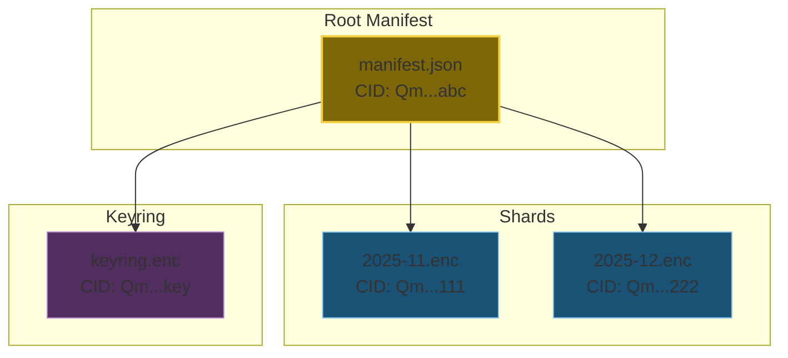
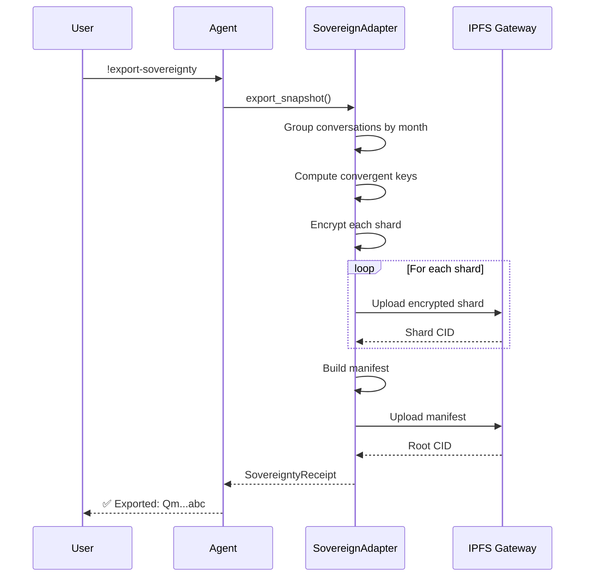
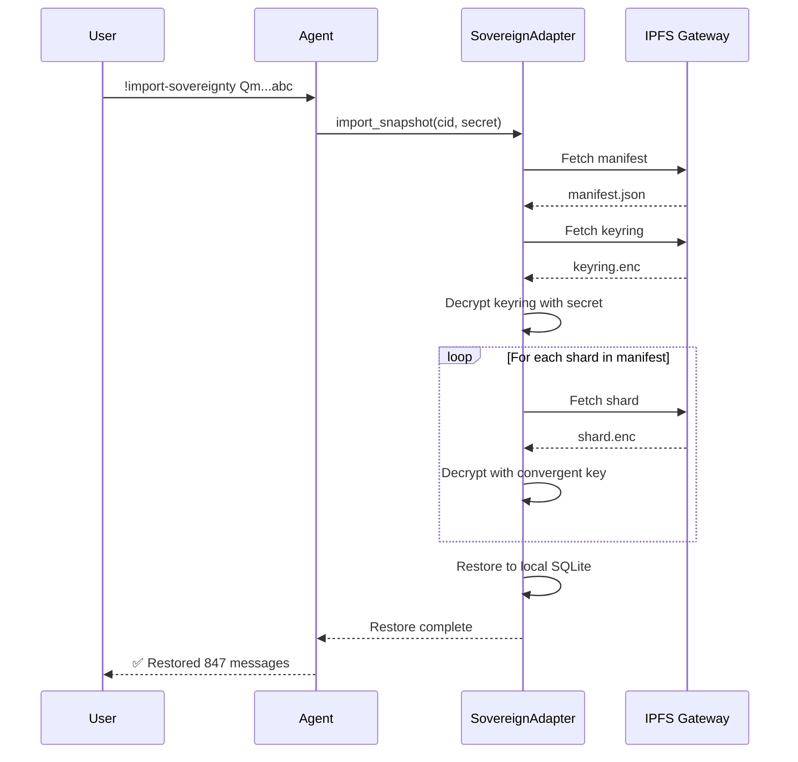
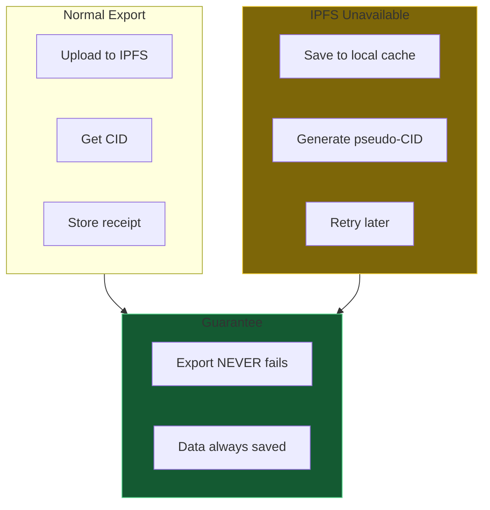
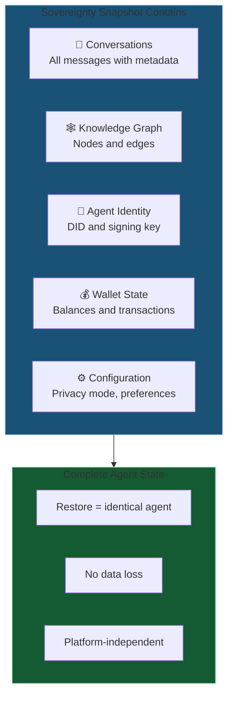
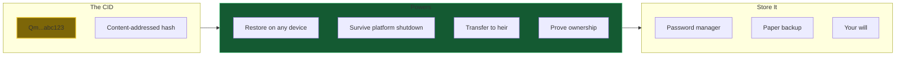

# DA-05: IPFS Sovereignty Export

Decentralized storage with convergent encryption and Merkle forest architecture.

---

## Slide 1: The Sovereignty Promise

**Not legal ownership. Cryptographic ownership.**

---

## Slide 2: Time-Based Sharding

**Incremental.** Only new/changed months are uploaded.

---

## Slide 3: Convergent Encryption

**Key = HMAC(Content, Secret)**

Same content → Same key → Same ciphertext → IPFS deduplicates!

---

## Slide 4: Why Convergent Encryption?

**Privacy + Efficiency.** Best of both worlds.

---

## Slide 5: Merkle Forest Structure

**DAG structure.** Root points to shards and keyring.

---

## Slide 6: Export Flow

---

## Slide 7: Import/Restore Flow

---

## Slide 8: Local Fallback

**Graceful degradation.** IPFS down? Cache locally, retry later.

---

## Slide 9: What Gets Preserved

---

## Slide 10: The CID - Your Proof

**The CID is your sovereignty.** Guard it like a private key.

---

*Next: [DA-06-filecoin-lighthouse.md](DA-06-filecoin-lighthouse.md) - Permanent storage via Lighthouse*
