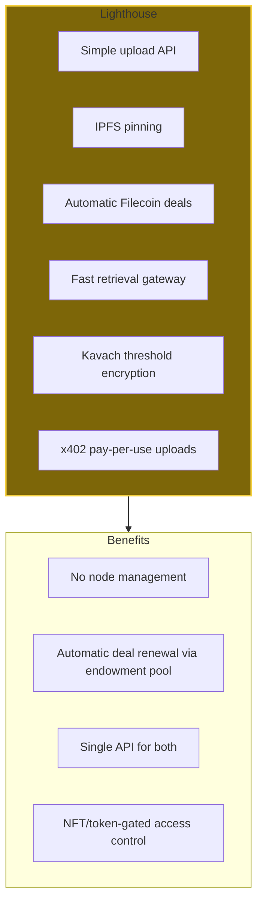
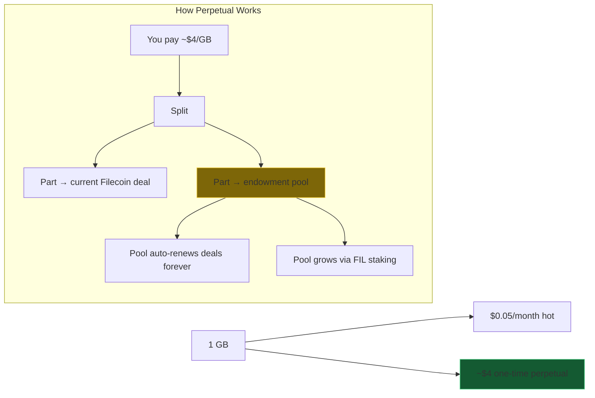
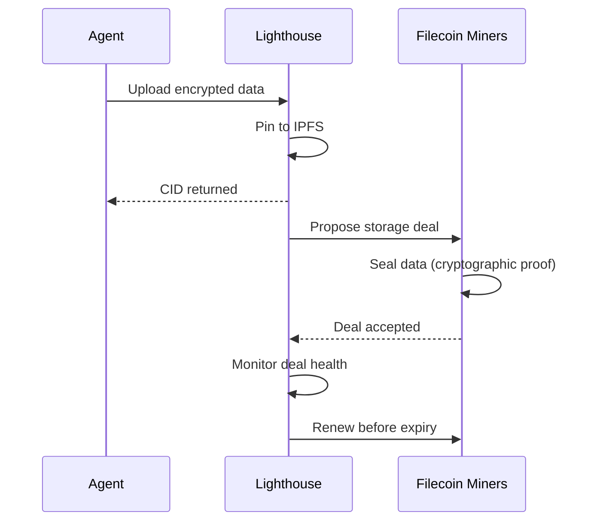
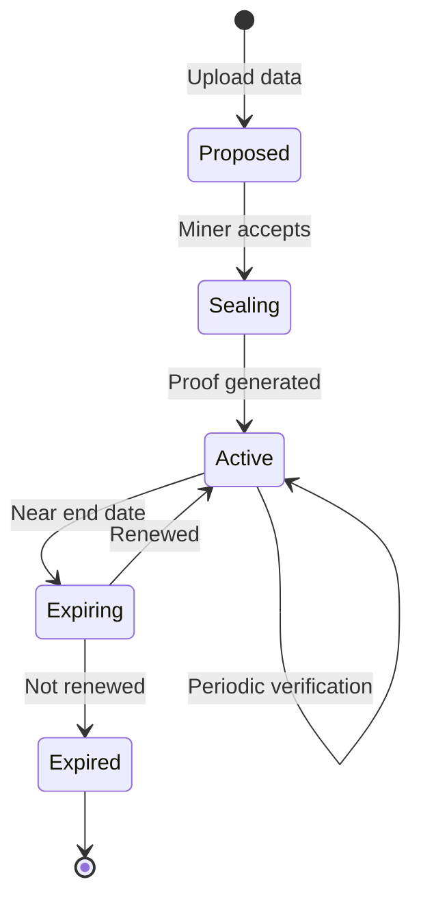
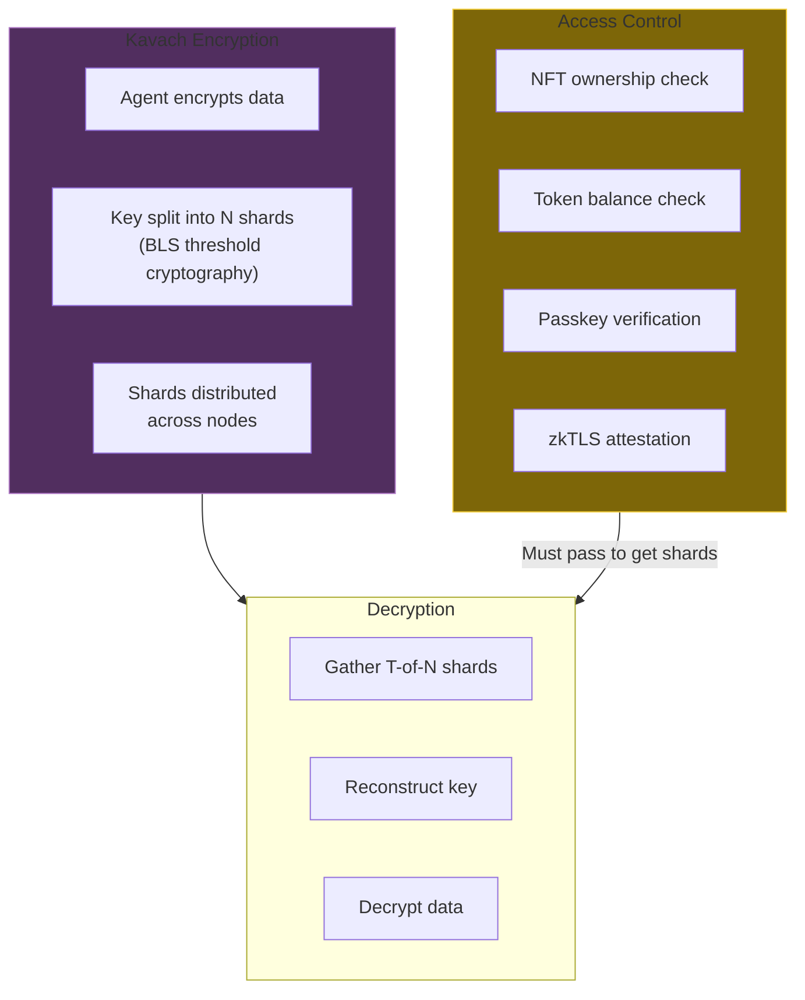
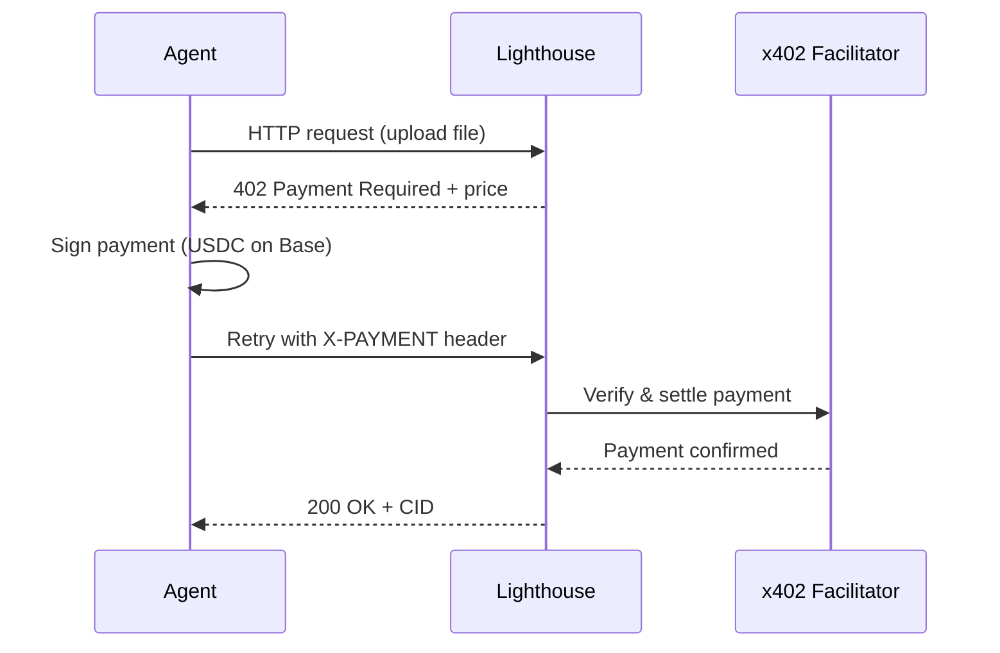
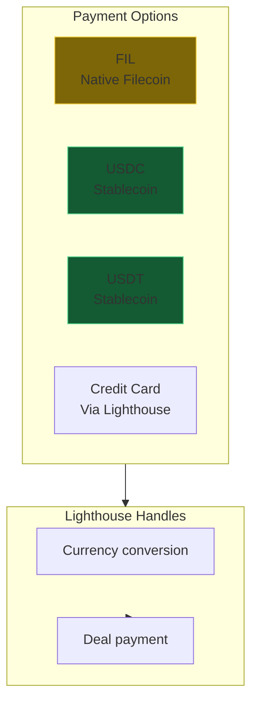
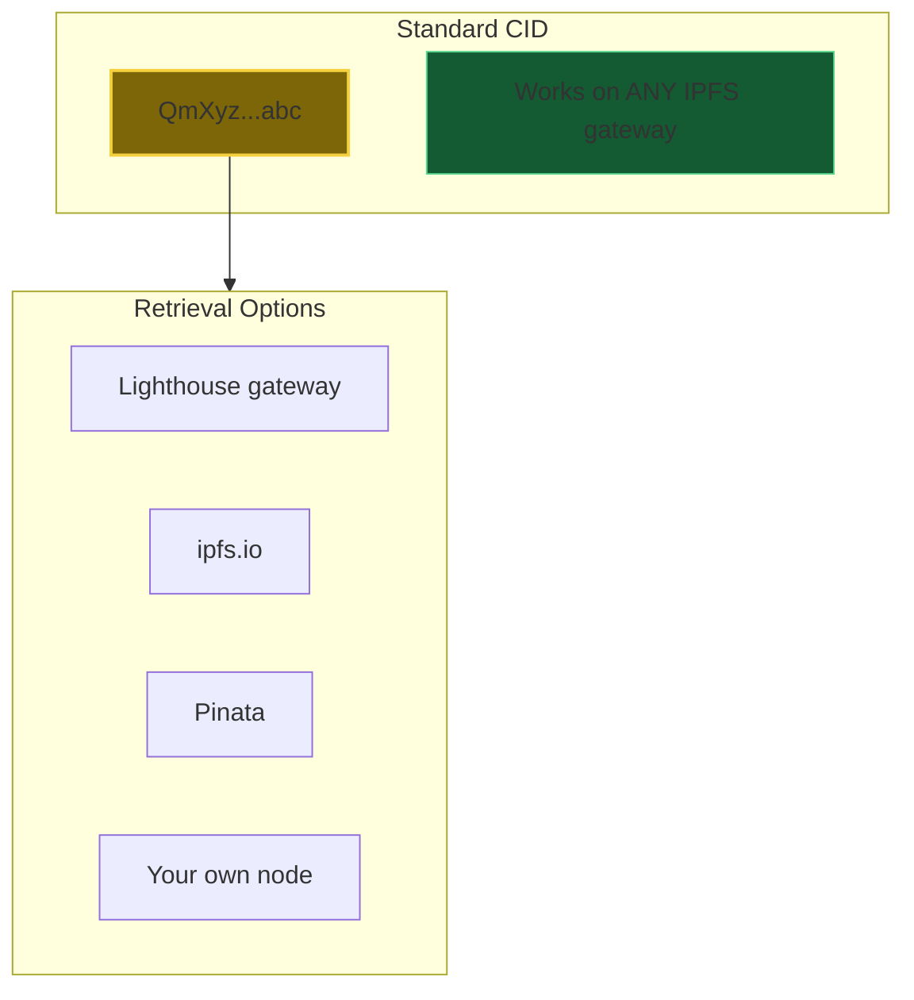
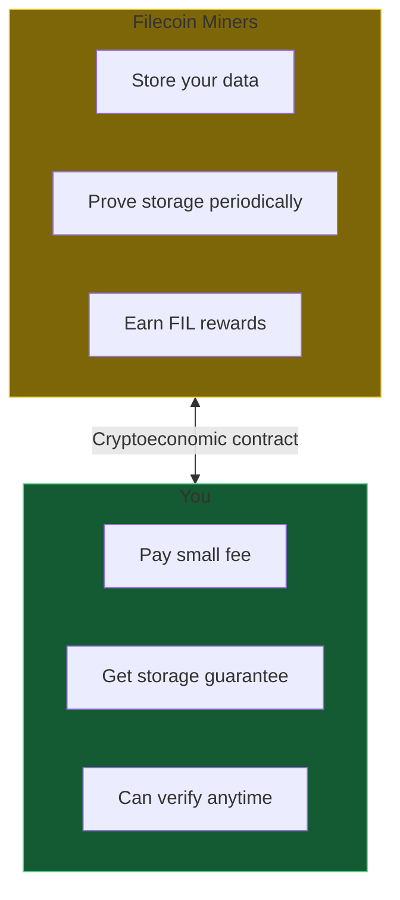

# DA-06: Filecoin & Lighthouse

Permanent storage for data sovereignty.

---

## Slide 1: Storage Tier Comparison

```mermaid
graph LR
    subgraph ipfs["IPFS (Hot)"]
        I1["Fast retrieval"]
        I2["Not guaranteed permanent"]
        I3["Free (if nodes available)"]
    end

    subgraph filecoin["Filecoin (Cold)"]
        F1["Slower retrieval"]
        F2["Guaranteed permanent"]
        F3["Paid, but very cheap"]
    end

    ipfs -->|"For long-term"| filecoin

    style ipfs fill:#0e4d45,stroke:#48c9b0
    style filecoin fill:#7d6608,stroke:#f4d03f
```

**IPFS for access. Filecoin for permanence.**

---

## Slide 2: Lighthouse - Managed IPFS + Filecoin

**One API.** IPFS + Filecoin complexity hidden.

---

## Slide 3: Pricing (Updated Feb 2026)

| Storage Type | Cost | Duration | Notes |
|--------------|------|----------|-------|
| IPFS hot (Lighthouse) | $0.05/GB/month | Until unpinned | Fast retrieval |
| Raw Filecoin deal | ~$0.00005/GB | Per deal (~1yr) | Must manually renew |
| Lighthouse perpetual | ~$2-5/GB one-time | Forever | Endowment pool auto-renews |

**Lighthouse Lifetime Plans:**

| Plan | Price | Storage |
|------|-------|---------|
| Free | $0 | 5 GB |
| Beacon | $20 | 5 GB |
| Navigator | $100 | 25 GB |
| Harbor | $500 | 150 GB |

**Pay once, stored forever.** The endowment pool funds perpetual renewal.

> **Note:** Raw Filecoin deal cost (~$0.00005/GB) is misleadingly cheap.
> Lighthouse charges ~$2-5/GB to fund the endowment pool that auto-renews
> deals in perpetuity. This is the real cost of "permanent" storage.

---

## Slide 4: Filecoin Deal Creation

---

## Slide 5: Deal Lifecycle

**Renewable.** Lighthouse auto-renews via endowment pool.

---

## Slide 6: Kavach Threshold Encryption

**No single point of failure.** Lighthouse never holds the full key.

Supported gating: ERC721/ERC1155 NFTs, ERC20 tokens, passkeys, zkTLS.
Chains: EVM, Solana, Cosmos, Coreum, Radix.

> **Kestrel implication:** Kavach replaces our current Fernet encryption
> (which stores keys locally in `cache_dir/key_{hash}.key`). With Kavach,
> cryostasis recovery doesn't depend on a local key file or env var -
> access is tied to the agent's wallet/DID on-chain.

---

## Slide 7: x402 Pay-Per-Use

x402 is a [Coinbase-developed protocol](https://github.com/coinbase/x402) using
HTTP 402 for micropayments. Agents can pay per-upload without pre-purchasing plans.

> **Kestrel implication:** Enables autonomous agent storage payments.
> Agent wallet signs USDC on Base → file stored → no API key quotas needed.
> This is the path to Phase 3 (Autonomous Renewal) in our roadmap.

---

## Slide 8: Multi-Currency Payment

**Pay how you want.** Lighthouse converts.

---

## Slide 9: No Vendor Lock-in

**The CID is universal.** Not locked to Lighthouse.

---

## Slide 10: Economic Incentives

**Miners are incentivized.** Math, not trust.

---

*Next: [DA-07-cryostasis.md](DA-07-cryostasis.md) - Agent dormancy when wallet runs low*
