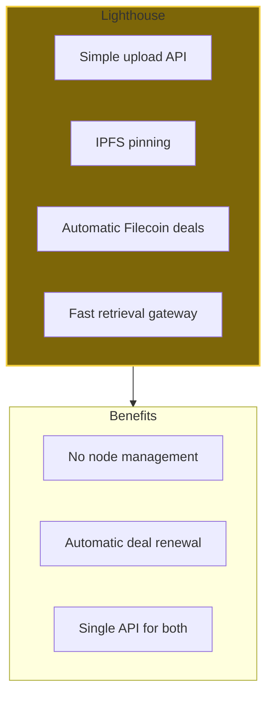
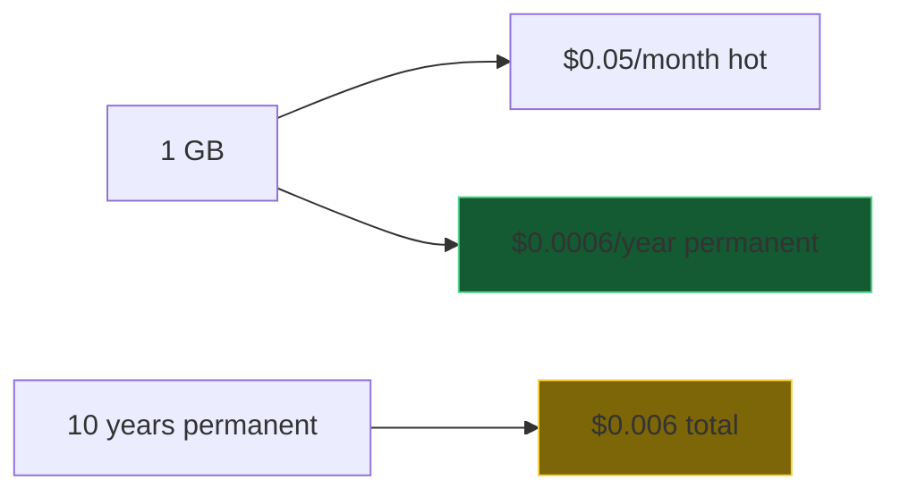
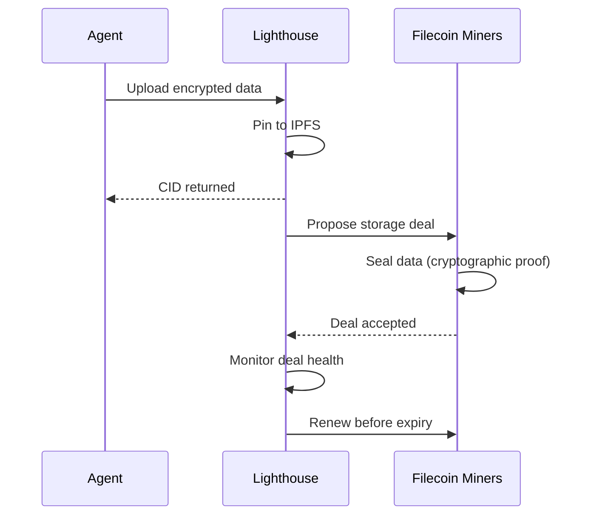
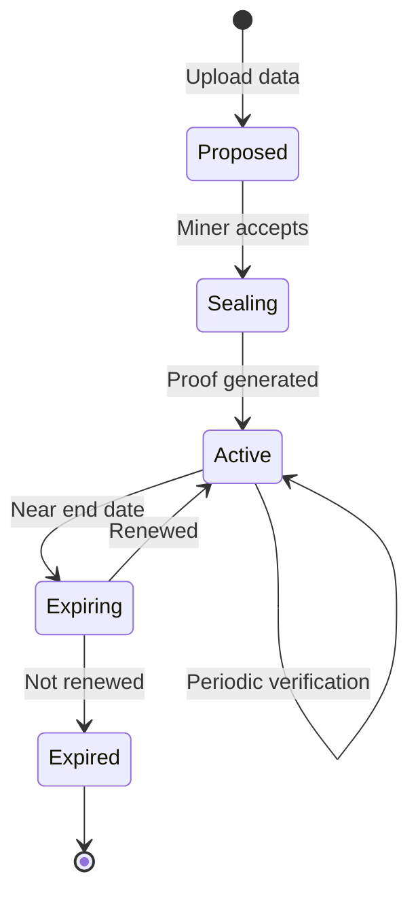
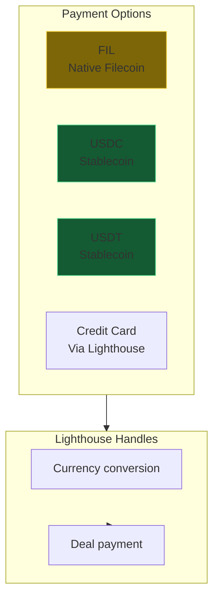
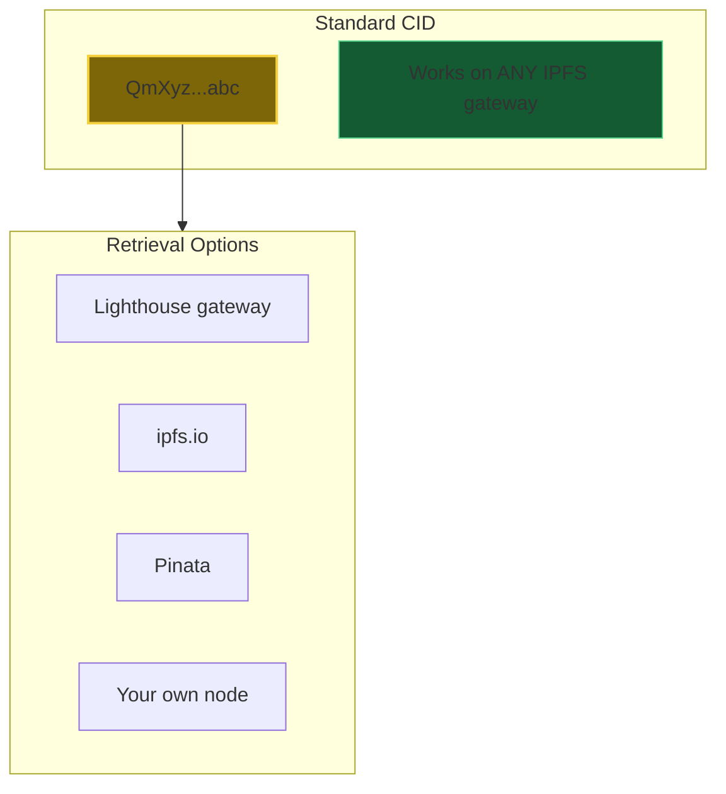
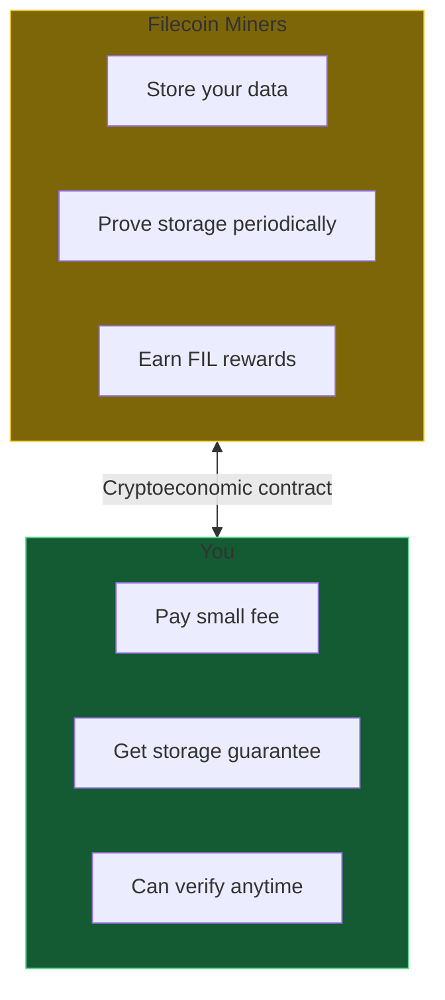

# DA-06: Filecoin & Lighthouse

Permanent storage for data sovereignty.

---

## Slide 1: Storage Tier Comparison

```mermaid
graph LR
    subgraph ipfs["IPFS (Hot)"]
        I1["Fast retrieval"]
        I2["Not guaranteed permanent"]
        I3["Free (if nodes available)"]
    end

    subgraph filecoin["Filecoin (Cold)"]
        F1["Slower retrieval"]
        F2["Guaranteed permanent"]
        F3["Paid, but very cheap"]
    end

    ipfs -->|"For long-term"| filecoin

    style ipfs fill:#0e4d45,stroke:#48c9b0
    style filecoin fill:#7d6608,stroke:#f4d03f
```

**IPFS for access. Filecoin for permanence.**

---

## Slide 2: Lighthouse - Managed IPFS + Filecoin

**One API.** IPFS + Filecoin complexity hidden.

---

## Slide 3: Pricing

| Storage Type | Cost | Duration |
|--------------|------|----------|
| IPFS (hot) | $0.05/GB/month | Until unpinned |
| Filecoin (cold) | $0.00005/GB/month | Permanent (renewable) |
| Lighthouse combo | ~$0.05/GB/month | Hot + cold backup |

**Permanent storage for pennies.**

---

## Slide 4: Filecoin Deal Creation

---

## Slide 5: Deal Lifecycle

**Renewable.** Lighthouse auto-renews if funded.

---

## Slide 6: Multi-Currency Payment

**Pay how you want.** Lighthouse converts.

---

## Slide 7: No Vendor Lock-in

**The CID is universal.** Not locked to Lighthouse.

---

## Slide 8: Economic Incentives

**Miners are incentivized.** Math, not trust.

---

*Next: [DA-07-cryostasis.md](DA-07-cryostasis.md) - Agent dormancy when wallet runs low*
