# DA-07: Cryostasis - Agent Dormancy

When agents can't afford to run, they sleep instead of dying.

---

## Slide 1: The Cryostasis Concept

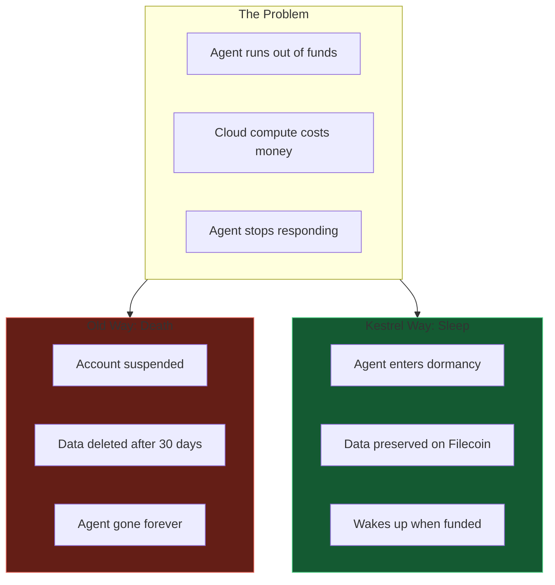

**Sleep, don't die.** Your AI companion waits for you.

---

## Slide 2: The $0.02 Trigger

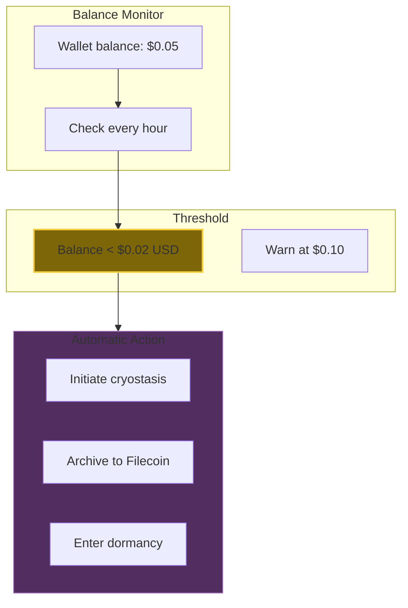

**$0.02 threshold.** Enough to pay for archival, not enough to run.

---

## Slide 3: Why $0.02?

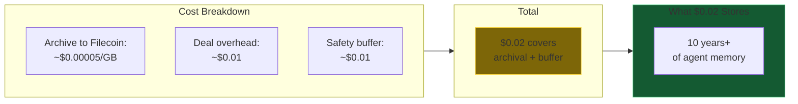

**Pennies for decades.** Filecoin is ridiculously cheap.

---

## Slide 4: Archive Flow

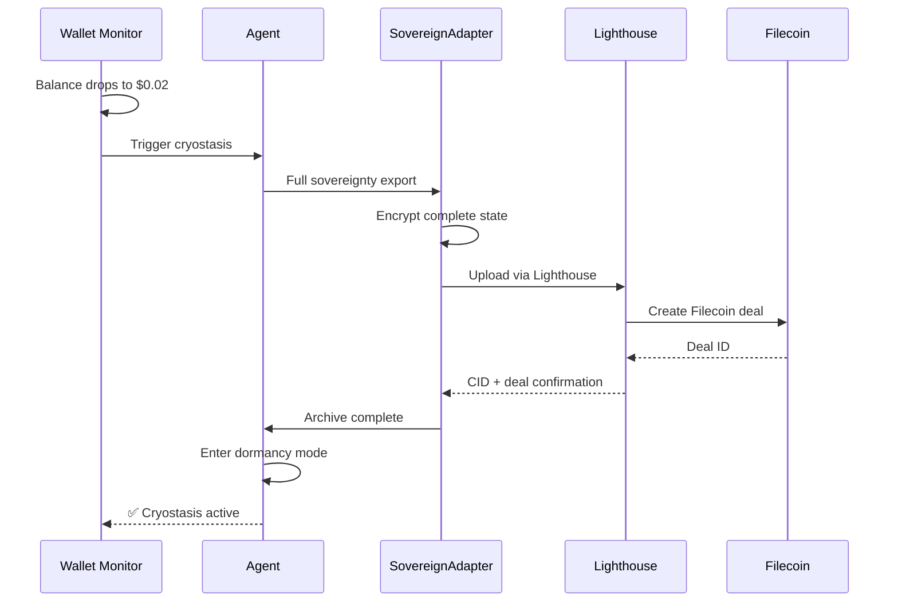

---

## Slide 5: What Gets Preserved

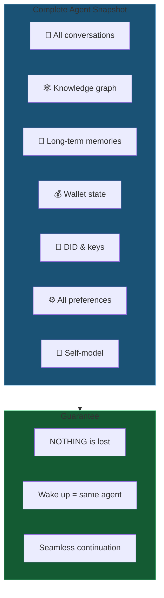

**Complete preservation.** Every memory, every preference.

---

## Slide 6: Dormancy State

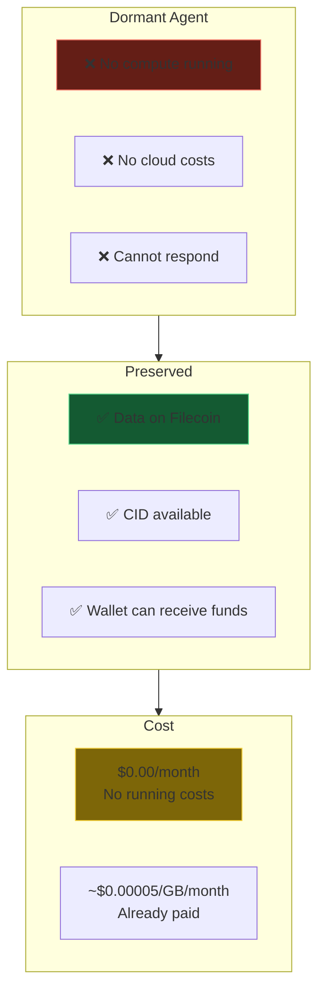

**Zero running costs.** Just waiting.

---

## Slide 7: Wake-Up Trigger

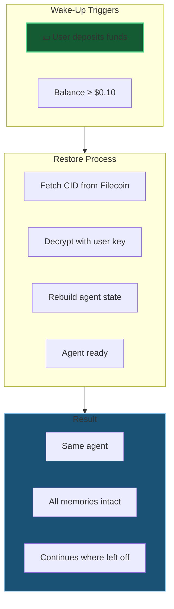

**Deposit funds → Agent wakes up.**

---

## Slide 8: Wake-Up Flow

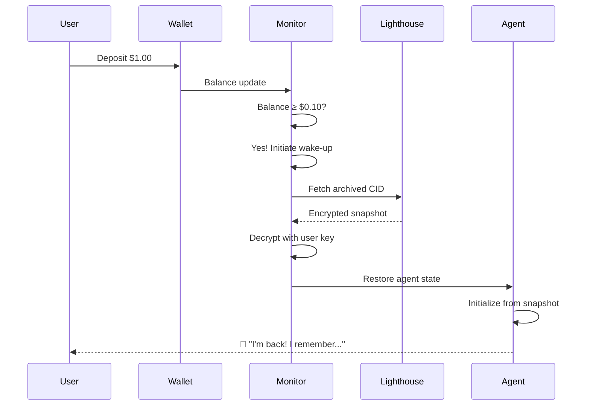

---

## Slide 9: Cost Analysis

| Scenario | Storage | Duration | Cost |
|----------|---------|----------|------|
| Small agent | 10 MB | 1 year | $0.00006 |
| Medium agent | 100 MB | 1 year | $0.0006 |
| Large agent | 1 GB | 1 year | $0.006 |
| Large agent | 1 GB | 10 years | $0.06 |
| Large agent | 1 GB | 100 years | $0.60 |

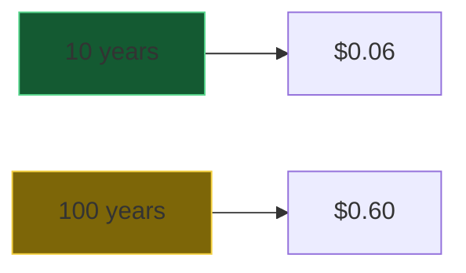

**Decades for pennies.** Centuries for dollars.

---

## Slide 10: Cryostasis Commands

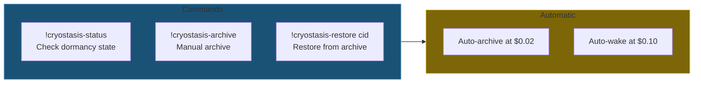

**Manual or automatic.** Your choice.

---

## Slide 11: Inheritance Use Case

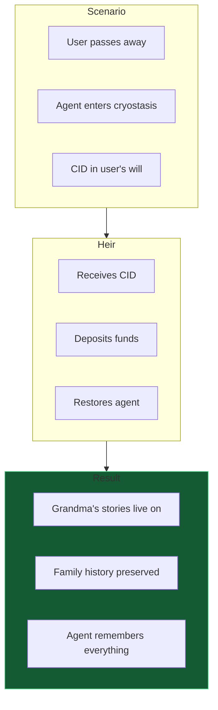

**Digital inheritance.** Your AI companion can outlive you.

---

*Next: [DA-08-privacy-encryption.md](DA-08-privacy-encryption.md) - Encryption at rest and PII scrubbing*
