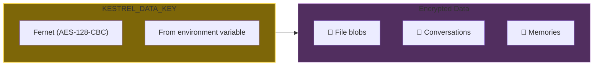
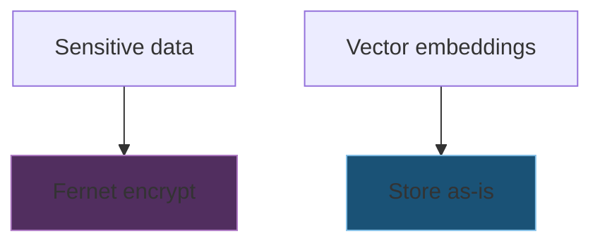
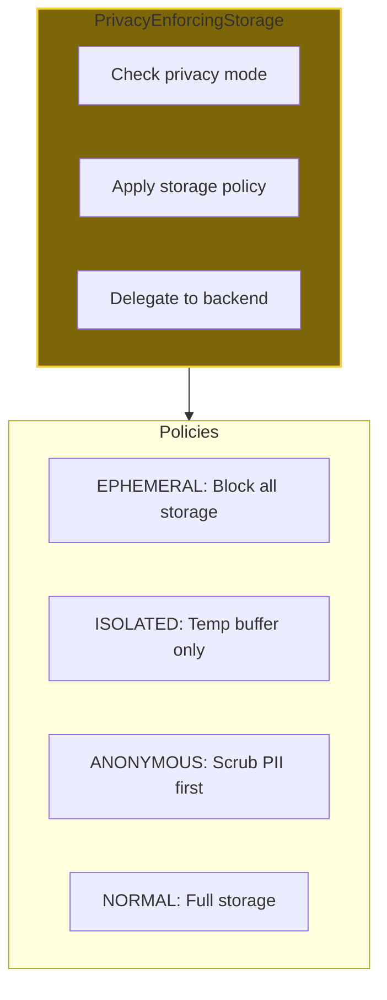
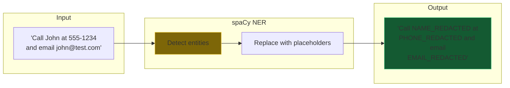
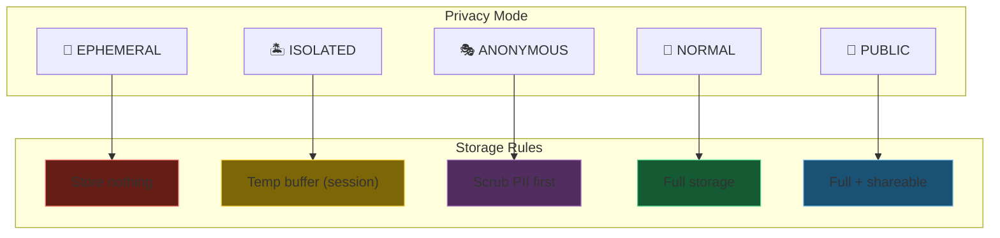
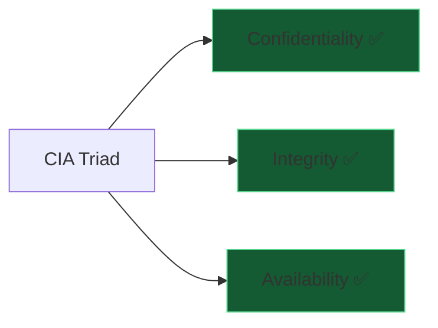

# DA-08: Privacy & Encryption

Encryption at rest, PII scrubbing, and privacy mode enforcement.

---

## Slide 1: Encryption at Rest

**Set KESTREL_DATA_KEY.** Everything encrypted transparently.

---

## Slide 2: What Gets Encrypted

| Component | Encrypted | How |
|-----------|-----------|-----|
| File blobs | ✅ Yes | Fernet before storage |
| Conversations | ✅ Yes | Fernet on content field |
| Memories | ✅ Yes | Fernet on content field |
| Knowledge graph | ⚠️ Partial | Sensitive nodes only |
| Wallet state | ✅ Yes | Fernet on balances |
| Embeddings | ❌ No | Vectors not sensitive |

---

## Slide 3: PrivacyEnforcingStorage Wrapper

**Policy enforcement at storage boundary.**

---

## Slide 4: PII Scrubbing (ANONYMOUS Mode)

**spaCy NER.** Detects names, orgs, emails, phones, SSNs.

---

## Slide 5: Privacy Mode → Storage Rules

---

## Slide 6: Security Guarantees

| Property | Guarantee | How |
|----------|-----------|-----|
| **Confidentiality** | ✅ Data unreadable without key | Fernet encryption |
| **Integrity** | ✅ Tampering detected | HMAC in Fernet |
| **Availability** | ✅ Data survives platform loss | IPFS/Filecoin backup |
| **Privacy** | ✅ PII removable on demand | Scrubbing pipeline |
| **Sovereignty** | ✅ User controls all keys | No key escrow |

---

*End of Data Architecture Deep Dive series*

*Return to [README.md](README.md) for series index*
