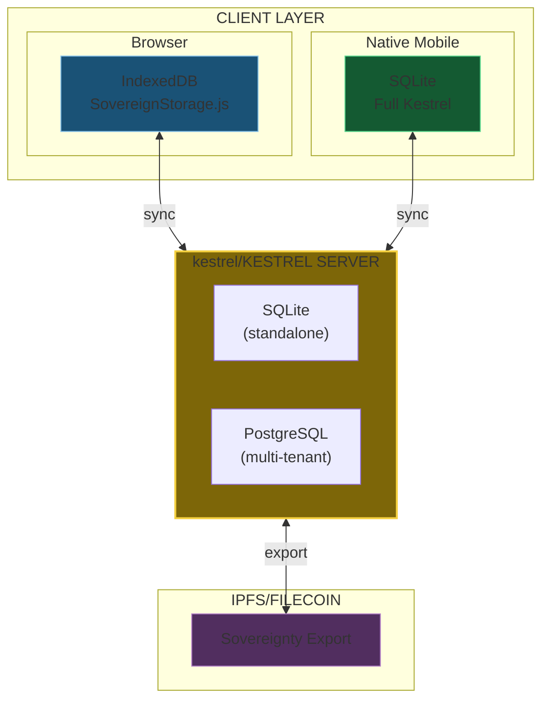
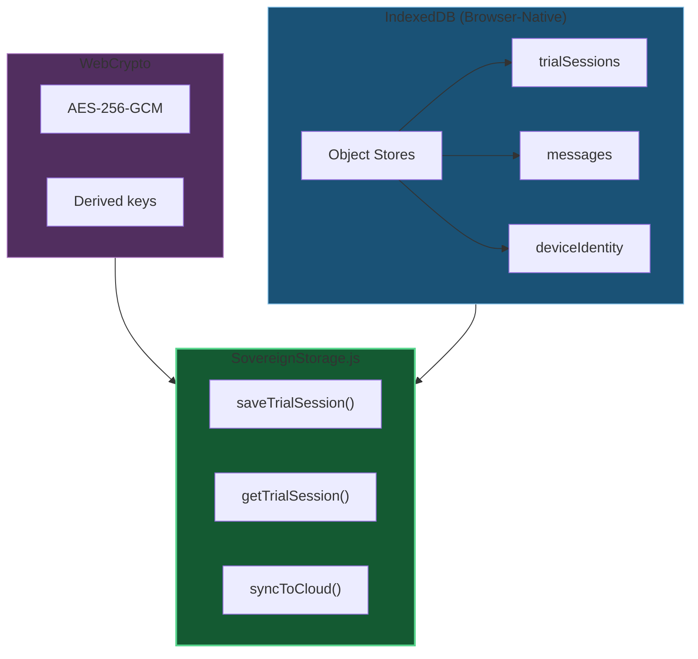
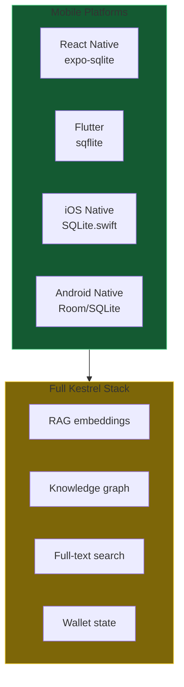
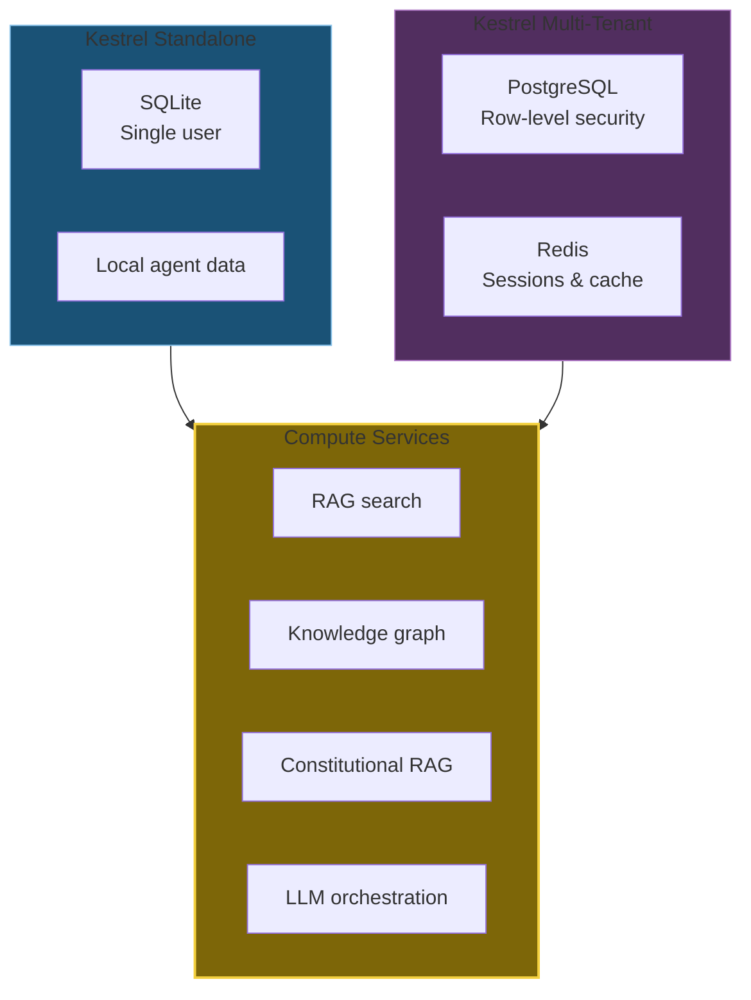
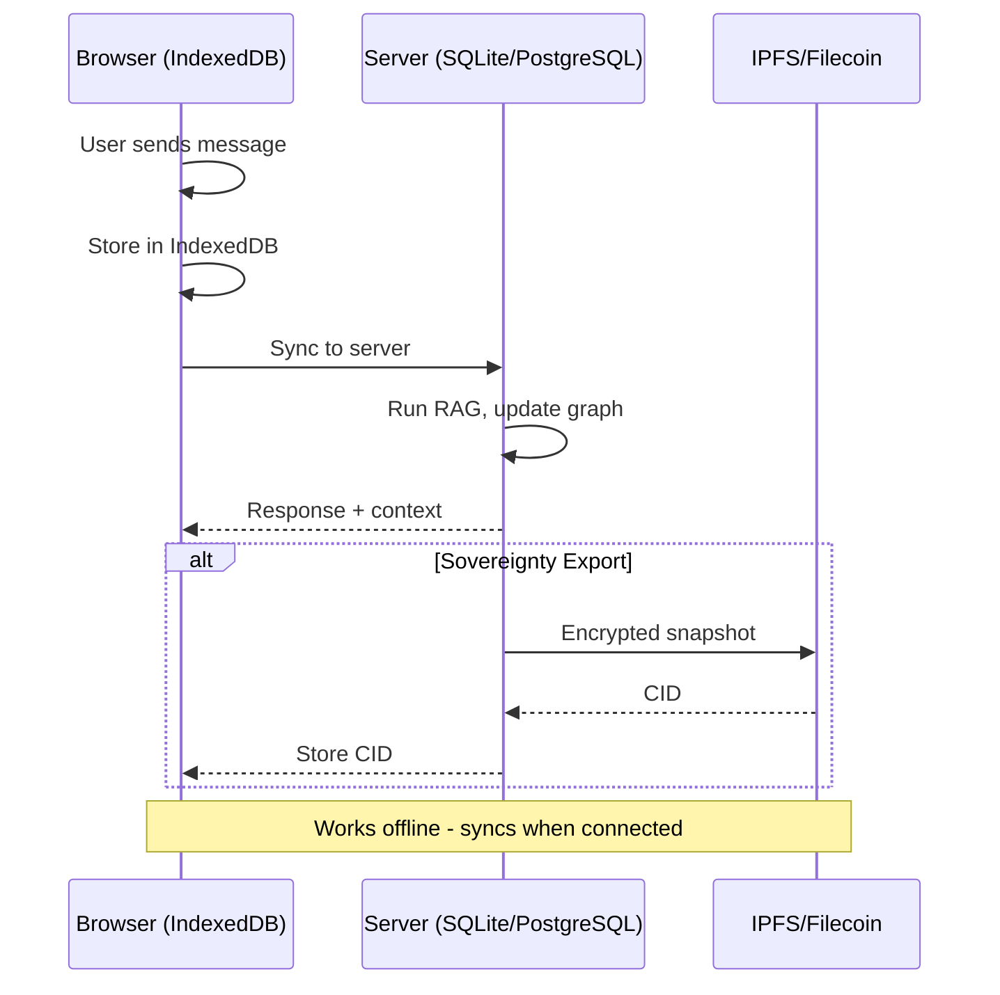
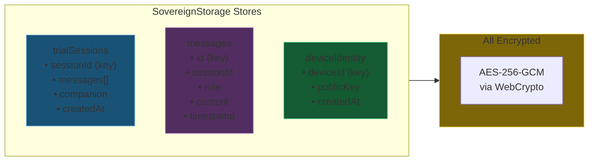
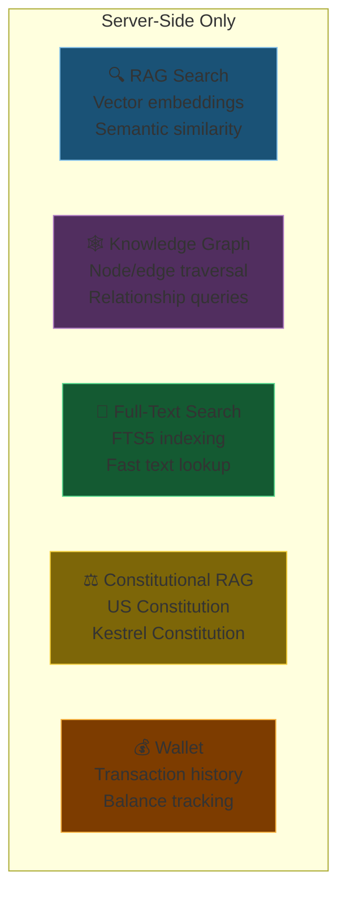
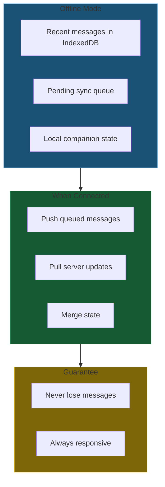
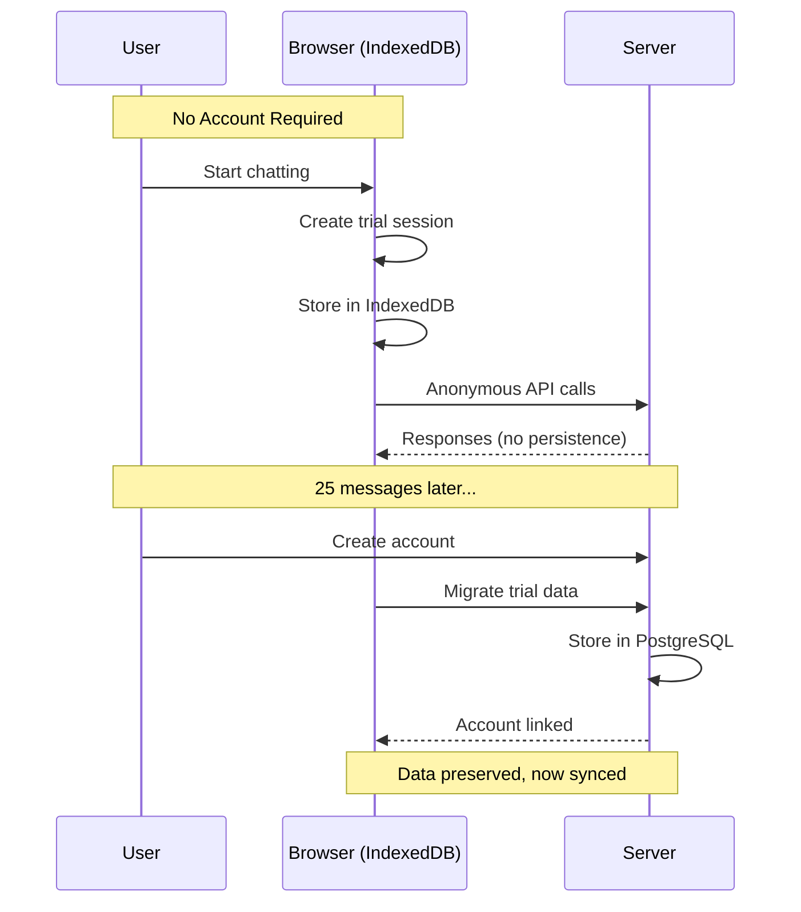

# DA-09: Browser & Mobile Storage

Client-side storage architecture across browsers, mobile apps, and server compute.

---

## Slide 1: Client Storage Architecture

**Three client paths.** All sync to server. All export to IPFS.

---

## Slide 2: Browser Layer - IndexedDB

**Browser storage.** Encrypted, offline-capable, trial-ready.

---

## Slide 3: Native Mobile Layer - SQLite

**Native mobile runs SQLite directly.** Full agent capabilities on device.

---

## Slide 4: Server Layer - Kestrel/Kestrel

**Server runs the heavy compute.** Clients sync and cache.

---

## Slide 5: Data Flow

---

## Slide 6: IndexedDB Object Stores

---

## Slide 7: Server Compute Capabilities

**Complex queries require SQL.** Browser delegates to server.

---

## Slide 8: Offline & Sync

**Works without network.** Syncs when available.

---

## Slide 9: Trial Mode Flow

---

## Slide 10: Implementation Status

| Component | Platform | Status |
|-----------|----------|--------|
| **IndexedDB wrapper** | Browser | ✅ `SovereignStorage.js` |
| **AES-256-GCM encryption** | Browser | ✅ WebCrypto API |
| **Sync endpoint** | Server | ✅ `/api/sovereign/sync` |
| **Trial mode** | Browser | ✅ Works without account |
| **SQLite** | React Native | 📋 Future |
| **SQLite** | Flutter | 📋 Future |
| **SQLite** | iOS Native | 📋 Future |
| **SQLite** | Android Native | 📋 Future |

---

*Return to [README.md](README.md) for series index*
