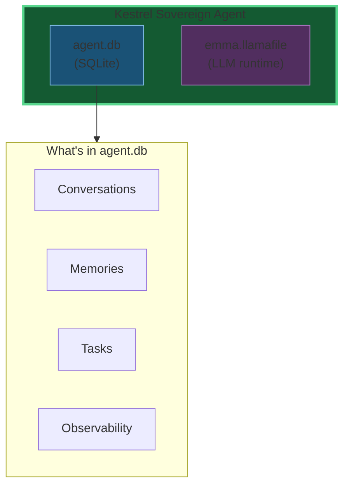
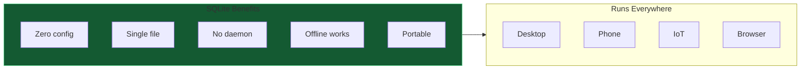
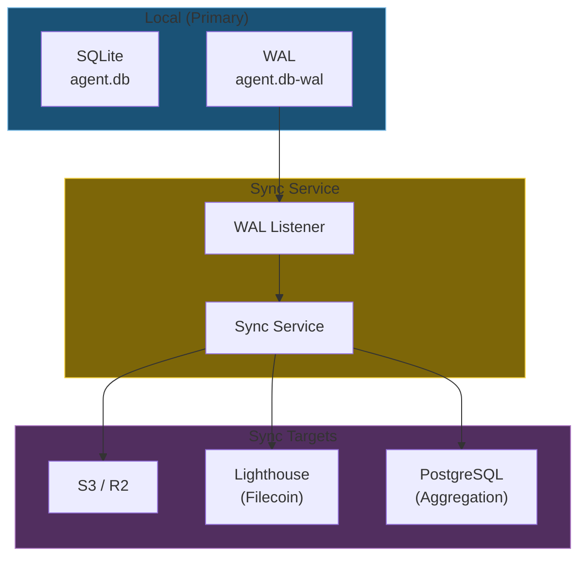
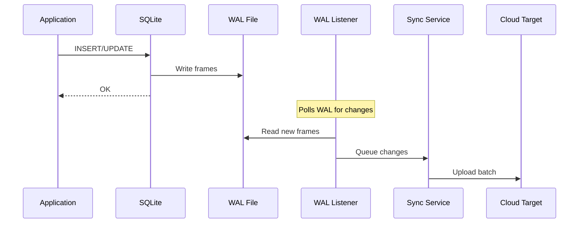
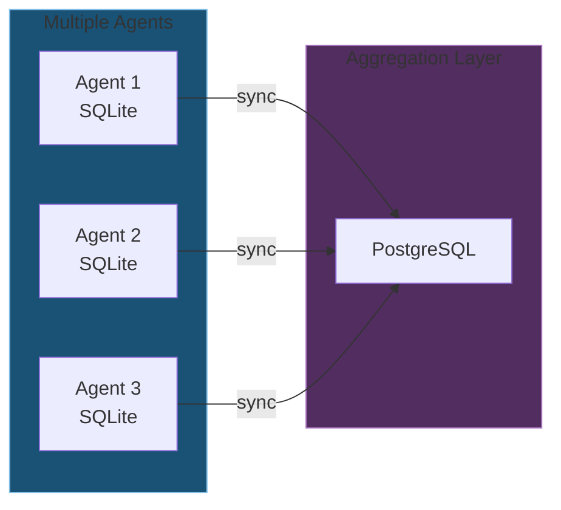
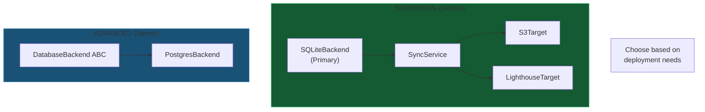
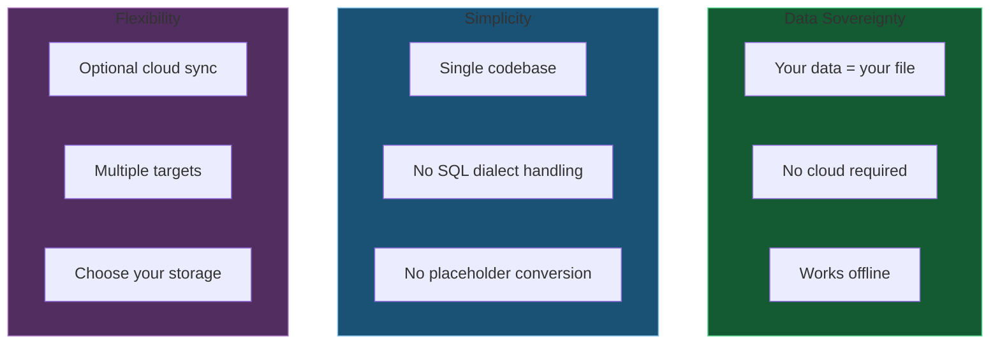

# DA-10: SQLite-First Sync Architecture

The new architecture: SQLite as primary, sync to cloud when needed.

---

## Slide 1: The Vision - Two-File Sovereign Agent



**True sovereignty.** Your data is literally a file you own.

---

## Slide 2: Why SQLite-First?



| Feature | SQLite | PostgreSQL |
|---------|--------|------------|
| Setup | None | Install daemon |
| File | Single `.db` | Directory |
| Network | Not needed | Required |
| Backup | Copy file | pg_dump |
| Portability | Full | Limited |

---

## Slide 3: Sync Architecture



**SQLite writes locally.** Sync replicates to cloud.

---

## Slide 4: WAL Listener



**Non-blocking.** Application doesn't wait for sync.

---

## Slide 5: Usage Example

```python
from kestrel_sovereign.storage.db import SQLiteBackend
from kestrel_sovereign.a2a.stores import TaskStore
from kestrel_sovereign.storage.sync import SyncService, S3Target

# SQLite is primary - always available
backend = SQLiteBackend("/path/to/agent.db")
await backend.connect()
task_store = TaskStore(backend)

# Sync is optional - for cloud backup
sync = SyncService("/path/to/agent.db")
sync.add_target(S3Target(bucket="my-backup"))
await sync.start()  # Non-blocking, runs in background

# Use task store normally
await task_store.save(task)  # Writes to SQLite
# Sync service automatically replicates to S3
```

**Simple API.** Sync is transparent to application.

---

## Slide 6: Sync Targets

| Target | Use Case | Features |
|--------|----------|----------|
| **S3** | Cloud backup | Litestream compatible |
| **Lighthouse** | Decentralized storage | IPFS/Filecoin |
| **PostgreSQL** | Aggregation | Multi-agent analytics |



---

## Slide 7: Architecture Modes



**SQLite (Default):** Sovereign agents, offline-first, portable
**PostgreSQL (Advanced):** Multi-tenant, high-concurrency, server deployments

*Constitutional Council Decision (session 9282ed19):*
*SQLite approved as DEFAULT; PostgreSQL retained for advanced use cases.*
*See `kestrel_sovereign/data/council_sessions/` for full deliberation.*

---

## Slide 8: Benefits



---

*Reference: Issue #2, feedback/2026-01-12_postgres_migration_plan.md*
