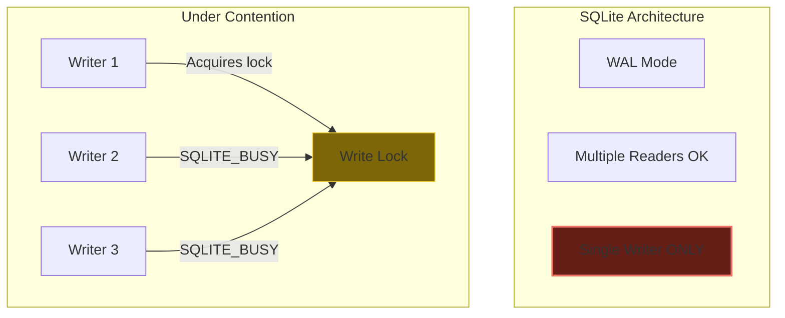
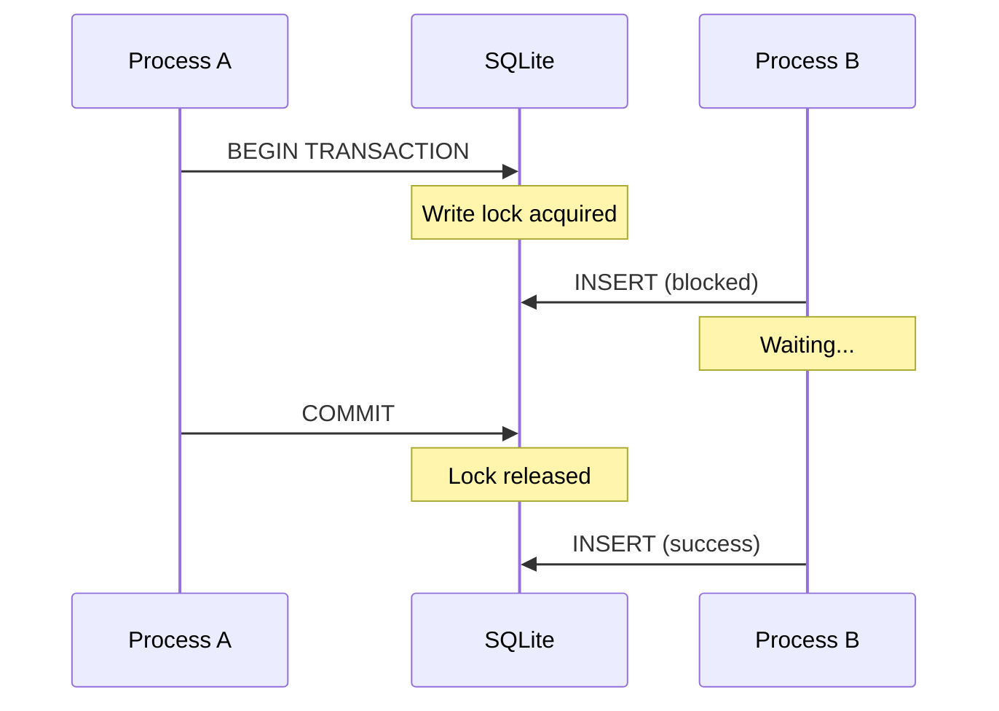
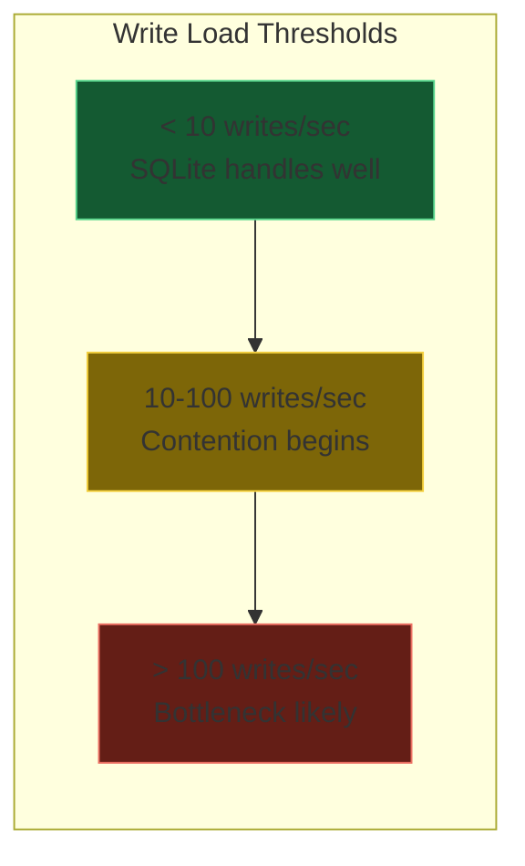
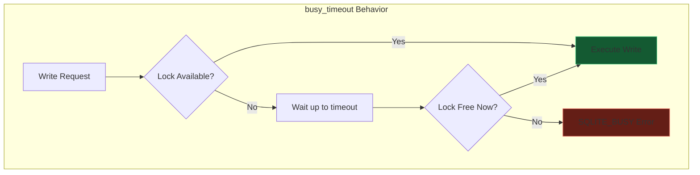
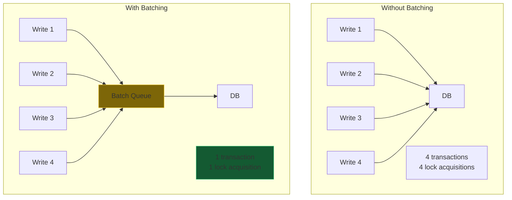
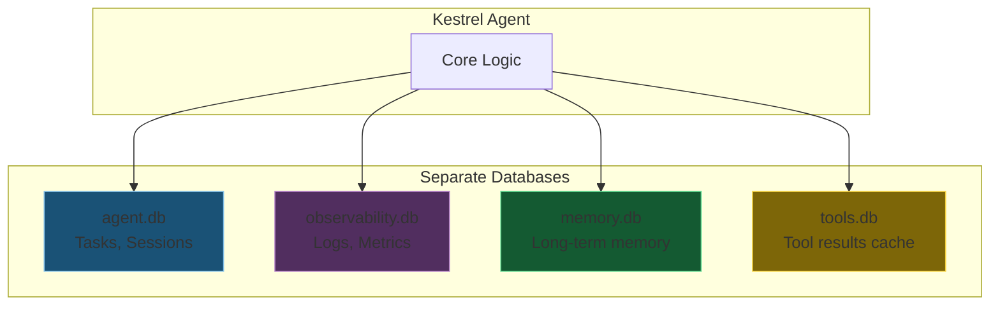
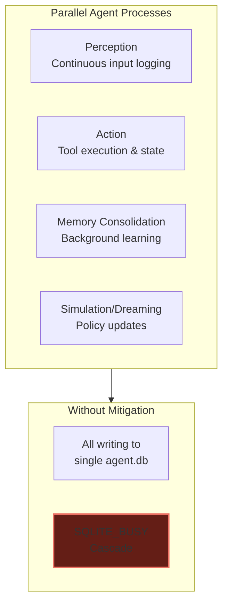
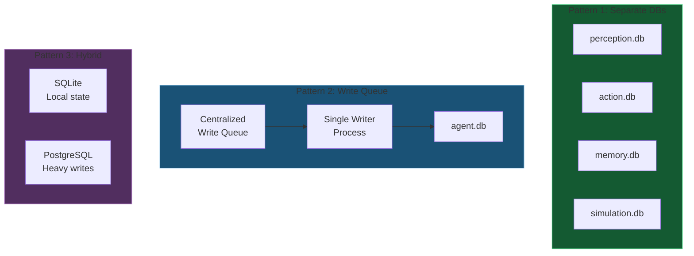
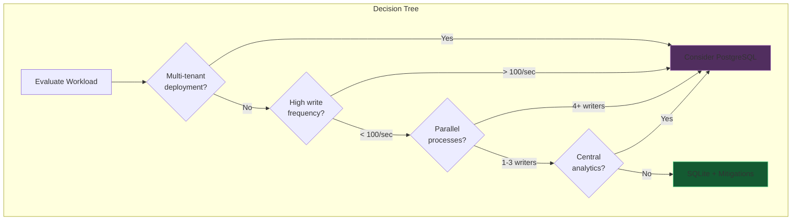

# DA-11: SQLite Concurrency Limitations

Understanding and mitigating SQLite's single-writer constraint for complex agent architectures.

---

## Slide 1: The Single-Writer Constraint



**SQLite allows only one writer at a time.** Multiple processes or threads attempting concurrent writes will encounter blocking or errors.

---

## Slide 2: Symptoms of Write Contention

| Symptom | Description | Severity |
|---------|-------------|----------|
| **SQLITE_BUSY** | Database is locked by another writer | Common |
| **SQLITE_LOCKED** | Table-level lock conflict | Occasional |
| **Timeout errors** | `busy_timeout` exceeded | Configurable |
| **Slow writes** | Serialized queue buildup | Gradual |
| **Application hangs** | Deadlock in write queue | Severe |



---

## Slide 3: Thresholds and Benchmarks



| Workload | SQLite Performance | Recommendation |
|----------|-------------------|----------------|
| Single-threaded CLI agent | Excellent | Use SQLite |
| Async agent with tools | Good with WAL | Use SQLite + mitigations |
| Multi-process agent | Fair with serialization | Consider mitigations |
| High-frequency logging | Poor | Separate DB or PostgreSQL |
| Parallel cognitive processes | Bottleneck | See Slide 7 |

---

## Slide 4: Mitigation - busy_timeout Configuration

```python
import aiosqlite

# Configure busy_timeout to wait instead of failing immediately
async def connect_with_timeout(db_path: str, timeout_ms: int = 5000):
    """
    Connect with busy_timeout to handle write contention gracefully.

    Args:
        db_path: Path to SQLite database
        timeout_ms: How long to wait for lock (default 5 seconds)
    """
    conn = await aiosqlite.connect(db_path)
    await conn.execute(f"PRAGMA busy_timeout = {timeout_ms}")
    await conn.execute("PRAGMA journal_mode = WAL")  # Enable WAL
    return conn
```



**Recommended timeout values:**
- CLI agents: 5,000 ms (5 seconds)
- Background tasks: 30,000 ms (30 seconds)
- Critical writes: 60,000 ms (60 seconds)

---

## Slide 5: Mitigation - Write Batching



```python
import asyncio
from typing import List, Tuple, Any

class WriteBatcher:
    """Batch multiple writes into single transactions."""

    def __init__(self, db, flush_interval: float = 0.1, max_batch: int = 100):
        self.db = db
        self.queue: List[Tuple[str, Tuple]] = []
        self.flush_interval = flush_interval
        self.max_batch = max_batch
        self._lock = asyncio.Lock()

    async def add(self, sql: str, params: Tuple = ()):
        """Queue a write operation."""
        async with self._lock:
            self.queue.append((sql, params))
            if len(self.queue) >= self.max_batch:
                await self._flush()

    async def _flush(self):
        """Execute all queued writes in a single transaction."""
        if not self.queue:
            return

        async with self.db.execute("BEGIN IMMEDIATE"):
            for sql, params in self.queue:
                await self.db.execute(sql, params)
        await self.db.commit()
        self.queue.clear()
```

**Benefits:**
- Reduces lock contention by 10-100x
- Improves throughput for high-frequency writes
- Trade-off: Slightly increased latency per write

---

## Slide 6: Mitigation - Separate Databases Per Subsystem



```python
from dataclasses import dataclass
from kestrel_sovereign.storage.db import SQLiteBackend

@dataclass
class AgentDatabases:
    """Separate databases to reduce write contention."""

    main: SQLiteBackend      # Core agent state
    observability: SQLiteBackend  # High-frequency logs
    memory: SQLiteBackend    # Background memory consolidation
    tools: SQLiteBackend     # Tool execution results

    @classmethod
    async def create(cls, base_path: str) -> "AgentDatabases":
        return cls(
            main=await SQLiteBackend(f"{base_path}/agent.db").connect(),
            observability=await SQLiteBackend(f"{base_path}/observability.db").connect(),
            memory=await SQLiteBackend(f"{base_path}/memory.db").connect(),
            tools=await SQLiteBackend(f"{base_path}/tools.db").connect(),
        )
```

**Use case mapping:**
| Subsystem | Database | Write Frequency |
|-----------|----------|-----------------|
| Tasks, sessions | `agent.db` | Low-Medium |
| Logs, metrics | `observability.db` | High |
| Memory consolidation | `memory.db` | Medium |
| Tool results | `tools.db` | Variable |

---

## Slide 7: Cognitive Concurrency Patterns

Future agents may require parallel cognitive processes:



**Architectural patterns to avoid contention:**



| Pattern | Pros | Cons |
|---------|------|------|
| **Separate DBs** | True parallelism | Join complexity |
| **Write Queue** | Single source of truth | Serialization overhead |
| **Hybrid** | Best of both | Operational complexity |

---

## Slide 8: When to Consider PostgreSQL



**PostgreSQL advantages:**
| Feature | SQLite | PostgreSQL |
|---------|--------|------------|
| Concurrent writers | 1 | Unlimited (MVCC) |
| Connection pooling | N/A | Built-in |
| Multi-tenant isolation | Manual | Row-level security |
| Centralized analytics | Complex | Native |
| Horizontal scaling | No | Read replicas |

**When PostgreSQL makes sense:**
- Multi-agent fleets with shared analytics
- SaaS/multi-tenant deployments
- Write rates exceeding 100 ops/second sustained
- Central logging and observability requirements

---

## Slide 9: Summary - Mitigation Checklist

```mermaid
graph TD
    subgraph checklist["SQLite Concurrency Checklist"]
        C1["1. Enable WAL mode"]
        C2["2. Set busy_timeout (5-60s)"]
        C3["3. Batch high-frequency writes"]
        C4["4. Separate DBs for hot paths"]
        C5["5. Use write queues for parallelism"]
        C6["6. Monitor SQLITE_BUSY errors"]
        C7["7. Consider PostgreSQL for heavy loads"]
    end

    C1 --> C2 --> C3 --> C4 --> C5 --> C6 --> C7

    style C1 fill:#145a32,stroke:#58d68d
    style C2 fill:#145a32,stroke:#58d68d
    style C3 fill:#1a5276,stroke:#85c1e9
    style C4 fill:#1a5276,stroke:#85c1e9
    style C5 fill:#7d6608,stroke:#f4d03f
    style C6 fill:#7d6608,stroke:#f4d03f
    style C7 fill:#512e5f,stroke:#af7ac5
```



**Quick Reference:**
```python
# Essential SQLite concurrency setup
async def setup_sqlite_for_concurrency(db_path: str):
    conn = await aiosqlite.connect(db_path)
    await conn.execute("PRAGMA journal_mode = WAL")
    await conn.execute("PRAGMA busy_timeout = 5000")
    await conn.execute("PRAGMA synchronous = NORMAL")  # Balance durability/speed
    return conn
```

---

## Constitutional Reference

This documentation fulfills a recommendation from Constitutional Council session `9282ed19-117f-455d-8aa5-a8933be57eb0`:

> "Document the concurrency limitations of the SQLite backend clearly for developers building complex agents."

The council identified that SQLite's single-writer constraint could become a bottleneck for future "cognitive concurrency" patterns. This document provides:
- Clear explanation of the limitation
- Practical mitigation strategies
- Decision framework for when to upgrade to PostgreSQL

---

*Previous: [DA-10-sqlite-first-sync.md](DA-10-sqlite-first-sync.md) - SQLite-first architecture with sync layer*
*See also: [DA-02-database-abstraction.md](DA-02-database-abstraction.md) - Database backend interface*
