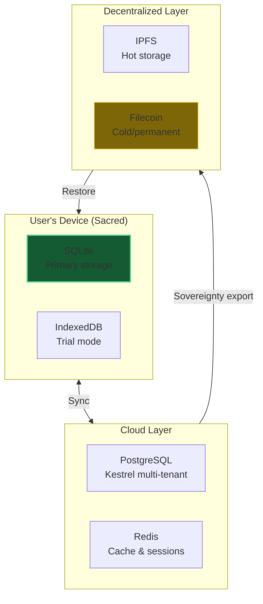

# Data Architecture Deep Dive

A comprehensive series on Kestrel's multi-layer storage system, data sovereignty, and cryostasis.

---

## Overview

This series covers the complete data architecture that enables Kestrel's data sovereignty promise:

> "Your AI companion can never be taken away from you."

---

## Document Structure

| Document | Topic | Slides |
|----------|-------|--------|
| [DA-01-overview.md](DA-01-overview.md) | Three-layer architecture, data flow | ~8 |
| [DA-02-database-abstraction.md](DA-02-database-abstraction.md) | DatabaseBackend ABC, SQLite (default) ↔ PostgreSQL (advanced) | ~6 |
| [DA-03-local-storage.md](DA-03-local-storage.md) | AsyncStorage facade, 5 specialized stores | ~8 |
| [DA-04-multi-tenant-cloud.md](DA-04-multi-tenant-cloud.md) | Kestrel PostgreSQL, row-level security | ~8 |
| [DA-05-ipfs-sovereignty.md](DA-05-ipfs-sovereignty.md) | IPFS sharding, convergent encryption, Merkle forest | ~10 |
| [DA-06-filecoin-lighthouse.md](DA-06-filecoin-lighthouse.md) | Permanent storage, deal lifecycle, pricing | ~8 |
| [DA-07-cryostasis.md](DA-07-cryostasis.md) | Agent dormancy, $0.02 trigger, wake-up flow | ~8 |
| [DA-08-privacy-encryption.md](DA-08-privacy-encryption.md) | Encryption at rest, PII scrubbing, privacy modes | ~6 |
| [DA-09-browser-mobile.md](DA-09-browser-mobile.md) | Browser IndexedDB, native mobile SQLite, hybrid model | ~10 |
| [DA-10-sqlite-first-sync.md](DA-10-sqlite-first-sync.md) | SQLite-first architecture with sync layer | ~8 |
| [DA-11-sqlite-concurrency.md](DA-11-sqlite-concurrency.md) | **NEW** SQLite concurrency limitations and mitigations | ~9 |

---

## Key Concepts

### The User's Device is Sacred
Data generated on the user's device stays on the device by default. Cloud sync is opt-in and serves as a backup, never the primary source.

### Three-Layer Architecture
1. **Local (SQLite)**: User's sovereign territory, offline-capable
2. **Cloud (PostgreSQL)**: Multi-tenant for Kestrel, sync target
3. **Decentralized (IPFS/Filecoin)**: Permanent, vendor-independent

### Browser & Mobile - The Hybrid Model
SQLite provides power (RAG, graph, FTS), but can't run in browsers. Our solution:
- **Browser**: IndexedDB via `SovereignStorage.js` for cache, trial mode, offline
- **Native Mobile**: SQLite runs directly (React Native, Flutter, native iOS/Android)
- **Server**: Does heavy compute (RAG, graph) when browser can't

IndexedDB is for presence. SQLite is for power. Together they deliver sovereignty.

### Cryostasis - Sleep, Don't Die
When an agent's wallet balance drops below $0.02 USD:
1. Complete agent state is archived
2. Encrypted and uploaded to Filecoin via Lighthouse
3. Agent enters dormancy (no compute costs)
4. Wakes up when user deposits funds

**Cost**: Decades of storage for pennies (~$0.00005/GB permanent)

---

## File Locations

| Component | Path |
|-----------|------|
| AsyncStorage facade | `/storage/async_storage.py` |
| Database interface | `/storage/db/interface.py` |
| SQLite backend | `/storage/db/sqlite.py` |
| PostgreSQL backend | `/storage/db/postgres.py` |
| Sovereign adapter V2 | `/storage/sovereign_adapter.py` |
| Filecoin adapter | `/storage/filecoin_adapter.py` |
| Lighthouse provider | `/storage/providers/lighthouse_provider.py` |
| Privacy wrapper | `/storage/privacy_wrapper.py` |
| Kestrel server | `/kestrel/server.py` |
| Kestrel PostgreSQL stores | `/kestrel/a2a/postgres_stores.py` |

---

## Color Palette

Same as main presentation:

| Color | Hex | Use |
|-------|-----|-----|
| Deep Blue | `#1a5276` | Primary/Kestrel |
| Dark Green | `#145a32` | Success/Local storage |
| Dark Orange | `#7d3c00` | Warning/Action |
| Dark Gold | `#7d6608` | Important/Filecoin |
| Dark Purple | `#512e5f` | Secondary/Cloud |
| Dark Red | `#641e16` | Error/Danger |
| Dark Teal | `#0e4d45` | Neutral/IPFS |

---

*Last Updated: December 2025*
