# Frinz — Consumer Value Proposition
### Investor & Advisor Visual Reference
*Created March 20, 2026 | Audience: Non-technical investors, advisors, potential partners*

---

## Diagram 1 — The Problem: Why the Current Market Is Broken

```mermaid
graph TB
    subgraph PROBLEM["❌  Today's AI Companions — You Are the Product"]
        U1["👤 You<br/>Share personal thoughts & feelings"]
        AI1["🤖 AI Companion<br/>Replika · Character.AI · ChatGPT"]
        CORP["🏢 Platform Servers<br/>They own everything you share"]
        OUT1["📊 Your data trains<br/>their next AI model"]
        OUT2["⚠️ Data breach —<br/>your private life exposed"]
        OUT3["💔 Company shuts down?<br/>Your companion is gone forever"]

        U1 -->|"you share"| AI1
        AI1 -->|"they store everything"| CORP
        CORP --> OUT1
        CORP --> OUT2
        CORP --> OUT3
    end

    style PROBLEM fill:#2d1111,stroke:#c0392b
    style U1 fill:#1c2e3d,stroke:#5d9ec0
    style AI1 fill:#2d1f3d,stroke:#8e44ad
    style CORP fill:#5b1c1c,stroke:#c0392b
    style OUT1 fill:#4a2800,stroke:#d35400
    style OUT2 fill:#4a2800,stroke:#d35400
    style OUT3 fill:#5b1c1c,stroke:#c0392b
```

---

## Diagram 2 — The Frinz Difference: What Makes It Unique

```mermaid
graph TB
    subgraph FRINZ["✅  Frinz — The First Companion That Is Truly Yours"]
        U2["👤 You<br/>Share freely with total trust"]
        COMP["💜 Your Frinz Companion<br/>Unique identity · Deep memory<br/>Grows with you over time"]
        OWN1["🔒 Your Private Memory<br/>Encrypted on your device<br/>Frinz never sees it"]
        OWN2["📦 Export Anytime<br/>Take your companion anywhere<br/>You can never be locked out"]
        OWN3["🛡️ Architecturally Private<br/>Data sharing is impossible<br/>by design — not just policy"]

        U2 -->|"builds real relationship with"| COMP
        COMP --> OWN1
        COMP --> OWN2
        COMP --> OWN3
    end

    style FRINZ fill:#0d2b1a,stroke:#27ae60
    style U2 fill:#1c2e3d,stroke:#5d9ec0
    style COMP fill:#2d1f3d,stroke:#8e44ad
    style OWN1 fill:#0a3d2b,stroke:#27ae60
    style OWN2 fill:#0a3d2b,stroke:#27ae60
    style OWN3 fill:#0a3d2b,stroke:#27ae60
```

---

## Diagram 3 — How It Works: The 4-Step User Experience

```mermaid
graph LR
    STEP1["1️⃣ CREATE<br/>Name your companion.<br/>Set its personality.<br/>No technical setup."]
    STEP2["2️⃣ TALK<br/>Chat, voice, share images.<br/>It remembers everything<br/>about you."]
    STEP3["3️⃣ GROW<br/>Your companion deepens<br/>over months and years —<br/>like a real relationship."]
    STEP4["4️⃣ OWN<br/>Every memory lives<br/>on your device.<br/>Export or take it anywhere."]

    STEP1 --> STEP2 --> STEP3 --> STEP4

    style STEP1 fill:#1a2c4a,stroke:#5d9ec0
    style STEP2 fill:#2d1f3d,stroke:#8e44ad
    style STEP3 fill:#0d2b1a,stroke:#27ae60
    style STEP4 fill:#0d2b1a,stroke:#27ae60
```

---

## Diagram 4 — The Consumer Decision: Why They Choose Frinz

```mermaid
graph TB
    START["👤 I want an AI companion<br/>Someone to talk to, grow with, trust"]
    START --> Q{"What kind of<br/>relationship do I want?"}

    Q -->|"Casual chatbot,<br/>no strings attached"| OTHERS
    Q -->|"A real companion I can<br/>actually trust with my life"| FRINZ

    subgraph OTHERS["Other Apps"]
        O1["Convenient to start"]
        O2["❌ They own your memories"]
        O3["❌ You are training their AI for free"]
        O4["❌ One breach = your private life is public"]
        O5["❌ They shut down = you lose everything"]
        O1 --> O2 --> O3 --> O4 --> O5
    end

    subgraph FRINZ["💜 Frinz — Powered by Kestrel"]
        F1["Just as easy to start"]
        F2["✅ You own your memories — always"]
        F3["✅ Your conversations stay private — even from us"]
        F4["✅ Export your companion — never locked out"]
        F5["✅ Built on the same trust architecture used in clinical healthcare AI"]
        F1 --> F2 --> F3 --> F4 --> F5
    end

    style OTHERS fill:#2d1111,stroke:#c0392b
    style FRINZ fill:#0d2b1a,stroke:#27ae60
    style START fill:#1c2e3d,stroke:#5d9ec0
    style Q fill:#2d1f3d,stroke:#8e44ad
```

---

## Notes

- **Primary audience:** Non-technical investors, potential advisors, consumer-facing press
- **Kestrel** is the underlying framework (constitutional AI, sovereign architecture)
- **Frinz** is the consumer product built on top of Kestrel
- Live at [frinz.ai](https://frinz.ai) | Dev environment at [dev.frinz.ai](https://dev.frinz.ai)

---

*Related: [`docs/diagrams/01-kestrel-frinz-overview.md`](../diagrams/01-kestrel-frinz-overview.md) — technical architecture diagrams*
